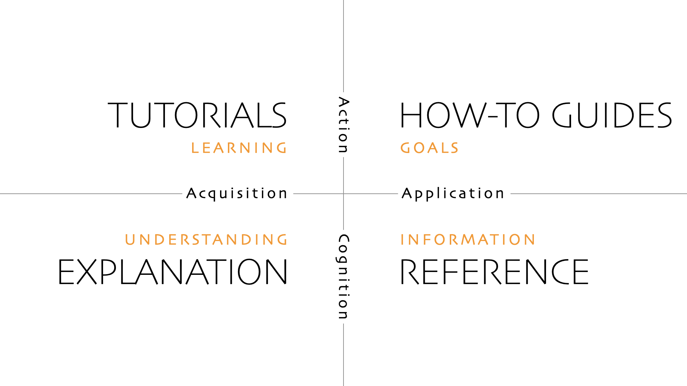

# Why software project design?
<div class=column>

- Throughout these 10 days, you have seen how HPC codes are:
    - Parallelised
    - Ported to GPUs
    - Tuned for performance
    - Run through batch systems
- A more practical question we want to discuss shortly:

**How do we keep our code usable?**

</div>

<div class=column>

Good project design helps you

- Reproduce old results
- Collaborate without chaos
- Move between machines
- Trust production runs
- Leave something usable for the next person

</div>


# The essentials
- A sustainable HPC software project needs four things:
    - **Version control**: what changed?
    - **Testing**: does it still work?
    - **CI/CD**: can routine checks run automatically?
    - **Documentation**: how should people use and maintain it?
- We only cover the surface today
- The goal is to recognise the tools and know what to adopt as your software size increases

# Section 1: Version control {.section}

# Version control
- Version control records the history of a project
- It lets you:
    - Track changes over time
    - Compare versions
    - Recover old states
    - Work on features in parallel
    - Collaborate without emailing tarballs
- In practice: **use Git**


# Reproducibility matters in HPC
- Production runs can consume large allocations
- Later, you should know:
    - Which code version was used?
    - Which compiler, MPI, modules, and libraries were used?
    - Which input files and job scripts were used?
    - Which changes happened between two runs?
- A commit hash or release tag is a simple anchor, but the run environment must also be recorded.


# Git: distributed, but often used centrally
<div class=column>

- **Peer-to-peer / distributed**
    - Every clone can contain full history
    - Work offline
    - Exchange changes between repositories
    - Git is technically this kind of system

</div>

<div class=column>

- **Client-server / central workflow**
    - One shared place acts as the reference
    - Easier collaboration and permissions
    - GitHub, GitLab, institutional Git servers
    - Most teams work this way in practice

</div>


# A minimal Git habit
```bash
# get the project
git clone git@github.com:group/project.git
cd project

# work locally
git status
git add src/solver.cpp tests/test_solver.cpp
git commit -m "Fix boundary condition in solver"

# share changes
git push
```

- Commit small, understandable changes
- Write messages for future you and future collaborators


# Branches, tags, pull requests, issues
<div class=column>

- `main` / `master`
    - Main line of development
    - Should be usable
- `dev`
    - Optional integration branch
- `feature/...`
    - Short-lived work branch
- **Tag**
    - Name for an important commit
    - Release, paper, benchmark version

</div>

<div class=column>

- Pull/merge request (GitHub/GitLab feature)
    - Proposed change
    - Place for review and discussion
    - Good place to run automatic checks
- Issue (GitHub/GitLab feature)
    - Bug, feature idea, documentation gap, performance note
    - Should include enough information to reproduce the problem

</div>

# Section 2: Testing {.section}

# Testing
- Tests check that the software behaves as expected
- Testing does not prove the code is perfect
- It catches many mistakes before they reach production
- HPC testing should cover e.g.:
    - Numerical correctness
    - Build and run workflows
    - Restart and input/output behaviour
- Test correctness before measuring performance


# Unit and integration tests
<div class=column>

- **Unit tests**
    - Small pieces of code
    - Fast and deterministic
    - Good for formulas, parsers, boundary conditions, helper routines
    - Should run often

</div>

<div class=column>

- **Integration tests**
    - Parts working together
    - Build the executable
    - Run a tiny MPI/GPU case
    - Test restart and output files
    - Slower, but closer to real use

</div>


# Test coverage
- Coverage asks: **which lines or branches were executed by tests?**
- Useful for finding forgotten code paths
    - Error handling
    - Rare options
    - Boundary conditions
    - File readers/writers
- High coverage is not the same as scientific correctness
- Low coverage is a warning sign


# Section 3: CI/CD {.section}

# CI/CD
- **Continuous Integration (CI)**
    - Automatically build and test changes
    - Usually triggered by push or pull/merge request
- **Continuous Delivery / Deployment (CD)**
    - Automatically prepare or publish outputs
    - Examples: documentation pages, packages, containers, releases
- CI/CD makes routine project checks repeatable


# CI/CD use-cases
<div class=column>

Good first checks:

- Build the code
- Run unit tests
- Run a tiny integration test
- Build documentation
- Check examples or scripts

</div>

<div class=column>

In a training repository:

- Build slides or documentation
- Publish rendered material
- Keep source and output connected
- Let contributors see failures before merging

</div>


# Runners: provided or self-hosted?
<div class=column>

- **Provided runners**
    - Hosted by GitHub/GitLab
    - Good for unit tests, docs, simple builds
    - Easy to start with
    - Not like a supercomputer

</div>

<div class=column>

- **Self-hosted runners**
    - Maintained by you or your organisation
    - Useful for special compilers, GPUs, vendor libraries
    - More realistic, but more responsibility
    - Be careful with security and shared HPC policies

</div>


# CI/CD and HPC: keep expectations realistic
- CI is not a replacement for testing on the real machine
- CI is excellent for catching simple failures early
- Good split:
    - Every change: build, unit tests, documentation
    - Before merging: small integration tests
    - Before release or production campaign: target-machine validation
- Do not run production-scale benchmarks as normal CI jobs


# Section 4: Documentation {.section}

# Documentation
- Documentation is part of the software project
- Different readers need different information:
    - New user: how do I start?
    - Regular user: how do I solve this task?
    - Developer: how is this implemented?
    - Future you: why was this choice made?
- One huge manual rarely serves everyone well


# Diátaxis framework
<div class=column>

- **Tutorials**
    - Learning-oriented
    - “Let’s cook an omelette together”
- **How-to guides**
    - Goal-oriented
    - “How to make an omelette with mushrooms”

</div>

<div class=column>

- **Reference**
    - Information-oriented
    - Ingredients, temperatures, pan sizes
- **Explanation**
    - Understanding-oriented
    - "Why eggs set when heated"

</div>

# Diátaxis framework



# Documentation for HPC software
<div class=column>

- **Tutorial**
    - Run the first tiny simulation
- **How-to**
    - Run on LUMI with Slurm
    - Restart from a checkpoint after a failed job

</div>

<div class=column>

- **Reference**
    - Input parameters
    - Command-line options

- **Explanation**
    - Numerical method
    - Parallelisation strategy
    - Performance model
</div>


# Facilitating collaboration

<div class=column>
- **Plan now** for $n_\mathrm{files} > 1$ and $n_\mathrm{contributors} > 1$
   - Will make it easier to expand
   - Future you will be grateful!
- **Shared repository**
- **Contribution guidelines**
   - Pull/merge request contents
   - Branches to use (`main`, `dev`, etc.)
   - Formatting style
</div>

<div class=column>
- **Common code format**
   - Helps readability
   - Use automated tools as much as possible
      - Code formatting
      - Code linting
      - Can be checked/enforced in CI/CD
      - Can be integrated in editor or IDE
   - Example tools: `clang-format`, `Cppcheck`, `fprettify`
</div>

# Minimum viable project checklist
- Code is in Git
- Main branch builds
- Important changes go through pull/merge requests
- Releases or important runs are tagged
- There are some fast tests, possibly run with CI/CD
- Documentation explains how to build, test, run, and cite

# Conclusions
- Use Git before the project becomes complicated
- Keep the main branch trustworthy
- Tag important versions and runs
- Test correctness before performance
- Automate boring checks with CI/CD
- Write documentation for different reader needs
- Using the above, you can ensure better reproducibility and computing time usage

# Next: deployment and production
<div class=column style=width:45%>

**Once the project is designed, tested, automated, and documented:**

How do we run it reliably on large machines?

</div>

<div class=column style=width:45%>

- Resource applications
- Scaling evidence
- Job scripts and file systems
- Monitoring and profiling
- Troubleshooting and support

</div>
