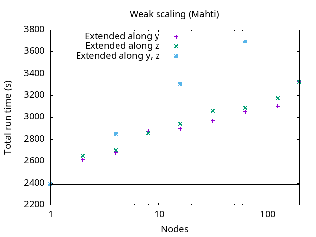
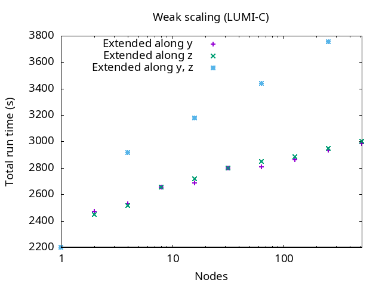
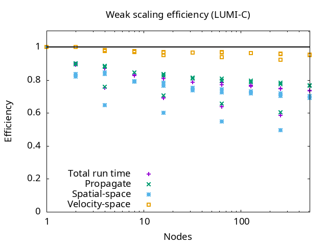
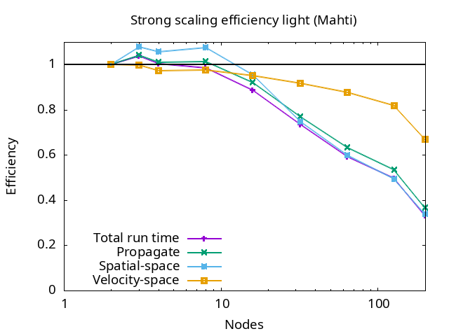
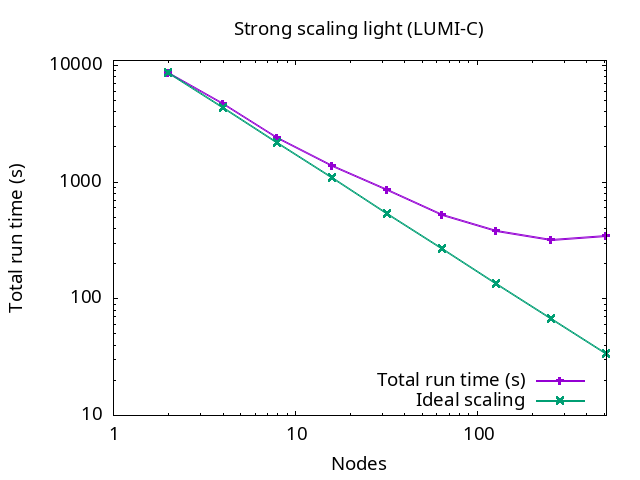
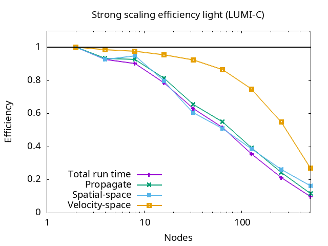
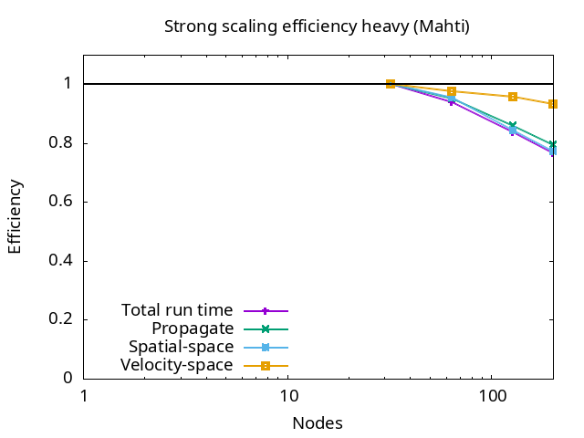
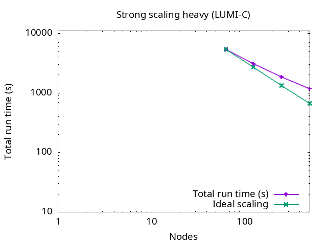
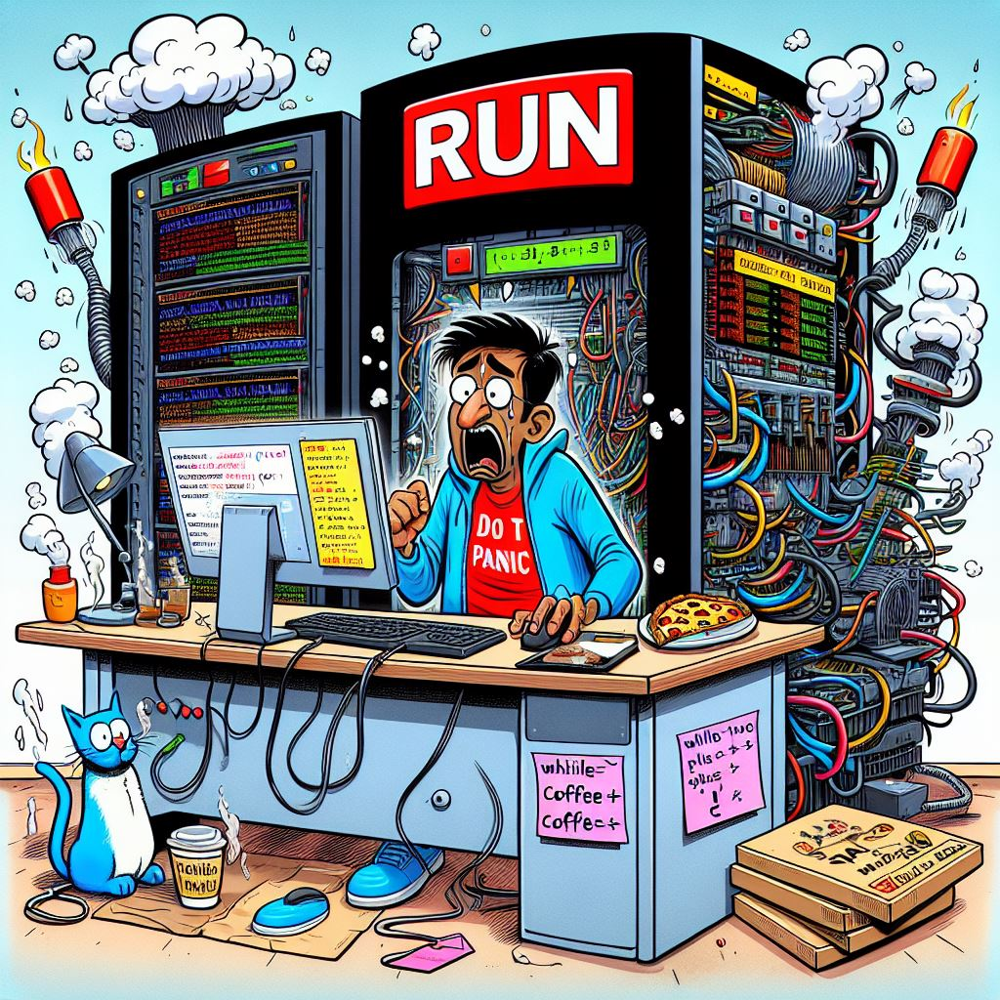

# Code deployment and production

- Your code is
    - Written/ported &checkmark;
    - Modular &checkmark;
    - Using robust version control and software engineering practices &checkmark;
    - Parallelised &checkmark;
    - Optimised &checkmark;
    - Using efficient I/O &checkmark;
    - Tested, verified, and validated &checkmark;

- You were granted computational resources for benchmarking and/or production! 🎉
- How do you ensure your code is performing well and not wasting these precious resources?

# Performance and optimisation

-  So, covering ideas like measure first where the bottleneck is before doing any optimization (could be I/O too).

# Code deployment and production: scaling

- How efficiently is your code running in parallel?
- Weak scaling:
    - Start with a problem run on a single core/CPU/GPU/node
    - Multiply **both** problem size **and** core/CPU/GPU/node count by *n*
    - Plot execution time vs. problem size: **should be flat**
- Strong scaling:
    - Start with problem run on a small amount of resources
    - Run fixed problem size with increasing amount of resources
    - Plot execution time vs. amount of resources used: **should be inversely proportional**

# Case Vlasiator: Weak scaling on Mahti

{.center width=100%}

{.center width=100%}

# Case Vlasiator: Weak scaling on LUMI-C

{.center width=100%}

{.center width=100%}

# Case Vlasiator: Strong scaling (light) on Mahti

{.center width=100%}

{.center width=100%}

# Case Vlasiator: Strong scaling (light) on LUMI-C

{.center width=100%}

{.center width=100%}

# Case Vlasiator: Strong scaling (medium) on Mahti

{.center width=100%}

{.center width=100%}

# Case Vlasiator: Strong scaling (medium) on LUMI-C

{.center width=100%}

{.center width=100%}

# Case Vlasiator: Strong scaling (heavy) on Mahti

{.center width=100%}

{.center width=100%}

# Case Vlasiator: Strong scaling (heavy) on LUMI-C

{.center width=100%}

{.center width=100%}

# Code deployment and production: profiling
- Detailed performance analysis usually has overheads incompatible with production performance
- It can be useful to **monitor** some performance metrics/profiling with lightweight tools
    - Ensure the code works as intended
    - Ensure the system works as intended
- "Basic" health checks:
    - Is the job proceeding (not hanging)?
    - Is the performance as expected and homogeneous (no unexplained slowdowns)?
    - Is the memory usage as expected (resident, high-water mark)?

# Code deployment and production: monitoring
- Production campaigns can be long and frustrating
    - Long queueing times
    - System downtimes
    - Hardware and software failures (the more nodes used, the more frequent!)
- Streamline and automatise procedures as much as possible!
    - Automatised workflows
    - Automatic warnings from system
        - slurm email if available (not on LUMI...)
        - Use available APIs to push notifications
- **Do not spend 24/7 on the command line!**

# Code deployment and production: troubleshooting
- In case of anomalies:
    - Is my **code version** correct?
    - Are my **compilation** parameters correct? Maybe recompile?
    - Is my **job script** correct and up to date (run parameters, modules)?
    - Check your **workflow** still matches best practices in the documentation!
    - Ask your **team** colleagues to check if things work for them?
- If you suspect system issues:
    - Is a maintenance announced/under way?
    - Is there an update on the system status page or mailing list?
    - Is anyone else running/in queue?

# Code deployment and production: get help!
- If you still suspect issues with the system, **contact support**!
    - Detailed description!
    - Code, modules, job parameters
    - Expected result/behaviour
    - What is abnormal

# Quiz?

# Conclusions 

- Adopt practices and tools to ease the burden of a single person

# ...and lastly:

**Have great success running your well-designed application on top supercomputers!**

