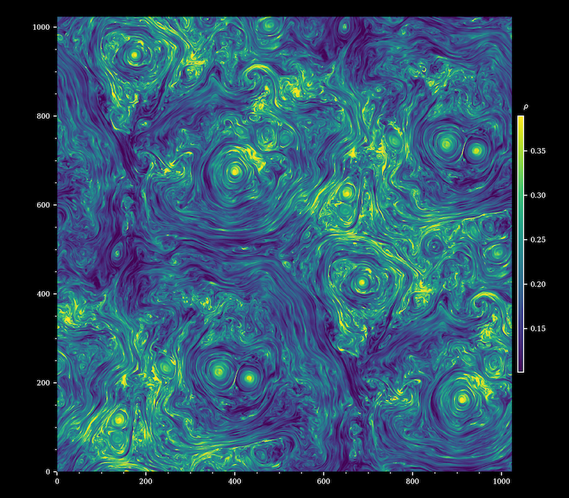
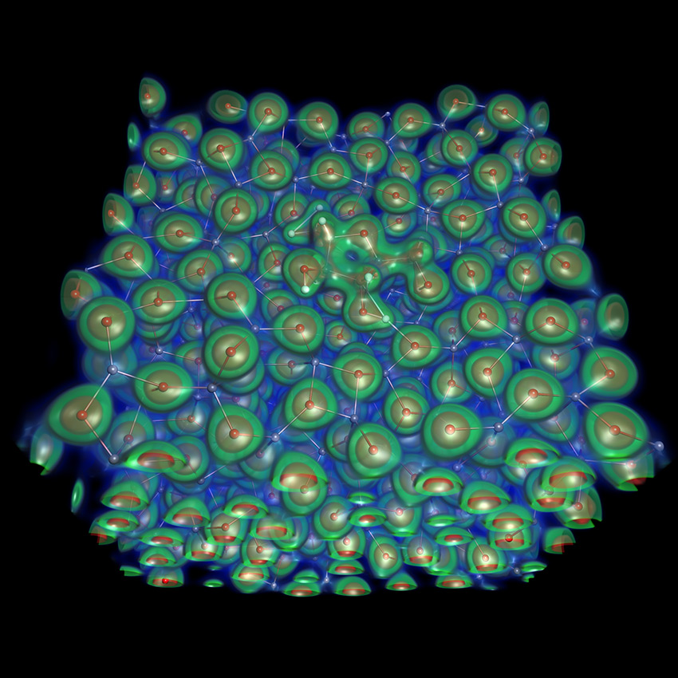
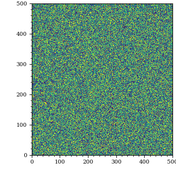
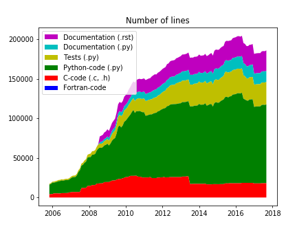

# Design choices {.section}

# Runko

- Kinetic plasma simulation code
    - Particle-in-Cell with computational particles and electromagnetic fields are in grid
- Hybrid C++14/Python code 
    - Domain super-decomposition with MPI 
    - Massively parallel with runs on >10k cores

    
{.center width=100%}

# GPAW

- Density-functional theory -based electronic structure code
- Python + C + libraries (numpy, BLAS, LAPACK)
    - Various parallelization levels with MPI
    - Over 10k cores with some modes
    - ~20 developers all around world

    
{.center width=50%}

{.center width=50%}

# Why develop software? 

- To do science
- To create a product

- Supercomputing platforms enable investigating bigger and more complex problems

    
- **Do science**
    - Scientific articles
    - Method-oriented articles presenting code and methods

    
- **Code as a product**
    - Prestige and fame
    - Gateway into projects, collaborations
    - Citations, co-authorships
    - Work on the bleeding edge

# Case Runko: Going big...

- Kinetic plasma simulations are microscopical (<1cm)
    - Bigger simulation domains mean more realistic, larger systems
- Recently simulated turbulent plasma with 10^10 particles 
    - New physics starts to appear at larger scale

    
{.center width=80%}

# Starting position

- New code or existing project / rewrite of old code?

- **Questions**: your software project?

# Cases Runko & GPAW

    
Runko

- New code 
- +1yr of development
- Allowed to start from scratch and use new technologies

    
GPAW

- Existing code with basic features mostly working (95 %) in 2005
- Choice of physical model and  programming languages had been made
- Production ready in 2008-2009
    - Science done already earlier

# Design model

- Development is not only about physics and numerics
    - Also about **how** you do it
- Instead of "Just code" it is advantageous to plan a little too!
- So-called Agile Development
    - Umbrella term for different software development methods
    - Divide work into small tasks, define short working period, review, repeat

# Agile development model

    
- Focused on iterative and incremental development
    - Quick prototyping
    - Supports continuous publication
    - Analysis, coding, testing, etc. never end

    
- Development cycle
    - Plan
    - Design
    - Develop
    - Test
    - Release
    - Feedback

# Parallelization strategies

- Planning includes thinking what is the target platform
- Target machines: laptops, small clusters, supercomputers
    - OpenMP, MPI, MPI+OpenMP, GPUs
- From shared memory to distributed memory machines
    - Keep in mind that most machines are distributed memory systems = MPI
- Moving from <1000 cores to >10k cores
    - Parallellization strategies need to be considered
    - Non-blocking, avoiding global calls,...
- Accelerators
    - GPUs have their own tricks and quirks

# Parallelization strategies 

- Going **BIG** -> GPUs are mandatory
- But not all HPC needs to be exascale
    - Size is not a goal in itself

# Case Runko: Parallellization

- Runko has uses a new novel parallellization strategy
    - Relies on dividing work among small subregions of the grid
    - Computational grid (i.e., what rank owns which tiles) is constantly changing to balance the load
- Moving beyond 1000 cores is non-trivial
    - Non-blocking communication
    - Removal of collectives
    - Re-design of IO

{.center width=80%}

# Programming languages

- Selection of languages
    - Most common are C, C++, Fortran
    - Mostly matter of taste
- C++ more object-oriented features and many more data structures (maps, lists, etc.); low-level memory management
- Fortran is really good for number crunching, good array syntax
- But also newcomers like Python/Julia
    - Faster coding cycle and less error prone
    - Testing, debugging, and prototyping much easier

# Hybrid codes 

- Different languages can be interfaced together
    - Best of both worlds
- Low level languages (C, C++, Fortran) for costly functions
- High-level languages (Python, Julia, R) for main functions
- Combinations/suggestions
    - Python & C++ (PyBind11) for object-oriented programming
    - Julia & Fortran (native) for functional programming

# Case Runko: C++14/Python3 code

- Runko is an example of a hybrid code
- Low-level "kernels" are in C++
- High-level functionality is operated from Python scripts
- So far it has been an excellent choice
    - Fast code
    - Ease of use
    - Rapid prototyping

# Modular code design: programming

- Good code is modular
    - Encapsulation 
    - Self-contained functions
    - No global variables, input what you need
- Modular code takes more time to design but is **lot** easier to extend and understand

# Modular code design: tools

    
- Avoid not invented here syndrome
- Leverage existing software and libraries
    - Libraries
        - Numerical (BLAS, solvers,...)
        - I/O
        - Parallelization
    - Frameworks?
        - Plug your model into an existing framework?
        - Petsc, Trilinos, BoxLib++, ARMReX, corgi,...

    
- Caveats:
    - Is the lib still supported/updated?
    - Do you trust the source, is it widely used
    - Is there documentation
    - Does it support all the features

# Modular code design: development tools

- Software development is time consuming, many tools exists to help you in the process
- Build systems automate compiling
    - Makefiles, CMake, Ninja, ...
- Debuggers
- Compilers
    - Compilers are not the same, compiler bugs are real!
    - Test your code with different compilers (gnu, clang, intel, cray,...)

- **Questions**: Choices in your software and experiences about them?

# Case GPAW: Modular design

- Object oriented features and Python modules heavily utilized
- Main numerical kernels well separated from high level algorithms
- New features can be developed independently
{width=40%}

# Data formats

- Data has to be "designed" too
- Data formats
    - Not just plain text files/binary files
    - Platform-independent formats (HDF5, NetCDF, ...)
    - Metadata together with the data?
- Log files
    - Especially with HPC applications some kind of log file system is useful
- Standard formats
    - Your field might have some data standards (e.g., PML for plasma codes)
- Remember also that large simulations produce lots of data
    - Storing "big data" is an issue

# Case Runko: IO issues

- Runko uses rank-independent multiple-file IO strategy
    - Excellent performance as there is no synching
    - But, sometimes the burst performance is too good...
        - 10k cores writing ~TBs of data in seconds is nice for the user but file system might not like it

# Summary 

- Software design is all about planning (agile development)
- Productivity
    - Modular design
    - Use existing libraries
    - Use & adopt design, community, and collaboration tools
    - Programming language and design selection

