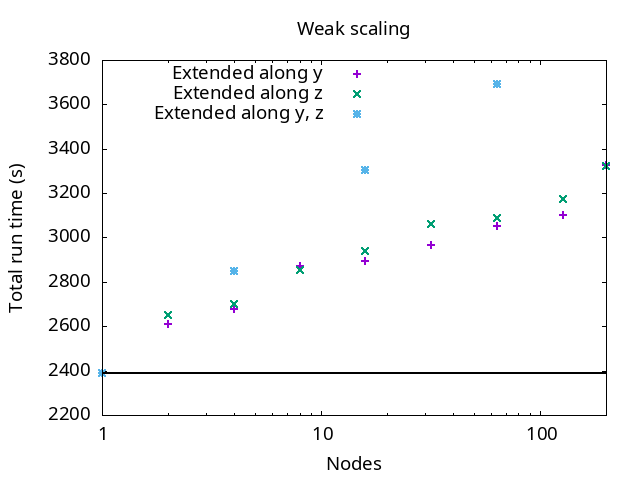
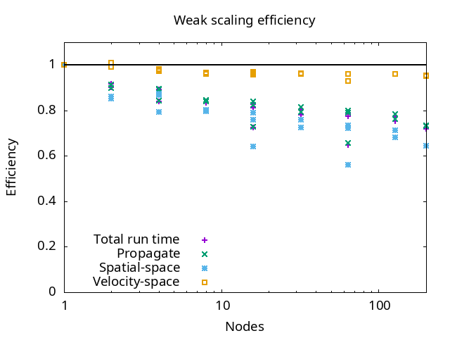
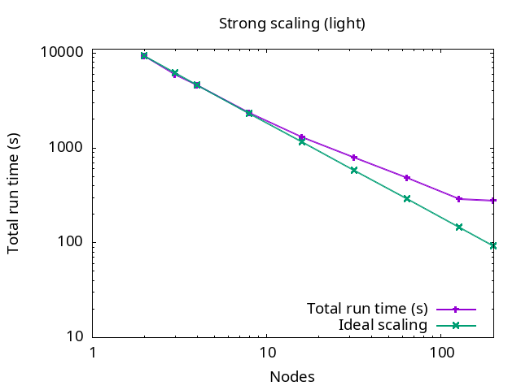
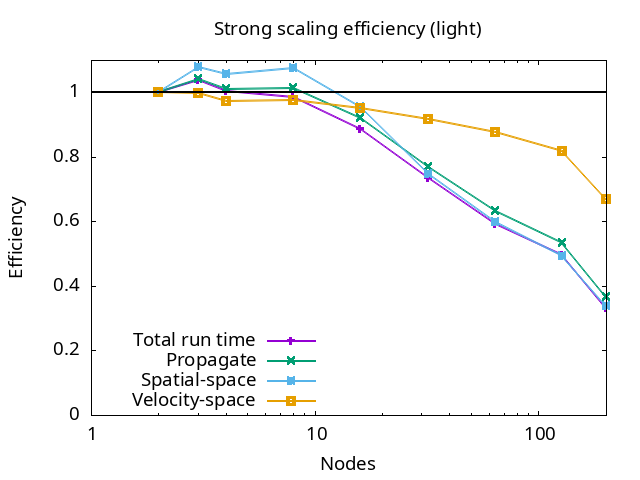
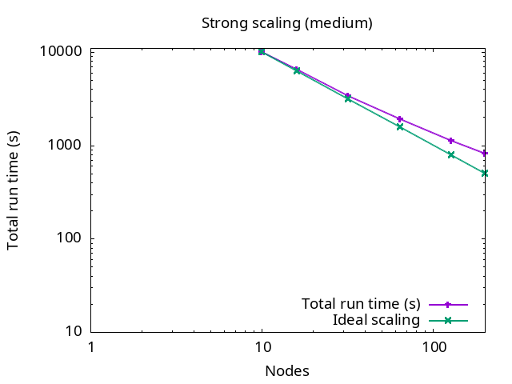
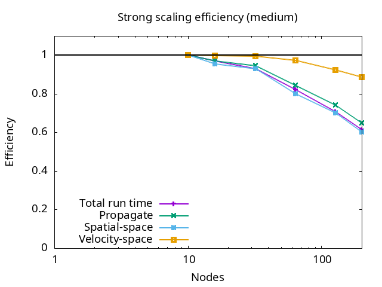
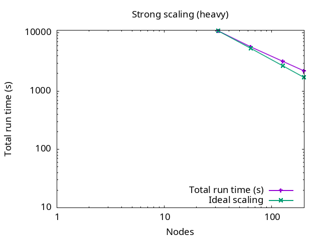
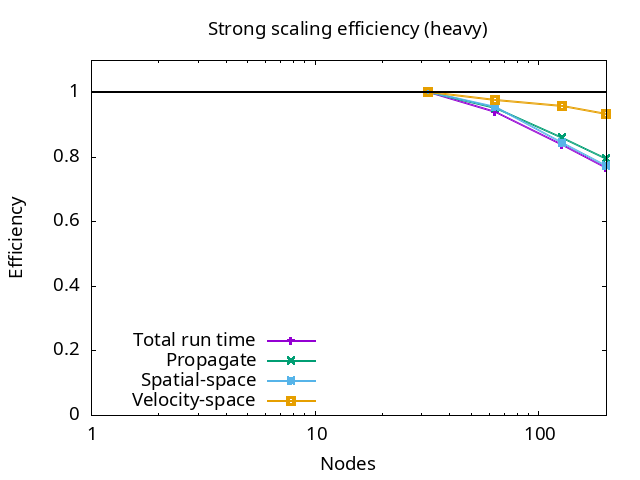

# Why develop software? 

<div class=column>
    
- **Do science**
    - Answer questions, solve problems
    - Scientific method:
        - Observations/measurements
        - Theoretical model
        - **Simulation**
    - Speedup scientific procedures and analysis, reducing also their costs
</div>

<div class=column>
    
- **Code as a product**
    - Prestige and fame
    - Gateway into projects, collaborations
    - Citations, co-authorships
    - Work on the bleeding edge
</div>


# Starting position

- New code or existing project / rewrite of old code?
- How much effort do you have at your disposal?
    - Number of developers may grow

- **Question**: What is your software project?

# Today's real-world case: Vlasiator

<div class=column style="width:65%">
- Hybrid-Vlasov model of magnetised space plasma physics
- [Open source](https://github.com/fmihpc/vlasiator), led by University of Helsinki
- \>60 000 lines of modern C++
- Semi-Lagrangian solver on Cartesian grids
- 6D: 3D space, 3V velocity
    - ghost updates in every direction, every step
    - **Lots** of memory
- MPI + OpenMP + SIMD, Cuda/HIP for GPUs
</div>

<div class=column style="width:33%">    
{width=100%}
</div>


# Starting position: Case Vlasiator (ca. 2008)

- Science case: apply algorithm with "**more physics**" (kinetic phenomena)
    - Previous state of the art: fluid-based approaches
- Problem: "**too heavy**" for current HPC systems
- Strategy: start developing now what runs on "next year's" **cutting-edge HPC** systems
- Global (2D) simulations of the Earth's magnetosphere since 2013, 3D since 2020
- **GPU** porting started earnestly around 2021
    - Before that, insufficient memory and too low host &harr; device bandwidth


# Design model

- Development is not only about physics and numerics
    - Also about **how** you do it
- Instead of "Just code" it is advantageous to **plan** a little too!
    - Also think about future possible extensions!
- **Software engineering** has come up with lots of different development models
    - Waterfall, V-model, Agile models (Scrum etc.), ...
    - Also scientific software may benefit from formal development models

# Design considerations

- Parallelisation strategies
- Data design
- Programming languages
- Modularity
- I/O formats
- Documentation
- Testing


# Parallelisation strategies

- Planning includes thinking what is the target platform
- **Target machines**: laptops, small clusters, supercomputers
    - OpenMP, MPI, MPI+OpenMP, GPUs
- From shared memory to distributed memory machines
    - Keep in mind that most machines are distributed memory systems = MPI
- Moving from <1000 cores to >10k cores
    - Parallelisation strategies need to be considered
    - Non-blocking, avoiding global calls, ...
- **Accelerators**
    - GPUs have their own tricks and quirks

# Parallelisation strategies 

- Going **BIG** &rarr; GPUs are pretty mandatory these days
- But not all HPC needs to be exascale
    - Size is not a goal in itself

# Case Vlasiator: Parallelisation

<div class=column style="width:57%">
- Domain decomposition (**MPI**) of position-space grid
- OpenMP **threading** for position and velocity spaces
- **Vectorization** of core solvers
- Parallel MPI-IO with own library
    - Adapted for 6D data
- Good parallel scalability
    - Current record: 1452 nodes / 185 856 cores on LUMI-C
</div>

<div class=column style="width:40%">
![<span style=" font-size:0.5em;">   [\[Kotipalo et al., 2025\]](https://doi.org/10.48550/arXiv.2505.20908)](images/vlasiator_Kotipalo_load_balance.png){.center width=100%}
</div>


# Case Vlasiator: GPU porting strategy

- Initial exploration/hackathons e.g. using OpenACC
- Decision to use **unified memory**
- Piece-by-piece porting to GPU
- Performance analysis, to guide **re-design** effort
- **Re-writing** to consolidate GPU version
- Performance on-par with CPU
- Effort: > 4 person-years


# Case Vlasiator: GPU porting

- Most of the computations on GPU
- Data resides in **unified memory**, page faults successfully minimised
- CUDA/HIP kernels for portability
    - **Algorithms redesigned** to operate on at least 64 elements at a time
    - Extensive **kernel merging**
- **GPU-aware MPI communication**
- Custom hybrid hashmap and vector libraries [\[Papadakis et al., Front. Comput. Sci., 2024\]](https://doi.org/10.3389/fcomp.2024.1407365)


# Programming languages

- Selection of languages
    - **Performance** oriented languages (low level)
    - **Programmability** oriented languages (high level)
    - Mix
        - Best of both worlds
        - Low-level languages for costly functions
        - High-level languages for main functions


# Low level languages

- Direct control over memory
- Most common are **C, C++, Fortran**
    - Better support for GPU programming in C/C++, HIP does not support Fortran  kernels

<div class=column>

- C++
    - `std` library for data structures
    - low level memory management (concept of data ownership, move semantics, ...)
    - metaprogramming

</div>

<div class=column>

- Fortran
    - Good for number crunching
    - Good array syntax
    - Language semantics make optimisation easier for compilers

</div>


# High level languages

- Python/Julia
    - Faster coding cycle and less error prone
    - Testing, debugging, and prototyping much easier
    - Built on top of high performance libraries (numpy, tensorflow, ...)

- Combinations/suggestions
    - Python & C++ (PyBind11) for object-oriented programming
    - Julia & Fortran (native) for functional programming


# GPU programming approaches

- **Directive** based approaches: OpenACC and OpenMP
    - "standard" and "portable"
- **Native** low level languages: CUDA (NVIDIA) and HIP (AMD)
    - HIP supports in principle also NVIDIA devices
    - With HIP, Fortran needs wrappers via C-bindings
- **Performance portability** frameworks: SYCL, Kokkos
    - Support only C++
- **Standard language features**: parallel C++, `do concurrent`
    - Rely on implicit data movements
    - Compiler support incomplete


# Modular code design: programming

- Good code is **modular**
    - Encapsulation
    - Self-contained functions
    - No global variables, input what you need
- Modular code takes more time to design but is **a lot** easier to extend and understand


# Case Vlasiator: Modular design

- **Object-oriented programming** to manage e.g. boundary conditions
    - Easy to create new boundaries or initial conditions
- Separate **what** to do (e.g. physics) from **how** to do (e.g. optimal implementation of loops)
    - Interfaces to different backends (CUDA kernel, OpenMP threading, ...)
    - Use of class inheritance/templates/lambdas to reduce code duplication


# Break for questions and breathing


# Version control

- Version control is the **single most important software development tool**
- Git is nowadays ubiquitous, Subversion (SVN) was more common but is less popular now
- Additional tools in web services (GitHub, GitLab, Bitbucket)
    - Forking
    - Issue tracking
    - Review of pull/merge requests
    - Wikis
    - Integrations
- Vlasiator: public [GitHub repository](https://github.com/fmihpc/vlasiator)


# Code design: tools

<div class=column>
    
- Avoid **not invented here** syndrome
- Leverage existing software and **libraries**
    - Numerical (BLAS, solvers, ...)
    - I/O
    - Parallelisation
    - Profiling/monitoring
</div>

<div class=column>
    
- Caveats:
    - Is the lib still supported/updated?
    - Do you trust the source, is it widely used?
    - Is there documentation?
    - Does it support all the features, can you extend it if needed?
</div>


# Code design: development tools

- Software development is time consuming, many **tools** exist to help you in the process
- Build systems automate **configuring and compiling**
    - CMake
    - GNU Autotools
    - Make, Ninja
- The bigger your project is, the better is to rely on these **automatic** tools
    - Setup can be painful

    
# Code design: development tools

- Debuggers
- Compilers
    - Compilers are not the same, compiler bugs are real!
    - Test your code with different compilers (gnu, clang, intel, cray, ...)
- Linters (check coding style)

- **Questions**: What development tools do you use? Do they make your work easier?


# Data design

- Data has to be "designed" too
- Use **structures**!
    - Note possible performance difference between structure of arrays vs.
      arrays of structures
- Think about the **flow**
- How to distribute the data 
- GPU introduce more data related problems and opportunities:
    - Memory copies between host and device
    - Preallocation, prefetching, overlapping computation with copy
    - GPU-aware MPI


# Case Vlasiator: Data design

- Adaptively refined **3D spatial mesh**
    - Array of spatial variables
    - (Hybrid) hashmap of (sparse, dynamic) **3V velocity mesh**
    - 3D-3V used for (computationally heavy) propagation of plasma
- Uniform, highest-resolution 3D spatial mesh
    - Arrays of electromagnetic field variables
    - Used for (computationally lighter) EM field propagation


# I/O Data formats

- **Data** formats
    - Not just plain text files/binary files
    - Platform-independent formats (HDF5, NetCDF, ...)
    - Metadata together with the data?
- **Log** files
- Standard formats
    - Your field might have some data standards 
- Remember also that large simulations produce lots of data
    - Storing "big data" is an issue
    - A global climate simulation can produce one PB in a day


# Case Vlasiator: I/O data formats

- Input data (run parameters): command line arguments or **ascii** configuration file
- Logfile with simulation progress, memory monitoring, etc. in ascii
- Output data in custom format with library using **fast, parallel MPI-IO** (10s–100s GiB/s; reduces redundancy of stored metadata for 3D-3V data compared to industry-standard formats)
- Checkpoint/restart files in same custom format
- Can be 10 TB per file
    - Need to consider post-processing and long-term storage, collaboration


# Coding style

- Code **readability** comes first
- **Consistency** helps readability 
    - Indentation, how/when to have instructions longer than one line, ...
    - Many editors have tools to help
    - There are exceptions!


# Documentation
- In-code:
    - **Explanation** of what files, classes, functions are doing
    - Text and e.g. ascii-art explanations of complex parts
    - Can be formatted to build external documentation (e.g. `Doxygen`, `Sphinx`)
- Along with the code (wiki, manual)
    - **How to** contribute
    - How to install and use
    - How to analyse
    - How to cite


# Documentation
- **For whom** am I writing documentation? Think of:
    - You after vacation (did *I* write this?)
    - Who comes after your PhD (they *must* have had a good reason for writing it like this?!)
    - Future contributors (where to start? how do I contribute my optimised kernel to their repo?)
    - Future users (I could use this for my research, how does it work?)
- **Questions**: How often do you write and maintain documentation? Do you use any tools?


# Documentation: Example
```c++
// These names come from the right hand rule, with
// - x horizontal
// - y on the line of sight                         +z    +y
// - z vertical                                      |    /
//                                                  oop  /
// and                                          mpo__|_opo____ppo
// - m standing for "minus"                     /    | /      /
// - p for "plus" and                          /     |/      /
// - o for "zero" or "origin"        -x --moo ------ooo------ poo-- +x
//                                           /      /|     /
// Examples:                                /_____ /_|____/
// -1,  0,  0 = moo                       mmo    omo |    pmo
// +1,  0,  0 = poo                              /  oom    
// +1, +1, +1 = ppp                             /    |
//  0,  0,  0 = ooo                            -y   -z

constexpr size_t poo() const { return calculateIndex({i + 1, j    , k    }); }
constexpr size_t pop() const { return calculateIndex({i + 1, j    , k + 1}); }
```

# Testing
- **Unit** testing (does this function/solver/module work?)
- **Integration** testing (hopefully my new feature doesn't break everything?)
- **Verification** (does my code do what I designed it to do?)
- **Validation** (does my code do things as expected compared to theory/data?)

**Use automated tools to streamline as much testing as you can! Ensure your test coverage is adequate!**


# Break for questions and breathing


# Code deployment and production

<div class=column>

- Your code is
    - Written/ported &checkmark;
    - Modular &checkmark;
    - Using robust version control and software engineering practices &checkmark;
    - Parallelised &checkmark;
    - Optimised &checkmark;
    - Using efficient I/O &checkmark;
    - Tested, verified, and validated &checkmark;
</div>

<div class=column>
- You were granted computational resources for benchmarking and/or production! 🎉
- How do you ensure your code is performing well and not wasting these precious resources?
</div>


# Code deployment and production: scaling

- How efficiently is your code running in parallel?
- Weak scaling:
    - Start with a problem run on a single core/CPU/GPU/node
    - Multiply **both** problem size **and** core/CPU/GPU/node count by *n*
    - Plot execution time vs. problem size: **should be flat**
- Strong scaling:
    - Start with problem run on a small amount of resources
    - Run fixed problem size with increasing amount of resources
    - Plot execution time vs. amount of resources used: **should be inversely proportional**


# Case Vlasiator: Weak scaling

<div class=column>
{.center width=100%}
</div>

<div class=column>
{.center width=100%}
</div>

# Case Vlasiator: Strong scaling (light)

<div class=column>
{.center width=100%}
</div>

<div class=column>
{.center width=100%}
</div>

# Case Vlasiator: Strong scaling (medium)

<div class=column>
{.center width=100%}
</div>

<div class=column>
{.center width=100%}
</div>


# Case Vlasiator: Strong scaling (heavy)

<div class=column>
{.center width=100%}
</div>

<div class=column>
{.center width=100%}
</div>


# Code deployment and production: profiling
- Detailed performance analysis usually has overheads incompatible with production performance
- It can be useful to **monitor** some performance metrics/profiling with lightweight tools
    - Ensure the code works as intended
    - Ensure the system works as intended
- "Basic" health checks:
    - Is the job proceeding (not hanging)?
    - Is the performance as expected and homogeneous (no unexplained slowdowns)?
    - Is the memory usage as expected (resident, high-water mark)?


# Code deployment and production: monitoring
- Production campaigns can be long and frustrating
    - Long queueing times
    - System downtimes
    - Hardware and software failures (the more nodes used, the more frequent!)
- Streamline and automatise procedures as much as possible!
    - Automatised workflows
    - Automatic warnings from system
        - slurm email if available (not on LUMI...)
        - Use available APIs to push notifications
- **Do not spend 24/7 on the command line!**


# Code deployment and production: troubleshooting
- In case of anomalies:
    - Is my **code version** correct?
    - Are my **compilation** parameters correct? Maybe recompile?
    - Is my **job script** correct and up to date (run parameters, modules)?
    - Check your **workflow** still matches best practices in the documentation!
    - Ask your **team** colleagues to check if things work for them?
- If you suspect system issues:
    - Is a maintenance announced/under way?
    - Is there an update on the system status page or mailing list?
    - Is anyone else running/in queue?


# Code deployment and production: get help!
- If you still suspect issues with the system, **contact support**!
    - Detailed description!
    - Code, modules, job parameters
    - Expected result/behaviour
    - What is abnormal


# Conclusions 

- Software design is all about planning 
- Productivity
    - Modular design
    - Use existing libraries
    - Use and integrate design, community, and collaboration tools
    - Programming language and design selection
- Re-/Usability
    - Not only for a single developer
    - Automation/standardisation where possible
    - Adopt practices and tools to ease the burden of a single person

# ...and lastly:

<div class=column style=width:45%>
**Have great success running your well-designed application on top supercomputers!**
</div>

<div class=column style=width:45%>

</div>

