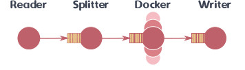
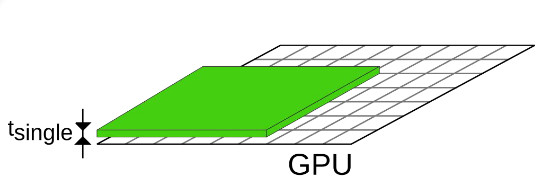
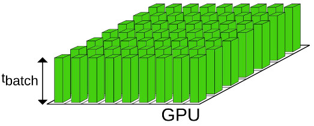

# Why develop software? 

- To do science
- To create a product

- Supercomputing platforms enable investigating bigger and more complex problems

    
- **Do science**
    - Scientific articles
    - Method-oriented articles presenting code and methods
    - Speedup other standard scientific procedures, reducing also their costs

    
- **Code as a product**
    - Prestige and fame
    - Gateway into projects, collaborations
    - Citations, co-authorships
    - Work on the bleeding edge

# Starting position

- New code or existing project / rewrite of old code?
    - How much effort do you have at your disposal?

- **Questions**: your software project?

# ICON

- 
- 
  

    
{.center width=100%}

# LiGen

- High Throughput virtual screening Application
- C++ + GPU (CUDA/SYCL)
    - MPI + std::thread + offloading
    - Property of Dompe' Farmaceutici
    - Found a compound active against COVID (paucisymptomatic)

    
{.center width=50%}

# Starting position: Cases ICON & LiGen

    
ICON

- 
- 
- 

    
LiGen

- Existing code with basic features mostly working
- Bad scaling paradigm
- Complete rewrite of the application to use advanced c++ features
    - Data flow design
    - GPU acceleration added

# Design model

- Development is not only about physics and numerics
    - Also about **how** you do it
- Instead of "Just code" it is advantageous to plan a little too!
    - Also think about future possible extensions!

# Parallelization strategies

- Planning includes thinking what is the target platform
- Target machines: laptops, small clusters, supercomputers
    - OpenMP, MPI, MPI+OpenMP, GPUs
- From shared memory to distributed memory machines
    - Keep in mind that most machines are distributed memory systems = MPI
- Moving from <1000 cores to >10k cores
    - Parallellization strategies need to be considered
    - Non-blocking, avoiding global calls,...
- Accelerators
    - GPUs have their own tricks and quirks

# Parallelization strategies 

- Going **BIG** -> GPUs are mandatory
- But not all HPC needs to be exascale
    - Size is not a goal in itself

# Case LiGen: Parallellization

    
- Embarassingly parallel (or data parallel)
- One process per node
- Internal pipeline
    - Thread balancing is a variable to explore!
        - Find the bottleneck, increase workers, repeat

- No need to communicate between nodes
    - MPI used only for IO operations

 
 
 
{.justify width=90%}

# Case LiGen: GPU parallelization

- Traditional approach: distribute computation
    - Latency oriented: process a single data as fast as possible

- New solution: batch of data
    - Throughput oriented: kernel is slower, but can handle much more data
    - If enough data are available, throughput is increased
    - Possible only if amount of memory per data required is small

{.justify width=90%}
 
 
{.justify width=90%}

# Programming languages

- Selection of languages
    - Performance oriented languages (low level)
    - Programmability oriented languages (high level)
    - Mix
        - Best of both worlds
        - Low-level languages for costly functions
        - High-level languages for main functions

# Low level languages

- Direct control over memory
- Most common are C, C++, Fortran
- GPU has better support for C/C++, Fortran for kernels is not supported at all in HIP.

- C++
    - std library for data structures
    - low level memory management (concept of data ownership, move semantics,...)
    - metaprogramming

- Fortran
    - Good for number crunching
    - Good array syntax

# High level languages

- Python/Julia
    - Faster coding cycle and less error prone
    - Testing, debugging, and prototyping much easier
    - Built on top of high performance libraries (numpy, tensorflow,...)

- Combinations/suggestions
    - Python & C++ (PyBind11) for object-oriented programming
    - Julia & Fortran (native) for functional programming

# Modular code design: programming

- Good code is modular
    - Encapsulation 
    - Self-contained functions
    - No global variables, input what you need
- Modular code takes more time to design but is **a lot** easier to extend and understand

# Code design: tools

    
- Avoid **not invented here** syndrome
- Leverage existing software and libraries
    - Libraries
        - Numerical (BLAS, solvers,...)
        - I/O
        - Parallelization

    
- Caveats:
    - Is the lib still supported/updated?
    - Do you trust the source, is it widely used
    - Is there documentation
    - Does it support all the features

# Code design: development tools

- Software development is time consuming, many tools exist to help you in the process
- Build systems automate configuring and compiling
    - CMake
    - Make, Ninja
- The bigger your project is, the better is to rely on these automatic tools.
    - Setup can be painful
    
# Code design: development tools

- Debuggers
- Compilers
    - Compilers are not the same, compiler bugs are real!
    - Test your code with different compilers (gnu, clang, intel, cray,...)

- **Questions**: Choices in your software and experiences about them?

# Case LiGen: Modular design

- Pipeline of stages with a common structure (input/output queues)
    - Easy to create new stages to support new functionalities
- Single interface for compute intensive backends
    - High level program structure separated by time consuming accelerated code
    - Different implementation for the accelerated code.
    - Backend characteristics (e.g data movement) are hidden from the rest of the application.

# Data design

- Data has to be "designed" too:
    - Use structures!
    - Think about the flow
    - How to distribute across the processes
    - GPU introduce more data related problems and opportunities:
        - Move between Host and Device
        - Preallocation
        - Overlapping computation with copy

# Case LiGen: Data design

- Relies a lot on c++ data ownership semantics (usage of move, refs, ...)
    - Avoid costly copies!

- GPU: 
    - Wrapper for memory to enable c++ RAII paradigm: we can forget about mallocs!
    - Preallocate for worst case: one malloc to process them all!
    - Double buffering

# IO Data formats

- Data formats
    - Not just plain text files/binary files
    - Platform-independent formats (HDF5, NetCDF, ...)
    - Metadata together with the data?
- Log files. Especially useful with HPC applications
- Standard formats
    - Your field might have some data standards 
- Remember also that large simulations produce lots of data
    - Storing "big data" is an issue

# Coding style

- Code readability comes first
- Consistency helps readability 
    - Indentation, how/when to have instructions longer than one line,...
    - Many editor have tools to help
    - There are exceptions!

# Summary 

- Software design is all about planning 
- Productivity
    - Modular design
    - Use existing libraries
    - Use & adopt design, community, and collaboration tools
    - Programming language and design selection

