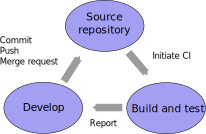

# Documenting and testing {.section}

<small>
Material is partly based on work by Software Carpentry and Code Refinery 
licensed under CC BY-SA 4.0
</small>

# Why to document your code?

- You will forget details
    - Code that you wrote 6 months ago is often indistinguishable from code 
      that someone else has written
- Writing documentation may improve the design of your code
- Have other people to use (and cite!) your code
    - If the documentation is not good enough, people will not use it    
- Allow other people to contribute to development
    - Practically impossible without documentation
- Even within a group, people move in and out 

# What to document?

- How to use the code
    - Installation instructions
    - Format of the input file and possible values of input parameters
    - Tutorials on specific cases
    - Examples that can be copy-pasted
    - FAQs
    - How to cite the code !

# What to document?

- How to develop the code
    - Equations implemented in the code when appropriate
        - Mapping of physical symbols to variables in code
    - Coding style
    - Instructions for contributing
    - APIs (application programming interfaces)
    - Implementation details

# How to document?

- Documentation should be part of the code
- Keep the documentation close to source
    - Same versioning as for the code
    - Guides in e.g. `docs` subdirectory
    - APIs in the source code, e.g. describe arguments of subroutine next to
      the definition
        - many tools can generate automatically API documention from comments
    - Non-obvious implementation choices in comments in source code
- Tools for documentation: RST and Markdown markup languages, wikis, Doxygen, 
  github pages and readthedocs for hosting
- Good documentation does not save bad code!

# How is your code documented?

**Discuss** within your table!

# Documentation in GPAW & Runko

GPAW

- User developer guides, tutorials etc. written in RST
- www-site generated with Sphinx
- APIs in Python docstrings
- <https://wiki.fysik.dtu.dk/gpaw>

Runko

- Main structure described in a publication 
- GitHub Readmes + www-site with sphinx
- API automatically documented with doxygen+breathe
- <https://github.com/natj/runko>
- <https://runko.readthedocs.io>

# Testing

**Simulations and analysis with untested software  
do not constitute science!**

- Experimental scientist would never conduct an experiment with uncalibrated 
  detectors
- Computational scientist should never conduct simulations with untested 
  software

# Why software needs to be tested?

- Ensure expected functionality
- Ensure expected functionality is preserved
    - Software is fragile, bugs lurk in easily
    - In large projects innocent looking changes can have surprising side effects
- Testing helps detecting errors early
- Testing is essential for reproducibility of results
- Tests make it easier to verify whether software is correctly installed

# Defensive programming

- Would you trust a software ...
    - ... when its tests do not pass?
    - ... if the tests are never run?
    - ... if there are no tests at all?
- Assume mistakes will happen and introduce guards against them
- Test drive development
    - Tests are written before actually implementing the functionality

# What should be tested in software ?

- Validity of the physical model
    - Comparison to experimental results
- Validity of numerical methods and implementation
    - Comparison to analytic solutions of special cases
    - Conservation laws and symmetries
- Correct functioning of individual subroutines and modules
- Performance
    - Changes in software may lead into degradation in performance
- Dependency variants 
    - At least compiler and mpi implementation

# Unit testing

- Tests for smallest testable part of an application
    - Function, module or class
- Ideally, tests are independent of each other
- Frameworks: cUnit, cppunit, pFUnit, Google Test, pytest, ...
- Client code which executes tests can be also hand-written
- Unit testing helps in managing complexity
    - Well structured and modular code is easy to test

# Integration testing

- Combining individual software modules and testing as group
    - "Trivial" changes in code can have surprising side effects
    - Example: testing a specific solver which utilizes several modules
- At the highest level tests the whole application
- Recommended to be combined with unit testing

# Challenges with HPC

- Behavior can depend on the number of threads and MPI tasks
    - Parallel components should be tested with multiple different parallelization schemes
- Large scale integration tests can be time consuming
- Changes in program code may also lead to degradation in performance and 
  scalability
    - Tests should track also the performance

# Challenges with HPC

- Performance is often system/architecture specific
    - Preferably test on multiple architectures
- Complicated dependency chains makes testing even harder
    - Impossible to test exhaustively 
- Systems are very noisy, especially on the filesystem and network level.  

# Continuous integration

- Automatic testing
    - Build test ensures that code is always in a "working state"
- Unit and integration tests can be run automatically after build succeeds
- Nightly / weekly tests
    - Software is built and tested at specified times
- Test at "commit"
    - Test set is run when new code is pushed to main repository
- Nightly and "commit" tests can exclude time consuming tests

# Continuous integration

- Test system should send a notification when test fails
    - Mailing list, IRC, Flowdock, …
- Test status can be shown also in www-page
- Tools for continuous integration:
    - TravisCI
    - Jenkins
    - GitlabCI
    - GitHub Actions

{.center width=90%}

# How is your code tested?

**Discuss** within your table!

# Testing in GPAW & Runko

GPAW

- Wide test set
    - Unit tests and integration tests
- Continuous integration with GitlabCI
- Developers should run tests manually before pushing
- Test set should run after installation

Runko

- Each module covered with unit tests (pytest)
- Physics tested with bigger integration tests
- Continuous integration with TravisCI

# Take home messages

- Document your code
- Test your code, prefer automatic testing
