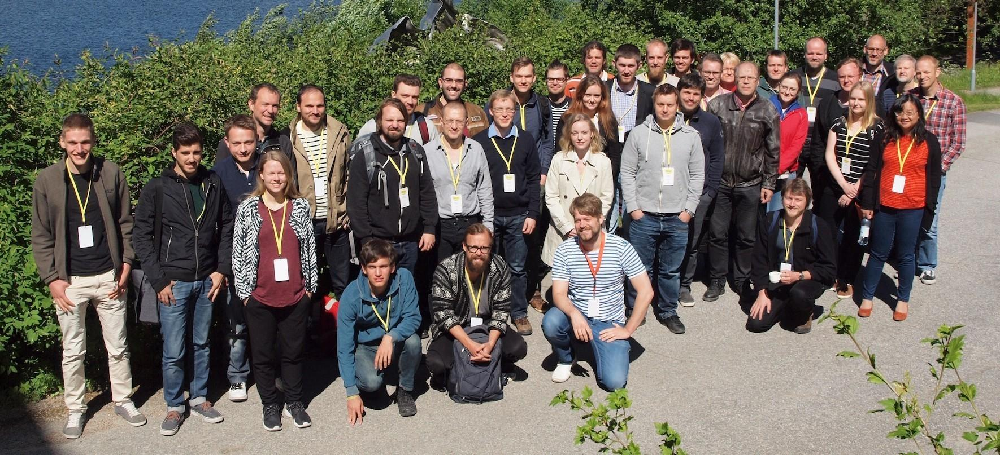

# Collaboration and release{.section}

<small>
Material based partly on Coderefinery lesson "Social coding and open software" 
by Radovan Bast, Richard Darst, Sabry Razick, Jyry Suvilehto, 
<http://cicero.xyz/v3/remark/0.14.0/github.com/coderefinery/social-coding/master/talk.md>  
CC-BY-SA-4.0
</small>

# Collaboration in software development

- Scientific software is seldom developed only by one person
- Closed development within a limited group
    - Local research group
    - Group of collaborators
- Open development
    - Anyone can contribute (within the terms given by main developers)

# What is needed for collaboration?

- Mostly same requirements for closed and open development
- Common version control is minimum requirement for collaboration
- Automated testing and reasonable documentation are also very beneficial
- Some communication tools
    - Mailing lists, instant messaging
    - Issue trackers
- Clear development guidelines
    - Code review process is likely beneficial

# Benefits of sharing software

- Easier to find and reproduce (scientific reproducibility)
- More trustworthy: others can verify correctness and find and report bugs
- Enables others to build on top of your code (if the license allows it)
- Others can submit features/improvements and fix bugs
- Many tools and apps are free for open source (GitHub, Travis CI, Appveyor, 
  Read the Docs)
- Good for your CV: you can show what you have built
- Starting to become a requirement in a lot of projects

# Why do some researchers prefer not to share?

- Fear of being scooped
- Exposes possibly "ugly code"
- Others may find bugs
- Others may require support and ask too many questions
- Fear of losing control over the direction of the project
- "Bad" derivative projects may appear - fear that this will harm the reputation

# To share or not to share?

- **Discuss** what do you think

# Open vs. closed source vs. free software

- Free software does not mean that software is for free
- Open source license does not mean you need to share everything immediately
- Open source does not mean public domain: software in the public domain has no owner
- Open source does not mean non-commercial: plenty of companies produce and support it

# Copyright vs. license

- Copyright: intellectual property granted to the creator of software
- License: Terms given by the copyright owner for using and redistributing 
  the software
- Owner of the copyright depends on the local legislation, work contract etc.
    - As an example, CSC holds the copyright to the work created by CSC 
      employees
- Common open source licenses: MIT, Apache, BSD, GPL, Creative Commons

# Practical recommendations for licensing

- License your code very early in the project
    - Ideally develop publicly accessible open source code from day one
- Open source is in the spirit of openness of science
    - Take an OSI-approved license: makes it easier to evaluate
    - Do not use custom licenses for open source: compatibility not clear.
    - Open sourcing makes sure you are not locked out of your own code
      once you change affiliation.
- Add a `LICENSE` file to your repository (GitHub understands it):
    - Use GitHub web to add file named `LICENSE` and it helps you select!

# Social coding

- Licensing is one thing... but will anyone ever contribute to code?
- Do you welcome people to your project?
- Do you give credit?
- Do you respond to issues and pull requests?
- Openness and transparency
- Document whether/how/where you want to be asked questions
    - Chat or mailing list
- If the project grows, agree on a decision process for controversial changes

# Releasing software

- When software is ready for public releases?
    - Never (there are always bugs or missing features)
    - From day one (it will never be perfect in any case)
- Maybe you want to publish some science before releasing software?
- Having a citation for software is recommended
- Documentation and support processes are beneficial
- Generally, it is better to release often
    - Make clear release notes about changes

**Discuss:** Do you do software releases / versioning?

# Case GPAW

- Open source electronic structure simulation code
- GPL from the beginning, copyright scattered over all developers
- Gitlab, mailing list, issue tracker, face-to-face workshops
- First method paper in 2005, major review article in 2010
    - Together over 2000 citations
- From single developer to tens of users and developers all over the world

{.center width=30%}
 
{.center width=50%}

