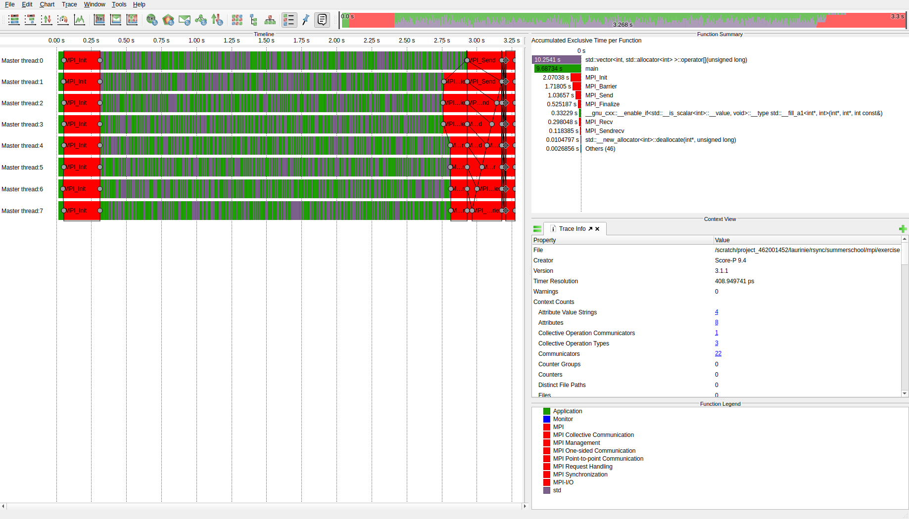
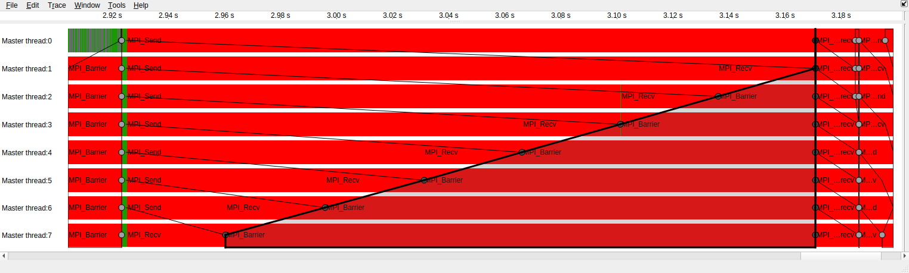
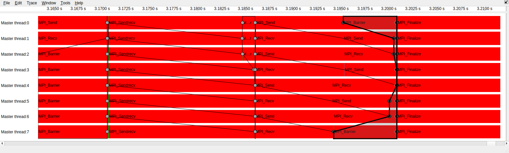

<!--
SPDX-FileCopyrightText: 2026 CSC - IT Center for Science Ltd. <www.csc.fi>

SPDX-License-Identifier: CC-BY-4.0
-->

# Profiling with Score-P

Use the [`message-chain` exercise](../../../mpi/exercises/05-message-chain/) as an example.

```bash
export EBU_USER_PREFIX=/projappl/project_462001452/EasyBuild/
module load LUMI/25.03 partition/C Score-P/9.4-cpeGNU-25.03

cd /path/to/message-chain/solution/
scorep CC chain.cpp -o chain_scorep

SCOREP_ENABLE_TRACING=1 SCOREP_ENABLE_PROFILING=0 SCOREP_TOTAL_MEMORY=1G srun -A project_462001452 -p small --nodes=1 --ntasks-per-node=8 chain_scorep
```
Score-P output goes in a directory named something like `scorep-20260602_0937_4649433290416212`. You can change this with an environment variable: `export SCOREP_EXPERIMENT_DIRECTORY=$PWD/scorep_out`

The traces are generated as `.otf2` files (Open Trace Format).


## Viewing the trace with Vampir

Caveat: Vampir is a commercial, closed source tool.
There is a license, which allows the usage of Vampir on LUMI.

------------------------------------------------

Go to www.lumi.csc.fi and login.

Start a Desktop session. Reserve 4 cores so that you have enough memory (trace files can get big).

When in the desktop session, open a terminal and type
```bash
ml Vampir
vampir &
```

TODO summarize basic vampir usage
- Move around using the minimap at top right




Traces for chain A: individual sends and recvs.



Traces for chains B and C. B uses MPI_Sendrecv, C has alternating send and recv.

