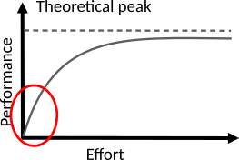
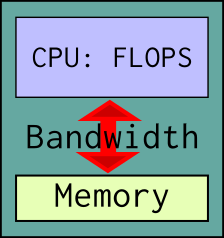
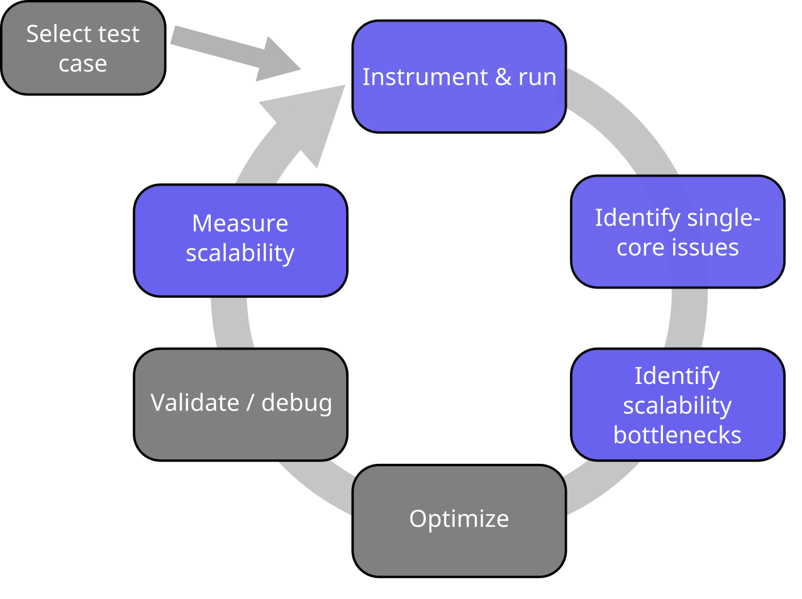
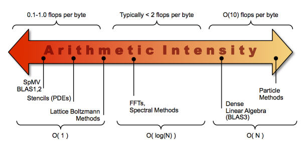
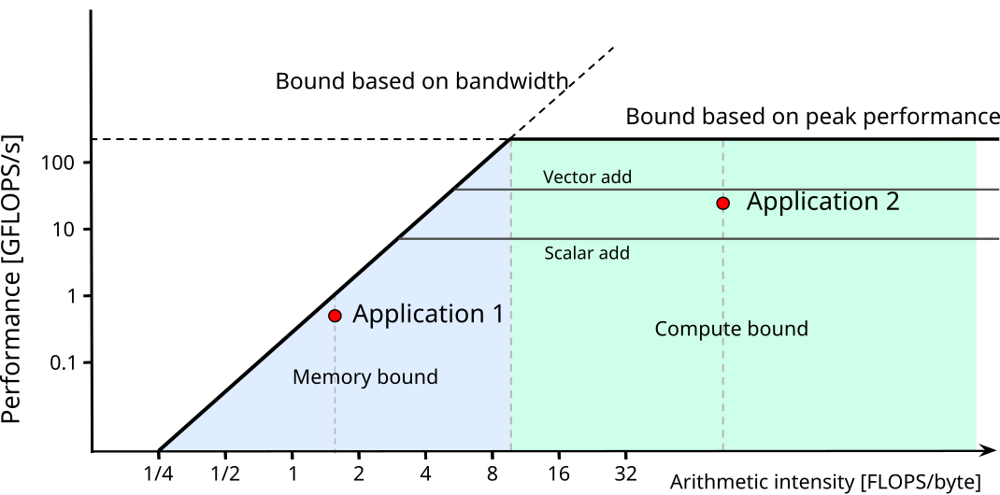

# A day in life at CSC

<div class=column>
**CSC customer**
<br>
<small>
I’m performing simulations with my Fortran code. It seems to perform much worse
with MKL library in the new system than with IMSL library in the old system.
<br>
<br>
<br>
No
</small>
</div>

<div class=column>
**CSC specialist**
<br>
<br>
<br>
<br>
<br>
<small>
Have you profiled your code?  
</small>
</div>

# A day in life at CSC

- Profiled the code: 99.9% of the execution time was being spent on these lines:

```fortran
do i=1,n          ! Removing these unnecessary loop iterations reduced the 
 do j=1,m         ! wall-time of one simulation run from 17 hours to 3 seconds…
    do k=1,fact(x)
      do o=1,nchoosek(x)
         where (ranktypes(:,:)==k)
            ranked(:,:,o)=rankednau(o,k)
         end where
      end do
    end do
  end do
end do
```

# Minding performance {.section}

# Why worry about application performance?

- Obvious benefits
    - Better throughput => more science
    - Cheaper than new hardware 
    - Save energy, compute quota etc.
- ...and some non-obvious ones
    - Potential cross-disciplinary research with computer science
    - Deeper understanding of application

# Improving application performance

- Modern supercomputers are very complex (with evermore increasing
  complexity)
    - Several multicore CPUs and GPUs within one node
    - Superscalar out-of-order instruction execution
    - Multilevel coherent caches
    - SIMD vector units
    - SMT capabilities for multithreading
    - Separate memories for GPUs and CPUs
    - Complex communication topologies
- To get most out of the hardware, performance engineering is needed

# Factors affecting performance in HPC

- Single node performance
    - single core performance
    - single GPU performance
    - threading (and MPI within a node)
- Communication between nodes
- Input/output to disk

# How to improve single node performance?

<div class=column>
- Choose good algorithm
    - e.g. $O(N \mathrm{log} N)$ vs. $O(N^2)$
    - remember prefactor!
- Use high performance libraries
    - linear algebra (BLAS/LAPACK), FFTs, ...
- Experiment with compilers and compiler options
    - There is no single best compiler and set of options for all use
      cases
- Experiment with threading options
    - Thread pinning, loop scheduling, ...
- Optimize the program code
</div>
<div class=column>
```bash
./fibonacci 20
With loop, Fibonacci number i=20 is 6765
Time elapsed 79 ums
With recursion, Fibonacci number i=20 is 6765
Time elapsed 343773 ums
```
<br>
<!-- Copyright CSC -->
{.center width=80%}

</div>

# How to improve parallel scalability?

- Choose good algorithm
    - Note that the best serial algorithm is not necessarily the best
      parallel algorithm
    - It can be beneficial to do more computations if less
      communication is needed
- Use high performance libraries
    - linear algebra (ScaLAPACK, ELPA), FFTs, ...
- Mind the load balance
    - Load balancing algorithms might be complex and add overheads
- Utilize advanced MPI features
- Experiment with parameters of the MPI library
    - Environment variables for short/long message threshold,
      collective algorithms, ...

# Performance engineering

- First step should always be measuring the performance and finding
  performance critical parts
  - Typically small part of the code (`~`10 %) consumes most
        (`~`90%) of the execution time 
- Optimize only the parts of code that are relevant for the total
  execution time!
    - “Premature code optimization is the root of all evil”
- Important to understand interactions
    - Algorithm `–` code `–` compiler `–` libraries `–` hardware
- Performance is not portable
 
# How to assess application's performance?

<div class=column>
- Two fundamental limits for CPU
- Peak floating point performance
    - clock frequency
    - number of instructions per clock cycle
    - number of FLOPS per instruction
    - number of cores
    - no real application achieves peak in sustained operation
- Main memory bandwidth
    - How fast data can be fed to the CPU
</div>

<div class=column>
<!-- Copyright CSC -->
{.center width=50%}
</div>

# How to assess application's performance?

- Example: maximum performance of **axpy** `x[i] = a x[i] + y[j]`
    - Two FLOPS (multiply and add) per `i`
    - Three memory references per `i`
    - With double precision numbers arithmetic intensity <br>
      $I=\frac{\mathrm{FLOPS}}{\mathrm{memory traffic}} =
      \frac{2}{3*8}=0.08$ FLOPS/byte
    - In Puhti, memory bandwidth is \~200 GB/s, so maximum performance
      is \~16 GFLOPS/s
    - Theoretical peak performance of Puhti node is \~2600 GFLOPS/s

# How to assess application's performance?

- Example: matrix-matrix multiplication `C[i,j] = C[i,j] + A[i,k] * B[k,j]`
    - $2 N^3$ FLOPS
    - $3 N^2$ memory references
    - With double precision numbers arithmetic intensity
      $I=\frac{2 N}{3}$ FLOPS/byte
    - With large enough $N$ limited by peak performance

# How to assess application's parallel performance?

- First step should be always to optimize single core performance
    - May affect computation / communication balance
- Maximize single node performance
    - Dynamic scaling of clock frequency, shared caches etc. make
      scalability within node complex concept
    - Example: independent computations in Mahti (no parallel
      overheads)
        - Single core: 1.99 s
        - All the cores: 2.20 - 2.25 s per core
<!-- Numbers from the affinity_test code --> 
- Memory bound applications may benefit from undersubscribing the node 
- Lower limit for acceptable scalability between nodes
    - Speedup of 1.5 when doubling number of nodes

# Code optimization cycle

{.center width=60%}

# Selecting the test case

<div class=column>
- Test case should represent a real production run
- Measurements should be carried out on the target platform
    - "Toy" run on laptop is in most cases useless
- Measurements should be done on both sides of scalability limit
    - Rule of thumb: doubling number of CPUs increases performance
      less than factor of 1.5
</div>

<div class=column>
{.center width=70%}
</div>

# Roofline model

<div class=column>
- Simple visual concept for maximum achievable performance
    - can be derived in terms of arithmetic intensity $I$, peak performance
      $\pi$ and peak memory bandwidth $\beta$
$$
P = min \begin{cases}
\pi \\
\beta \times I
\end{cases}
$$

- Machine balance = arithmetic intensity needed for peak performance
    - Typical values 5-15 FLOPS/byte
- Additional ceilings can be included (caches, vectorization,
  threading, MPI)

</div>

<div class=column>
<!-- Copyright CSC -->
{.center width=90%}
<br>
<!-- https://crd.lbl.gov/departments/computer-science/par/research/roofline/introduction/ -->
{.center width=70%}

</div>

# Roofline model

<div class=column>
- Model does not tell if code can be optimized or not
    - Application 1 may not be *fundamentally* memory bound, but only
        implemented badly (not using caches efficiently)
    - Application 2 may not have *fundamentally* prospects for higher
        performance (performs only additions and not fused multiply adds)
- However, can be useful for guiding the optimization work
</div>
<div class=column>
<!-- Copyright CSC -->
{.center width=90%}
</div>

# Roofline model

- How to obtain the machine parameters?
    - CPU specs
    - own microbenchmarks
    - special tools (Intel tools, Empirical Roofline Tool)
- How to obtain application's GFLOPS/s and arithmetic intensity?
    - Pen and paper and timing measurements
    - Performance analysis tools and hardware counters
    - *True* number of memory references can be difficult to obtain

# Take-home messages

- Mind the application performance: it is for the benefit of you,
  other users and the service provider
- Profile the code and identify the performance issues first, before
  optimizing anything
    - “Premature code optimization is the root of all evil”
- Quite often algorithmic or intrusive design changes are needed to
  improve parallel scalability
- Roofline model can work as a guide in optimization

# How to start?
- What limits the performance?
    - Serial / OpenMP / GPU (single node performance)
    - MPI (internode performance)
    - I/O
- Intel Performance Snapshot can provide big picture for further
  analysis
    - Other possible tools: gprof, TAU, scalasca, CrayPAT
    
# Web resources

- Roofline performance model and Empiral Roofline Tool
    - <https://crd.lbl.gov/departments/computer-science/par/research/roofline/>


