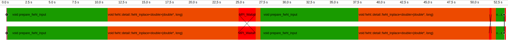

# Performance analysis ("profiling")

My code is too slow! What do I do?

- Find out *where* the slow code segments are
- Figure out *why* it's slow
    - Suboptimal algorithm?
    - Inefficient use of hardware features?
- Focus optimization efforts where it matters!
    - Long function that is only called once vs a short function that is called<br>
    1 000 000 times?

Let's look at common **profiling methods** and **tools** for systematically answering these questions.

# Collecting performance data by sampling

- Periodically interrupt program execution and record where it is
- Gives a *statistical* performance profile of a program: hot code paths emerge naturally

<small>

```
9216685 function calls (9214011 primitive calls) in 83.535 seconds

Ordered by: internal time
List reduced from 1639 to 6 due to restriction <6>

ncalls  tottime  percall  cumtime  percall filename:lineno(function)
    8   19.076    2.384   19.076    2.385 _decomp.py:284(eigh)
    6   14.773    2.462   14.773    2.462 {method 'construct_density' of 'LocalizedFunctionsCollection' objects}
    4   11.353    2.838   11.353    2.838 {method 'calculate_potential_matrices' of 'LocalizedFunctionsCollection'}
    8   10.885    1.361   11.644    1.456 hamiltonian.py:57(_calculate_matrix_without_kinetic)
    30   3.553    0.118    3.553    0.118 {built-in method _gpaw.mmm}
 72005   3.043    0.000    3.043    0.000 {method 'calculate' of 'XCFunctional' objects}
```
</small>
*Sampling results from the Python cProfile profiler*

# Code instrumentation and tracing

- Place markers in code, either manually or automatically with **instrumentation** tools
    - Markers generate a timestamped **trace** of events during execution
    - Events can record any metrics of interest: hardware counters, memory usage, ...
- Caution: Instrumentation has significant runtime overhead and may produce enormous output files


<small>*Example traces from two MPI tasks*</small>


# Hardware counters

Tracking hardware events give hints about *why* a particular code segment takes as long as it does.

<div style="margin-top: 1em;"></div>

- CPU cycles
- Cache misses
- Memory page faults
- Branch mispredictions
- ...

# Profiling tools

There are lots! Some common ones in HPC include:

- [Linux `perf`](https://www.man7.org/linux/man-pages/man1/perf.1.html)
- [AMD μProf](https://www.amd.com/en/developer/uprof.html)
- [Intel VTune](https://www.intel.com/content/www/us/en/developer/tools/oneapi/vtune-profiler.html)
- GPU vendor-specific profilers:
    - [NVIDIA Nsight Systems](https://developer.nvidia.com/nsight-systems)
    - [AMD rocprofiler](https://rocm.docs.amd.com/projects/rocprofiler-sdk/en/latest/how-to/using-rocprofv3.html)
- MPI-aware profiling suites:
    - [Score-P](https://www.vi-hps.org/projects/score-p/overview/overview.html), [Scalasca](https://scalasca.org/) and the rest of their ecosystem
    - [TAU Performance System](https://www.cs.uoregon.edu/research/tau/home.php)

# Demo: tracing with Score-P and Vampir

Profiling the message-chain MPI exercise
