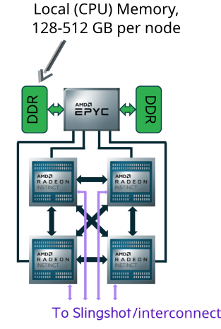
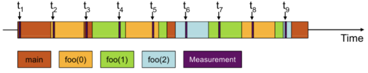
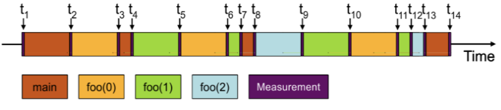

# GPU performance optimization {.section}

# Introduction
- GPUs (Graphics Processing Units) are widely used in High-Performance Computing (HPC) applications.
- GPUs are powerful and complex processors designed for parallel computing.
- GPUs require explicit expression of parallelism by the programmer.

# General Principles for High GPU Performance 

- Keep all the compute resources busy (idle resources are a waste)
- Minimize the synchronization at all levels
- Minimize the data transfers between host and device 
- Keep the data in faster memory and use an appropriate access pattern

{.center width=40%}

# GPU performance analysis {.section}

# Performance analysis cycle

{.center width=60%}

# Measuring performance
- Don’t speculate about performance – measure it!
- Performance analysis tools help to
    - Find hot-spots
    - Identify the cause of less-than-ideal performance
- Tools covered here
    - TAU, Omniperf
- Other tools
    - Perf, CrayPAT, Tau, Scalasca, gprof, PAPI, ...
    - CUPTI, AMD ROCm Profiler, ...
    - <http://www.vi-hps.org/tools/tools.html>

# Hardware performance counters

- Hardware performance counters are special registers on CPU \& GPU that count
  hardware events
- They enable more accurate statistics and low overhead
    - In some cases they can be used for tracing without any extra
      instrumentation

- Number of counters is much smaller than the number of events that can be
  recorded
- Different devices have different counters

# PAPI

- Performance Application Programming Interface (PAPI)
- Consistent interface and methodology for collecting performance counter information 
- Support for most major CPUs and GPUs
- Several performance analysis tools use PAPI underneath
    - API for collecting metrics within application
- Command line tools for investigating available counters *etc.*
    - `papi_avail`

# Profiling application

- Collecting all possible performance metrics with single run is not practical
    - Simply too much information
    - Profiling overhead can alter application behavior
- Start with an overview!
    - Call tree information, what routines are most expensive?

# <ins>Sampling</ins> vs. Tracing

- When application is profiled using sampling, the execution is stopped at
  predetermined intervals and the state of the application is examined
    - Lightweight, but may give skewed results

{.left width=60%}

# Sampling vs. <ins>Tracing</ins>
- Tracing records events, e.g., every function call
    - Usually requires modification to the executable
        - These modifications are called instrumentation
    - More accurate, but may affect program behavior
    - Often generates lots of data

{.left width=60%}

# Tau  Analysis Utilities

<small> 

- TAU is a powerful performance evaluation toolkit
- Runs on all HPC platforms, relatively easy to install
- Targets all parallel programming/execution paradigms (GPU, MPI, OpenMP, pthreads, ...)
- Programming languages: Fortran, C, C++, UPC,  Java, Python, ...
- TAU has instrumentation, measurement and analysis tools 
- User-friendly graphical interface
- Profiling: Measures total time spent in each routine
- Tracing: Shows events and their timings across processes on a timeline
- I/O performance evaluation
- Memory debugging

</small>

# Omniperf Tools

 - system performance profiling tool for machine
learning/HPC workloads running on AMD MI GPUs. 
 - presently targets usage on MI100 and MI200 accelerators.
 - profiling, roofline model, tracing
 - built on top of `roctracer` and `rocprof` 
