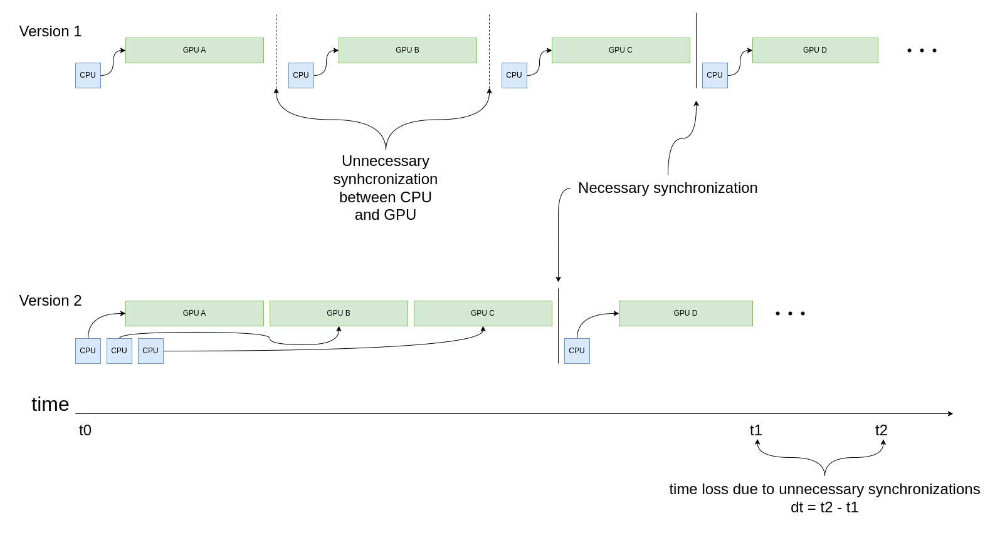
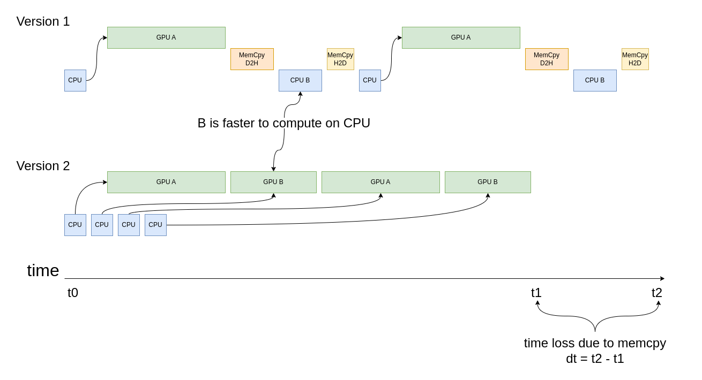
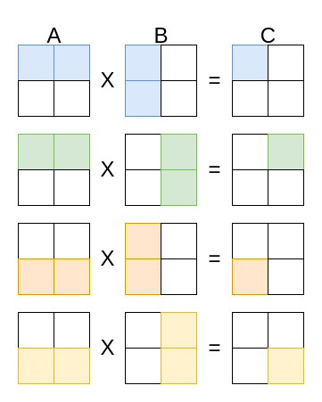

# Contents
- General Principles for High GPU Performance 
- GPU performance analysis
- Sampling vs tracing
- Tau
- Omniperf
- Hardware counters & papi

# Foreword

- GPUs are drastically different from CPUs
- Different principles apply for optimizing GPU code
- The following concentrates on single GPU codes

# General Principles for High GPU Performance {.section}

# General Principles for High GPU Performance 

Keep all the compute resources busy (idle resources are a waste)

:::::: {.columns}
::: {.column width="50%"}

 \
 \
```cpp
template <typename T>
constexpr void axpy(
  size_t i, T a, T *x, T *y, T *r) {
    r[i] = a * x[i] + y[i];
}
```

:::
::: {.column width="50%"}

{.center width=80%}

:::
::::::

# General Principles for High GPU Performance 

Minimize synchronization (at all levels)

:::::: {.columns}
::: {.column width="30%"}

<small>
```cpp
// Version 1
computeA<<<...>>>(...);
deviceSynchronize();

computeB<<<...>>>(...);
deviceSynchronize();

computeC<<<...>>>(...);
deviceSynchronize();

computeD<<<...>>>(...);

// Version 2
computeA<<<...>>>(...);
computeB<<<...>>>(...);
computeC<<<...>>>(...);
deviceSynchronize();

computeD<<<...>>>(...);
```
</small>

:::
::: {.column width="70%"}

{.center width=100%}

:::
::::::

# General Principles for High GPU Performance 

Minimize data transfers between host and device 

:::::: {.columns}
::: {.column width="30%"}

<small>
```cpp
// Version 1
while (1) {
    computeA<<<...>>>(...);
    memcpyD2H();

    computeB(...);
    memcpyH2D();
}

// Version 2
while (1) {
    computeA<<<...>>>(...);
    computeB<<<...>>>(...);
}
```
</small>

:::
::: {.column width="70%"}

{.center width=100%}

:::
::::::

# General Principles for High GPU Performance 

:::::: {.columns}
::: {.column width="70%"}

Keep the data in faster memory

<small>
```cpp
__global__ void tiled_mat_mul(float *a, float *b, float *c) {
    __shared__ float tileA[64];
    __shared__ float tileB[64];
    // Load data from a and b to shared memory and compute c
    // while reusing the shared memory by the threads in one block
}
```
</small>

:::
::: {.column width="70%"}

{.center width=50%}

:::
::::::

# General Principles for High GPU Performance 

:::::: {.columns}
::: {.column width="30%"}

Use an appropriate access pattern

:::
::: {.column width="70%"}

{.center width=100%}

:::
::::::

# GPU performance analysis {.section}

# Performance analysis cycle

{.center width=60%}

# Measuring performance

::: incremental

- Don’t speculate about performance – measure it!
- Performance analysis tools help to
    - Find hot-spots
    - Identify the cause of less-than-ideal performance
- Tools covered here
    - TAU, Omniperf
- Other tools
    - Perf, CrayPAT, Scalasca, gprof, PAPI, ...
    - CUPTI, AMD ROCm Profiler, ...
    - <http://www.vi-hps.org/tools/tools.html>

:::

# Profiling application

::: incremental

- Collecting every possible metric on a single run is not practical
    - Too much data
    - Profiling overhead can alter application behavior
- Start with an overview
    - Call tree information, what routines are most expensive?

:::

# [Sampling]{.underline} vs. Tracing

::::::::: {.columns}
:::::: {.column width="50%"}

::: incremental

- Application is stopped at predetermined intervals 
    - Information is collected about the state of application
- Lightweight, but may give skewed results
    - Statistical information

:::

::::::
:::::: {.column width="50%"}

{.left width=100%}

::::::
:::::::::

# Sampling vs. [Tracing]{.underline}

::::::::: {.columns}
:::::: {.column width="50%"}

::: incremental

- Records events, e.g., every function call
- Requires usually modification to the executable: code instrumentation
- More accurate than sampling, but may affect program behavior
- Generates often lots of data

:::

::::::
:::::: {.column width="50%"}

{.left width=100%}

::::::
:::::::::

# Tau Analysis Utilities

::: incremental

- <https://www.cs.uoregon.edu/research/tau/home.php>
- A performance evaluation toolkit
- Runs on all HPC platforms, (sometimes) easy to install
- Targets all parallel programming/execution paradigms (GPU, MPI, OpenMP, pthreads, ...)
- Programming languages: Fortran, C, C++, UPC, Java, Python, ...

:::

# Tau Analysis Utilities cont.

::: incremental

- TAU has instrumentation, measurement and analysis tools 
- User-friendly graphical interface
- Profiling: Measures total time spent in each routine
- Tracing: Shows events and their timings across processes on a timeline
- I/O performance evaluation
- Memory debugging

:::

# Omniperf Tools

::: incremental

- <https://amdresearch.github.io/omniperf/getting_started.html>
 - system performance profiling tool for machine
learning/HPC workloads running on AMD MI GPUs 
 - presently targets usage on MI100 and MI200 accelerators
 - profiling, roofline model, tracing
 - built on top of `roctracer` and `rocprof`  
 - supports both a web-based GUI and a command-line analyzer for user convenience

:::

# Hardware performance counters

::: incremental

- Special registers on CPU \& GPU that count hardware events
- Enable more accurate statistics and low overhead
    - In some cases they can be used for tracing without any extra
      instrumentation
- Number of counters is much smaller than the number of events that can be
  recorded
- Different devices have different counters

:::

# PAPI

::: incremental

- Performance Application Programming Interface (PAPI)
- Consistent interface and methodology for collecting performance counter information 
- Support for most major CPUs and GPUs
- Several performance analysis tools use PAPI underneath
    - API for collecting metrics within application
- Command line tools for investigating available counters *etc.*
    - `papi_avail`

:::

