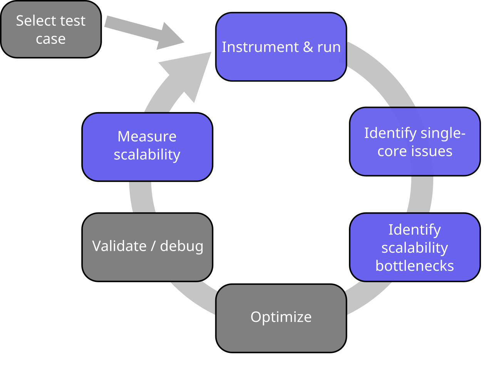
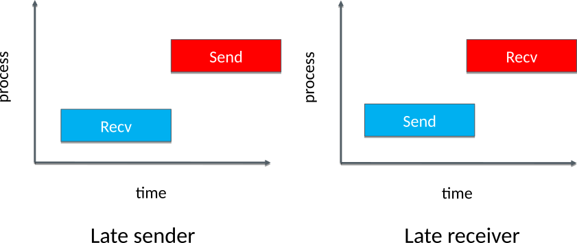
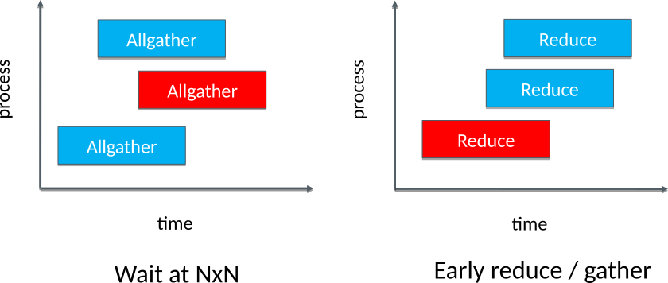

# MPI performance analysis  {.section}

# Performance analysis cycle

{.center width=60%}

# Introduction

- Finding out the scalability bottlenecks of parallel application is non-trivial
- Bottlenecks can be very different with few CPUs/GPUs than with thousands of CPUs/GPUs
- Performance analysis needs to be carried in scalability limit with
  large enough test case
- Efficient tools are needed for the analysis of massively parallel applications

# Potential scalability bottlenecks

- Bad computation to communication ratio
    - In 2D heat equation with one dimensional parallelization  
      $\frac{T_{comp}}{T_{comm}} \sim \frac{N}{p}$

- Load imbalance
- Synchronization overhead
- Non-optimal communication patterns

# Common inefficient communication patterns

{.center width=80%}

# Common inefficient communication patterns

{.center width=80%}

# MPI performance analysis

- Many tools can automatically identify common problematic communication
   patterns
- Flat profile
    - Time spent in MPI calls during the whole program execution
- Trace
    - Also the temporal profile of MPI calls
    - Potentially huge data

# Demo: TAU tracing {.section}

# Summary

- Many tools can provide information about MPI performance problems
    - Manual investigation impossible in massively parallel scale
- Problems often caused by load imbalance or by badly designed communication
  pattern

# Optimization overview

- Optimization is challenging topic
- Many technical low-level details
     - Often very architecture and problem specific
- Lots of trial and error
- Do the basics right
    - Use efficient algorithms
    - Use well-known libraries (BLAS, LAPACK, FFTW, …)
    - Test different compilers and compiler options
    - Avoid unnecessary I/O

# More detailed information

- <https://events.prace-ri.eu/event/718/material/slides/>
- <http://www.agner.org/optimize/>
- <https://pop-coe.eu/further-information/learning-material>
- <http://www.prace-ri.eu/best-practice-guides/>

