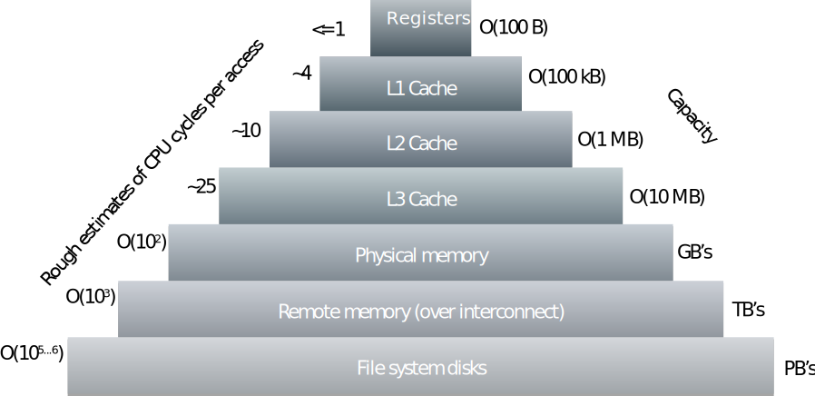
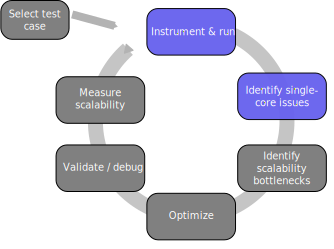

# Single node performance optimization {.section}

# Doesn't the compiler do everything?

- You can make a big difference to code performance with how you
  express things
- Helping the compiler to spot optimisation opportunities
- Using the insight of your application
    - language semantics might limit compiler
- Removing obscure (and obsolescent) "optimizations" in older code
    - Simple code is the best, until otherwise proven
- This is a dark art, mostly: optimize on case-by-case basis
    - First, check what the compiler is already doing


# Compiler optimization techniques

- Architecture-specific tuning
    - Tunes all applicable parameters to the defined microarchitecture
- Vectorization
    - Exploiting the vector units of the CPU (AVX etc.)
    - Improves performance in most cases
- Loop transformations
    - Fusing, splitting, interchanging, unrolling etc.
    - Effectiveness varies

# Cache memory

<div class=column>
- In order to alleviate the memory bandwidth bottleneck, CPUs have multiple levels of cache memory
    - when data is accessed, it will be first fetched into cache
    - when data is reused, subsequent access is much faster
- L1 is closest to the CPU core and is fastest but has smallest capacity
- Each successive level has higher capacity but slower access
</div>

<div class=column>
<!-- Image copyright CSC, see LICENSE -->
{.center width=90%}
</div>

# Vectorization

- Modern CPUs have SIMD (Single Instruction, Multiple Data) units and instructions
    - Operate on multiple elements of data with single instructions
- AVX2 256 bits = 4 double precision numbers
- AVX512 512 bits = 8 double precision numbers
    - single AVX512 fused multiply add instruction can perform 16 op's / cycle

<br>
<!-- Image copyright CSC, see LICENSE -->
{.center width=70%}


# Compiler flag examples {.table-colour}
<small>

| Feature                      | Gnu and Clang           | Intel              | Cray              |
|------------------------------|-------------------------|--------------------|-------------------|
| Balanced optimization        | `-O3`                   | `-O2`              | `-O3`       |
| Agressive optimization       | `-Ofast -funroll-loops` | `-Ofast`           | `-O3 -hfp3`         |
| Architecture specific tuning | `-march=<target>`       | `-x<target>`       | `-h cpu=<target>` |
| Fast math                    | `-ffast-math`           | `-fp-model fast=2` | `-h fp3`          |

</small>

# What the compiler is doing? {.table-colour}

<div class=column>
- Compilers have vast amount of heuristics for optimizing common
  programming patters
- Most compilers can provide a report about optimizations performed,
  with various amount of detail
    - See compiler manuals for all options
- Look into assembly code with
  <br> `-S -fverbose-asm`

</div>
<div class=column>

| Compiler    |  Opt. report               |
| ----------- | -------------------------- |
| GNU         | `-fopt-info`               |
| Clang       | `-Rpass=.*`                |
| Intel       | `-qopt-report`             |
| Cray        | `-hlist

<br>

```
...
  vfmadd213pd %ymm0, %ymm2, %ymm10
  vfmadd213pd %ymm0, %ymm2, %ymm9
  vfmadd213pd %ymm0, %ymm2, %ymm8
...
```
</div>


# Single node performance analysis {.section}

# Performance analysis cycle

{.center width=60%}

# Measuring performance
- Don’t speculate about performance – measure it!
- Performance analysis tools help to
    - Find hot-spots
    - Identify the cause of less-than-ideal performance
- Tools covered here
    - Intel VTune
- Other tools
    - Perf, CrayPAT, Tau, Scalasca, gprof, PAPI, ...
    - NVIDIA Nsight, AMD ROCm Profiler, ...
    - <http://www.vi-hps.org/tools/tools.html>

# Hardware performance counters

- Hardware performance counters are special registers on CPU that count
  hardware events
- They enable more accurate statistics and low overhead
    - In some cases they can be used for tracing without any extra
      instrumentation

- Number of counters is much smaller than the number of events that can be
  recorded
- Different CPUs have different counters

# PAPI

- Performance Application Programming Interface (PAPI)
- Consistent interface and methodology for collecting performance counter information 
- Support for most major CPUs and GPUs
- Several performance analysis tools use PAPI underneath
    - API for collecting metrics within application
- Command line tools for investigating available counters *etc.*
    - `papi_avail`

# Profiling application

- Collecting all possible performance metrics with single run is not practical
    - Simply too much information
    - Profiling overhead can alter application behavior
- Start with an overview!
    - Call tree information, what routines are most expensive?

# <ins>Sampling</ins> vs. Tracing

- When application is profiled using sampling, the execution is stopped at
  predetermined intervals and the state of the application is examined
    - Lightweight, but may give skewed results

{.left width=60%}

# Sampling vs. <ins>Tracing</ins>
- Tracing records events, e.g., every function call
    - Usually requires modification to the executable
        - These modifications are called instrumentation
    - More accurate, but may affect program behavior
    - Often generates lots of data

{.left width=60%}


# Intel VTune

- VTune is a tool that can give detailed information on application resource
  utilization
    - Uses CPU hardware counters on Intel CPUs for more accurate statistics
- VTune has extensive GUI for result analysis and visualization

# VTune

- Analysis in three steps
    1. **Collect:** Run binary and collect performance data - sampling based
       analysis
    2. **Finalize:** Prepare data for analysis - by default combined with
       collect
    3. **Report:** Analyze data with VTune

# VTune
- In addition to the GUI, command-line tools can be used to collect the
  statistics
    - Works with batch jobs too
- Many different profiles (actions), for example
    - *hotspots* for general overview
    - *advanced-hotspots* for more detailed view with hardware counters
    - *hpc-performance* for HPC specific analysis
    - *memory-access* for detailed memory access analysis

# VTune demo {.section}

