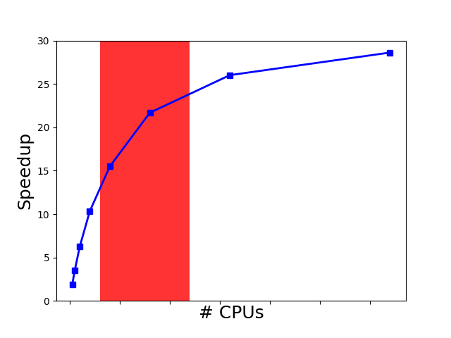
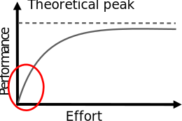

# A day in life at CSC

<div class=column>
**CSC customer**
<br>
<small>
I’m performing simulations with my Fortran code. It seems to perform much worse
with MKL library in the new system than with IMSL library in the old system.
<br>
<br>
No
</small>
</div>

<div class=column>
**CSC specialist**
<br>
<br>
<br>
<br>
<br>
<small>
Have you profiled your code?  
</small>
</div>

# A day in life at CSC

- Profiled the code: 99.9% of the execution time was being spent on these lines:

```fortran
do i=1,n          ! Removing these unnecessary loop iterations reduced the 
 do j=1,m         ! wall-time of one simulation run from 17 hours to 3 seconds…
    do k=1,fact(x)
      do o=1,nchoosek(x)
         where (ranktypes(:,:)==k)
            ranked(:,:,o)=rankednau(o,k)
         end where
      end do
    end do
  end do
end do
```

# Minding performance {.section}

# Improving application performance

- Obvious benefits
    - Better throughput => more science
    - Cheaper than new hardware 
    - Save energy, compute quota etc.
- ...and some non-obvious ones
    - Potential cross-disciplinary research with computer science
    - Deeper understanding of application

# Improving application performance

- Modern supercomputers are very complex (with evermore increasing
  complexity)
    - Multiple CPU cores within one socket
    - Superscalar out-of-order instruction execution
    - Multilevel coherent caches
    - SIMD vector units
    - SMT capabilities for multithreading
    - Complex communication topologies
- To get most out of the hardware, performance engineering is needed


# Performance engineering

- Adapting the problem to the underlying hardware
- Key factors to application performance
    - Effective algorithms, doing things in a more clever way
        * e.g. O(n log(n)) vs O(n^2)
    - Efficient memory access
    - High CPU cycle utilization
    - Parallel scalability
    - Efficient I/O

# Performance engineering

- Important to understand interactions
    - Algorithm `–` code `–` compiler `–` libraries `–` hardware
- Performance is not portable
- Optimize only the parts of code that are relevant for the total
  execution time!
    - Typically small part of the code (`~`10 %) consumes most
        (`~`90%) of the execution time 

# Compute bound vs. memory bound

- CPU bound: performance is limited by floating point operations CPU
  can execute
    - No waiting for data
    - Limit is theoretical peak performance
- Memory bound: performance is limited by how fast CPU can fetch data
  from memory
    - CPU performance has been increasing more rapidly than memory
      bandwidth
    - Limit is memory bandwidth
    - Optimized memory access is critical to performance


# Memory hierarchy

{.center width=80%}

# SIMD vectorization

<div class=column>

- SIMD instructions operate on multiple elements at one cycle
- AVX/AVX2: 256 bits:
    - 4 DP values
    - 8 SP values
    - AVX2 brings FMA
- AVX512: 512 bits
    - 8 DP values
    - 16 SP values
</div>
<div class=column>
```c
double * A, * B, * C;
int i, N;
/* C loops */
for (i=0; i<N; i++)
   C[i]=B[i]+A[i];

```
{.center width=100%}
</div>

# Code optimization cycle

{.center width=60%}

# Selecting the test case

<div class=column>
- Test case should represent a real production run
- Measurements should be carried out on the target platform
    - "Toy" run on laptop is in most cases useless
- Measurements should be done on both sides of scalability limit
    - Rule of thumb: doubling number of CPUs increases performance
      less than factor of 1.5
</div>

<div class=column>
{.center width=80%}
</div>

# On compilers and performance {.section}

# Optimal porting

<div class=column>
- ”Improving application performance without touching the source code”
- Potential to get significant performance improvements with little effort
- Should be revisited routinely
    - Hardware, OS, compiler and library upgrades
    - Can be automated
</div>
<div class=column>

{.center width=80%}
<small>

- Compilers
- Compiler flags
- Numerical libraries
- Intranode placement
- Internode placement
- Filesystem parameters

</small>
</div>

# Choosing a compiler

- Many different options
    - GNU, PGI, Intel, Cray, etc.
- Compatibility
    - Different proprietary intrinsics
    - Different rounding rules
- Performance
    - There is no universally fastest compiler
    - Depends on the application or even input

# Compiler optimization techniques

- Architecture-specific tuning
    - Tunes all applicable parameters to the defined microarchitecture
- Vectorization
    - Exploiting the vector units of the CPU (AVX etc.)
    - Improves performance in most cases
- Loop transformations
    - Fusing, splitting, interchanging, unrolling etc.
    - Effectiveness varies


# Compiler flag examples
<small>

| Feature                      | Cray              | Intel              | Gnu                     |
|------------------------------|-------------------|--------------------|-------------------------|
| Reporting                    | `-hlist=a`        | `-qopt-report=3`   | `-fopt-info-vec`        |
| Balanced optimization        | `(default)`       | `-O2`              | `-O3`                   |
| Agressive optimization       | `-O3,fp3`         | `-Ofast`           | `-Ofast –funroll-loops` |
| Architecture specific tuning | `-h cpu=<target>` | `-x<target>`       | `-march=<target>`       |
| Fast math                    | `-h fp3`          | `-fp-model fast=2` | `-ffast-math`           |

</small>

# Doesn't the compiler do everything?

- You can make a big difference to code performance with how you
  express things
    - Helping the compiler spot optimisation opportunities
    - Using the insight of your application
    - Removing obscure (and obsolescent) “optimizations” in older code
        - Simple code is the best, until otherwise proven
- This is a dark art, mostly: optimize on case-by-case basis
    - First, check what the compiler is already doing

# Take-home messages

- Mind the application performance: it is for the benefit of you,
  other users and the service provider
- Profile the code and identify the performance issues first, before
  optimizing anything
    - “Premature code optimization is the root of all evil”
- Quite often algorithmic or intrusive design changes are needed to
  improve parallel scalability
- Serial optimization is mostly about helping the compiler to optimize
  for the target CPU

# How to start?
- What limits the performance?
    - Serial / OpenMP (single node performance)
    - MPI (internode performance)
    - I/O
- Intel Performance Snapshot can provide big picture for further
  analysis
    - Other possible tools: gprof, TAU, scalasca, CrayPAT


