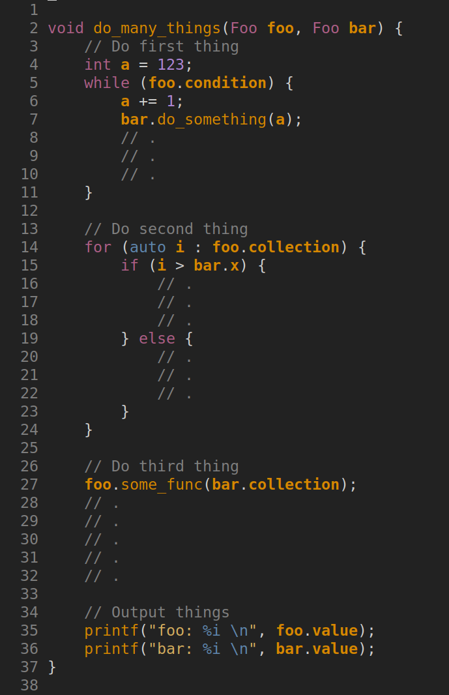
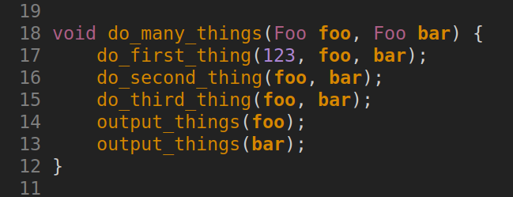

# Overview
- Why?
- Different types of tests
- Testing frameworks
- Demo
- Summary

# Why? {.section}

# Why test your software?
- Improves code quality

# Why test your software?

- Improves code quality
    - testing is easier when you have *modular-code-of-small-functions*
    - *modular-code-of-small-functions* leads to code that is *easy-to-understand*
    - when code is *easy-to-understand*, it's easier to have *thoroughly-tested-code*
    - *thoroughly-tested-code* usually has fewer bugs and is more pleasant to work with and modify
    - bonus: well named (short) functions self-document your code

    

        {width=80%}
    

    

        {width=80%}
    

# Why test your software?

- Improves code quality
    - testing is easier when you have *modular-code-of-small-functions*
    - *modular-code-of-small-functions* leads to code that is *easy-to-understand*

    

        {width=80%}
    

    

        {width=80%}
    

# Why test your software?
- Improves code quality
- Improves life quality
    - Software with fewer bugs is more pleasant to use and modify

# Why test your software?
- Improves code quality
- Improves life quality
- Provides guarantees
    - Passing tests prove that your code does what it says it does

# Why test your software?
- Improves code quality
- Improves life quality
- Provides guarantees
    - Passing tests prove that your code does what it says it does
    - *See, it works* vs *Trust me, it works*

# Why test your software?
- Improves code quality
- Improves life quality
- Provides guarantees
- Provides a safety net
    - Modifying code is less daunting when a test battery is there to catch your mistakes

# Test types {.section}

# Test types
- Unit tests
- Integration tests
- Regression tests

# Unit tests
- Write small tests for small functions

# Integration tests
- Write small tests for small functions

# Regression tests
- Write small tests for small functions

# Frameworks {.section}

# Frameworks
A long list from which to choose from

- https://en.wikipedia.org/wiki/List_of_unit_testing_frameworks

We'll be focusing of CTest today

# CTest
- Comes bundled with CMake

# Demo {.section}

# Summary
- Different types of tests
    - Unit tests
    - Integration tests
    - Regression tests
- Testing software and frameworks
    - CTest
- Demo

# Documenting {.section}
<small>
Material is partly based on work by Software Carpentry and Code Refinery 
licensed under CC BY-SA 4.0
</small>

# What to document: how to use the code

- Installation instructions
- Input files and input parameters
- Format of the output files
- Tutorials on specific cases
- Examples that can be copy-pasted
- FAQs
- How to cite the code !

{.center width=70%}
 
{.center width=70%}

# Documentation in LiGen & ICON

LiGen
- User guide and developer guide written in LaTex
    - Explain how to use (user guide)
    - Explain not obvious design choices and data structures (developer guide)
- Lot of comments in the codebase

ICON
- No single extensive user or developer documentation
- Set of LaTex files within repository
- Separate user tutorials
- Some developer information within gitlab wiki
- Relatively good documentation in source 

# Testing {.section}

# Testing

**Simulations and analysis with untested software  
do not constitute science!**

- Experimental scientist would never conduct an experiment with uncalibrated 
  detectors
- Computational scientist should never conduct simulations with untested 
  software

# Why software needs to be tested?

- Ensure expected functionality
- Ensure expected functionality is preserved
    - Software is fragile, bugs lurk in easily
    - In large projects innocent looking changes can have surprising side effects
- Testing helps detecting errors early
- Testing is essential for reproducibility of results
- Tests make it easier to verify whether software is correctly installed
- Tests make it easier to port the code to new architectures

# Defensive programming

- Would you trust a software ...
    - ... when its tests do not pass?
    - ... if the tests are never run?
    - ... if there are no tests at all?
- Assume mistakes will happen and introduce guards against them
- Test drive development
    - Tests are written before actually implementing the functionality

# What should be tested in scientific software ?

- Validity of the physical model
    - Comparison to experimental results
- Validity of numerical methods and implementation
    - Comparison to analytic solutions of special cases
    - Conservation laws and symmetries
- Correct functioning of individual subroutines and modules
- Performance
    - Changes in software may lead into degradation in performance
- Dependency variants 
    - At least compiler and mpi implementation

# Unit testing

- Tests for smallest testable part of an application
    - Function, module or class
- Ideally, tests are independent of each other
- Frameworks: cUnit, cppunit, pFUnit, Google Test, pytest, ...
- Client code which executes tests can be also hand-written
- Unit testing helps in managing complexity
    - Well structured and modular code is easy to test

# Integration testing

- Combining individual software modules and testing as group
    - "Trivial" changes in code can have surprising side effects
    - Example: testing a specific solver which utilizes several modules
- At the highest level tests the whole application
- Recommended to be combined with unit testing

# Continuous integration

- Automatic testing
    - Build test ensures that code is always in a "working state"
    - Linting test ensures code adheres to style guide
- Unit and integration tests can be run automatically after build succeeds
- Nightly / weekly tests
    - Software is built and tested at specified times
- Test at "commit"
    - Test set is run when new code is pushed to main repository
- Nightly and "commit" tests can exclude time consuming tests

# Continuous integration

- Test system should send a notification when test fails
    - Mailing list, IRC, Flowdock, …
- Test status can be shown also in www-page
- Tools for continuous integration:
    - GitHub Actions
    - Gitlab CI
    - Travis-CI
    - Jenkins
    - Buildbot

{.center width=90%}

# Challenges with HPC

- Behavior can depend on the number of threads and MPI tasks
    - Parallel components should be tested with multiple different parallelization schemes
    - Results can change with different MPI geometries
    - GPU have different aritmethic units: perfectly reproducible results may not be available.
- Large scale integration tests can be time consuming
- Changes in program code may also lead to degradation in performance and 
  scalability
    - Tests should track also the performance

# Challenges with HPC

- Performance is often system/architecture specific
    - How to get access to different branches of CPUs / GPUs?
- Complicated dependency chains makes testing even harder
    - Impossible to test exhaustively 
- Systems are very noisy, especially on the filesystem and network level.
- Different compilers may produce different results (and have bugs)
- How to run CI tests from public repository on supercomputers?

# How is your code tested?

**Discuss** within your table!

# Testing in LiGen & ICON

LiGen

- Large set of end-to-end tests
- Smaller set of unit tests
- Developers have to test before pushing changes
- Comparison of results obtained by the different backends (CPU/CUDA/SYCL) helps in finding bugs

ICON

- No unit testing framework 
- Build tests and integrations tests with buildbot
    - ~10 different supercomputers included in the testing
- Buildbot tests need to be triggered manually

# Take home messages

- Document your code
- Test your code, prefer automatic testing
