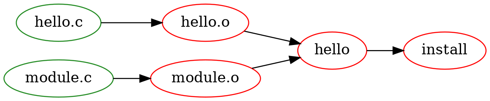
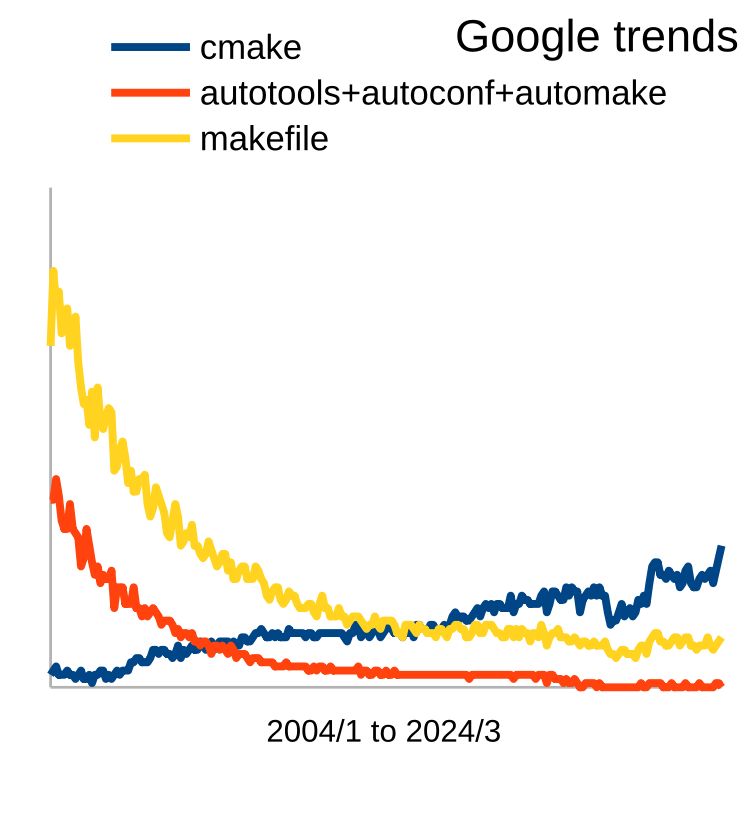

# Solution
Like so:
```bash
> gcc hello.c -o hello
```

# Multiple files

```bash
> ./build.sh
```
where `build.sh`:
```bash
#!/bin/bash
gcc module.c -c -o module.o
gcc hello.c -c -o hello.o
gcc module.o hello.o -o hello
```

# Even more files
## Almost always `build.sh` is good enough!

:::::{.columns}
:::{.column}
- **Pros**: simple, transparent
- **Cons**: 
    - Edit one file, compile all
    - Cross platform
    - Installing binaries?
    - Linking to shared libraries: works on my machine!
    - Serial
- Address all cons: No longer simple and transparent.
:::
:::{.column}
```bash
> ./build.sh
```
`build.sh`:
```bash
#!/bin/bash
CC=gcc
CFLAGS=-g -O2

$CC module_a.c $CFLAGS -c -o module_a.c
$CC module.c $CFLAGS -c -o module.o
$CC hello.c $CFLAGS -c -o hello.o

$CC module.o hello.o -o hello

```
:::
::::::

# GNU Make: `Makefile`


* Simplest Makefile: no Makefile
```bash
> make hello
cc     hello.c   -o hello
```
* No unnecessary rebuild:
```bash
> make hello
make: 'hello' is up to date.
```

```bash
> touch hello.c && make hello
cc     hello.c   -o hello
```


# GNU Make: `Makefile`

::::::{.columns}
:::{.column}
`Makefile`
```Makefile
.PHONY: clean all install
%.o: %.c
	$(CC) $(CFLAGS) -c $< -o $@

hello: hello.o module.o

clean:
    rm *.o hello

install: hello
    mkdir -p ./bin/
    cp hello ./bin/

all: hello

```
:::
:::{.column}

Build with 2 threads:
```bash
> make -j 2 install
cc  -c hello.c -o hello.o
cc  -c module.c -o module.o
cc   hello.o module.o   -o hello
mkdir -p ./bin/
cp hello ./bin/
```
:::
Almost always Makefile is good enough!
::::::


# CMake {.section}
## When `build.sh` nor `Makefile` are not good enough

# CMake
## What does it do?
<div align="center">

</div>

* Reads a special file `CMakeLists.txt` and generates a makefile:
  - Ninja
  - Unix Makefile
  - IDE project files, ...
* Replacement for GNU Autotools

# CMake
## Fundamental design rules

- One input file for all platforms: `CMakeLists.txt`
- Depend only on C++ compiler (and basic unix devel env)
- Support code generation
- Support IDEs: generates project files
  - *Nowadays IDEs support CMake*

# CMake
## Historical perspective

- 2000 Created at Kitware (Bill Hoffman)
- 2002 VTK and ParaView adopt CMake
- 2006 KDE
- 2008 CMakeLists.txt for the LLVM compiler
- 2011 ninja generator added to CMake
- 2016 LLVM adopts CMake and removes autoconf
- 2019 Qt

# CMake
## Documentation

::::::{.columns}
:::{.column width="55%"}
* [Reference documentation: cmake.org/cmake/help/latest/](https://cmake.org/cmake/help/latest/)
* Search engines: 
    - *"cmake how to link to libpng"*
    - *"cmake why doesn't this work?"*
* Command line: `cmake --help <command>`
:::
:::{.column width="39%" align="top"}

:::
::::::

# Copy-paste CMakeLists.txt
```cmake
# Makes cmake act like its version were 3.18 (this is a comment)
cmake_minimum_required(VERSION 3.18)

project(project_hello VERSION 0.1 DESCRIPTION "Hello project" LANGUAGES C) 

set(BUILDER_NAME "Default" CACHE STRING "Variable description")
configure_file("${PROJECT_SOURCE_DIR}/include/config.h.in"
    "${PROJECT_BINARY_DIR}/include/config.h")

add_library(module STATIC module.c)
target_include_directories(module PUBLIC include)
add_executable(hello hello.c)
target_include_directories(hello PUBLIC include ${PROJECT_BINARY_DIR}/include)
target_link_libraries(hello PUBLIC module)

install(TARGETS hello module RUNTIME DESTINATION "bin" ARCHIVE DESTINATION "lib"
  LIBRARY DESTINATION "lib")
```

# Copy-paste CMakeLists.txt line-by-line

* Declare cmake compatibility and project information
   - Which `LANGUAGES` to detect from the system?

```cmake
# Makes cmake act like its version were 3.18 (this is a comment)
cmake_minimum_required(VERSION 3.18)
project(project_hello VERSION 0.1 DESCRIPTION "Hello project" LANGUAGES C) 
```

# Copy-paste CMakeLists.txt line-by-line

* Make a variable:
  - cache its value: `CACHE` (must-caps)
  - name: `BUILDER_NAME` (no-need caps)
  - type: `STRING` (must-caps)
```cmake
set(BUILDER_NAME "Default" CACHE STRING "Variable description")
```
* Fill a template file

    ```cmake
    configure_file("${PROJECT_SOURCE_DIR}/include/config.h.in"
        "${PROJECT_BINARY_DIR}/include/config.h")
    ```

  - Excerpt from `config.h.in`
```c
#define HELLO_BUILDER_NAME "@BUILDER_NAME@"
```

# Copy-paste CMakeLists.txt line-by-line
* Add static library target

    ```cmake
    add_library(module STATIC module.c)
    ```

* Give it a "`-I`" flag pointing to source directory `include/`. 
    - `PUBLIC` (must-caps): Propagate it to targets that depend on `module` (*default*).
    - `PRIVATE` (must-caps): Don't propagate.
    - `INTERFACE` (must-caps): Propagate but don't add to this.

    ```cmake
    target_include_directories(module PUBLIC include)
    ```


# Copy-paste CMakeLists.txt line-by-line

* Add executable target

    ```cmake
    add_executable(hello hello.c)
    ```

* Declare include directory under build-directory`/include/` to it

    ```cmake
    target_include_directories(hello PUBLIC include ${PROJECT_BINARY_DIR}/include)
    ```

* Link executable target `hello` to static library target `module` 

    ```cmake
    target_link_libraries(hello PUBLIC module)
    ```

# Copy-paste CMakeLists.txt line-by-line

* Declare what to install and where
    - executables (`RUNTIME`) to "bin"
    - static (`ARCHIVE`) `libs/` shared libs (`LIBRARY`)  to `lib/`
    ```cmake
    install(TARGETS hello module RUNTIME DESTINATION "bin" ARCHIVE DESTINATION "lib"
      LIBRARY DESTINATION "lib")
    ```

* Platform dependent: in windows `.dll` files go under `RUNTIME` destination!

# Copy-paste CMakeLists.txt: collected
```cmake
# Makes cmake act like its version were 3.18 (this is a comment)
cmake_minimum_required(VERSION 3.18)

project(project_hello VERSION 0.1 DESCRIPTION "Hello project" LANGUAGES C) 

set(BUILDER_NAME "Default" CACHE STRING "Variable description")
configure_file("${PROJECT_SOURCE_DIR}/include/config.h.in"
    "${PROJECT_BINARY_DIR}/include/config.h")

add_library(module STATIC module.c)
target_include_directories(module PUBLIC include)
add_executable(hello hello.c)
target_include_directories(hello PUBLIC include ${PROJECT_BINARY_DIR}/include)
target_link_libraries(hello PUBLIC module)

install(TARGETS hello module RUNTIME DESTINATION "bin" ARCHIVE DESTINATION "lib"
  LIBRARY DESTINATION "lib")
```

# Typical CMake usage: out of source build

```bash
> mkdir build; cd build                            # Out of source build
> cmake .. -C precache.cmake -T toolchain.cmake    # Generate makefiles and cmake cache files
> ccmake .                                         # Modify configuration further
> make                                             # Build software
```
<hr>

* Note: `CACHE` type variables in "CMakeLists.txt" are set only if they don't exist, but
* `precache.cmake`: *initial-cache* file with bunch of `set(variablename value
  cache ...)` statements is evaluated prior to evaluating `CMakeLists.txt`
  files.
* `toolchain.cmake`: *tool-chain* file but for setting `CMAKE_<language>_COMPILER` cache variables (`C`, `CXX`, `Fortran`, ...).

# Another CMakeLists.txt for heat equation

```cmake
cmake_minimum_required(VERSION 3.18)
project(heat VERSION 1.0 DESCRIPTION "Heat equation w/ cmake" LANGUAGES CXX C)

find_package(OpenMP) # Search internet: "cmake openmp how to enable"
find_package(PNG REQUIRED)

add_executable(heat_omp core.cpp heat.cpp main.cpp 
  setup.cpp utilities.cpp io.cpp "../../../hybrid/heat-hybrid/common/pngwriter.c")
target_link_libraries(heat_omp PRIVATE png)
target_include_directories(heat_omp PUBLIC "../../../hybrid/heat-hybrid/common")

if(OpenMP_CXX_FOUND)
  target_link_libraries(heat_omp PUBLIC OpenMP::OpenMP_CXX)
endif()

install(TARGETS heat_omp RUNTIME DESTINATION "heat" )
install(FILES "bottle.dat" DESTINATION "heat")
```

# CMake ecosystem

* CTest - testing in structured way
* CPack - make packages (tar.gz, .zip, .deb, .rpm etc)
* CDash - web server for collecting and displaying build and test results 
* `ccmake` - curses interface for modifying cache
* `cmake-gui` - graphical (qt) interface for modifying cache

# Opinions!

* How to identify when Makefiles are no longer enough
    - They start to contain if-else logic
    - You start googling for GNU Autotools
    - You want to link to a complicated library which supports CMake (Trilinos?)
    - You wish to publish a shared library
* "Should I use CMake for this project?"
    - Yes, because you said *project*
    - No, I intend to keep it on my computer
    
