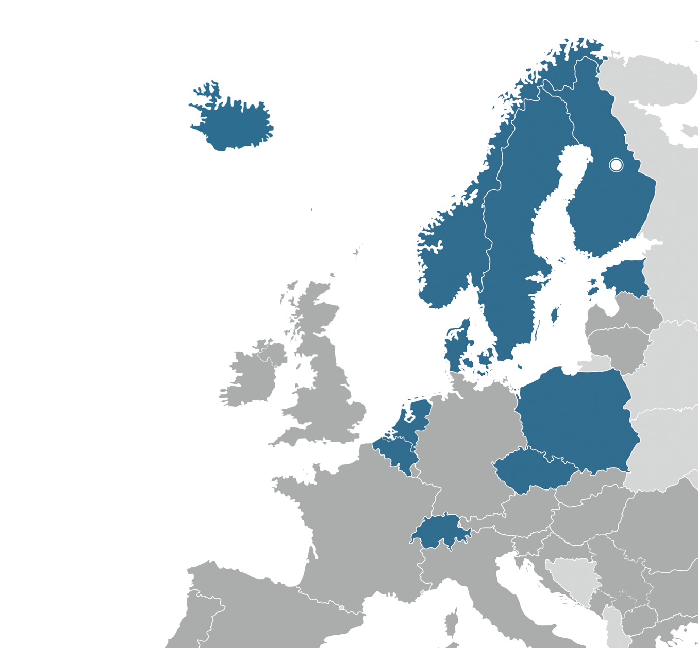
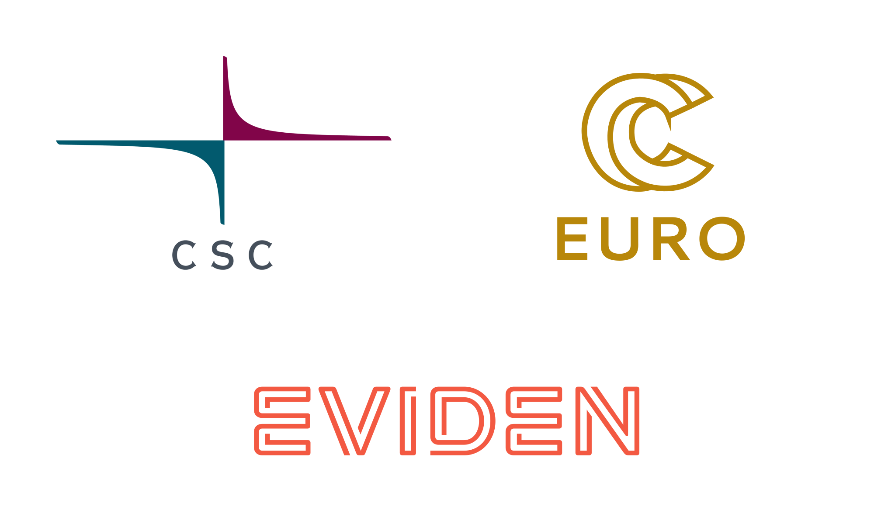

# Learning objectives

- The goal is to build HPC expertise up to an intermediate/semi-advanced level during the school.
- After the summer school, the participants will be able to:
  - Identify main parallel programming concepts
  - Create parallel MPI programs with C, C++, or Fortran programming languages
  - Create GPU-accelerated programs using HIP/CUDA
  - Recognize advanced parallel programming constructs
  - Understand and modify HPC applications utilizing MPI, OpenMP, and/or HIP/CUDA

# Summer School LUMI project

- Summer School LUMI project will end next week Thursday 10.7.2025
  - Please transfer out the data you wish to keep

# Using LUMI beyond the school

{.center width=80%}

:::::: {.columns}
::: {.column width="55%"}
- LUMI is a EuroHPC supercomputer
  - Co-funded by EuroHPC JU and the LUMI Consortium
  - Available for all users in Europe via EuroHPC

- Users in LUMI consortium countries can access the national LUMI resources in addition to the EuroHPC resources
  - To get started, apply a project <https://lumi-supercomputer.eu/get-started/>
:::
::: {.column width="45%"}
:::
::::::

# Using LUMI

- LUMI documentation
  - <https://docs.lumi-supercomputer.eu/>
- LUMI training materials
  - <https://lumi-supercomputer.github.io/LUMI-training-materials/>
- LUMI AI Guide
  - <https://github.com/Lumi-supercomputer/LUMI-AI-Guide>
- LUMI User Support Team
  - <https://lumi-supercomputer.eu/user-support/need-help/>

# Materials

- All material remains in the Summer School GitHub repository <https://github.com/csc-training/summerschool/>
  - See a zip file containing all the slides too
- A static copy of 2025 content will be published as a release under GitHub

# Upcoming CSC trainings

- Training portfolio: Overview of trainings 
  <https://research.csc.fi/training-portfolio/>
  - Portable GPU Programming
  - Practical Deep Learning
  - ...
- Training calendar: Schedule of trainings 
  <https://csc.fi/en/trainings/training-calendar/>

# Certificate

- You should have received a training certificate by email already
  - If not, please contact organizers

# Feedback

- You should have received a link to the feedback form by email
  - Anonymous
  - Your feedback is highly valued!

- <u>Now</u> it's a good time fill the feedback form

# Acknowledgements

{.center width=80%}

# Thank you!

 
 
 

Big thank you to all of you!

