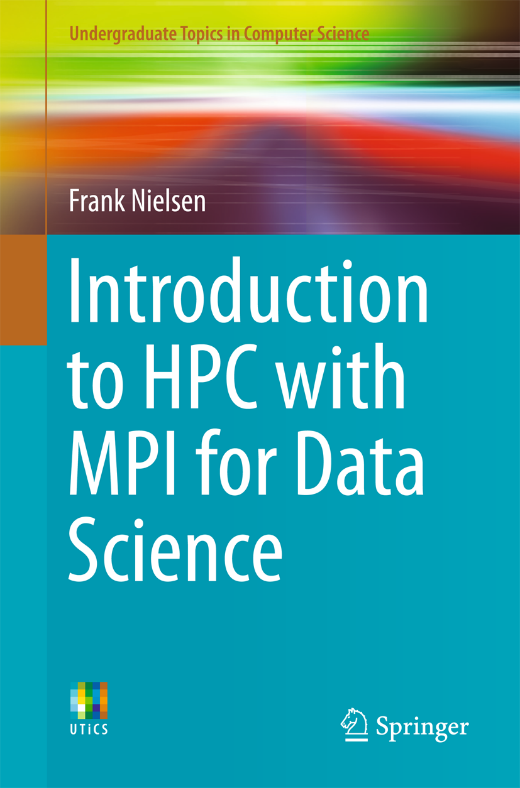
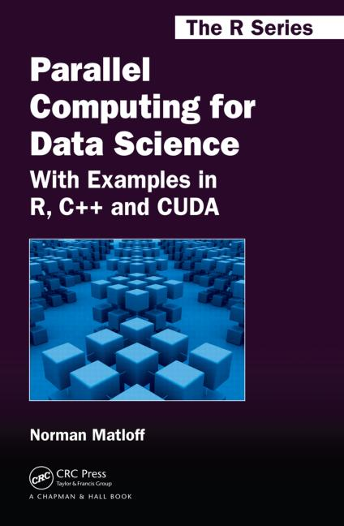
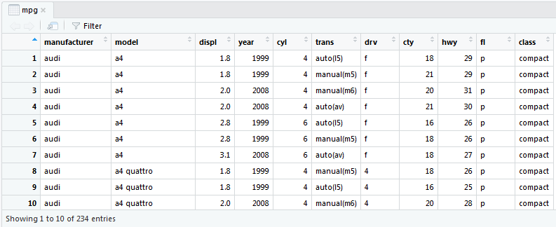
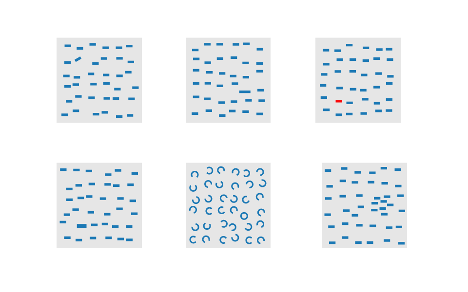
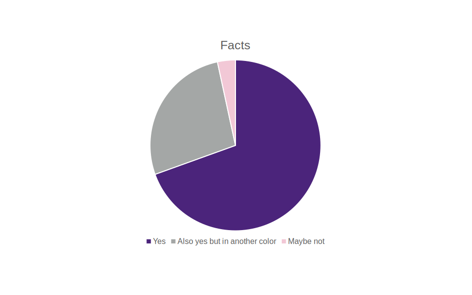

# What is data science

- Not just statistics rebranded
- Not just Big Data hype
- NB! Big data techniques are real, not hype
- Interdisciplinary field with a strong emphasis on communication and teamwork
- Emerged with the data deluge

{width=100%}

# Data science and HPC

- Many problem types in data science benefit nicely from parallel computing
matrix operations
	* K-means clustering
	* pairwise operations, graphs and adjacency matrices, sorting
	* MCMC
	* chunk averaging
	* and deep learning and GPUs

{width=45%}\ {width=45%}

# Apache Spark

- Apache Spark is a general-purpose cluster computing system
	- Spark SQL (for SQL and structured data) and MLlib (for machine learning) make it a high level framework for large scale data analysis
- Key concept is the RDD, resilient distributed dataset
	- fault tolerant
	- support transformations (like maps) and actions (like reduces)
- Question: Spark vs. MPI, which one wins?	

# The data in data science
- Data science commonly deals with "n observations, p variables" format of tabular ("rectangular") data, known as data frames
	- CSV (or any CSV-like) is a well suited file format for storing such data (when small)
- Other kinds of data and formats:
	- JSON, NetCDF, SQL
	- GIS
	- images, sound, video
	 -trees, graphs

# An example of a data frame viewed in RStudio:

{width=100%}

# Tidy data

- Tidy data (Codd's 3NF):
	1. Each variable must have its own column
	2. Each observation must have its own row
	3. Each value must have its own cell
- Specifically, you do not want to have data values in variable names!

subject temp90 temp95
------- ------ ------
ctrl	0.91	0.22
trt 	0.19	0.44

subject temp score
------- ---- -----
ctrl	90    0.91
trt 	90    0.19
ctrl	95    0.22
trt 	95    0.44

# R vs. Python (or something else?)

- There is no clear winner between the two
- Relevant Python libraries: Pandas, NumPy, SciPy, matplotlib, scikit-learn
- Relevant R packages: all of tidyverse, particularly ggplot2
- Others to consider:
	- 3d visualization: VisIt, ParaView, MayaVi
	- Tableau and Trifacta
	- Matlab, SAS, Excel etc. are not dead! Julia is an option too

# DATA VISUALISATION {.section}

# Why visualize data?

- "The purpose of visualization is insight, not pictures." (Ben Shneiderman)
- "You can see a lot by just looking." (Yogi Berra)
- Humans are obviously visual creatures

# Two famous examples (plus one)

- John Snow and the London cholera epidemic [https://public.tableau.com/en-us/s/gallery/mapping-1854-cholera-outbreak](https://public.tableau.com/en-us/s/gallery/mapping-1854-cholera-outbreak)
- Florence Nightingale in the Crimean war [https://beta.sciencemuseum.org.uk/stories/2016/11/4/florence-nightingalethe-pioneer-statistician](https://beta.sciencemuseum.org.uk/stories/2016/11/4/florence-nightingalethe-pioneer-statistician)
- (Almost unrelated bonus: [https://en.wikipedia.org/wiki/James_Lind](https://en.wikipedia.org/wiki/James_Lind))

# Some distinctions in visualisation 
- Exploration vs. communication
- data visualization vs. scientific visualization
- 3d visualization of surfaces
- maps
- animations
- infographics

# How do you make good visualizations?
- Is it about knowing the correct graph type?
- If not right, is it about being able to name a lot of graph types?
- Is it knowing which visualization tool is the best and how to use it?

# Albert Cairo: The truthful art

- Five qualities of great visualizations
	- Truthful
	- Functional
	- Beautiful
	- Insightful
	- Enlightening

# You are telling a story
- The most important aspect of creating good, effective visualizations is knowing which story you are telling
	- and to **who**, **what** you want them to do with the story and **how** are you going to tell it
- "Compared to what, to whom, to when, to where...?"
	- part to whole; new to old; levels of a category to each other; single level to the rest; ...
- Context is important

# Example: adding depth and breadth
*From Cairo: The truthful art*

- "Study finds more than a quarter of journalism grads wish they'd chosen another career."
	- compared to when? Years 1999 to 2012 present in the study, with not much change
	- compared to whom? No data on other majors
	- context? Wages and job opportunities in journalism?
- "Even if job prospects for journalists have worsened substantially and they may worsen even further in the future, the percentage of grads who wish they'd chosen another career hasn't changed at all in more than a decade."

# Pre-attentive features and gestalt laws
- Some visual features are **pre-attentive:** they are processed without conscious effort, you just see it
	- such as size, length, shape, orientation, color hue and intensity, texture, grouping...
- Some visual features help to perceive a collection as a whole: these are known as **gestalt principles**
	- proximity, similarity, enclosure, closure, continuity, connection (and then some)

#
{.center width=80%}

# Visual encoding of data

- Cairo: "There is a time in every class and workshop when someone raises her hand and asks: **How do you know that you have chosen the right graphic form to represent your data?** --- I invariably reply, 'I have no idea, but I can give you some clues to make your own choices based on what we know about why and how visualization works."

# Grammar of graphics
- Leland Wilkinson: The grammar of graphics (book)
- Hadley Wickham: The layered grammar of graphics (article)
- gpplot2 (a R package, part of _tidyverse_)
- the key idea in all of these:
- **When you make a data visualisation, you are mapping variables in your data to graphical elements in your plot**

# Graphical features, Cleveland's hierarchy
- position, length, angle, slope, area, volume, curvature, shading, color saturation, color hue
	- (does this list sound familiar by now?)
	- ordered here roughly according to Cleveland: the first ones allow for more accurate and faster estimates
	- addition by Cairo: the latter ones may be better able to reveal general patterns

#  Are pie charts always bad?

{.center width=80%}

