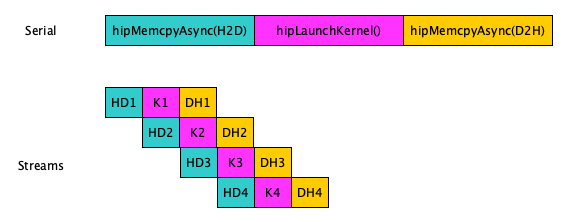
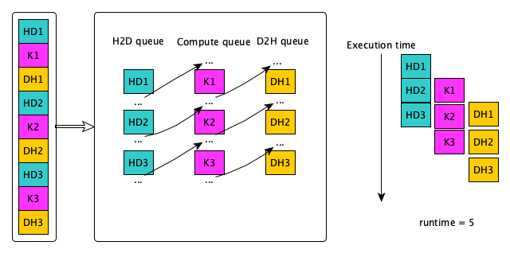

# OpenMP asynchronous operations {.section}

# Motivation

- By default, the host thread will wait until OpenMP `target` compute or data
  construct has completed its execution, *i.e.* there is an implicit
  barrier at the end of the `target`
- Potential parallelism in overlapping compute, data transfers, MPI,
  etc.

{.center}


# Asynchronous execution: nowait and taskwait

- `target` construct creates an implicit OpenMP task
- Similar to OpenMP explicit task constructs (`task`, `taskloop`), `target`
  has a `nowait` clause
    - removes the implicit barrier
- Completion can be ensured with the `taskwait` construct
- Work on host (concurrent to accelerator) can be parallelized with
  OpenMP tasks


# OpenMP and asynchronous execution

{.center}


# OpenMP and asynchronous execution

<div class=column>
```c
#pragma omp target nowait
process_in_device();

process_in_host();
#pragma omp taskwait
```
</div>

<div class=column>
```fortranfree
 !$omp target nowait
 call process_in_device();
 !$omp end target

 call process_in_host();
 !$omp taskwait
```
</div>


# Task dependencies

- OpenMP tasks support data flow model, where a task can have input
  and output dependencies

<div class=column>
```c
// The two tasks can be 
// executed concurrently
#pragma omp task
{do something}

#pragma omp task
{do something else}
```
</div>

<div class=column>
```c
// The two tasks cannot be 
// executed concurrently
#pragma omp task depend(out:a)
{do something which produces a}

#pragma omp task depend(in:a)
{do something which uses a as input}
```
</div>

- Also `target` tasks support dependencies


# Task dependencies

<div class=column>
<small>
```c
#pragma omp task depend(out: A)
 {Code A}
#pragma omp target depend(in: A) depend(out: B) \
 nowait
 {Code B}
#pragma omp target depend(in: B) depend(out: C) \
 nowait
 {Code C}
#pragma omp target depend(in: B) depend(out: D) \
 nowait
 {Code D}
#pragma omp task depend(in: A) depend(out: E)
  {Code E}
#pragma omp task depend(in: C,D,E)
  {Code F}
```
</div>
</small>

<div class=column>
{.center width=80%}
</div>


# Task dependencies

- Dependencies may be specified also for a part of an array

```c
// Preocessing array in blocks
for (int ib = 0; ib < n; ib += bf) {
  #pragma omp ... depend(out:A[ib*bf]) nowait
  {Processing step 1}
  #pragma omp ... depend(in:A[ib*bf]) nowait
  {Processing step 2}
}
```


# OpenMP asynchronous operations summary

- `target` construct creates an implicit OpenMP task
- OpenMP task functionalities (`nowait`, `taskwait`, `depend`) can
  be used for asynchronous execution on accelerators
- May enable better performance by overlapping different operations
    - Performance depends heavily on the underlying implementation

# Streams, events, and synchronization in HIP {.section}

# What is a stream?

* A sequence of operations that are executed in order on the GPU
* Operations in different streams may run concurrently if sufficient resources are available

<small>
<div class="column">
{width=800px}

* H-to-D copy runs in a single stream, and the kernel and D-to-H copy are split into 4 streams

</div>
<div class="column">
{width=800px}

* H-to-D copy, kernel, and D-to-H copy are split into 4 streams

</div>
</small>

# Asynchronous functions and the default stream

* The functions without `Async`-postfix run on the default stream, and are synchronizing with host

<small>

  ```cpp
  ​hipError_t hipMalloc ( void** devPtr, size_t size )
  ​hipError_t hipMemcpy ( void* dst, const void* src, size_t count, hipMemcpyKind kind )
  ​hipError_t hipFree ( void* devPtr ) 
  ```

  </small>

* When using non-default streams, functions with `Async`-postfix are needed
  * These functions take the stream as an additional argument (`0` denotes the default stream)

<small>

  ```cpp
  hipError_t hipMallocAsync ( void** devPtr, size_t size, hipStream_t stream ) 
  hipError_t hipMemcpyAsync ( void* dst, const void* src, size_t count, 
                              hipMemcpyKind kind, hipStream_t stream ) 
  hipError_t hipFreeAsync ( void* devPtr, hipStream_t stream ) 
  ```
</small>

# Asynchronous functions and the page-locked memory

 * Asynchronous memory copies require page-locked host memory (more in Memory lectures)
   * Allocate with `hipHostMalloc()` instead of `malloc()`:
  ```cpp
  ​hipError_t hipHostMalloc ( void** pHost, size_t size, unsigned int  flags ) 
  ```
  
   * Deallocate with `hipFreeHost()`:
  ```cpp
  ​hipError_t hipFreeHost ( void* ptr ) 
  ```

# Asynchronisity and kernels


* Kernels are always asynchronous with host, and require explicit synchronization
  * If no stream is specified in the kernel launch, the default stream is used
  * The fourth kernel argument is reserved for the stream 
* Running kernels concurrently require placing them in different streams
  * Default stream has special synchronization rules and cannot run concurrently with other streams (applies to all API calls)

<small>

  ```cpp
  // Use the default stream
  hipkernel<<<grid, block>>>(args);
  // Use the default stream
  hipkernel<<<grid, block, bytes, 0>>>(args);
  // Use the stream strm[i]
  hipkernel<<<grid, block, bytes, strm[i]>>>(args);
  ```
</small>

# Stream creation, synchronization, and destruction

* Declare a stream variable
  ```cpp
  hipStream_t stream
  ```

* Create `stream`
  ```cpp
  hipError_t hipStreamCreate ( hipStream_t* stream ) 
  ```

* Synchronize `stream`
  ```cpp
  ​hipError_t hipStreamSynchronize ( hipStream_t stream ) 
  ``` 

* Destroy `stream`
  ```cpp
  ​hipError_t hipStreamDestroy ( hipStream_t stream ) 
  ```

# Stream example

<small>
<div class="column">
```cpp
// Declare an array of 3 streams
hipStream_t stream[3];

// Create streams and schedule work
for (int i = 0; i < 3; ++i){
  hipStreamCreate(&stream[i]);

  // Each streams copies data from host to device
  hipMemcpyAsync(d_data[i], h_data[i], bytes, 
      hipMemcpyHostToDevice, stream[i]);

  // Each streams runs a kernel
  hipkernel<<<grid, block, 0, stream[i]>>>(d_data[i]);

  // Each streams copies data from device to host
  hipMemcpyAsync(h_data[i], d_data[i],  bytes, 
      hipMemcpyDeviceToHost, stream[i]);
}

// Synchronize and destroy streams
for (int i = 0; i < 3; ++i){
  hipStreamSynchronize(stream[i]);
  hipStreamDestroy(stream[i]);
}
```
</div>

<div class="column">
{height=400px}
</div>

</small>

# Events

<small>

* Events provide a mechanism to signal when operations have occurred
in a stream
  * Useful for inter-stream synchronization and timing asynchronous events
* Events have a boolean state: occurred / not occurred
  * Important: the default state = occurred

<div class="column">

```cpp
  // Start timed GPU kernel
  clock_t start_kernel_clock = clock();
  kernel<<<gridsize,blocksize,0,strm>>>(d_a,n_total);

  // Start timed device-to-host memcopy
  clock_t start_d2h_clock = clock();
  hipMemcpyAsync(a,d_a,bytes,hipMemcpyDeviceToHost,strm);

  // Stop timing
  clock_t stop_clock = clock();
  hipStreamSynchronize(strm);
```

* This code snippet can measure how quick the CPU is throwing asynchronous tasks into a queue for the GPU

</div>
<div class="column">

```cpp
  // Start timed GPU kernel
  hipEventRecord(start_kernel_event, strm);
  kernel<<<gridsize,blocksize,0,strm>>>(d_a,n_total);

  // Start timed device-to-host memcopy
  hipEventRecord(start_d2h_event, strm);
  hipMemcpyAsync(a,d_a,bytes,hipMemcpyDeviceToHost,strm);

  // Stop timing
  hipEventRecord(stop_event, strm);
  hipEventSynchronize(stop_event);
```

* This code snippet can measure the duration of each asynchronous task on the GPU

</div>
</small>

# Event usage

<small>

* Create `event` object
  ```cpp
  ​hipError_t hipEventCreate ( hipEvent_t* event ) 
  ```

* Capture in `event` the contents of `stream` at the time of this call
  ```cpp
  hipError_t hipEventRecord ( hipEvent_t event, hipStream_t stream ) 
  ``` 

* Compute the elapsed time in milliseconds between `start` and `end` events
  ```cpp
  hipError_t hipEventElapsedTime ( float* ms, hipEvent_t start, hipEvent_t end ) 
  ``` 

* Make all future work submitted to `stream` wait for all work captured in `event`
  ```cpp
​ hipError_t hipStreamWaitEvent ( hipStream_t stream, hipEvent_t event, unsigned int flags = 0 ) 
  ```

* Wait for `event` to complete
  ```cpp
  hipError_t hipEventSynchronize ( hipEvent_t event ) 
  ``` 

* Destroy `event` object
  ```cpp
  hipError_t hipEventDestroy ( hipEvent_t event ) 
  ```

</small>


# Synchronization

<small>

* Synchronize the host with a specific stream
  ```cpp
  ​hipError_t hipStreamSynchronize ( hipStream_t stream ) 
  ``` 

* Synchronize the host with a specific event
  ```cpp
  ​hipError_t hipEventSynchronize ( hipEvent_t event )
  ``` 

* Synchronize a specific stream with a specific event (the event can be in another stream) 
  ```cpp
​  hipError_t hipStreamWaitEvent ( hipStream_t stream, hipEvent_t event, unsigned int  flags = 0 ) 
  ``` 

* Synchronize the host with the whole device (wait until all device tasks are finished)
  ```cpp
  hipError_t hipDeviceSynchronize ( void ) 
  ``` 

* In-kernel blockwise synchronization across threads (not between host/device)
  ```cpp
  __syncthreads()
  ```

</small>

# Synchronization in a kernel

* The device function `__syncthreads()` synchronizes threads within a block inside a kernel
* Often used with shared memory (keyword `__shared__`) which is memory shared between each thread in a block 

<small>

```cpp
#define BLOCKSIZE 256
__global__ void reverse(double *d_a) {
    __shared__ double s_a[BLOCKSIZE]; /* array of doubles, shared in this block */
    int tid = threadIdx.x;
    s_a[tid] = d_a[tid];              /* each thread fills one entry */
    __syncthreads();                  /* all threads in a block must reach this point before 
                                         any thread in that block is allowed to continue. */
    d_a[tid] = s_a[BLOCKSIZE-tid];    /* safe to write out array in reverse order */
}
```

* A simple kernel example for reversing the order of the entries of a block-sized array
</small>

# HIP streams, events, and synchronization summary

* Streams provide a mechanism to evaluate tasks on the GPU concurrently and asynchronously with the host
  * Asynchronous functions requiring a stream argument are required
  * Kernels are always asynchronous with the host
  * Default stream is denoted by `0` (no stream creation required)
* Events provide a mechanism to signal when operations have occurred
in a stream
  * Good for inter-stream synchronization and timing events
* Many host/device synchronizations functions for different purposes
  * The device function `__syncthreads()` is only for in-kernel synchronization between threads in a same block (does not synch threads across blocks)
