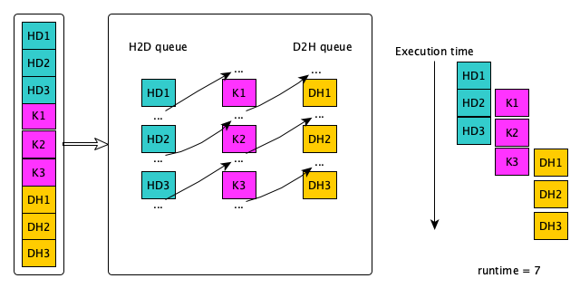

# Streams

- What is a stream?
    - a sequence of operations that execute in order on the GPU
    - operations in different streams may run concurrently

{width=1200px}


# Amount of concurrency

{width=1600px}


# Default

- Only a single stream is used if not defined
- Operations are synchronized unless async versions are used


# Example: issue of order (I)

- We have 3 streams and we do 3 operations (HD, K, DH)

{height=680px}


# Example: issue of order (II)

- Need to think the dependencies and how to improve the runtime

{height=680px}


# Synchronization and memory

hipStreamSynchronize
  : host waits for all commands in the specified stream to complete

hipDeviceSynchronize
  : host waits for all commands in all streams on the specified device to
    complete

hipEventSynchronize
  : host waits for the specified event to complete

hipStreamWaitEvent
  : stream waits for the specified event to complete


# Stream/Events API

<div class="column">
hipStreamCreate
  : creates an asynchronous stream

hipStreamDestroy
  : destroy an asynchronous stream

hipStreamCreateWithFlags
  : creates an asynchronous stream with specified flags
</div>

<div class="column">
<small>

hipEventCreate
  : create an event

hipEventDestroy
  : destroy an event

hipEventRecord
  : record an event in a specified stream

hipEventSynchronize
  : wait for an event to complete

hipEventElapsedTime
  : return the elapsed time between two events

</small>
</div>


# Implicit Synchronization

- hipHostMalloc
- hipMalloc
- hipMemcpy
...


# Example: data transfer and compute

- Serial

```cpp
hipEventRecord(startEvent,0);

hipMemcpy(d_a, a, bytes, hipMemcpyHostToDevice);
hipLaunchKernelGGL(kernel, n/blockSize, blockSize, 0, 0, d_a, 0);
hipMemcpy(a, d_a, bytes, hipMemcpyDeviceToHost);

hipEventRecord(stopEvent, 0);
hipEventSynchronize(stopEvent);

hipEventElapsedTime(&duration, startEvent, stopEvent);
printf("Duration of sequential transfer and execute (ms): %f\n", duration);
```


# How to improve the performance?

- Use streams to overlap computation with communication
```cpp
hipStream_t stream[nStreams];
for (int i = 0; i < nStreams; ++i)
    hipStreamCreate(&stream[i]);
```

- Use Asynchronous data transfer
```cpp
hipMemcpyAsync(dst, src, bytes, hipMemcpyHostToDevice, stream);
```

- Execute kernels on different streams
```cpp
hipLaunchKernelGGL(kernel, gridsize, blocksize, shared_mem_size, stream,
                   arg0, arg1, ...);
```


# Synchronization (I)

- Synchronize everything
  ```cpp
  hipDeviceSynchronize()
  ```

- Synchronize a specific stream
  ```cpp
  hipStreamSynchronize(streamid)
  ```
    - Blocks host until all HIP calls are completed on this stream


# Synchronization (II)

- Synchronize using Events
    - Create an event
    ```cpp
    hipEvent_t stopEvent
    hipEventCreate(&stopEvent)
    ```

    - Record an event in a specific stream and wait until ready
    ```cpp
    hipEventRecord(stopEvent,0)
    hipEventSynchronize(stopEvent)
    ```

    - Make a stream wait for a specific event
    ```cpp
    hipStreamWaitEvent(stream[i], stopEvent, unsigned int flags)
    ```


# Synchronization in the kernel

`__syncthreads()`
  : synchronize threads inside a kernel

<br>

```cpp
__global__ void reverse(double *d_a) {
    __shared__ double s_a[256]; /* array of doubles, shared in this block */
    int tid = threadIdx.x;
    s_a[tid] = d_a[tid];     /* each thread fills one entry */
    __syncthreads();         /* all wavefronts must reach this point before
                                any wavefront is allowed to continue. */
    d_a[tid] = s_a[255-tid]; /* safe to write out array in reverse order */
}
```
