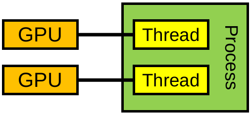

# Multi-GPU programming and HIP/OpenMP + MPI{.section}

# Outline

* GPU context
* Device management
* Programming models
* Peer to peer (GPU-GPU) access
* HIP/OpenMP + MPI


# Introduction

* Workstations or supercomputer nodes can be equipped with several GPUs
    * For the current supercomputers, the number of GPUs per node usually
      ranges between 2 and 6
    * Allows sharing (and saving) resources (disks, power units, e.g.)
    * More GPU resources per node, better per-node-performance


# GPU Context

* A context is established implicitly on the current device when the first task requiring an active context is evaluated (HIP and OpenMP)
* Several processes can create contexts for a single device
    * The device resources are allocated per context
* By default, one context per device per process in HIP (since CUDA 4.0)
    * Threads of the same process share the primary context (for each device)
* HIP supports explicit context management whereas OpenMP does not

# Selecting device

* Driver associates a number for each available GPU device starting from 0
* The functions `hipSetDevice()` and `omp_set_default_device()` are used for selecting the desired device for HIP and OpenMP, respectively
  * Furthermore, in OpenMP, the `device()`-directive can be used to offload targets to specific devices without changing the default device


# Device management

```cpp
// Return the number of available devices

int omp_get_num_devices(void); // OpenMP, returns the result
hipError_t hipGetDeviceCount(int *count) // HIP, stores the result in `count`

// Set device as the current device for the calling host thread

void omp_set_default_device(int device) // OpenMP
hipError_t hipSetDevice(int device) // HIP

// Return the current device for the calling host thread

int omp_get_default_device(void) // OpenMP, returns the result
hipError_t hipGetDevice(int *device) // HIP, stores the result in `device`
```


# Querying or verifying device properties

* In HIP, one can query the properties of different devices in the system using
  `hipGetDeviceProperties()` function
    * No context needed
    * Provides e.g. name, amount of memory, warp size, support for unified
      virtual addressing, etc.
    * Useful for code portability

In HIP, the function returns the device properties in struct `prop`
```
hipError_t hipGetDeviceProperties(struct hipDeviceProp *prop, int device)
```
In OpenMP, `requires` clause can be used to verify the device properties, e.g.
```
#pragma omp requires unified_shared_memory
```


# Multi-GPU programming models

<div class="column">
* One GPU per process (I)
    * Syncing is handled through message passing (e.g. MPI)
* Many GPUs per process (II)
    * Process manages all context switching and syncing explicitly
* One GPU per thread (III, advanced)
    * Syncing is handled through thread synchronization requirements
</div>

<div class="column">
{width=50%}
{width=50%}
{width=50%}
</div>


# One GPU per process (I)

* Recommended for multi-process applications using a message passing library
* Message passing library takes care of all GPU-GPU communication
* Each process interacts with only one GPU which makes the implementation
  easier and less invasive (if MPI is used anyway)
    * Apart from each process selecting a different device, the implementation
      looks much like a single-GPU program
* **Multi-GPU implementation using MPI is discussed at the end!**


# Many GPUs per process (II)

* Process switches the active GPU using `hipSetDevice()` (HIP) or `omp_set_default_device()` (OpenMP) functions 
   * OpenMP has also `device()`-directive to offload work to a specific device
* After selecting the default device, operations such as the following are effective only
  on the selected GPU:
    * Memory operations
    * Kernel execution
    * Streams and events (HIP)
* Asynchronous function calls (HIP) or `nowait` clause (OpenMP) are required to overlap work 


# Many GPUs per process (II), code example

<small>

* HIP example
```cpp
// Launch kernels (HIP)
for(unsigned n = 0; n < num_devices; n++) {
  hipSetDevice(n);
  kernel<<<blocks[n],threads[n], 0, stream[n]>>>(arg1[n], arg2[n], size[n]);
}
//Synchronize all kernels with host (HIP)
for(unsigned n = 0; n < num_devices; n++) {
  hipSetDevice(n);
  hipStreamSynchronize(stream[n]);
}
```
* OpenMP example
```cpp
// Launch kernels (OpenMP)
for(int n = 0; n < num_devices; n++) {
  omp_set_default_device(n);
  #pragma omp target teams distribute parallel for nowait
  for (unsigned i = 0; i < size[n]; i++)
    // Do something
}
#pragma omp taskwait //Synchronize all kernels with host (OpenMP)
```
</small>


# One GPU per thread (III, advanced)

* One GPU per CPU thread
    * E.g. one OpenMP CPU thread per GPU being used
* HIP and OpenMP APIs are threadsafe
    * Multiple threads can call the functions at the same time
* Each thread can create its own context on a different GPU
    * `hipSetDevice()` (HIP) or `device()`-directive (OpenMP) determine the device and create a context per thread
* From the point of view of a single thread, the implementation closer to a single-GPU case
* Communication between threads still not trivial


# One GPU per thread (III, advanced), code example

<small>

* HIP example
```cpp
// Launch and synchronize kernels from parallel CPU threads using HIP
#pragma omp parallel num_threads(num_devices) 
{
  unsigned n = omp_get_thread_num();
  hipSetDevice(n);
  kernel<<<blocks[n],threads[n], 0, stream[n]>>>(arg1[n], arg2[n], size[n]);
  hipStreamSynchronize(stream[n]);
}
```
* OpenMP example
```cpp
// Launch and synchronize kernels from parallel CPU threads using OpenMP
#pragma omp parallel num_threads(num_devices) 
{
  unsigned n = omp_get_thread_num();
  #pragma omp target teams distribute parallel for device(n)
  for (unsigned i = 0; i < size[n]; i++)
    // Do something
}
```
</small>


# Direct peer to peer access (HIP)

* Access peer GPU memory directly from another GPU
    * Pass a pointer to data on GPU 1 to a kernel running on GPU 0
    * Transfer data between GPUs without going through host memory
    * Lower latency, higher bandwidth

```cpp
// Check peer accessibility
hipError_t hipDeviceCanAccessPeer(int* canAccessPeer, int device, int peerDevice)

// Enable peer access
hipError_t hipDeviceEnablePeerAccess(int peerDevice, unsigned int flags)

// Disable peer access
hipError_t hipDeviceDisablePeerAccess(int peerDevice)
```
* Between AMD GPUs, the peer access is always enabled (if supported)


# Peer to peer communication

* Devices have separate memories
* Memcopies between different devices can be done as follows:

```cpp
// HIP: First option that requires unified virtual addressing (use "hipMemcpyDefault" for "kind")
hipError_t hipMemcpy(void* dst, void* src, size_t size, hipMemcpyKind kind=hipMemcpyDefault)

// HIP: Second option does not require unified virtual addressing
hipError_t hipMemcpyPeer(void* dst, int  dstDev, void* src, int srcDev, size_t size)

// OpenMP
int omp_target_memcpy(void *dst, const void *src, size_t size, size_t dstOffset,
                      size_t srcOffset, int dstDev, int dstDev)
```

* If direct peer to peer access is not available or implemented, the functions should fall back to a normal copy through host memory

# Three levels of parallelism

<small>

1. GPU -- GPU threads on the multiprocessors
    * Parallelization strategy: HIP, OpenMP, SYCL, Kokkos, OpenCL
2. Node -- Multiple GPUs and CPUs
    * Parallelization strategy: MPI, Threads, OpenMP
3. Supercomputer -- Many nodes connected with interconnect
    * Parallelization strategy: MPI between nodes

</small>

{width=60%}


# MPI and HIP

* Compiling HIP/OpenMP and MPI calls in the same compilation unit may not always be trivial
* One can set MPI compiler to use `hipcc` or the desirable OpenMP compiler like `nvc`, e.g. for OpenMPI:
  ```bash
  OMPI_CXXFLAGS='' OMPI_CXX='hipcc'
  ```
or 
  ```bash
  OMPI_CXXFLAGS='' OMPI_CXX='nvc -mp=gpu -gpu=cc80'
  ```

* Alternatively, one could separate HIP/OpenMP and MPI code in different compilation units compiled with `mpicxx` and `hipcc`/`nvc`
    * Link object files in a separate step using `mpicxx` or `hipcc`/`nvc`


# MPI+HIP strategies

1. One MPI process per node
2. **One MPI process per GPU**
3. Many MPI processes per GPU, only one uses it
4. **Many MPI processes sharing a GPU**

* 2 is recommended (also allows using 4 with services such as CUDA MPS)
    * Typically results in most productive and least invasive implementation
      for an MPI program
    * No need to implement GPU-GPU transfers explicitly (MPI handles all
      this)
    * It is further possible to utilize remaining CPU cores with OpenMP (but
      this is not always worth the effort/increased complexity)


# Selecting the correct GPU

* Typically, all processes on the node can access all GPUs of that node
* The following implementation allows utilizing all GPUs using one or more
  processes per GPU
    * Use CUDA MPS when launching more processes than GPUs

```cpp
int deviceCount, nodeRank;
MPI_Comm commNode;
MPI_Comm_split_type(MPI_COMM_WORLD, MPI_COMM_TYPE_SHARED, 0, MPI_INFO_NULL, &commNode);
MPI_Comm_rank(commNode, &nodeRank);
#ifdef _OPENMP
  deviceCount = omp_get_num_device();
  omp_set_default_device(nodeRank % deviceCount);
#elif __HIP__
  hipGetDeviceCount(&deviceCount);
  hipSetDevice(nodeRank % deviceCount);
#endif
```


# GPU-GPU communication through MPI

* GPU-aware (CUDA/ROCm aware) MPI libraries support direct GPU-GPU transfers
    * Can take a pointer to device buffer (avoids host/device data copies)
* Unfortunately, currently no GPU support for custom MPI data types (must use a
  datatype representing a contiguous block of memory)
    * Data packing/unpacking must be implemented application-side on GPU
* ROCm aware MPI libraries are still new and there may be problems
    * It is a good idea to have a fallback option to use pinned host staging
      buffers

# MPI communication with GPU-aware MPI

* With HIP+MPI, one can simply pass a device pointer to GPU-aware MPI
   * In OpenMP this can be achieved using `use_device_ptr` clause as follows:

```cpp
/* MPI_Send with GPU-aware MPI */
#pragma omp target data use_device_ptr(data)
{
    MPI_Send(data, N, MPI_DOUBLE, to, MPI_ANY_TAG, MPI_COMM_WORLD);
}

/* MPI_Recv with GPU-aware MPI */
#pragma omp target data use_device_ptr(data)
{
    MPI_Recv(data, N, MPI_DOUBLE, from, MPI_ANY_TAG, MPI_COMM_WORLD,
             MPI_STATUS_IGNORE);
}
```


# Summary

- There are many ways to write a multi-GPU program
- Use `hipSetDevice()` (HIP) or `omp_set_default_device()` (OpenMP) to choose the default device
   * In OpenMP, `device()`-directive can also be used to select the target device
* If you have an MPI program, it is often best to use one GPU per process, and
  let MPI handle data transfers between GPUs
* There is still little experience of ROCm aware MPIs, there may be issues
    * Note that a GPU-aware MPI is only required when passing device
      pointers to MPI, passing host pointers does not require any
      GPU awareness
