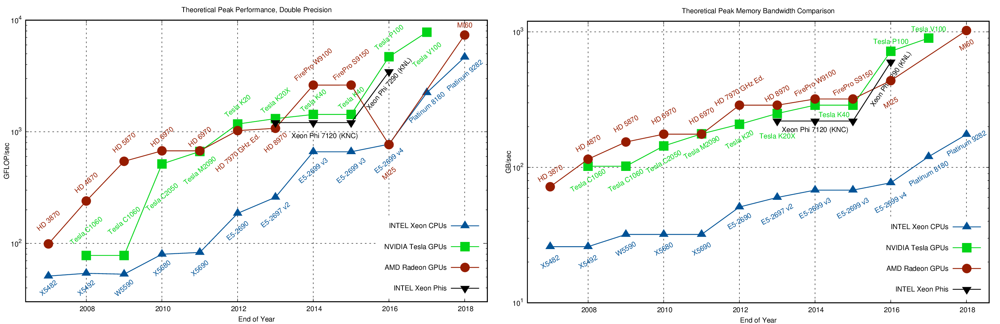

# Motivation {.section}

# Why use GPU?




# What's different?


# Different design philosophies

<div class="column">
## CPU

- General purpose
- Good for serial processing
- Great for task parallelism
- Low latency per thread
- Large area dedicated cache and control


</div>

<div class="column">

## GPU

- Highly specialized for parallelism
- Good for parallel processing
- Great for data parallelism
- High-throughput
- Hundreds of floating-point execution units


</div>

# GPU Programming Model {.section}

# Heterogeneous CPU-GPU System


selkie.macalester.edu/csinparallel/modules/GPUProgramming/build/html/Introduction/Introduction.html

# Heterogeneous Programming

<div class="column">

- CPU (host) and GPU (device) codes are mixed
- all calls are made from host
- separate address spaces
- host allocates the memory
- host handles the memory transfers between CPU and GPU
- control is return to the host after a kernel calls
- kernels are executed sequentially

</div>

<div class="column">

{width=59%}

</div>

# Thread Hierarchy. SIMT

<div class="column">

{width=105%}

</div>

<div class="column">

- Threads are executed on scalar processors
- Blocks are executed on multiprocessors
- Several blocks can reside on one multiprocessor (limited by the local resources)
- Kernel is executed as a grid of threads block
- Only one kernel is executed on a device at one time

</div>


# Thread Scheduling


<div class="column">

- Warps (waves) of 32 (64) parallel threads
- Consecutive, increasing thread IDs
- All executing one common instruction at a time
- Conditional  branches are executed serially
- Memory accesses are per warp (wave)

</div>

<div class="column">

{width=110%}

</div>

# CUDA C /HIP code example


<div class="column">
## CUDA C

```c
   ...

   int *a_d,*b_d,*c_d;
   cudaMalloc((void **)&a_d,Nbytes);
   cudaMalloc((void **)&b_d,Nbytes);
   cudaMalloc((void **)&c_d,Nbytes);

   cudaMemcpy(a_d,a,nBytes,cudaMemcpyHostToDevice);
   cudaMemcpy(b_d,b,nBytes,cudaMemcpyHostToDevice);

   vecAdd<<<gridSize,blockSize>>>(a_d,b_d,c_d,N);


   cudaDeviceSynchronize();

```

</div>

<div class="column">
## HIP

```c
   ...

   int *a_d,*b_d,*c_d;
   hipMalloc((void **)&a_d,Nbytes);
   hipMalloc((void **)&b_d,Nbytes);
   hipMalloc((void **)&c_d,Nbytes);

   hipMemcpy(a_d,a,Nbytes,hipMemcpyHostToDevice));
   hipMemcpy(b_d,b,Nbytes,hipMemcpyHostToDevice));

   hipLaunchKernelGGL(vecAdd,
       dim3(gridSize), dim3(blockSize),
       0, 0,
       a_d,b_d,c_d,N);
   hipDeviceSynchronize();

```

</div>

# CUDA C /HIP code example continued

```c
__global__ void vecAdd(int *a_d,int *b_d,int *c_d,int N)
{
  int i = blockIdx.x * blockDim.x + threadIdx.x;

  if(i<N)
  {
    c_d[i] = a_d[i] + b_d[i];
  }
}   
```

# Memory model
<div class="column">
- *Registers*: The fastest form of memory. Accessible only by the thread
- *Shared Memory*: Almost as fast as a registers. Visible by any thread within blocks
- **Global Memory**: 150x slower then registers/shared memory. Accessible from any thread or from the host
- Memory with special access pattern. Heavily cached on chip.
</div>

<div class="column">

{width=90%}

</div>

# Global memory access

- Memory transactions are done in continuous blocks of 32B, 64B, or 128B
- Address of the first element is aligned to 16x the size of the first element

{width=190%}

# Shared Memory access
- Shared memory is divided into banks (allowing only one access per cycle)
- Parallel access: multiple addresses accessed over multiple banks
- Serial access: multiple addresses in the same bank
- Broadcast access: a single address read in a single bank (by the whole warp)

{width=100%}

# Unified Memory

- Data movement appears more transparent to the application
- Creates a pool of managed memory
- Each allocation is accessible on both the CPU and GPU with the same pointer
- System automatically migrates data between the host and device, as needed

# Streams
- A sequence of asynchronous GPU operations that execute on a device in the order issued by the host code.
- Operations within a stream are guaranteed to execute in the prescribed order
- Operations in different streams may run concurrently or interleaved

{width=99%}
