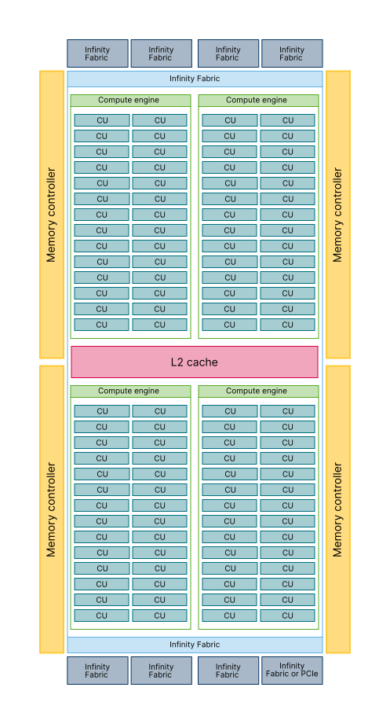

# Introduction to GPUs in HPC{.section}

# High Performance Computing through the ages

{.center width=70%}

 
{.center width=100%}

# Accelerators

- Specialized parallel hardware for compute-intensive operations
    - Co-processors for traditional CPUs
    - Based on highly parallel architectures
    - Graphics processing units (GPU) have been the most common
      accelerators during the last few years
- Promises
    - Very high performance per node
    - More FLOPS/Watt
- Usually major rewrites of programs required

# Accelerator model today

- Local memory in GPU
    - Smaller than main memory (32 GB in Puhti, 64GB in LUMI)
    - Very high bandwidth (up to 3200 GB/s in LUMI)
    - Latency high compared to compute performance

{width=100%}

- GPUs are connected to CPUs via PCIe
- Data must be copied from CPU to GPU over the PCIe bus

# Lumi - Pre-exascale system in Finland

 {.center width=50%}

# GPU architecture

- Designed for running tens of thousands of threads simultaneously on
  thousands of cores
- Very small penalty for switching threads
- Running large amounts of threads hides memory access penalties
- Very expensive to synchronize all threads

{.center width=42% height=60%}
    
<small>Overview of MI250x Graphics Compute Die (GCD) (source: AMD)</small>

# Challenges in using Accelerators

**Applicability**: Is your algorithm suitable for GPU?

**Programmability**: Is the programming effort acceptable?

**Portability**: Rapidly evolving ecosystem and incompatibilities between vendors.

**Availability**: Can you access a (large scale) system with GPUs?

**Scalability**: Can you scale the GPU software efficiently to several nodes?

#  Heterogeneous Programming Model

- GPUs are co-processors to the CPU
- CPU controls the work flow:
  - *offloads* computations to GPU by launching *kernels*
  - allocates and deallocates the memory on GPUs
  - handles the data transfers between CPU and GPUs
- CPU and GPU can work concurrently
   - kernel launches are normally asynchronous

# Using GPUs

1. Use existing GPU applications
2. Use accelerated libraries
3. Directive based methods
    - **OpenMP**, OpenACC
4. High-level GPU programming
    - SYCL, Kokkos, ...
5. Use direct GPU programming
    - CUDA, **HIP**, ...

**Easier, more limited**

{width=16% }

**More difficult, more opportunities**

# Directive-based accelerator languages

- Annotating code to pinpoint accelerator-offloadable regions
- OpenACC
    - created in 2011, latest version is 3.1 (November 2020)
    - mostly Nvidia
- OpenMP
    - earlier only threading for CPUs
    - initial support for accelerators in 4.0 (2013), significant improvements & extensions in 4.5 (2015), 5.0 (2018), 5.1 (2020) and 5.2 (2021)

- Focus on optimizing productivity
- Reasonable performance with quite limited effort, but not guaranteed

# Native GPU code: HIP / CUDA

- CUDA
    - has been the *de facto* standard for native GPU code for years
    - extensive set of optimised libraries available
    - custom syntax (extension of C++) supported only by CUDA compilers
    - support only for NVIDIA devices
- HIP
    - AMD effort to offer a common programming interface that works on
      both CUDA and ROCm devices
    - standard C++ syntax, uses nvcc/hcc compiler in the background
    - almost a one-on-one clone of CUDA from the user perspective
    - ecosystem is new and developing fast

# GPUs @ CSC

- **Puhti-AI**: 80 nodes, total peak performance of 2.7 Petaflops
    - Four Nvidia V100 GPUs, two 20 cores Intel Xeon processors, 3.2 TB fast local storage, network connectivity of  200Gbps aggregate bandwidth  
- **Mahti-AI**: 24 nodes, total peak performance of 2. Petaflops
    - Four Nvidia A100 GPUs, two 64 cores AMD Epyc processors, 3.8 TB fast local storage,  network connectivity of  200Gbps aggregate bandwidth   
- **LUMI-G**: 2978 nodes, total peak performance of 500 Petaflops
    - Four AMD MI250X GPUs, one 64 cores AMD Epyc processors, no local storage, network connectivity of  800Gbps aggregate bandwidth

# Summary

- GPUs provide significant speed ups for certain applications
- GPUs are co-processors to CPUs
   - CPU offloads computations and manages memory
- High amount of parallelism required for efficient utilization of GPUs
- Programming GPUs
    - Directive based methods
    - CUDA, HIP
