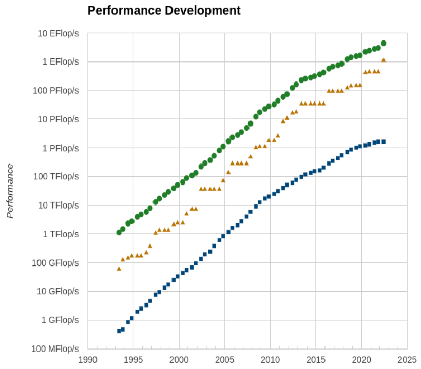

# High-performance computing

<div class="column">

- High performance computing is fueled by ever increasing performance
- Increasing performance allows  breakthroughs in many major challenges that
  humankind faces today
- Not only hardware performance, algorithmic improvements have also added ordered of magnitude of real performance

</div>

<div class="column">

</div>

# HPC through the ages

<div class="column">
- Achieving performance has been based on various strategies throughout the years
    - Frequency, vectorization, multinode, multicore ...
    - Now performance is mostly limited by power consumption
- Accelerators provide compute resources based on a very high level of parallelism to reach
  high performance at low relative power consumption
</div>

<div class="column">

</div>


# Accelerators

- Specialized parallel hardware for floating point operations
    - Co-processors for traditional CPUs
    - Based on highly parallel architectures
    - Graphics processing units (GPU) have been the most common
      accelerators during the last few years
- Promises
    - Very high performance per node
- Usually major rewrites of programs required

# Why use them?


# What's different?


# Different design philosophies

<div class="column">

## CPU

- General purpose
- Good for serial processing
- Great for task parallelism
- Low latency per thread
- Large area dedicated cache and control


</div>

<div class="column">

## GPU

- Highly specialized for parallelism
- Good for parallel processing
- Great for data parallelism
- High-throughput
- Hundreds of floating-point execution units


</div>


# Lumi - Pre-exascale system in Finland
<div class="column">
{}
</div>
<div class="column">
{width=65%}
</div>


# Heterogeneous CPU-GPU System

<div class="column">
- Connected to CPUs via PCIe
- Local memory
    - Smaller than main memory (32 GB in Puhti)
    - Very high bandwidth (up to 900 GB/s)
    - Latency high compared to compute performance
- Data must be copied over the PCIe bus

</div>
<div class="column">
{}
{width=100%}
</div>


# Heterogeneous Programming

<div class="column">

- CPU (host) and GPU (device) codes are mixed
- all calls are made from host
- separate address spaces
- host allocates the memory
- host handles the memory transfers between CPU and GPU
- control is return to the host after a kernel calls
- kernels are executed sequentially

</div>

<div class="column">

{width=59%}

</div>

# GPU Autopsy. Nvidia Volta

<div class="column">
- 80 streaming multi processor units (SM), each comprising many smaller Cuda cores
    - 5120 single precision cores
    - 2560 double precision cores
    - 640 tensor cores
- Common L2 cache (6144 KB) for all multi processors
- HBM2 memory, typically 16 GB or 32 GB
</div>

<div class="column">
{ width=100% }
</div>


# GPU architecture: Nvidia Volta


{ .center width=77% }


# GPU Autopsy. Nvidia Volta Streaming Multiprocessor

<div class="column">

- 64 single precision cores
- 32 double precision cores
- 64 integer cores
- 8 Tensore cores
- 128 KB memory block for L1 and shared memory
    - 0 - 96 KB can be set to user managed shared memory
    - The rest is L1
- 65536 registers - enables the GPU to run a very large number of threads
</div>
<div class="column">

{ .center width=70% }

</div>


# Thread Hierarchy. SIMT

<div class="column">

{width=105%}

</div>

<div class="column">

- Threads are executed on scalar processors
- Blocks are executed on multiprocessors
- Several blocks can reside on one multiprocessor (limited by the local resources)
- Kernel is executed as a grid of threads block
- Only one kernel is executed on a device at one time

</div>


# Thread Scheduling


<div class="column">

- Warps (waves) of 32 (64) parallel threads
- Consecutive, increasing thread IDs
- All executing one common instruction at a time
- Conditional  branches are executed serially
- Memory accesses are per warp (wave)

</div>

<div class="column">

{width=110%}

</div>

# CUDA C /HIP C code example

<div class="column">
## CUDA C

```c
   ...

   int *a_d,*b_d,*c_d;
   cudaMalloc((void **)&a_d,Nbytes);
   cudaMalloc((void **)&b_d,Nbytes);
   cudaMalloc((void **)&c_d,Nbytes);

   cudaMemcpy(a_d,a,nBytes,cudaMemcpyHostToDevice);
   cudaMemcpy(b_d,b,nBytes,cudaMemcpyHostToDevice);

   vecAdd<<<gridSize,blockSize>>>(a_d,b_d,c_d,N);


   cudaDeviceSynchronize();

```

</div>

<div class="column">
## HIP

```c
   ...

   int *a_d,*b_d,*c_d;
   hipMalloc((void **)&a_d,Nbytes);
   hipMalloc((void **)&b_d,Nbytes);
   hipMalloc((void **)&c_d,Nbytes);

   hipMemcpy(a_d,a,Nbytes,hipMemcpyHostToDevice));
   hipMemcpy(b_d,b,Nbytes,hipMemcpyHostToDevice));

   hipLaunchKernelGGL(vecAdd,
       dim3(gridSize), dim3(blockSize),
       0, 0,
       a_d,b_d,c_d,N);
   hipDeviceSynchronize();

```

</div>

# CUDA C /HIP code example continued

```c
__global__ void vecAdd(int *a_d,int *b_d,int *c_d,int N)
{
  int i = blockIdx.x * blockDim.x + threadIdx.x;

  if(i<N)
  {
    c_d[i] = a_d[i] + b_d[i];
  }
}
```

# Memory model
<div class="column">
- *Registers*: The fastest form of memory. Accessible only by the thread
- *Shared Memory*: Almost as fast as a registers. Visible by any thread within blocks
- **Global Memory**: 150x slower then registers/shared memory. Accessible from any thread or from the host
- Memory with special access pattern. Heavily cached on chip.
</div>

<div class="column">

{width=90%}

</div>

# Global memory access

- Memory transactions are done in continuous blocks of 32B, 64B, or 128B
- Address of the first element is aligned to 16x the size of the first element

{width=190%}

# Shared Memory access
- Shared memory is divided into banks (allowing only one access per cycle)
- Parallel access: multiple addresses accessed over multiple banks
- Serial access: multiple addresses in the same bank
- Broadcast access: a single address read in a single bank (by the whole warp)

{width=100%}

# Unified Memory

- Data movement appears more transparent to the application
- Creates a pool of managed memory
- Each allocation is accessible on both the CPU and GPU with the same pointer
- System automatically migrates data between the host and device, as needed

# Streams
- A sequence of asynchronous GPU operations that execute on a device in the order issued by the host code.
- Operations within a stream are guaranteed to execute in the prescribed order
- Operations in different streams may run concurrently or interleaved

{width=99%}


# Challenges in using Accelerators

**Applicability**: Is your algorithm suitable for GPU?

**Programmability**: Is the programming effort acceptable?

**Portability**: Rapidly evolving ecosystem and incompatibilities between vendors.

**Availability**: Can you access a (large scale) system with GPUs?

**Scalability**: Can you scale the GPU software efficiently to several nodes?


# Using GPUs


<div class="column">
1. Use existing GPU applications
2. Use accelerated libraries
3. Use frameworks
    - Kokkos
    - AMReX
3. Directive based methods
    - ** OpenMP **
    - OpenACC
4. Use native GPU language
    - CUDA
    - HIP
    - OpenCL
    - SYCL
</div>
<div class="column">

Easier, but more limited

{ width=15% }

More difficult, but more opportunities

</div>


# Directive-based accelerator languages

- Annotating code to pinpoint accelerator-offloadable regions
- OpenACC standard created in Nov 2011
    - Focus on optimizing productivity (reasonably good performance with
      minimal effort)
    - Current standard is 2.7 (November 2018)
    - Mostly Nvidia only
- OpenMP
    - Earlier only threading for CPUs
    - 4.5 also includes for the first time some support for accelerators
    - 5.0 standard vastly improved
    - Dominant directive approach in the future?


# GPUs at CSC - Puhti-AI

- In total 80 nodes with a total peak performance of 2.7 Petaflops
- Each node has
    - Two latest generation Intel Xeon processors, code name Cascade Lake, with 20 cores each running at 2.1 GHz (Xeon Gold 6230)
    - Four Nvidia Volta V100 GPUs with 32 GB of memory each
    - 384 GB of main memory
    - 3.2 TB of fast local storage
    - Dual rail HDR100 interconnect network connectivity providing 200Gbps aggregate bandwidth

# GPUs at CSC - Mahti-AI

- In total 24 nodes with a total peak performance of 2.0 Petaflops
- Each node has
    - Two latest generation AMD processors, code name EPYC with 64 cores each running at 2.6 GHz (Rome)
    - Four Nvidia Volta A100 GPUs with 40 GB of memory each
    - 512 GB of main memory
    - 3.8 TB of fast local storage
    - Dual rail HDR100 interconnect network connectivity providing 200Gbps aggregate bandwidth

# GPUs at CSC - LUMI-G

- In total 2560 nodes with a total peak performance of 550 Petaflops
- Each node has
    - One latest generation AMD processor, code name Trento with 64 cores each running at 2.6 GHz (Trento)
    - Four AMD MI250X GPUs with 128 GB of memory each
    - 512 GB of main memory
    - 2x3 TB of fast local storage
    - Four interconnect network connectivity providing 800Gbps aggregate bandwidth


# Summary

- HPC throughout the ages -- performance through parellelism
- Programming GPUs
    - CUDA, HIP
    - Directive based methods
