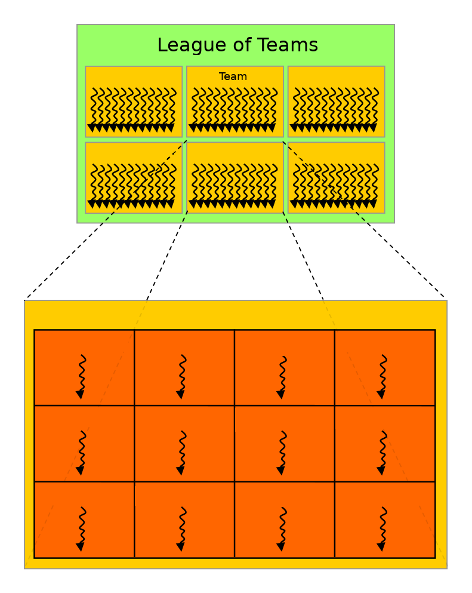
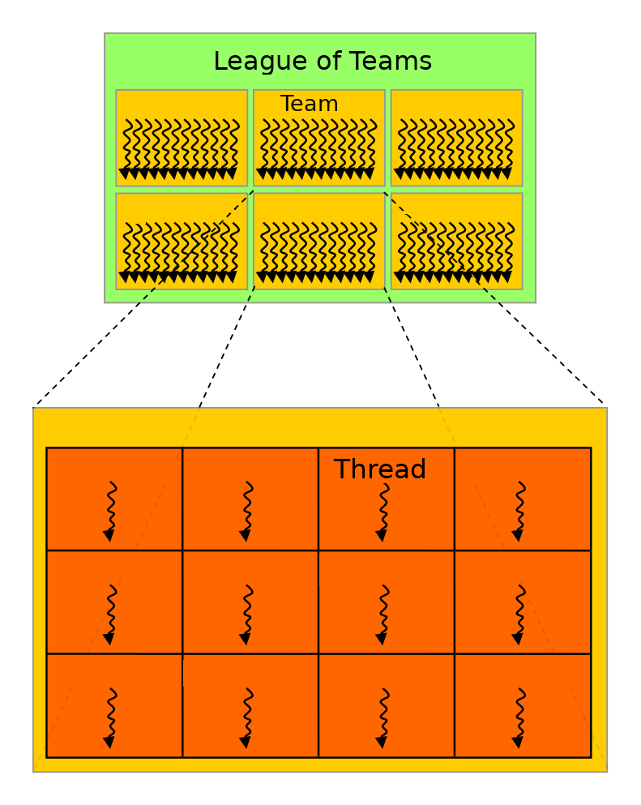

# What is OpenMP offloading ?

- Set of OpenMP constructs for heterogenous systems
    - **GPU**s, FPGAs, ...
- Code regions are offloaded from the host CPU to be computed on an
  accelerator
    - high-level abstraction layer for GPU programming
- In principle same code can be run on various systems
    - CPUs only
    - NVIDIA GPUs, AMD GPUs, Intel GPUs, ...
- Standard defines both C/C++ and Fortran bindings


# OpenMP vs. OpenACC

- OpenACC is very similar compiler directive based approach for GPU
  programming
    - open standard, however, NVIDIA major driver
- Why OpenMP and not OpenACC?
    - OpenMP is likely to have a more extensive platform and compiler
      support
    - currently, OpenACC support in AMD GPUs is limited
    - currently, OpenACC can provide better performance in NVIDIA GPUs


# OpenACC support for AMD GPUs

- OpenACC support for AMD GPUs in GNU compilers under development
- OpenACC support in general for Clang/Flang is under development
- Cray compilers
    - Fortran compiler supports OpenACC v2.7, support for latest OpenACC coming 
    - C/C++ compiler does not support OpenACC
- In LUMI, only Fortran is supported with OpenACC
- For now, OpenACC is not a recommended approach for new codes targeting AMD
  GPUs
    - if a Fortran code already uses OpenACC, it may be possible to use it


# OpenMP vs. CUDA/HIP

- Why OpenMP and not CUDA/HIP?
    - easier to start shifting work to GPUs (less coding)
    - simple things are simpler
    - same code can be compiled to CPU and GPU versions easily
- Why CUDA/HIP and not OpenMP?
    - can access all features of the GPU hardware
    - better control and assurance it will work as intended
    - more optimization possibilities


# OpenMP execution model

- Host-directed execution with an attached accelerator
    - large part of the program is usually executed by the host
    - computationally intensive parts are *offloaded* to the accelerator
- Accelerator can have a separate memory
    - OpenMP exposes the separate memories through *data environment*
      that defines the memory management and needed copy operations


# OpenMP execution model

<div class="column">
- Program runs on the host CPU
- Host offloads compute-intensive regions (*kernels*) and related data
  to the GPU
- Compute kernels are executed by the GPU
</div>

<div class="column">

</div>


# OpenMP data model in offloading

<div class="column">
- If host memory is separate from device memory
    - host manages memory of the device
    - host copies data to/from the device
- When memories are not separate, no copies are needed (difference is
  transparent to the user)
</div>

<div class="column">

</div>


# Compiling an OpenMP program for GPU offloading

- In addition to normal OpenMP options (*i.e.* `-fopenmp`), one needs
  to typically specify offload target (NVIDIA GPU, AMD GPU, ...)

| Compiler |  Options for offload                     |
| -------- | ---------------------------------------- |
| NVIDIA   | `-mp=gpu` (`-gpu=ccNN`)                  |
| Cray     | `-fopenmp-targets=xx -Xopenmp-target=xx` |
| Clang    | `-fopenmp-targets=xx`                    |
| GCC      | `-foffload=yy`                           |

- Without these options a regular CPU version is compiled!


# Compiling an OpenMP program for GPU offloading

- Conditional compilation with `_OPENMP` macro:

```c
#ifdef _OPENMP
device specific code
#else
host code
#endif
```

- Example: Compiling with CCE 15.0.1 in Lumi
	- Compiler wrapper will take care to set most of the correct flags for offloading (such as the `-fopenmp-targets=xx`) if you load the correct modules
	- Required modules are at least `LUMI/23.03 partition/G rocm cpeCray`

```bash
cc -o my_exe test.c -fopenmp
```


# OpenMP internal control variables

- OpenMP has internal control variables
    - `OMP_DEFAULT_DEVICE` controls which accelerator is used.
- During runtime, values can be modified or queried with
  `omp_<set|get>_default_device`
- Values are always re-read before a kernel is launched and can be
  different for different kernels


# Runtime API functions

- Low-level runtime API functions can be used to
    - query the number of devices in the system
    - select the device to use
    - allocate/deallocate memory on the device(s)
    - transfer data to/from the device(s)
-  Function definitions are in
    - C/C++ header file `omp.h`
    - `omp_lib` Fortran module


# Useful API functions

`omp_is_initial_device()`
  : returns True when called in host, False otherwise

`omp_get_num_devices()`
  : number of devices available

`omp_get_device_num()`
  : number of device where the function is called

`omp_get_default_device()`
  : default device

`omp_set_default_device(n)`
  : set the default device


# Target construct

- OpenMP `target` construct specifies a region to be executed on GPU
    - initially, runs with a single thread
- By default, execution in the host continues only after target region
  is finished
- May trigger implicit data movements between the host and the device

<div class=column>
```c++
#pragma omp target
{
  // code executed in device
}
```
</div>

<div class=column>
```fortran
!$omp target
  ! code executed in device
!$omp end target
```
</div>


# OpenMP offloading: worksharing {.section}

# Teams construct
<div class=column>
- Target construct does not create any parallelism, so additional
  constructs are needed
- `teams` creates a league of teams
    - number of teams is implementation dependent
    - initially, a single thread in each team executes the following
      structured block

</div>

<div class=column>

{width=70%}
</div>

# Teams construct

<div class=column>
- No synchronization between teams is possible
- Probable mapping: team corresponds to a "thread block" /
  "workgroup" and runs within streaming multiprocessor / compute unit

</div>

<div class=column>

{width=70%}
</div>

# Creating threads within a team

- Just having a league of teams is typically not enough to leverage all the
  parallelism available in the accelerator
- A `parallel` or a `simd` construct within a `teams` region creates threads
  within each team
    - number of threads per team is implementation dependent
    - with N teams and M threads per team there will be N x M threads in
      total


# Creating threads within a team

<div class=column>
- Threads within a team can synchronize
- Number of teams and threads can be queried with the
  `omp_get_num_teams()` and `omp_get_num_threads()` API functions

</div>

<div class=column>

{width=70%}
</div>

# Creating teams and threads

<div class=column>
```c++
#pragma omp target
#pragma omp teams
#pragma omp parallel
{
  // code executed in device
}
```
</div>

<div class=column>
```fortran
!$omp target
!$omp teams
!$omp parallel
  ! code executed in device
!$omp end parallel
!$omp end teams
!$omp end target
```
</div>


# League of multi-threaded teams

{.center width=80%}


# Worksharing in the accelerator

- `teams` and `parallel` constructs create threads, however, all the
  threads are still executing the same code
- `distribute` construct distributes loop iterations over the teams
- `for` / `do` construct can also be used within a parallel region


# Worksharing in the accelerator

<div class=column>
```c++
#pragma omp target
#pragma omp teams
#pragma omp distribute
for (int i = 0; i < N; i++)
  #pragma omp parallel
  #pragma omp for
  for (int j = 0; j < M; j++) {
    ...
  }
```
</div>

<div class=column>
```fortran
!$omp target
!$omp teams
!$omp distribute
do i = 1, N
  !$omp parallel
  !$omp do
  do j = 1, N
    ...
  end do
  !$omp end do
  !$omp end parallel
end do
!$omp end distribute
!$omp end teams
!$omp end target
```
</div>


# Controlling number of teams and threads

- By default, the number of teams and the number of threads is up to
  the implementation to decide
- `num_teams` clause for `teams` construct and `num_threads` clause
  for `parallel` construct can be used to specify number of teams and
  threads
    - may improve performance in some cases
    - performance is most likely not portable

```c++
#pragma omp target
#pragma omp teams num_teams(32)
#pragma omp parallel num_threads(128)
{
  // code executed in device
}
```


# Composite directives

- In many cases composite directives are more convenient
    - possible to parallelize also single loop over both teams and threads

<div class=column>
```c++
#pragma omp target teams
#pragma omp distribute parallel for
for (int i = 0; i < N; i++) {
  p[i] = v1[i] * v2[i]
}
```
</div>

<div class=column>
```fortran
!$omp target teams
!$omp distribute parallel do
do i = 1, N
  p(i) = v1(i) * v2(i)
end do
!$omp end distribute parallel do
!$omp end target teams
```
</div>


# Loop construct

- In OpenMP 5.0 a new `loop` worksharing construct was introduced
- Leaves more freedom to the implementation to do the work division
    - tells the compiler/runtime only that the loop iterations are
      independent and can be executed in parallel

<div class=column>
```c++
#pragma omp target
#pragma omp loop
for (int i = 0; i < N; i++) {
  p[i] = v1[i] * v2[i]
}
```
</div>

<div class=column>
```fortran
!$omp target
!$omp loop
do i = 1, N
  p(i) = v1(i) * v2(i)
end do
!$omp end loop
!$omp end target
```
</div>


# Compiler diagnostics {.section}

# Compiler diagnostics

- Compiler diagnostics is usually the first thing to check when starting
  to work with OpenMP, as it can tell you
    - what operations were actually performed
    - what kind of data copies that were made
    - if and how the loops were parallelized
- Diagnostics are very compiler dependent
    - compiler flags
    - level and formatting of information

# CRAY compiler

- Different behaviour between C/C++ and Fortran

<div class=column>
`cc -fopenmp -fsave-loopmark`
</div>

<div class=column>
`ftn -hmsgs -hlist=m  -fopenmp`

</div>

# CRAY compiler - Fortran
- Provides full support and nice diagnostics in file `*.lst`
- Example:
```bash
ftn-6405 ftn: ACCEL VECTORSUM, File = sum.F90, Line = 17 
  A region starting at line 17 and ending at line 21 was placed on the accelerator.

ftn-6823 ftn: THREAD VECTORSUM, File = sum.F90, Line = 17 
  A region starting at line 17 and ending at line 21 was multi-threaded.
```

# CRAY compiler - C/C++
- Provides support but limited diagnostics in file `*.lst`
- Still possible to see what is happening during the runtime of the application by setting the environment variable `CRAY_ACC_DEBUG` and reading the stderr of the batch job
- Less friendly to developer


# Summary

- OpenMP enables directive-based programming of accelerators with
  C/C++ and Fortran
- Host--device model
    - host offloads computations to the device
- Host and device may have separate memories
    - host controls copying into/from the device
- Key concepts:
    - league of teams
    - threads within a team
    - worksharing between teams and threads within a team


# Useful resources

- HPE Cray Programming Environment Documentation <br>
  <https://cpe.ext.hpe.com/docs/>

- 2022 ECP Community BoF Days <br>
  <https://www.openmp.org/wp-content/uploads/2022_ECP_Community_BoF_Days-OpenMP_RoadMap_BoF.pdf>
