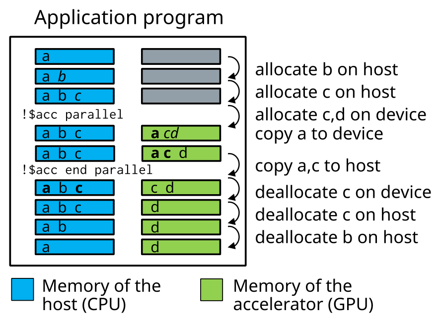

# What is OpenMP offloading ?

- Set of OpenMP constructs for heterogenous systems
    - **GPU**s, FPGAs, ...
- Code regions are offloaded from a host CPU to be computed on an accelerator
    - High level GPU programming
- In principle same code can be run on various systems
    - CPUs only
    - NVIDIA GPUs, AMD GPUs, Intel GPUs, ...
- Standard defines both C/C++ and Fortran bindings


# OpenMP vs. OpenACC

- OpenACC is very similar compiler directive based approach for GPU
  programming
    - Open standard, however, NVIDIA major driver
- Why OpenMP and not OpenACC?
    - OpenMP is going to have a more extensive platform and compiler
      support
    - Currently, OpenACC support in AMD GPUs is still developing
    - Currently, OpenACC can provide better performance in NVIDIA GPUs


# OpenMP vs. CUDA/HIP

- Why OpenMP and not CUDA/HIP?
    - Easier to work with
    - Porting of existing software requires less work
    - Same code can be compiled to CPU and GPU versions easily
- Why CUDA/HIP and not OpenMP?
    - Can access all features of the GPU hardware
    - More optimization possibilities


# OpenMP execution model

- Host-directed execution with an attached accelerator
    - Large part of the program is usually executed by the host
    - Computationally intensive parts are *offloaded* to the accelerator
      that executes *parallel regions*
- Accelerator can have a separate memory
    - OpenMP exposes the separate memories through *data environment*
      that defines the memory management and needed copy operations


# OpenMP execution model

<div class="column">
- Program runs on the host CPU
- Host offloads compute-intensive regions (*kernels*) and related data
  to the accelerator GPU
- Compute kernels are executed by the GPU
</div>

<div class="column">

</div>


# OpenMP data model in offloading

<div class="column">
- If host memory is separate from accelerator device memory
    - host manages memory of the device
    - host copies data to/from the device
- When memories are not separate, no copies are needed (difference is
  transparent to the user)
</div>

<div class="column">

</div>


# OpenMP directive syntax

- OpenMP uses compiler directives for defining compute regions (and data
  transfers) that are to be performed on a GPU
- OpenMP directives consist of a *sentinel*, followed by the directive
  name and optional clauses

|         | sentinel      | directive | clauses      |
| ------- | ------------- | --------- | ------------ |
| C/C++   | `#pragma omp` | `target`  | `map(data)`  |
| Fortran | `!$omp`       | `target`  | `map(data)`  |


# OpenMP directive syntax

<div class=column>
- In C/C++, directive applies to the following structured block

```c++
#pragma omp parallel
{
  // calculate in parallel
    printf("Hello world!\n");
}
```
</div>

<div class=column>
- In Fortran, and `end` directive specifies the end of the construct

```fortran
!$omp parallel
  ! calculate in parallel
    write(*,*) "Hello world!"
!$omp end parallel
```
</div>


# Compiling an OpenMP program for GPU offloading

- In addition to normal OpenMP options (*i.e.* `-fopenmp`), one needs
  to typically specify offload target (NVIDIA GPU, AMD GPU, ...)

| Compiler |  Options for offload                     |
| -------- | ---------------------------------------- |
| NVIDIA   | `-mp=gpu` (`-gpu=ccNN`)                  |
| Cray     | `-fopenmp-targets=xx -Xopenmp-target=xx` |
| Clang    | `-fopenmp-targets=xx`                    |
| GCC      | `-foffload=yy`                           |

- Without these options a regular CPU version is compiled!


# Compiling an OpenMP program for GPU offloading

- Conditional compilation with `_OPENMP` macro:

```c
#ifdef _OPENMP
device specific code
#else
host code
#endif
```

- Example: Compiling with NVIDIA HPC in Mahti

```bash
nvc -o my_exe test.c -mp=gpu -gpu=cc80
```


# OpenMP internal control variables

- OpenMP has internal control variables
    - `OMP_DEFAULT_DEVICE` controls which accelerator is used.
- During runtime, values can be modified or queried with
  `omp_<set|get>_default_device`
- Values are always re-read before a kernel is launched and can be
  different for different kernels


# Runtime API functions

- Low-level runtime API functions can be used to
    - Query the number of devices in the system
    - Select the device to use
    - Allocate/deallocate memory on the device(s)
    - Transfer data to/from the device(s)
-  Function definitions are in
    - C/C++ header file `omp.h`
    - `omp_lib` Fortran module


# Useful API functions

- `omp_is_initial_device()` : returns True when called in host, False
  otherwise
- `omp_get_num_devices()` : number of devices available
- `omp_get_device_num()` : number of device where the function
  is called
- `omp_get_default_device` : default device
- `omp_set_default_device` : set the default device


# OpenMP offload constructs {.section}


# Target construct

- OpenMP `target` constructs specifies a region to be executed on GPU
- Initially, runs with a single thread
- By default, execution in the host continues only after target region
  is finished.
- May trigger implicit data movements between the host and the device

<div class=column>
```c++
#pragma omp target
{
  // code executed in device
}
```
</div>

<div class=column>
```fortran
!$omp target
  ! code executed in device
!$omp end target
```
</div>


# Teams construct

- Target construct does not create any parallelism, but additional
  constructs are needed
- `teams` creates a league of teams
    - number of teams is implementation dependent
- Initially, single thread per team runs the following structured block
- No synchronization between teams is possible
- Probable mapping: team corresponds to a "thread block" /
  "workgroup" and runs within streaming multiprocessor / compute unit


# Creating threads within a team

- The league of teams cannot typically leverage all the parallelism
  available in the accelerator
- A `parallel` construct within a `teams` region creates threads
  within each team
    - number of threads per team is implementation dependent
- With N teams and M threads per team there will be N x M threads in
  total
- Threads within a team can synchronize
- Number of teams and threads can be queried with the
  `omp_get_num_teams()` and `omp_get_num_threads()` API functions


# Creating teams and threads

<div class=column>
```c++
#pragma omp target
#pragma omp teams
#pragma omp parallel
{
  // code executed in device
}
```
</div>

<div class=column>
```fortran
!$omp target
!$omp teams
!$omp parallel
  ! code executed in device
!$omp end parallel
!$omp end teams
!$omp end target
```
</div>


# League and teams of threads

{.center width=80%}


# Worksharing in the accelerator

- `teams` and `parallel` constructs create threads, however, all the
  threads are still executing the same code
- `distribute` constructs distributes loop iterations over the teams
- `for` / `do` construct can be used within parallel region


# Worksharing in the accelerator

<div class=column>
```c++
#pragma omp target
#pragma omp teams
#pragma omp distribute
for (int i = i; i < N; i++)
  #pragma omp parallel
  #pragma omp for
  for (int j = 0; j < M; j++) {
    ...
  }
```
</div>

<div class=column>
```fortran
!$omp target
!$omp teams
!$omp distribute
do i = 1, N
  !$omp parallel
  !$omp do
  do j = 1, N
    ...
  end do
  !$omp end do
  !$omp end parallel
end do
!$omp end distribute
!$omp end teams
!$omp end target
```
</div>


# Controlling number of teams and threads

- By default, the number of teams and the number of threads is up to
  the implementation to decide
- `num_teams` clause for `teams` construct and `num_threads` clause
  for `parallel` construct can be used to specify number of teams and
  threads
    - May improve performance in some cases
    - Performance is most likely not portable

```c++
#pragma omp target
#pragma omp teams num_teams(32)
#pragma omp parallel num_threads(128)
{
  // code executed in device
}
```


# Composite directives

- In many cases composite directives are more convenient
    - possible to parallelize also single loop over both teams and threads

<div class=column>
```c++
#pragma omp target teams
#pragma omp distribute parallel for
for (int i = i; i < N; i++) {
  p[i] = v1[i] * v2[i]
}
```
</div>

<div class=column>
```fortran
!$omp target teams
!$omp distribute parallel do
do i = 1, N
  p(i) = v1(i) * v2(i)
end do
!$omp end distribute parallel do
!$omp end target teams
```
</div>


# Loop construct

- In OpenMP 5.0 a new `loop` worksharing construct was introduced
- Less prescriptive, leaves more freedom to the implementation to do
  the work division
    - Tells the compiler/runtime only that the loop iterations are
      independent and can be executed in parallel

<div class=column>
```c++
#pragma omp target
#pragma omp loop
for (int i = i; i < N; i++) {
  p[i] = v1[i] * v2[i]
}
```
</div>

<div class=column>
```fortran
!$omp target
!$omp loop
do i = 1, N
  p(i) = v1(i) * v2(i)
end do
!$omp end loop
!$omp end target
```
</div>


# Compiler diagnostics {.section}


# Compiler diagnostics

- Compiler diagnostics is usually the first thing to check when starting
  the OpenMP work
    - It can tell you what operations were actually performed
    - Data copies that were made
    - If and how the loops were parallelized
- The diagnostics is very compiler dependent
    - Compiler flags
    - Level and formatting of information


# NVIDIA compiler

- Diagnostics is controlled by compiler flag `-Minfo[=option]`
- Useful options:
    - `mp` -- operations related to the OpenMP
    - `all` -- print all compiler output
    - `intensity` -- print loop computational intensity info


# Example: `-Minfo`

```bash
nvc++ -O3 -mp=gpu -gpu=cc80 -c -Minfo=mp,intensity core.cpp
evolve:
     63, #omp target teams distribute parallel for
         63, Generating Tesla and Multicore code
             Generating "nvkernel_evolve_F1L63_1" GPU kernel
         68, Loop parallelized across teams and threads, schedule(static)
     69, Intensity = 19.00
```

# Cray compiler ???

- Diagnostics is controlled by compiler flag `-Minfo[=option]`
- Useful options:
    - `mp` -- operations related to the OpenMP
    - `all` -- print all compiler output
    - `intensity` -- print loop computational intensity info


# Example: `-Minfo` ??????

```bash
nvc++ -O3 -mp=gpu -gpu=cc80 -c -Minfo=mp,intensity core.cpp
evolve:
     63, #omp target teams distribute parallel for
         63, Generating Tesla and Multicore code
             Generating "nvkernel_evolve_F1L63_1" GPU kernel
         68, Loop parallelized across teams and threads, schedule(static)
     69, Intensity = 19.00
```

# Summary

- OpenMP enables directive-based programming of accelerators with
  C/C++ and Fortran
- Host-device model
    - host offloads computations to the accelerator
- Host and device may have separate memories
    - Host controls copying into/from the device
- Key concepts:
    - league of teams
    - threads within a team
    - worksharing between teams and threads within a team


# Useful resources

- NVIDIA HPC SDK Documentation <br>
  <https://docs.nvidia.com/hpc-sdk/compilers/hpc-compilers-user-guide/>
- Cray Compilers Documentation <br>
  <[https://dcray/hpc-compilers-user-guide/](https://support.hpe.com/hpesc/public/docDisplay?docId=a00115296en_us&page=index.html)>
