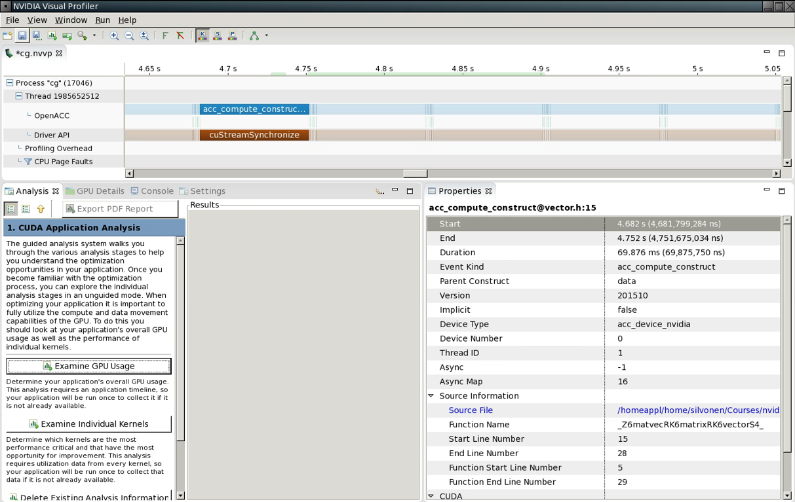

# Outline

- NVidia profiling tools
- Tuning compute region performance
    - Enabling vectorization
    - Loop optimizations
    - Branches
    - Memory access


# Profiling tools {.section}


# NVIDIA NVPROF profiler

- NVPROF is a command-line profiler that is included in OpenACC and CUDA
  toolkits
    - Can also do basic CPU profiling (CUDA 7.5 and newer)
- GPU profiling capabilities
    - High-level usage statistics
    - Timeline collection
    - Analysis metrics


# CPU example

```bash
$ nvprof --cpu-profiling on --cpu-profiling-mode top-down ./cg

...

======== CPU profiling result (top down):
Time(%) Time      Name
79.56%  26.7635s  main
74.58%  25.0876s  | matvec(matrix const &, vector const &, vector const &)
 4.89%  1.64575s  | allocate_3d_poisson_matrix(matrix&, int)
 0.09%  30.105ms  | free_matrix(matrix&)
 0.09%  30.105ms  |   munmap
15.96%  5.36875s  waxpby(double, vector const &, double, vector const &, vector const &)
 4.18%  1.40491s  dot(vector const &, vector const &)
 0.27%  90.315ms  __c_mset8
 0.03%  10.035ms  free_vector(vector&)
 0.03%  10.035ms    munmap

======== Data collected at 100Hz frequency
```

# GPU example

```bash
$ nvprof ./cg
...

==22639== Profiling result:
Time(%)     Time Calls      Avg       Min       Max  Name
84.96%  3.73571s  101  36.987ms  36.952ms  37.003ms  matvec(matrix const &, ...
 6.18%  271.72ms  302  899.73us  598.47us  905.44us  waxpby(double, vector ...
 5.40%  237.64ms  389  610.91us     800ns  1.5132ms  [CUDA memcpy HtoD]
 2.92%  128.37ms  200  641.87us  535.49us  771.52us  dot(vector const &, ...
 0.53%  23.338ms  200  116.69us  116.03us  117.54us  dot(vector const &, ...
 0.01%  427.78us  200  2.1380us  1.8880us  11.488us  [CUDA memcpy DtoH]

==22639== API calls:
Time(%)     Time Calls      Avg       Min       Max  Name
85.25%  4.01764s  812  4.9478ms  2.2690us  37.097ms  cuStreamSynchronize
 6.45%  304.19ms    1  304.19ms  304.19ms  304.19ms  cuDevicePrimaryCtxRetain
 3.43%  161.86ms    1  161.86ms  161.86ms  161.86ms  cuDevicePrimaryCtxRelease
...
```


# NVIDIA visual profiler

{.center}


# Details on OpenACC compute construct

{.center}


# Details on memory copy

{.center}


# Optimization {.section}


# Compute optimizations

- Data movement is and important part to optimize when using GPUs
    - Keeping data on the GPU as long as possible
- Getting the compiler to generate parallel code
    - Addressing loop dependencies
- Data access and execution divergence are important for GPU performance


# Loop dependencies

<div class="column">
```c
/* FLOW dependency, k>0 */
for (int i=0; i<N; i++)
    A[i] = A[i-k]+1;
/* ANTI dependency, k>0 */
for (int i=0; i<N; i++)
    A[i] = A[i+k]+1;
```
```fortran
! FLOW dependency, k>0
do i=0, N
    a(i) = a(i-k) + 1;
end do
! ANTI dependency, k>0
do i=0, N
    a(i) = a(i+k) + 1;
end do
```
</div>

<div class="column">
- FLOW dependency
    - Read After Write (RAW), data is written to is read on the following
      iteration round(s)
- ANTI dependency
    - Write After Read (WAR), data read is written to on the following
      iteration rounds
</div>


# Loop dependencies

- Dependencies disable vectorization, which is essential for good
  performance
- Rewrite the loops so that the dependency is removed
- Try to split the loop, use temporary array, etc.
- Some dependencies can not be removed
    - Try a different algorithm?


# Loop dependencies and C

- C pointers are hard for the compiler to follow
    - Compiler will not know, if a loop can be vectorized safely, if a
      function has pointer arguments
    - Can be a *false* dependency

```c
void adder(float *x, float *y, float *res) {
    for (int i=0; i < VECSIZE; i++) {
        res[i] = x[i] + y[i];
    }
}
```

- What if `res` and `x` overlap in memory?


# C99 restrict keyword

- C99 standard has restrict keyword which tells the compiler that the
  pointer is accessed so that it does not overlap with other accesses

```c
void adder(float restrict *x, float restrict *y, float restrict *res) {
    for (int i=0; i < VECSIZE; i++) {
        res[i] = x[i] + y[i];
    }
}
```


# Loop independent clause

- OpenACC independent clause tells to the compiler that loop iterations
  are independent
    - Overrides any compiler dependency analysis
    - You have to make sure that the iterations are independent!

```c
#pragma acc loop independent
void adder(float *x, float *y, float *res) {
    for (int i=0; i < VECSIZE; i++) {
        res[i] = x[i] + y[i];
    }
}
```


# Loop directive

- Loop directive accepts several fine-tuning clauses
    - **gang** -- apply gang-level parallelism
    - **worker** -- apply worker-level parallelism
    - **vector** -- apply vector-level parallelism
    - **seq** -- run sequentially
- Multiple levels can be applied to a loop nest, but they have to be
  applied in top-down order


# Optimize loops: vector length

- Tell the compiler that when using NVIDIA device it should use a
  vector length of 32 on the innermost loop
- Because these parameters depend on the accelerator type, it is a good
  practice to add **device_type** clause

```c
for (int i=0; i<imax; i++) {
    ...
    #pragma acc loop device_type(nvidia) vector(32)
    for (int j=0; j<jmax; j++) {
        ... /* No further loops in this block */
    }
}
```


# Optimize loops: specifying workers


```c
#pragma acc loop device_type(nvidia) gang worker(32)
for (int i=0; i<imax; i++) {
    ...
    #pragma acc loop device_type(nvidia) vector(32)
    for (int j=0; j<jmax; j++) {
        ...
    }
}
```

- Tell the compiler that when using NVIDIA device, the outer loop
  should be broken over gangs and workers with 32 workers per gang


# Additional loop optimizations

- `collapse(N)`
    - Same as in OpenMP, take the next N tightly nested loops and flatten
      them into a one loop
    - Can be beneficial when loops are small
    - Breaks the next loops into tiles (blocks) before parallelizing the
      loops
    - For certain memory access patterns this can improve data locality


# What values should I try?

- Depends on the accelerator you are using
- You can try out different combinations, but deterministic optimizations
  require good knowledge on the accelerator hardware
    - In the case of NVIDIA GPUs you should start with the NVVP results
      and refer to CUDA documentation
    - One hard-coded value: for NVIDIA GPUs the vector length should
      always be 32, which is the (current) warp size


# Branches in device code

- 32 threads running the same instruction at the same time
- Avoid branches based on thread id unless evenly dividable by 32
    - If (i%2) NO!
    - if (i%32) ok
- When unavoidable keep branches short


# Coalesced memory access

<div class="column">
- Coalesced memory access
    - 32 threads accessing memory at the same time
    - 32 Byte access granularity
- Overly simplified
    - Some cases 128 bytes access granularity
    - 128 byte coalesced accesses can improve performance
</div>

<div class="column">

</div>


# Summary

- Profiling is essential for optimization
    - NVPROF and NVVP for NVIDIA platform
- Loop optimizations
- Branches
- Memory access patterns
