# Overview

We will cover the following topics

- What is a GPU and why should you care
- How does the architecture of a GPU differ from that of a CPU
- How to use GPUs
- What problems are a good fit for GPUs
- (Bonus: Software - hardware mapping on GPUs)

# Learning objectives

After this lecture you will understand

- why GPUs are relevant for HPC
- how GPUs differ from CPUs
- how GPUs can be utilized
- what problems map well to GPUs
- (if time permits, how the software maps to hardware on a high level)

# GPUs: why and what? {.section}

# Why use GPUs for HPC?

:::::: {.columns}
::: {.column width="30%"}

Top 500 supercomputers mapped by coprocessor type.

https://www.top500.org/statistics/treemaps/

:::
::: {.column width="70%"}

November 2005

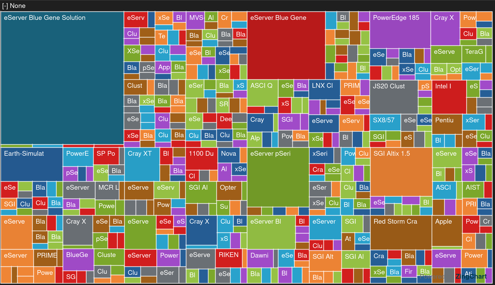{.center width=100%}

:::
::::::

# Why use GPUs for HPC?

:::::: {.columns}
::: {.column width="30%"}

Top 500 supercomputers mapped by coprocessor type.

https://www.top500.org/statistics/treemaps/

:::
::: {.column width="70%"}

November 2010

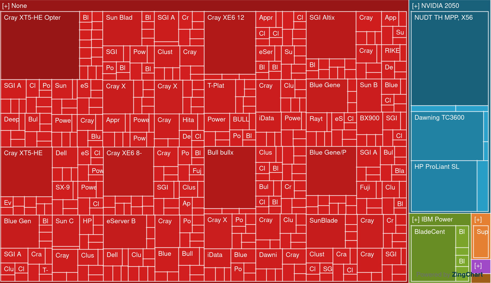{.center width=100%}

:::
::::::

# Why use GPUs for HPC?

:::::: {.columns}
::: {.column width="30%"}

Top 500 supercomputers mapped by coprocessor type.

https://www.top500.org/statistics/treemaps/

:::
::: {.column width="70%"}

November 2015

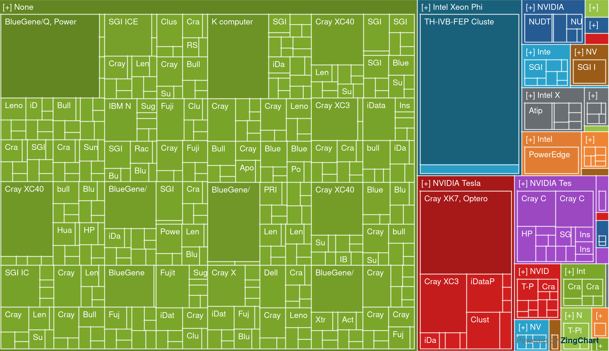{.center width=100%}

:::
::::::

# Why use GPUs for HPC?

:::::: {.columns}
::: {.column width="30%"}

Top 500 supercomputers mapped by coprocessor type.

https://www.top500.org/statistics/treemaps/

:::
::: {.column width="70%"}

November 2020

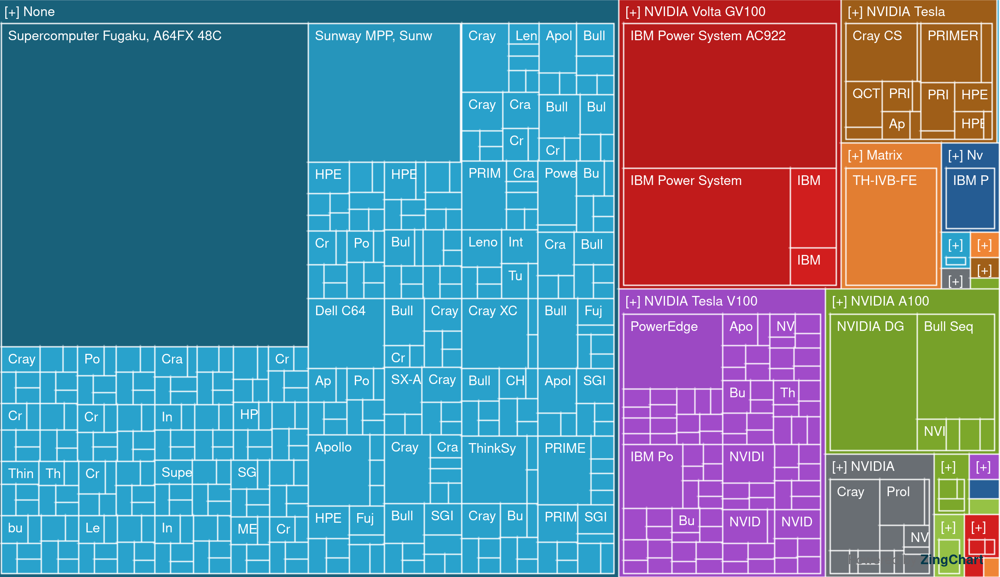{.center width=100%}

:::
::::::

# Why use GPUs for HPC?

:::::: {.columns}
::: {.column width="30%"}

Top 500 supercomputers mapped by coprocessor type.

https://www.top500.org/statistics/treemaps/

:::
::: {.column width="70%"}

November 2025

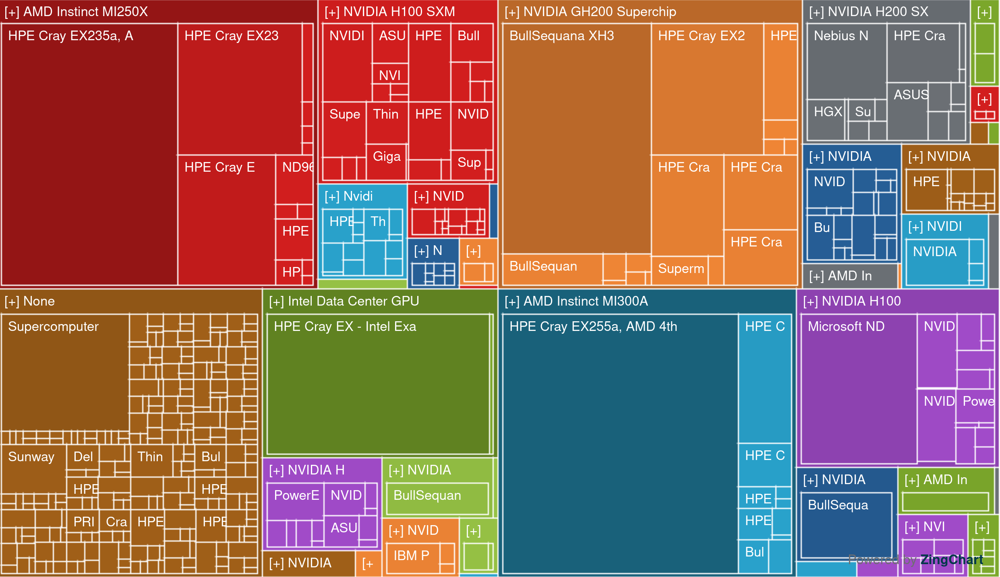{.center width=100%}

:::
::::::

# Why use GPUs for HPC?

  \
  \
  \

<div style="text-align:center;">
GPUs enable exascale ($10^{18}$ FLOPS)
</div>

# What is a GPU?

:::::: {.columns}
::: {.column width="40%"}
A GPU is a **coprocessor** with its own architecture (and often its own memory)

Examples

- Grace-Hopper
- A100 w/ CPU
- MI250X w/ CPU
:::
::: {.column width="60%"}

CPU and GPU on separate chips

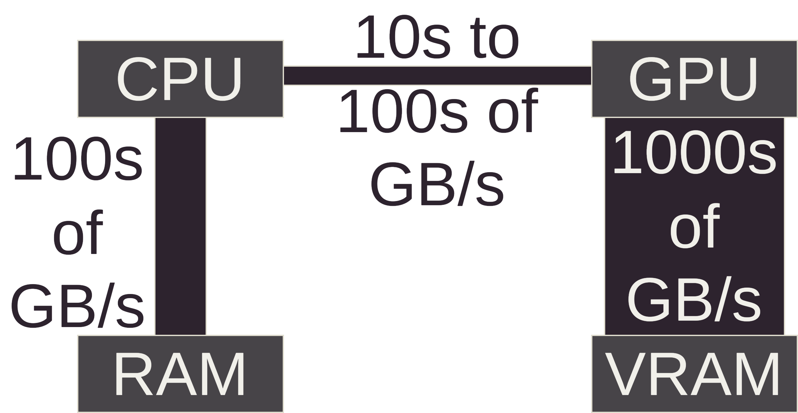{.center width=120%}
  
:::
::::::

# What is a GPU?

:::::: {.columns}
::: {.column width="40%"}
A GPU is a **coprocessor** with its own architecture (and often its own memory)

Examples

- MI300A
:::
::: {.column width="60%"}

CPU and GPU on a single chip

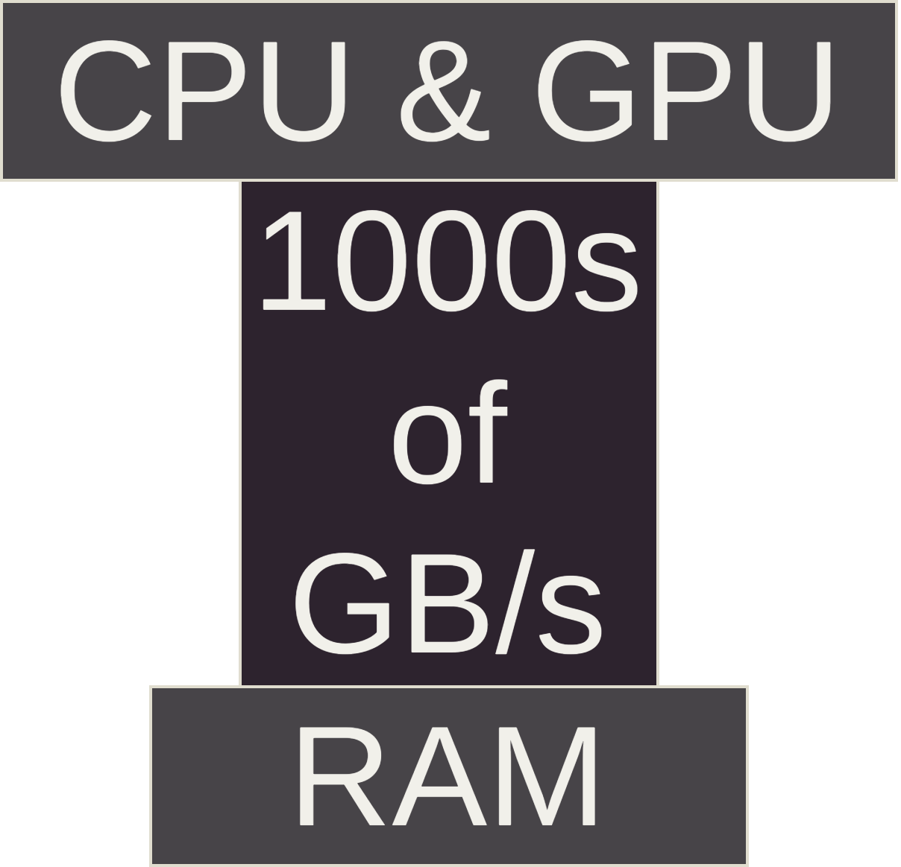{.center width=60%}
  
:::
::::::

# What is a GPU?

Controlled via an API

- CPU acts as an orchestrator
- GPU executes parallel tasks dispatched by the CPU
- GPUs are **coprocessors**, not replacements of CPUs

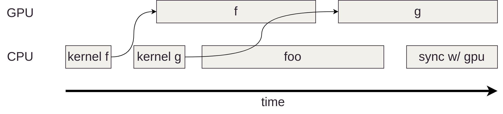{.center width=100%}

# GPU architecture {.section}

# CPU architecture

:::::: {.columns}
::: {.column width="30%"}
Most CPU die area is for cache, IO and branch prediction
  \
  \
(Relative scales between units approximate)
:::
::: {.column width="70%"}
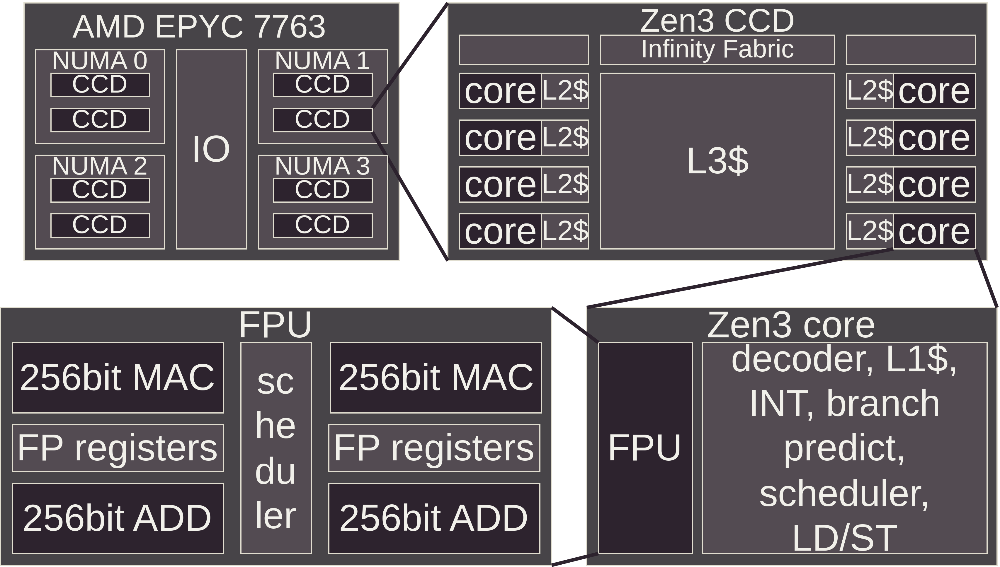{.center width=120%}
:::
::::::

# GPU architecture

:::::: {.columns}
::: {.column width="30%"}
Most GPU die area is reserved for computation
  \
  \
(Relative scales between units approximate)
:::
::: {.column width="70%"}
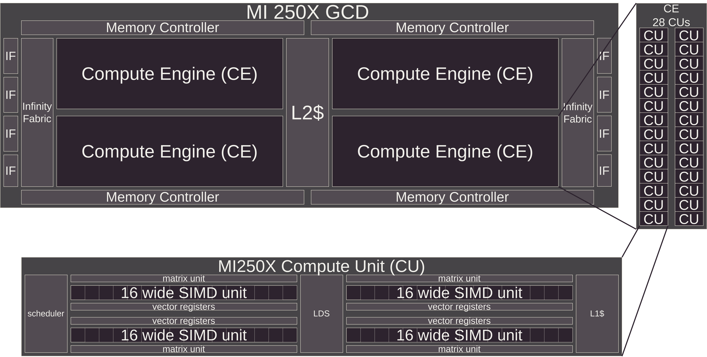{.center width=120%}
:::
::::::

# GPU vs CPU architecture

| Aspect | CPU | GPU |
|--------|-----|-----|
| lanes / SIMD | 8-16 | 16-32 |
| SIMDs / core | 2 | 4 |
| cores / processor | 64-192 | 100-200 |
| frequency | 1-4 GHz | 1-2 GHz |
| FLOPS | 1-10 TFLOPS | 10-100 TFLOPS |

GPUs have orders of magnitude more compute power

# SIMD

SIMD = Single Instruction, Multiple Data

- One operation applied to multiple data elements simultaneously
- All lanes in a SIMD unit execute the same instruction on different data
- Example: Add 8 numbers in parallel using 8 lanes
- Fundamental for high performance computation
  - If your code diverges (different if-else branches), performance degrades
  - Uniform execution across lanes = maximum throughput

# SIMD

:::::: {.columns}
::: {.column width="40%"}

No divergence (illustrative example)
  \
  \
```cpp
for (auto i = 0; i < N; i++) {
    c[i] = a[i] + b[i];
}
```
Throughput: 8

:::
::: {.column width="60%"}

One cycle

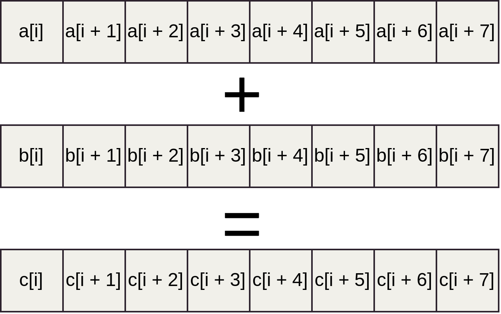{.center width=100%}
:::
::::::

# SIMD

:::::: {.columns}
::: {.column width="40%"}

Divergence (illustrative example)
  \
  \
```cpp
for (auto i = 0; i < N; i++) {
    if ((i % 8) < 4)
        c[i] = a[i] + b[i];
    else
        c[i] = a[i] * b[i];
}
```

Throughput: 4

:::
::: {.column width="60%"}

First cycle

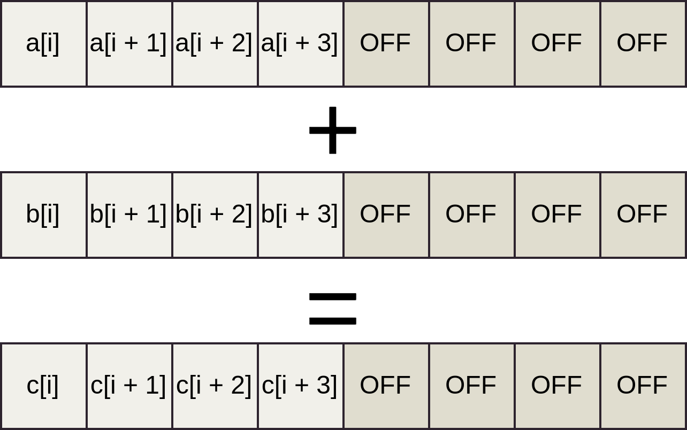{.center width=100%}
:::
::::::

# SIMD

:::::: {.columns}
::: {.column width="40%"}

Divergence (illustrative example)
  \
  \
```cpp
for (auto i = 0; i < N; i++) {
    if ((i % 8) < 4)
        c[i] = a[i] + b[i];
    else
        c[i] = a[i] * b[i];
}
```

Throughput: 4

:::
::: {.column width="60%"}

Second cycle

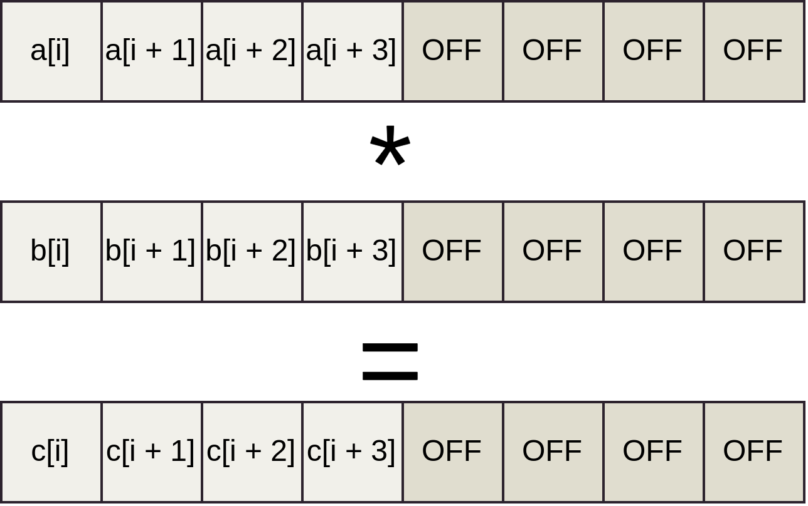{.center width=100%}
:::
::::::

# GPU Architecture Implications: Memory Bandwidth

:::::: {.columns}
::: {.column width="40%"}

More SIMDs = higher bandwidth requirement

- 100s of GB/s (CPU)
- 1000 of GB/s (GPU)
:::
::: {.column width="60%"}

{.center width=120%}
:::
::::::

# GPU Architecture Implications: Parallelism Requirement

Many parallel execution units require many parallel tasks

- A serial algorithm only uses a fraction of GPU capacity
- High performance requires scaling to hundreds of SIMD units
- Not all problems parallelize easily

# GPU Architecture Implications: High latency, high throughput

- Single value latency high compared to CPU
- With the same latency you get many values --> throughput is high
- CPUs are optimized for low latency, GPUs for high throughput


:::::: {.columns}
::: {.column width="80%"}
{.center width=100%}
:::
::: {.column width="20%"}
Image credit J. Lankinen
:::
::::::

# GPU Architecture Implications: Algorithmic Changes

Some algorithms need restructuring for GPU efficiency

Example: Reductions (summing an array)

- CPU: Simple loop with accumulator

{.center width=100%}

# GPU Architecture Implications: Algorithmic Changes

- GPU: Hierarchical reduction with multiple kernel launches & synchronization

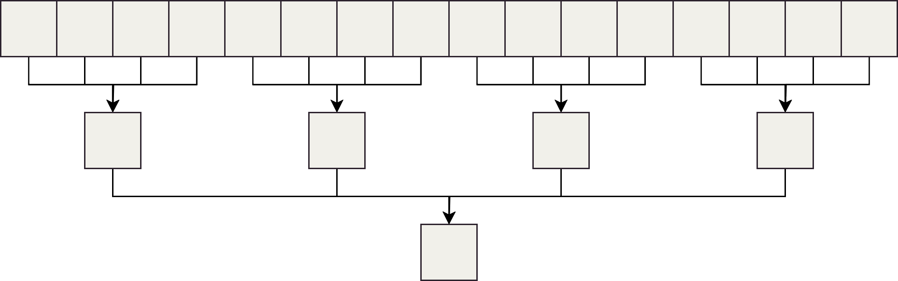{.center width=100%}

# GPU Architecture Implications: Algorithmic Changes

Reduction step across a SIMD 16 lanes wide

(Illustrative only, shows how different this is from a serial reduction)

:::::: {.columns}
::: {.column width="50%"}
```cpp
// lid (= lane id) goes from 0 to 15
for (auto i = 4; i > 0; i--) {
    const auto off1 = 1 << (i - 1);
    const auto off2 = (lid >> i) << i;
    const auto mod = (1 << i) - 1;
    const auto srclane = ((lid + off1) & mod)
                         + off2;
    value += __shfl(value, srclane);
}
```
:::
::: {.column width="50%"}
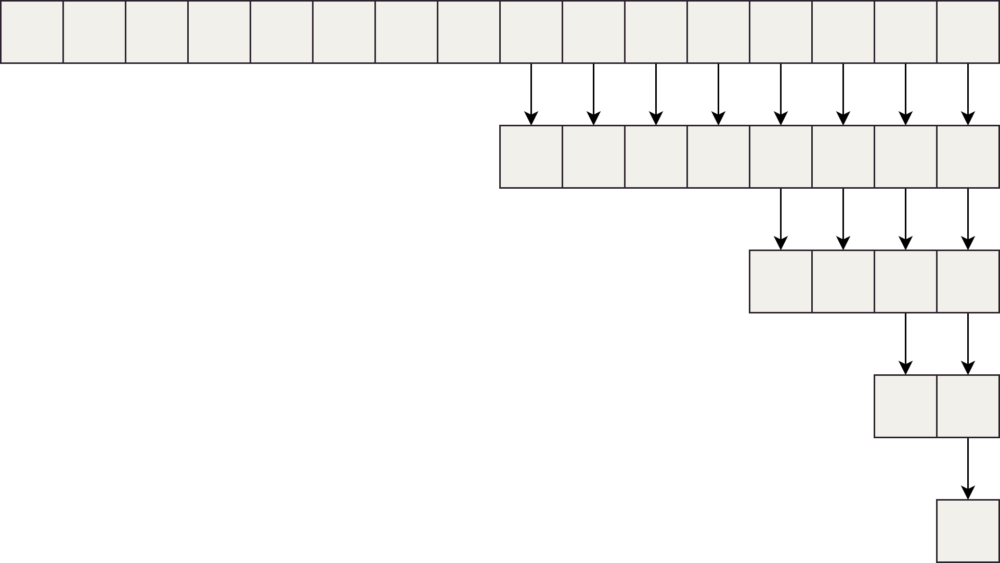{.center width=100%}
:::
::::::

# How to Use a GPU {.section}

# How to Use a GPU: Overview

Multiple layers of abstraction:

1. GPU accelerated programs
2. Parallel programming libraries
3. High-level APIs
4. Low-level APIs
5. Assembly-like intermediate representations

# How to Use a GPU: GPU-Accelerated Programs

Use existing HPC software with GPU support

Examples:

- GROMACS -- Molecular dynamics simulations
- LAMMPS -- Molecular dynamics simulations
- Elmer -- CSC's open source Finite Element multi-physics simulation package

# How to Use a GPU: Libraries – Algorithms

rocTHRUST (AMD) / Thrust (NVIDIA)

Common GPU-accelerated algorithms:

- Reductions – Sum, max, min operations
- Scan – Prefix sums and cumulative operations
- Transformations – Apply functions element-wise
- Sorting – Efficient parallel sort implementations

# How to Use a GPU: Libraries – Algorithms

rocTHRUST (AMD) / Thrust (NVIDIA)

Common GPU-accelerated algorithms:

- Search – Binary search and set operations
- Remove – Filter elements based on predicates
- Fill/Generate – Initialize GPU memory
- Gather/Scatter – Irregular memory access patterns
- ForEach – Execute function on all elements


# How to Use a GPU: Libraries – Linear Algebra

rocBLAS (AMD) / cuBLAS (NVIDIA)

- GPU implementations of BLAS (Basic Linear Algebra Subprograms)
- Essential for matrix operations
- Compatible with CPU BLAS interface
- Extreme performance for dense matrices

# How to Use a GPU: Libraries – Linear Algebra

rocSOLVER (AMD) / cuSOLVER (NVIDIA)

- GPU implementations of LAPACK routines
- Higher-level solvers (LU, QR, SVD, eigenvalue decomposition)
- Builds on BLAS infrastructure

# How to Use a GPU: Libraries – Linear Algebra

rocSPARSE (AMD) / cuSPARSE (NVIDIA)

- Sparse matrix solvers and operations
- Critical for problems with sparse structure
- Significant memory and compute savings for sparse data

# How to Use a GPU: High-Level APIs – OpenMP offloading

```cpp
#pragma omp target data map(tofrom:a[:N]) map(to:b[:N])
#pragma omp target teams distribute parallel for
for(size_t k = 0; k<N; ++k) {
  a[k] = 1.25 * a[k];
  a[k] += b[k];
}
```

- Works with C/C++/Fortran
- Vendor-supported on NVIDIA and AMD
- Pragmatic approach – annotate parallelizable loops

# How to Use a GPU: High-Level APIs – OpenACC

```fortran
!$acc parallel loop gang vector tile(16,16)
do j=1,n
    do i=1,n
        B(j,i) = A(i,j)
    enddo
enddo
!$acc end parallel
```

- Designed for accelerators, primarily Fortran
- NVIDIA has excellent support
- AMD support limited

# How to Use a GPU: High-Level APIs – C++

| Library | Origin | CPU | NVIDIA | AMD | Intel |
|---|---|:---:|:---:|:---:|:---:|
| Kokkos | Sandia / LF | Yes | Yes | Yes | Yes |
| RAJA | LLNL | Yes | Yes | Yes | Partial |
| SYCL | Khronos standard | Yes | Yes | Yes | Yes |

LF: Linux Foundation

LLNL: Lawrence Livermore National Laboratory

# How to Use a GPU: High-Level APIs – C++

<pre class="code"><code class="language-cpp">// Kokkos
<span style="background:#8abeb7">Kokkos::parallel_for</span>("saxpy", <span style="background:#f0c674">Kokkos::RangePolicy&lt;execution_space&gt;(0, N)</span>,
  <span style="background:#c5c8c6">KOKKOS_LAMBDA(const size_type i) {
    y(i) = a * x(i) + y(i);
  }</span>);

// RAJA
<span style="background:#8abeb7">RAJA::forall</span>&lt;Exec_GPU&gt;(<span style="background:#f0c674">RAJA::RangeSegment(0,N)</span>,
  <span style="background:#c5c8c6">[=] RAJA_DEVICE (idx_t i){
    y[i] = a * x[i] + y[i];
  }</span>
);

// SYCL
<span style="background:#8abeb7">h.parallel_for</span>&lt;class saxpy&gt;(<span style="background:#f0c674">sycl::range&lt;1&gt;(N)</span>, <span style="background:#c5c8c6">[=](sycl::id&lt;1&gt; i){
    y[i] = a * x[i] + y[i];
}</span>);
</code></pre>

# How to Use a GPU: High-Level APIs – Python

CuPy

```python
@jit.rawkernel()
def elementwise_copy(x, y, size):
    tid = jit.blockIdx.x * jit.blockDim.x + jit.threadIdx.x
    ntid = jit.gridDim.x * jit.blockDim.x
    for i in range(tid, size, ntid):
        y[i] = x[i]
```

- NumPy-like: accelerate array operations on GPUs
- Also possible to write GPU kernels in Python syntax
- NVIDIA support mature, AMD support experimental

# How to Use a GPU: High-Level APIs – Python

Numba

```python
@cuda.jit
def increment_by_one(an_array):
    tx = cuda.threadIdx.x
    ty = cuda.blockIdx.x
    bw = cuda.blockDim.x
    pos = tx + ty * bw
    if pos < an_array.size:
        an_array[pos] += 1
```

- Write GPU kernels in Python syntax
- Good performance, lower boilerplate than CUDA
- NVIDIA support mature, AMD support experimental

# How to Use a GPU: High-Level APIs – Python

PyTorch

```python
dtype = torch.float
device = torch.device("cuda:0")

x = torch.linspace(-math.pi, math.pi, 2000, device=device, dtype=dtype)
y = torch.sin(x)
z = x + y
```

- Versatile beyond ML (general tensor operations)
- Ok-ish performance for general purpose computation
- Mature support from AMD and NVIDIA

# How to Use a GPU: Lower-Level APIs – CUDA & HIP

CUDA (NVIDIA)

```c++
__global__ void saxpy_kernel(int n, float alpha, float *x, float *y) {
    int tid = blockIdx.x * blockDim.x + threadIdx.x;
    if (tid < n) {
        y[tid] = alpha * x[tid] + y[tid];
    }
}
```

- NVIDIA GPUs only
- C/C++/Fortran support
- Most mature ecosystem and documentation

# How to Use a GPU: Lower-Level APIs – CUDA & HIP

HIP (AMD/NVIDIA)

```c++
__global__ void saxpy_kernel(int n, float alpha, float *x, float *y) {
    int tid = blockIdx.x * blockDim.x + threadIdx.x;
    if (tid < n) {
        y[tid] = alpha * x[tid] + y[tid];
    }
}
```

- Heterogeneous-Compute Interface for Portability by AMD
- Syntactically almost 1 to 1 match with CUDA
- Makes code reuse across vendors easier
- Uses CUDA on NVIDIA GPUs, ROCm on AMD GPUs

# How to Use a GPU: Lower-Level APIs – Triton

Triton (Python-like)

```python
@triton.jit
def saxpy_kernel(y_ptr, x_ptr, alpha, n, BLOCK_SIZE: tl.constexpr):
    block_id = tl.program_id(axis=0)
    block_start = block_id * BLOCK_SIZE
    offsets = block_start + tl.arange(0, BLOCK_SIZE)
    mask = offsets < n
    x = tl.load(x_ptr + offsets, mask=mask)
    y = tl.load(y_ptr + offsets, mask=mask)
    y_new = alpha * x + y
    tl.store(y_ptr + offsets, y_new, mask=mask)
```

- Python-like GPU programming language from OpenAI
- Mostly used in AI/ML context
- Can be use for general purpose computing


# How to Use a GPU: Assembly-like languages -- PTX

PTX – NVIDIA Parallel Thread Execution

```ptx
{
	ld.param.u64 	%rd1, [square(int*, int)_param_0];
	ld.param.u32 	%r2, [square(int*, int)_param_1];
	mov.u32 	%r3, %ntid.x;
	mov.u32 	%r4, %ctaid.x;
	mov.u32 	%r5, %tid.x;
	mad.lo.s32 	%r1, %r3, %r4, %r5;
	setp.ge.s32 	%p1, %r1, %r2;
}
```

- Used internally by NVCC compiler
- Can be written directly

# How to Use a GPU: Assembly-like languages -- HSAIL

HSAIL – Heterogeneous System Architecture Intermediate Language

```hsail
shl_u32 $s1, $s1, 2;
add_u32 $s2, $s2, $s1;
ld_global_f32 $s2, [$s2];
add_u32 $s3, $s3, $s1;
ld_global_f32 $s3, [$s3];
add_f32 $s2, $s3, $s2;
add_u32 $s0, $s0, $s1;
st_global_f32 $s2, [$s0];
```

- AMD's compiler target representation
- Can be written directly

# How to Use a GPU: Graphics APIs

General-purpose compute via compute pipeline and compute shaders

- DirectX – Windows/Xbox, C++ with HLSL shaders
- Vulkan – Cross-platform, C/C++/Rust with GLSL/SPIR-V
- Metal – Apple platforms, Swift/Objective-C with MSL
- Poor support on supercomputers (drivers missing)

# How to Use a GPU: Language Support Summary

| Language | NVIDIA | AMD |
|----------|--------|-----|
| C/C++ | Excellent | Excellent |
| Fortran | Good | Limited |
| Python | Good | Limited |
| Other languages | Bindings only | Bindings only |

# How to Use a GPU: Practical Language Guidance

Choose based on your needs:

- C/C++ – Maximum portability and vendor support
- Python – Rapid development, strong ML frameworks (AMD experimental, except PyTorch)
- Fortran – Legacy and scientific codes (NVIDIA better)
- Other languages – Possible but support usually lacking on HPC systems

# Problems That Map Well to GPUs {.section}

# Problem Characteristics: Low Coupling & Parallelism

Problems with low coupling and many independent elements

Examples

- For loops with independent iterations
- Reductions (e.g. sums, max operations) across large arrays
- Matrix/vector products with many vectors/large matrices

# Problem Examples: Particle Simulations

Particle systems with limited coupling

Examples

- Molecular dynamics with cutoff distances
- N-body problems with approximate forces

# Problem Examples: Grid-Based Simulations

Grid-based systems where cells are updated independently

Examples

- Lattice-Boltzmann Methods
- Cellular automata (Conway's Game of Life)

# Problem Examples: Shading & Image Processing

Image processing

Examples

- Rendering 2D/3D scenes (original purpose of GPUs)
- Image filters (convolutions, blur, edge detection)

# Problem Examples: Machine Learning & AI

ML & AI with matrix operations & data parallelism

Examples

- natural language processing
- computer vision

# Does your problem benefit from a GPU?

Ask yourself

1. Does my problem have many parallel tasks?
2. Do I have a lot of data to crunch over?
3. Can I minimize CPU <--> GPU data movement?
4. Do I need low latency or high throughput?

# How to approach using GPUs?

1. Is software available? (GROMACS, LAMMPS, Elmer)
2. Can I use generic libraries? (Thrust, rocBLAS)
4. Do I need portability, ease of development, efficiency, feature support?
5. Lower level API with maximum control or a higher level abstraction?

# Summary

- The top 500 super computers gain their power from GPUs
- HPC programming changes rapidly, 5 years is a long time in HPCland
- GPUs are optimized for maximum throughput, not low latency
- Think about your needs when choosing the abstraction level:
  - High-level libraries (more assumptions, less control)
  - Low-level APIs (more explicit, maximum control)
- C/C++ best supported across NVIDIA and AMD
- Many problems map well to the parallel nature of GPUs, but not all

# Questions?

# Bonus: Software -- Hardware mapping {.section}

# GPU threads

GPU code is usually written from the perspective of a single GPU thread

Notice the lack of any for loops

```c++
__global__ void saxpy_kernel(int n, float alpha, float *x, float *y) {
    // What is my global thread ID?
    const int tid = blockIdx.x * blockDim.x + threadIdx.x;

    // Is my thread ID smaller than the length of the array?
    if (tid < n) {
        // Perform the operation, for this single ID
        y[tid] = alpha * x[tid] + y[tid];
    }
}
```

# GPU threads

GPU threads are very different from CPU threads:

- very lightweight
- spawned automatically
- grouped hiearchically
- mapped to hardware differently

# GPU thread -- SIMD lane

:::::: {.columns}
::: {.column width="50%"}
A single GPU thread maps to a single lane on a SIMD unit (or SMSP, which is NVIDIAs fancy name for it)

:::
::: {.column width="50%"}
TODO
{.center width=100%}
:::
::::::

# Wavefront/warp -- SIMD unit

:::::: {.columns}
::: {.column width="50%"}
Consecutive GPU threads grouped by hardware:

|#|Name|Vendor|HW|
|-|----|------|--|
|64|wavefront|AMD|SIMD|
|32|warp|NVIDA|SMSP|

SMSP: Streaming Multiprocessor Sub-Partition (~= SIMD)

Wavefronts/warps recide on the same SIMD/SMSP until completion

:::
::: {.column width="50%"}
TODO
{.center width=100%}
:::
::::::

# Wavefront

1. Wavefronts map to a SIMD unit
2. SIMD units perform the same operation for all lanes
3. Sub-wavefront divergence reduces throughput

:::::: {.columns}
::: {.column width="50%"}
```cpp
// avoid
if ((tid % 64) < 32)
    divergence_within_a_wavefront();
else
    reduces_throughput();
```
:::
::: {.column width="50%"}
```cpp
// ok
if ((tid / 64) < 32)
    no_divergence_since();
else
    threads_in_wavefront_take_same_branch();
```
:::
::::::

# Block of threads -- CU/SM

:::::: {.columns}
::: {.column width="50%"}
GPU threads grouped also in software by the user

**Block of threads** = N threads, where (1 <= N <= 1024)

Block maps to CU/SM (AMD/NVIDIA)

CU: Compute Unit

SM: Streaming Multiprocessor

:::
::: {.column width="50%"}
TODO
{.center width=100%}
:::
::::::

# Block of threads -- CU/SM

:::::: {.columns}
::: {.column width="50%"}
Multiple blocks may map to a single CU/SM

A single block is never mapped to multiple CU/SMs

Blocks may be 1, 2 or 3 dimensional
:::
::: {.column width="50%"}
TODO
{.center width=100%}
:::
::::::

# Block of threads and shared memory

:::::: {.columns}
::: {.column width="50%"}
1. Block of threads maps to a CU/SM
2. The SIMDs/SMSPs on CU/SM share a small amount of fast memory
3. Threads within the same block may cooperate through that memory
:::
::: {.column width="50%"}
TODO kuva CU:sta ja LDSstä
{.center width=100%}
:::
::::::

# Grid of blocks -- GPU

:::::: {.columns}
::: {.column width="50%"}
User also defines the number of blocks

**Grid of blocks** = N blocks, where (1 <= N <= M) and M depends on e.g. hardware, but is >= 65535

A grid maps to a single GPU

Grids may be 1, 2 or 3 dimensional

:::
::: {.column width="50%"}
TODO map to GPU
{.center width=100%}
:::
::::::

# Mapping summary

|#|Name|HW|User|Dim|Notes|
|-|----|--|----|---|-----|
|1|thread|lane|no|1||
|64|wavefront|SIMD|no|1|AMD (cf. warp)|
|32|warp|SMSP|no|1|NVIDIA (cf. wavefront)|
|N|block of threads|CU/SM|yes|1-3|1 <= N <= 1024|
|N|grid of blocks|GPU|yes|1-3|1 <= N <= M, M varies|

# Defining grids and blocks, launching work

```c++
__global__ void saxpy_kernel(int n, float alpha, float *x, float *y) {
    //              [0, 4095]    1024         [0, 1023]
    const int tid = blockIdx.x * blockDim.x + threadIdx.x;
    // We use the block ID--/            /         \-- the local thread ID
    //              and the block size--/
    // To compute the global thread ID
    if (tid < n) {
        y[tid] = alpha * x[tid] + y[tid];
    }
}

int main(int argc, char **argv) {
    // Allocation, initialization etc. not shown
    const dim3 block_of_threads(1024, 1, 1); // 32 warps, 16 wavefronts
    const dim3 grid_of_blocks(4096, 1, 1);
    saxpy_kernel<<<grid_of_blocks, block_of_threads>>>(n, alpha, x, y);
}
```
