# Overview

We will cover the following topics
  \
  \

- What is a GPU and why should you care
- How does the architecture of a GPU differ from that of a CPU
- What are some of the implications of GPU hardware
- How to use GPUs
- What problems are a good fit for GPUs

# Learning objectives

After this lecture you will understand
  \
  \

- Why GPUs are relevant for HPC
- How GPUs differ from CPUs
- How programming GPUs differs from programming CPUs
- How GPUs can be utilized
- What problems map well to GPUs

# GPUs: why? {.section}

# Why use GPUs for HPC?

:::::: {.columns}
::: {.column width="30%"}

Top 500 supercomputers mapped by coprocessor type.

<https://www.top500.org/statistics/treemaps/>

:::
::: {.column width="70%"}

November 2005

{.center width=100%}

:::
::::::

# Why use GPUs for HPC?

:::::: {.columns}
::: {.column width="30%"}

Top 500 supercomputers mapped by coprocessor type.

<https://www.top500.org/statistics/treemaps/>

:::
::: {.column width="70%"}

November 2010

{.center width=100%}

:::
::::::

# Why use GPUs for HPC?

:::::: {.columns}
::: {.column width="30%"}

Top 500 supercomputers mapped by coprocessor type.

<https://www.top500.org/statistics/treemaps/>

:::
::: {.column width="70%"}

November 2015

{.center width=100%}

:::
::::::

# Why use GPUs for HPC?

:::::: {.columns}
::: {.column width="30%"}

Top 500 supercomputers mapped by coprocessor type.

<https://www.top500.org/statistics/treemaps/>

:::
::: {.column width="70%"}

November 2020

{.center width=100%}

:::
::::::

# Why use GPUs for HPC?

:::::: {.columns}
::: {.column width="30%"}

Top 500 supercomputers mapped by coprocessor type.

<https://www.top500.org/statistics/treemaps/>

:::
::: {.column width="70%"}

November 2025

{.center width=100%}

:::
::::::

# Why use GPUs for HPC?

  \
  \
  \

<div style="text-align:center;">
GPUs enable exascale ($10^{18}$ FLOPS)
</div>

# Runtimes of Taylor expansion, N = 0

::::::::: {.columns}
:::::: {.column width="40%"}

- $y_i \gets \sum_{n = 0}^{0} \frac{x_i^n}{n!}$
- $i = 1\dots$ vector size
- No arithmetic: $y_i \gets 1$
- Serial, OpenMP with 64 threads and GPU

::::::
:::::: {.column width="80%"}
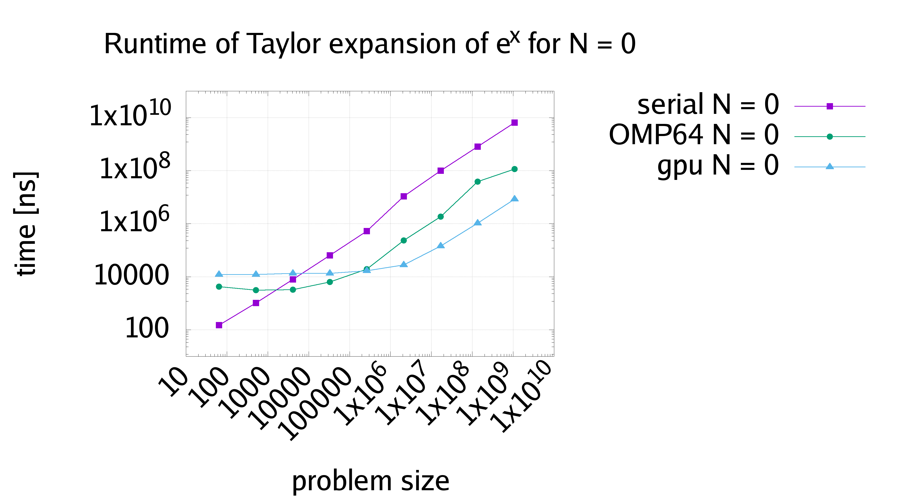{.center width=200%}
::::::
:::::::::

# Runtimes of Taylor expansion, N = 8

::::::::: {.columns}
:::::: {.column width="40%"}

- $y_i \gets \sum_{n = 0}^{8} \frac{x_i^n}{n!}$
- $i = 1\dots$ vector size
- Serial, OpenMP with 64 threads and GPU

::::::
:::::: {.column width="80%"}
{.center width=120%}
::::::
:::::::::

# Runtimes of Taylor expansion, N = 16

::::::::: {.columns}
:::::: {.column width="40%"}

- $y_i \gets \sum_{n = 0}^{16} \frac{x_i^n}{n!}$
- $i = 1\dots$ vector size
- Serial, OpenMP with 64 threads and GPU

::::::
:::::: {.column width="80%"}
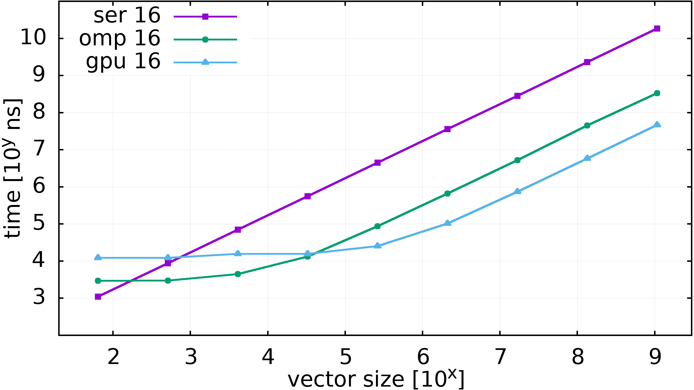{.center width=120%}
::::::
:::::::::

# Runtimes of Taylor expansion, serial

::::::::: {.columns}
:::::: {.column width="40%"}

- $y_i \gets \sum_{n = 0}^{N} \frac{x_i^n}{n!}$
- $i = 1\dots$ vector size
- Serial

::::::
:::::: {.column width="80%"}
{.center width=120%}
::::::
:::::::::

# Runtimes of Taylor expansion, OpenMP 64 threads

::::::::: {.columns}
:::::: {.column width="40%"}

- $y_i \gets \sum_{n = 0}^{N} \frac{x_i^n}{n!}$
- $i = 1\dots$ vector size
- OpenMP 64 threads

::::::
:::::: {.column width="80%"}
{.center width=120%}
::::::
:::::::::

# Runtimes of Taylor expansion, GPU

::::::::: {.columns}
:::::: {.column width="40%"}

- $y_i \gets \sum_{n = 0}^{N} \frac{x_i^n}{n!}$
- $i = 1\dots$ vector size
- GPU

::::::
:::::: {.column width="80%"}
{.center width=120%}
::::::
:::::::::

# Runtimes of Taylor expansion, all

::::::::: {.columns}
:::::: {.column width="40%"}

- $y_i \gets \sum_{n = 0}^{N} \frac{x_i^n}{n!}$
- $i = 1\dots$ vector size
- All

::::::
:::::: {.column width="80%"}
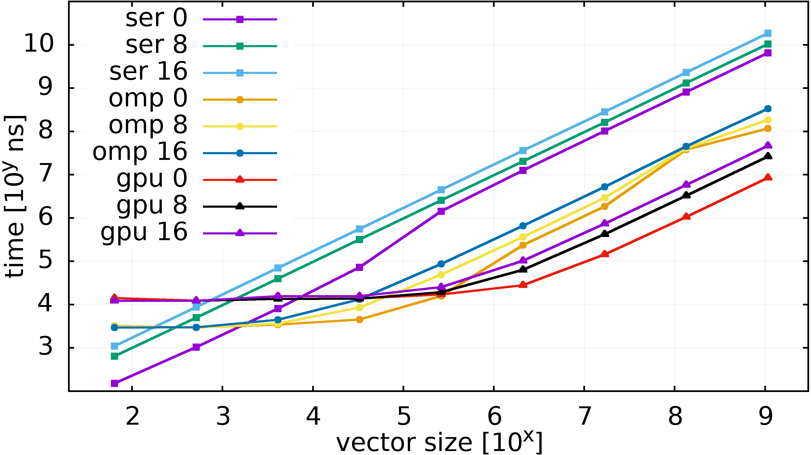{.center width=120%}
::::::
:::::::::

# CPU vs GPU: what's the difference? {.section}

# What is a GPU?

:::::: {.columns}
::: {.column width="40%"}
A GPU is a **coprocessor** to the CPU

It has its own architecture (and often its own memory)

Examples

- Grace-Hopper
- A100 w/ CPU
- MI250X w/ CPU
:::
::: {.column width="60%"}

CPU and GPU on separate chips

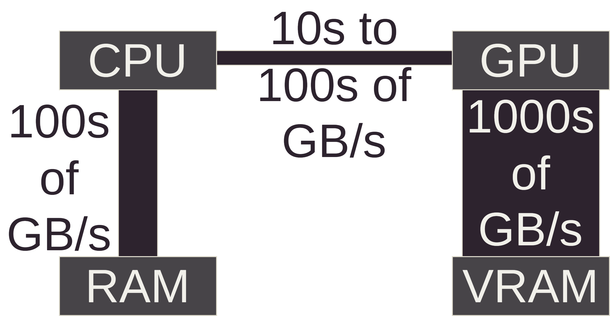{.center width=120%}
  
:::
::::::

# What is a GPU?

:::::: {.columns}
::: {.column width="40%"}
A GPU is a **coprocessor** to the CPU

It has its own architecture (and often its own memory)

Examples

- MI300A
:::
::: {.column width="60%"}

CPU and GPU on a single chip

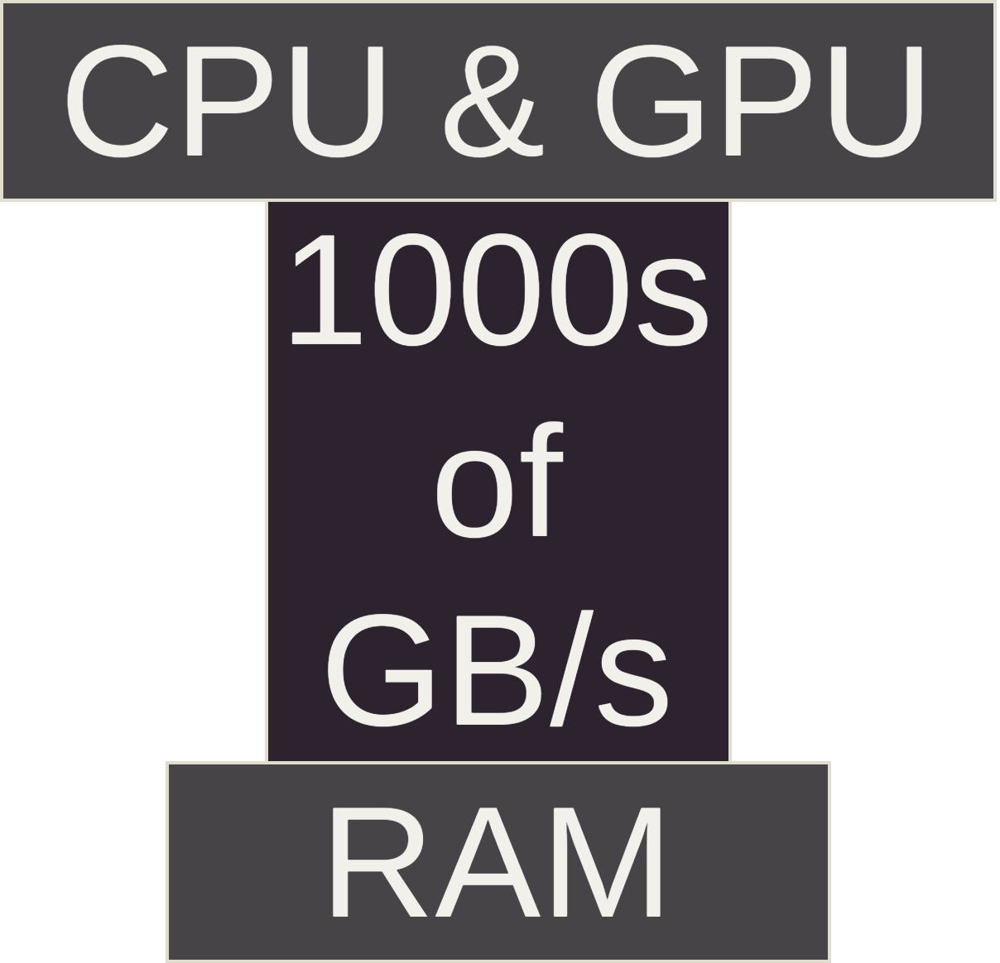{.center width=60%}
  
:::
::::::

# What is a GPU?

- Controlled via an API
- CPU acts as an orchestrator
- GPU executes parallel tasks dispatched by the CPU
- GPUs are **coprocessors**, not replacements of CPUs

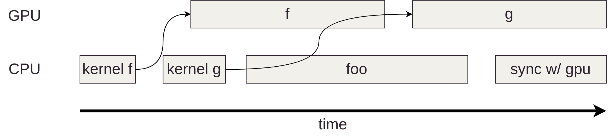{.center width=100%}

# CPU architecture

:::::: {.columns}
::: {.column width="30%"}
Abstract schematic of Epyc 7763 CPU
:::
::: {.column width="70%"}
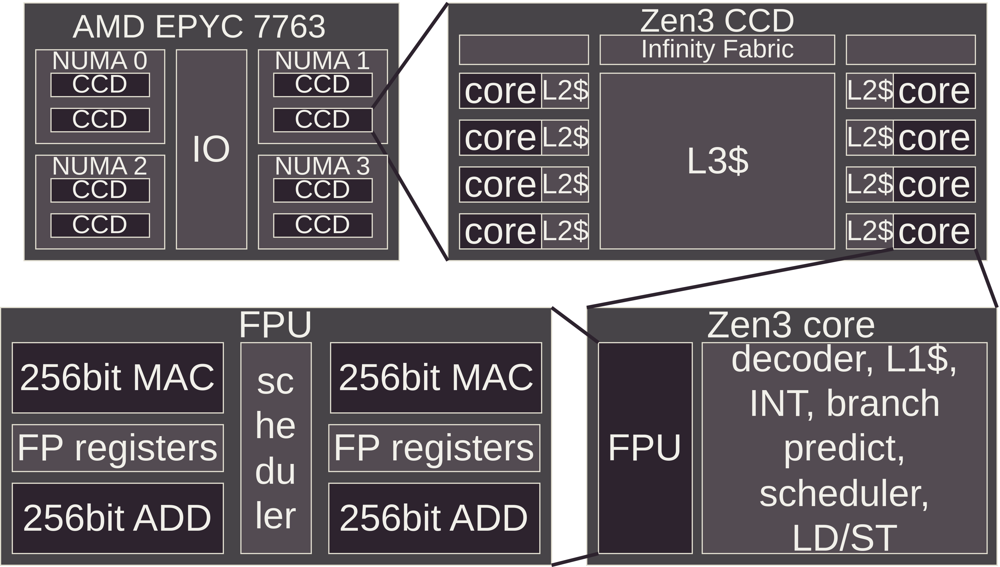{.center width=120%}
:::
::::::

# CPU architecture

:::::: {.columns}
::: {.column width="30%"}
Die shot of Zen3 CCD by Fritzchen Fritz

<small>Fritzchens Fritz, public domain, <https://www.flickr.com/people/130561288@N04/></small>
:::
::: {.column width="70%"}
{.center width=100%}
:::
::::::

# GPU architecture

:::::: {.columns}
::: {.column width="30%"}
Abstract schematic of MI250x GPU
:::
::: {.column width="70%"}
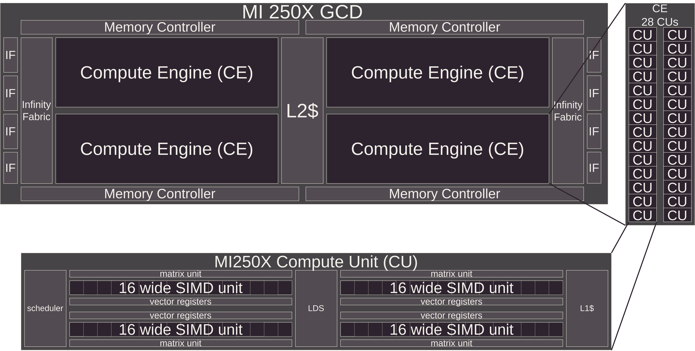{.center width=120%}
:::
::::::

# GPU architecture

Die shot of MI250X (on the web page)

<https://www.amd.com/en/technologies/cdna.html#cdna2>

# CPU vs GPU threads

GPU code is usually written from the perspective of a single GPU thread

Notice the lack of any for loops

```c++
__global__ void saxpy(int n, float alpha, float *x, float *y) {
    // What is my global thread ID?
    const int tid = blockIdx.x * blockDim.x + threadIdx.x;

    // Is my thread ID smaller than the length of the array?
    if (tid < n) {
        // Perform the operation, for this single ID
        y[tid] = alpha * x[tid] + y[tid];
    }
}
```

# CPU vs GPU threads -- Very different beasts

:::::: {.columns}
::: {.column width="50%"}
GPU threads

- Very lightweight: cheap to switch
- $N_{thr} = O(N_{data}) \approx 10^4 - 10^6$
- Lifetime tied to the running kernel
- Alway some inherent hierarchy between threads, user configurable

:::
::: {.column width="50%"}
CPU threads

- Expensive to switch
- $N_{thr} = O(N_{core}) \approx 10^1 - 10^2$
- Lifetime controlled by the user/library
- No inherent hierarchy, entirely up to the user/library
:::
::::::

# CPU vs GPU threads -- Keeping HW busy

:::::: {.columns}
::: {.column width="50%"}
GPU

- Launch many threads to oversubscribe hardware
- In case of a stall, switch to another thread to keep working

:::
::: {.column width="50%"}
CPU

- Launch few threads: 1-2 per core
- Attempt to reduce the number of stalls by any means necessary
  - branch prediction
  - instruction reordering
  - large and sophisticated caches
- As the last resort, switch to another thread

:::
::::::

# GPU Architecture Implications: Memory Bandwidth

More computing units = higher bandwidth requirement

:::::: {.columns}
::: {.column width="40%"}

- 100s of GB/s (CPU)
- 1000 of GB/s (GPU)
:::
::: {.column width="60%"}

{.center width=120%}
:::
::::::

# GPU Architecture Implications: Parallelism Requirement

- Many parallel execution units require many parallel tasks
- A serial algorithm only uses a fraction of GPU capacity
- Not all problems parallelize easily

# GPU Architecture Implications: High latency, high throughput

- Single value latency high compared to CPU
- With the same latency you get many values --> throughput is high
- CPUs are optimized for low latency, GPUs for high throughput


:::::: {.columns}
::: {.column width="80%"}
{.center width=100%}
:::
::: {.column width="20%"}
  \
  \
  \
Image credit J. Lankinen
:::
::::::

# GPU Architecture Implications: Algorithmic Changes

- Some algorithms need restructuring for GPU efficiency
- Example: Reductions (summing an array)
- CPU: Simple loop with an accumulator

{.center width=100%}

# GPU Architecture Implications: Algorithmic Changes

- GPU: Hierarchical reduction with multiple kernel launches & synchronization

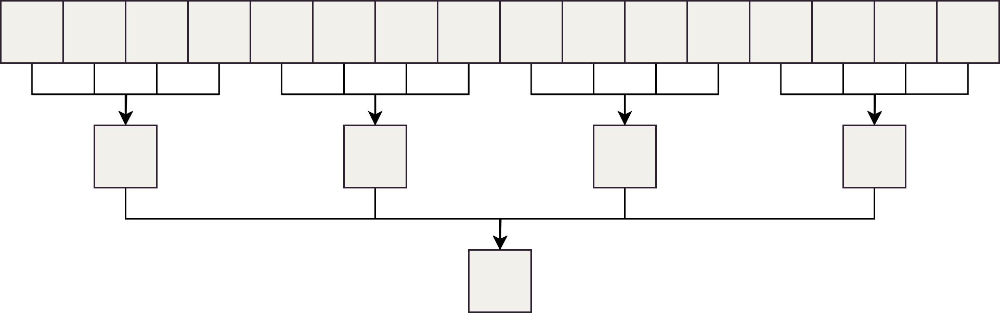{.center width=100%}

# GPU Architecture Implications: Algorithmic Changes

- Reduction step across a SIMD unit
- Illustrative only, shows how different this is from a serial reduction

:::::: {.columns}
::: {.column width="50%"}
```cpp
// lid (= lane id) goes from 0 to 15
for (auto i = 4; i > 0; i--) {
    const auto off1 = 1 << (i - 1);
    const auto off2 = (lid >> i) << i;
    const auto mod = (1 << i) - 1;
    const auto srclane = ((lid + off1) & mod)
                         + off2;
    value += __shfl(value, srclane);
}
```
:::
::: {.column width="50%"}
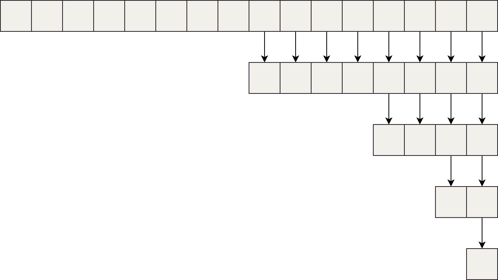{.center width=100%}
:::
::::::

# How to Use a GPU: Overview

Multiple layers of abstraction:
  \
  \

1. GPU accelerated programs (GROMACS, LAMMPS)
2. Parallel programming libraries (Thrust, rocBLAS)
3. High-level APIs (**OpenMP offloading**, OpenACC, SYCL, Numba, PyTorch)
4. Low-level APIs (**CUDA**, **HIP**, OpenCL, Triton)
5. Graphich APIs (DirectX, Vulkan, Metal)
6. Assembly-like intermediate representations (PTX, HSAIL)

# Problems That Map Well to GPUs {.section}

# Problem Characteristics: Low Coupling & Parallelism

:::::: {.columns}
::: {.column width="50%"}
Problems with low coupling and many independent elements

Examples

- For loops with independent iterations
- Reductions (e.g. sums, max operations) across large arrays
- Matrix/vector products with many vectors/large matrices

:::
::: {.column width="50%"}
```cpp
for (auto i = 0; i < N; i++) {
    y[i] = a * x[i] + y[i];
}
```
{.center width=100%}
:::
::::::

# Problem Examples: Particle Simulations

:::::: {.columns}
::: {.column width="50%"}
Particle systems with limited coupling

Examples

- Molecular dynamics with cutoff distances
- N-body problems with approximate forces
:::
::: {.column width="50%"}
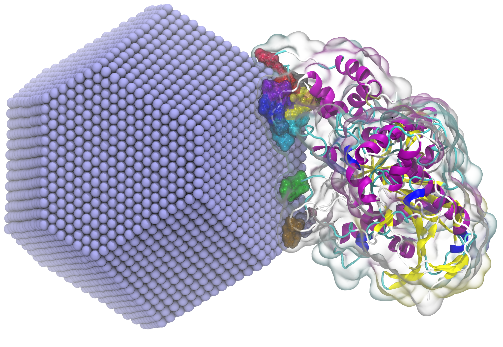{.center width=100%}
<small>Semen Yesylevskyy, [CC BY 4.0](https://creativecommons.org/licenses/by/4.0), via Wikimedia Commons</small>
:::
::::::

# Problem Examples: Grid-Based Simulations

:::::: {.columns}
::: {.column width="50%"}
Grid-based systems where cells are updated independently

Examples

- Lattice-Boltzmann Methods
- Cellular automata (Conway's Game of Life)
:::
::: {.column width="50%"}
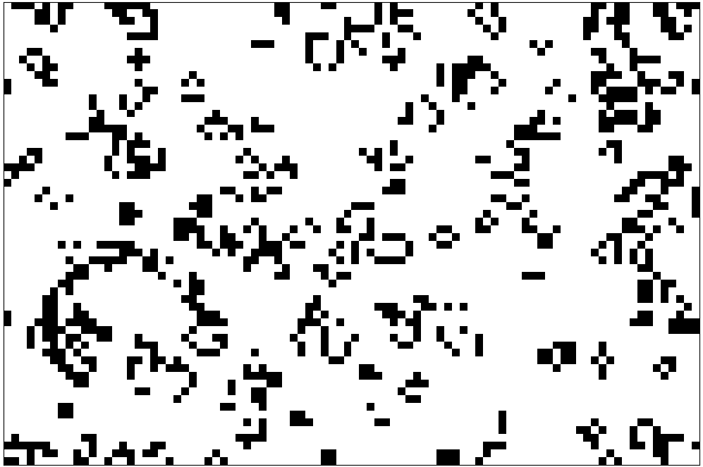{.center width=100%}
:::
::::::

# Problem Examples: Shading & Image Processing

:::::: {.columns}
::: {.column width="50%"}
Image processing

Examples

- Rendering 2D/3D scenes (original purpose of GPUs)
- Image filters (convolutions, blur, edge detection)

:::
::: {.column width="50%"}
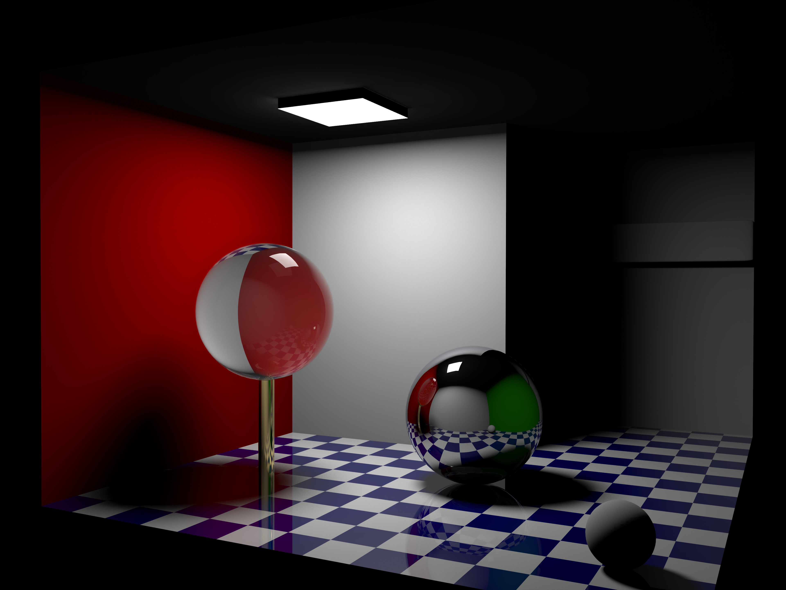{.center width=100%}

<small>Barahag, [CC BY-SA 4.0](https://creativecommons.org/licenses/by-sa/4.0), via Wikimedia Commons</small>
:::
::::::

# Problem Examples: Machine Learning & AI

:::::: {.columns}
::: {.column width="50%"}
ML & AI with matrix operations & data parallelism

Examples

- natural language processing
- computer vision

:::
::: {.column width="50%"}
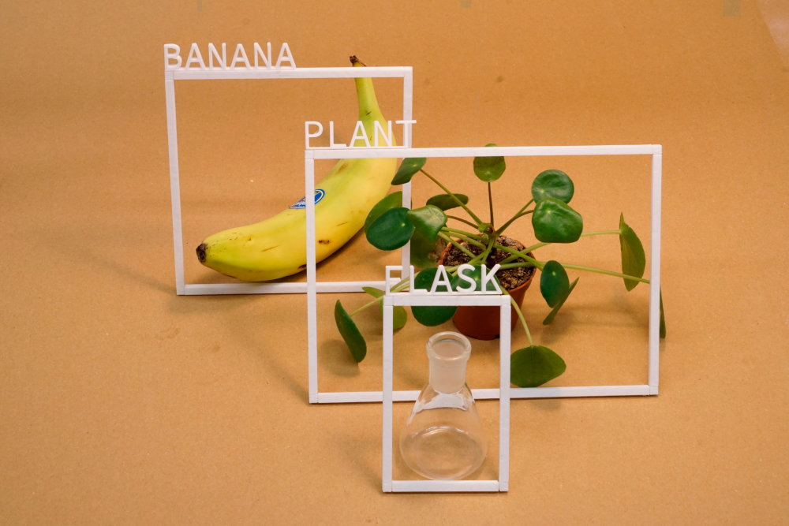{.center width=100%}

<small>Max Gruber, [CC BY 4.0](https://creativecommons.org/licenses/by/4.0), via Wikimedia Commons</small>
:::
::::::

# Does your problem benefit from a GPU?

Ask yourself
  \
  \

1. Does my problem have many parallel tasks?
2. Do I have a lot of data to crunch over?
3. Can I minimize CPU <--> GPU data movement?
4. Do I need low latency or high throughput?

# How to approach using GPUs?

1. Is software available? (GROMACS, LAMMPS)
2. Can I use generic libraries? (Thrust, rocBLAS)
4. Do I need portability, ease of development, efficiency, feature support?
5. Lower level API with maximum control or a higher level abstraction?

# Summary

- The top 500 supercomputers gain their power from GPUs
- HPC programming changes rapidly, 5 years is a long time in HPCland
- GPUs are optimized for maximum throughput, not low latency
- Think about your needs when choosing the abstraction level:
  - High-level libraries (more assumptions, less control)
  - Low-level APIs (more explicit, maximum control)
- Many problems map well to the parallel nature of GPUs, but not all

# Questions?

# The End

Thank you, bye
