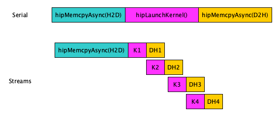
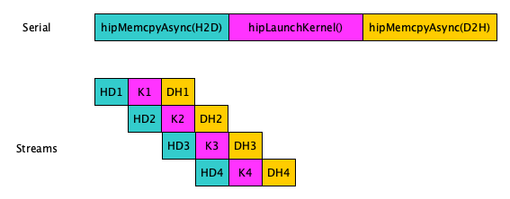
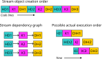
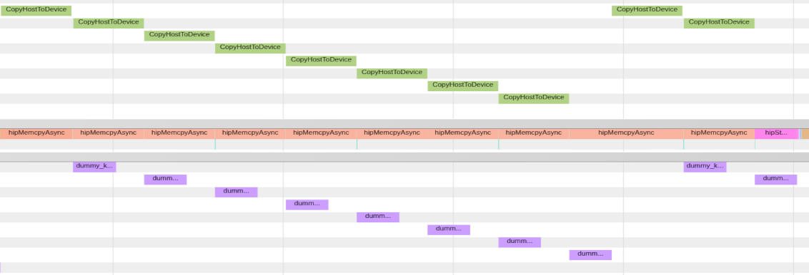
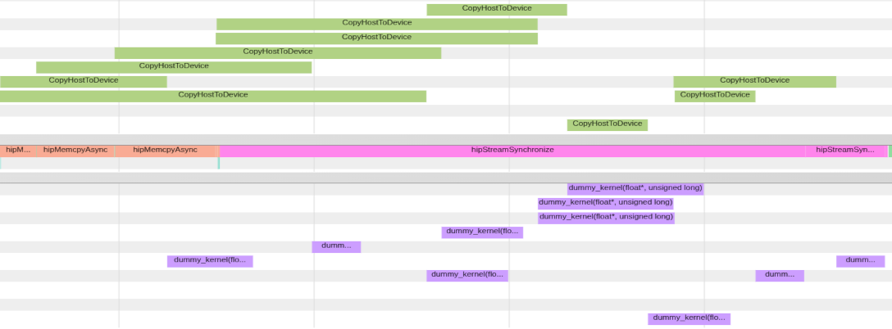

<!--
SPDX-FileCopyrightText: 2021 CSC - IT Center for Science Ltd. <www.csc.fi>

SPDX-License-Identifier: CC-BY-4.0
-->

---
title: Streams, events, and synchronization
event: CSC Summer School in High-Performance Computing 2026
lang:  en
pdfSeparateFragments: false
---

# Motivation

- So far we have learned a "serial" way of programming for GPUs
- Questions we now want to answer:
  - Which operations could overlap?
  - Could multiple kernels execute simultaneously?
  - Could me move data between the host and device during kernel execution?

# Outline

* Streams 
* Events
* Synchronization

# Outline

:::{.fragment}
- Streams
  - Kernels in different streams are asynchronous
  - Kernels in same stream are executed in first-in-first-out order
  - Execute Host-to-Device and Device-to-Host transfers concurrently with kernels
:::
:::{.fragment}
- Events 
  - Synchronize across streams and host
  - Measure time
:::
:::{.fragment}
- Synchronization
  - host ⇔ stream, host ⇔ event,  host ⇔ device
  - stream ⇔ event
  - threads in block
:::

# What is a stream?

* A sequence (queue) of operations that execute in order on the GPU
* Operations in different streams may run concurrently

<small>
<div class="column">
{width=800px}

* H-to-D copy runs in a single stream, and the kernel and D-to-H copy are split into 4 streams

</div>
<div class="column">
{width=800px}

* H-to-D copy, kernel, and D-to-H copy are split into 4 streams

</div>
</small>

::: {.notes}
- Big kernels: 1 kernel in device at time
- But moving data while kernel is computing ok
- No data dependencies. HD2 does not depent on DH1.
:::

# The default stream

- When you do not specify a stream to your kernel, it is sent to the default stream
  - `my_kernel<<<grid, block, 0, 0>>>(...)`

:::{.fragment}
- API functions operate on the default stream: `hipMalloc, hipMemcpy, hipFree, ...`
:::

:::{.fragment}
- All operations (Malloc, Memcpy, Kernel execution) in the same stream execute sequentially in submission order
  - Hence, the sequential nature of what you have learnt so far
:::

# The order of execution in a stream

:::{.fragment}
{width=1600px}
:::

:::{.fragment}
- Operations are sent to the stream and executed in a FIFO manner
:::

:::{.fragment}
{width=340px}
:::

# Stream creation, synchronization, and destruction

* Declare a stream variable
```cpp
hipStream_t stream
```

* Create `stream`
```cpp
hipError_t hipStreamCreate ( hipStream_t* stream )
```

* Destroy `stream`
```cpp
hipError_t hipStreamDestroy ( hipStream_t stream )
```

# Using multiple streams

<small>
<div class="column">
{width=750px}

* H-to-D copy runs in a single stream, and the kernel and D-to-H copy are split into 4 streams

</div>
<div class="column">
{width=800px}

* H-to-D copy, kernel, and D-to-H copy are split into 4 streams

</div>
</small>

# Asynchronous operations and streams

- API functions operate on the default stream: `hipMalloc, hipMemcpy, hipFree, ...`
- Append `Async` to name and add `hipStream_t` as last argument for asynchronous version:
  - `hipMalloc(...)` ⟶ `hipMallocAsync(..., hipStream_t stream)`

::: {.notes}
- `hipStream_t stream` must be created as well (later)
:::

# Asynchronisity and kernels

- Running kernels concurrently require placing them in different streams
  - Default stream has special synchronization rules and cannot run concurrently with other streams (applies to all API calls)
- The stream is supplied to the kernel invocation:
  - `my_kernel<<<grid, block, 0, stream>>>(...)`
  - `hipLaunchKernelGGL(my_kernel, grid, block, 0, stream, ...)`
  - Default stream: `my_kernel<<<grid, block, 0, 0>>>(...)`


<small>

```cpp
// Use the default stream
hipkernel<<<grid, block>>>(args);
// Use the default stream
hipkernel<<<grid, block, bytes, 0>>>(args);
// Use the stream strm[i]
hipkernel<<<grid, block, bytes, strm[i]>>>(args);
```
</small>

# Stream example

::::::{.columns}
:::{.column width="50%"}

```cpp
hipStream_t stream[3];
for (int i = 0; i<3; ++i) 
  hipStreamCreate(&stream[i]);

for (int i = 0; i < 3; ++i) {
  hipMemcpyAsync(d_data[i], h_data[i], bytes, 
    hipMemcpyHostToDevice, stream[i]);

  hipkernel<<<grid, block, 0, stream[i]>>>
    (d_data[i], i);

  hipMemcpyAsync(h_data[i], d_data[i],  bytes, 
    hipMemcpyDeviceToHost, stream[i]);
}

for(int i = 0; i<3; ++i) {
  hipStreamSynchronize(stream[i]);
  hipStreamDestroy(stream[i]); }
```

:::
:::{.column width="49%"}
{width=100%}
:::

::::::

:::{.notes}
- host-device is bidirectional
:::

# Memory caveat:

- Host memory needs to be page-locked, otherwise memory copies are synchronous
```cpp
hipError_t hipHostMalloc(void **ptr, size_t size);
hipError_t hipHostFree(void *ptr);
```

::: {.notes}
More on this in Memory lecture
:::

---

## Async memory copy with regular vs page-locked memory



:::{.fragment}

:::

# Summary before moving to events

- When you do not specify a stream to your kernel, it is sent to the default stream
- Operations in a stream execute in a FIFO manner
- Multiple streams can execute concurrently on the same GPU

# Events

- Synchronize other streams/host with events
- Measure time between events
- [HIP API Documentation](https://rocm.docs.amd.com/projects/HIP/en/docs-6.0.0/doxygen/html/group___event.html)


# Why events?

* Cut stream to fragments
  * Useful for inter-stream synchronization and timing asynchronous events
* Events have a boolean state: occurred / not occurred
  * Query with `hipError_t hipEventQuery(hipEvent_t event)`: `hipSuccess`/`hipErrorNotReady`

::::::{.columns}
:::{.column}
:::{.fragment}

<small>
Measure how fast host places tasks to stream:
```cpp
  // Start timed GPU kernel
  clock_t start_kernel_clock = clock();
  kernel<<<gridsize, blocksize, 0, stream>>>(d_a, n_total);

  // Start timed device-to-host memcopy
  clock_t start_d2h_clock = clock();
  hipMemcpyAsync(a, d_a, bytes, hipMemcpyDeviceToHost, stream);

  // Stop timing
  clock_t stop_clock = clock();
  hipStreamSynchronize(stream);
```
</small>
:::
:::
:::{.column }
:::{.fragment}
<small>
Measure duration of tasks on GPU:
```cpp
  // Start timed GPU kernel
  hipEventRecord(start_kernel_event, stream);
  kernel<<<gridsize, blocksize, 0, stream>>>(d_a, n_total);

  // Start timed device-to-host memcopy
  hipEventRecord(start_d2h_event, stream);
  hipMemcpyAsync(a, d_a, bytes, hipMemcpyDeviceToHost, stream);

  // Stop timing
  hipEventRecord(stop_event, stream);
  hipEventSynchronize(stop_event);
```
</small>
:::
:::
::::::

::: {.notes}
- Note that with events the event is complete when the last hipMemcpy is complete
:::

# Events: Central API calls

<small>

| *Description* | API call |
|-|-|
| Initialize `event` object  | `hipEventCreate(hipEvent_t* event)` |
| Record an `event` in the `stream` | `hipEventRecord(hipEvent_t event, hipStream_t stream)`  |
| Elapsed time (ms) between `start` and `end` | `hipEventElapsedTime(float* ms, hipEvent_t start, hipEvent_t end)`  |
| Make `stream` wait for `event` | `hipStreamWaitEvent(hipStream_t stream, hipEvent_t event, unsigned int  flags = 0)` |
| Wait for `event` to complete | `hipEventSynchronize(hipEvent_t event)` |
| Destroy `event` object | `hipEventDestroy(hipEvent_t event)` |

- All of the above return `hipError_t`

</small>

# Lastly, synchronization

- GPU operations are asynchronous with respect to the host
  - The CPU may continue executing while kernels are still running
  - Memory copies and kernels may overlap

:::{.fragment}
- Synchronization is needed when:
  - The host (CPU) needs results produced by the GPU
  - One operation depends on another operation completing
:::

:::{.fragment}
- Without synchronization:
  - The CPU may access incomplete data
  - Operations may execute in the wrong order
:::

# Central synchronization API calls

<small>

* Synchronize the host with a specific **stream**
```cpp
hipError_t hipStreamSynchronize ( hipStream_t stream )
```

* Synchronize the host with a specific **event**
```cpp
hipError_t hipEventSynchronize ( hipEvent_t event )
```

* Synchronize a specific stream with a specific event (the event can be in another stream)
```cpp
hipError_t hipStreamWaitEvent ( hipStream_t stream, hipEvent_t event, unsigned int  flags = 0 )
```

* Synchronize the host with the whole **device** (wait until all device tasks are finished)
```cpp
hipError_t hipDeviceSynchronize ( void )
```

* In-kernel blockwise synchronization across threads (not between host/device)
```cpp
__syncthreads()
```

</small>

# Summary

::: incremental
* Streams provide a mechanism to compute tasks on the GPU concurrently
* Events provide a mechanism to signal when operations have occurred
in a stream
  * Good for inter-stream sychronization and timing events
* Many host/device synchronizations functions for different purposes
  * The device function `__syncthreads()` is only for in-kernel synchronization between threads in a same block (does not synch threads across blocks)
:::
