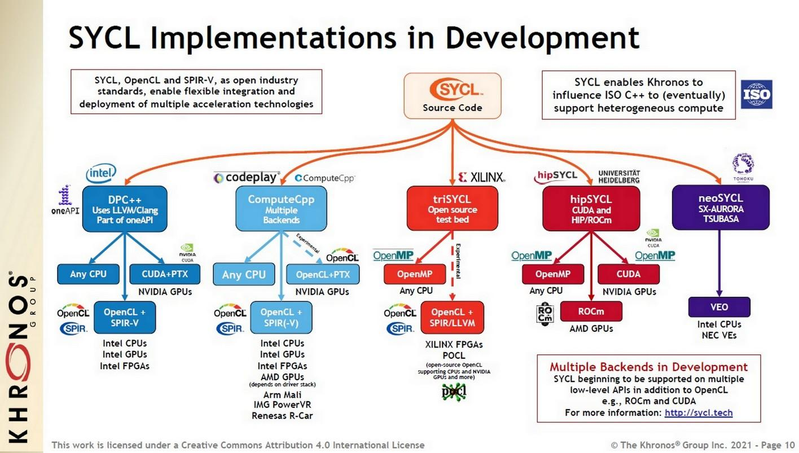
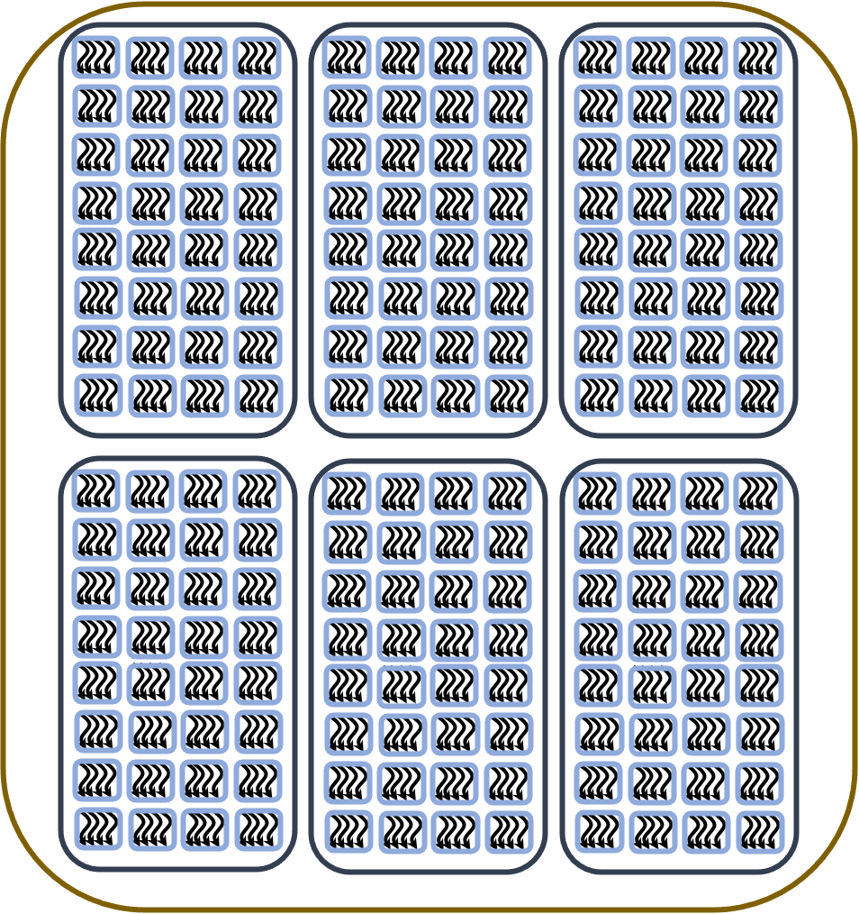
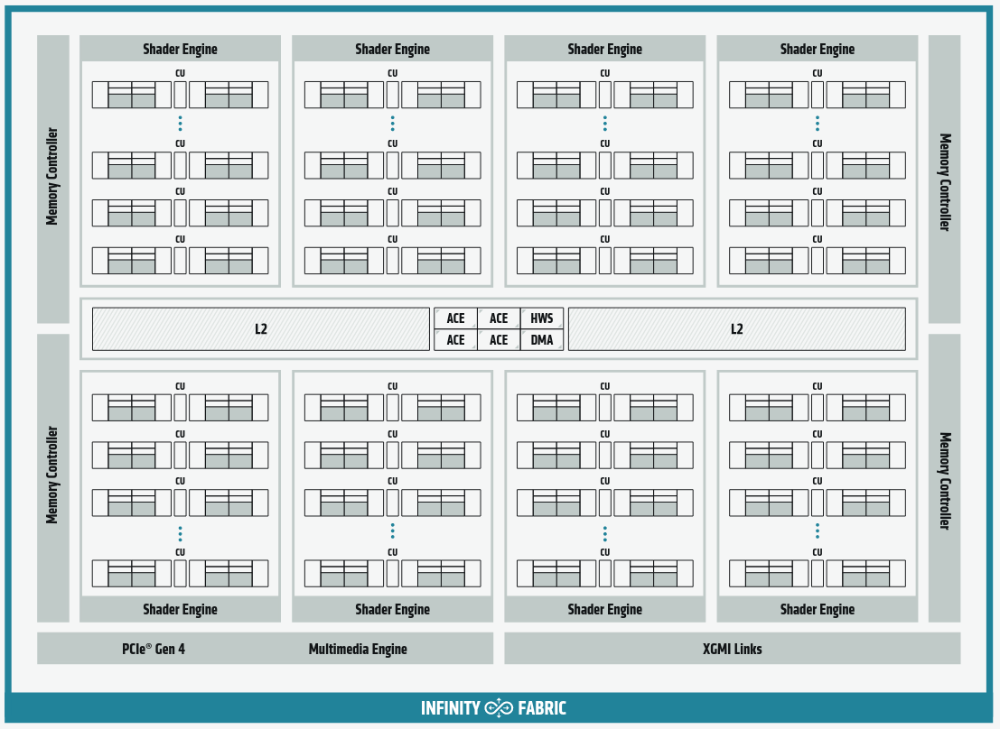
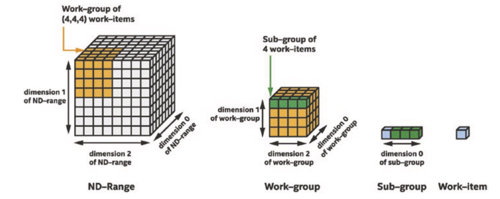
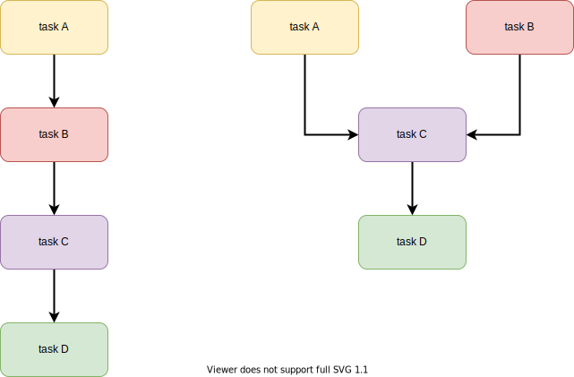

# What is SYCL?

 - C++ abstraction layer that can target various heterogeneous platforms in a single application
 - single source, high-level programming model
 - open source, royalty-free
 - developed by the Khronos Group 
    - 1.2 (2014), final (2015) revise 1.2.1 (2017)
    - 2.2 (2016), never finalized, C++14 and OpenCL 2.2
    - 2020 (2021), revision 9 (2024), C++17 and OpenCL 3.0
 - focused on 3P (Productivity, Portability, Performance)


# Productivity, Portability, Performance

 - **Productivity**: uses generic programming with templates and generic lambda functions.


 - **Portability**: it is a standard.


 - **Performance**: implementations aim to optimize SYCL for specific hardware platforms

# SYCL implementation


  - specific  adaptation of the SYCL programming model
    - **SYCL specific template-based interface**: interface for accesing functionalities and optimizations specific to SYCL
    - **compilers**:  translate the SYCL code into machine code that can run on various hardware accelerators
    - **backend support**: interface for various backends such as OpenCL, CUDA, HIP,  Level Zero, OpenMP
    - **runtime library**: manages the execution of SYCL applications, handling  memory management, task scheduling, and synchronization across different devices
    - **development tools**: debuggers, profilers, etc.


# SYCL ecosystem

{.center width=75%}


# SYCL Implementations on Mahti and LUMI

**Intel One API** + CodePlay Plug-ins for Nvidia and AMD:

  - CPUs, Intel GPUs, Intel FPGAs (via OpenCL or Level Zero)
  - Nvidia GPUs (via CUDA), AMD GPUs (via ROCM)

**AdaptiveCpp** (former OpenSYCL, hipSYCL):

  - CPUs (via OpenMP)
  - Intel GPUs (via Level Zero)
  - Nvidia GPUs (via CUDA), AMD GPUs (via ROCM)

# C++ Refresher


<div class="column"  style="width:39%;">

- Namespaces
- Templates
- Pointers and References
- Classes
- Containers
- Placeholder type `auto`
- Functors, Lambdas
- Error handling
 
</div>


<div class="column"  style="width:58%;">
```cpp
#include <sycl/sycl.hpp>
using namespace sycl;

template <typename T>
void axpy(queue &q, const T &a, const std::vector<T> &x, 
          std::vector<T> &y) {
  range<1> N{x.size()};
  buffer x_buf(x.data(), N); buffer y_buf(y.data(), N);

  auto e=q.submit([&](handler &h) {
    accessor x{x_buf, h, read_only};
    accessor y{y_buf, h, read_write};

    h.parallel_for(N, [=](id<1> i) {y[i] += a * x[i];});
  });
  q.wait_and_throw();
}
```
</div>


# GPU Programming model 

 - Program runs on the CPU (host)
 - CPU initializes the GPUs (devices), allocates the memory, and stages the CPU-GPU transfers
    - **Note!** CPU can also be a device
 - CPU launched the parallel code (kernel) to be executed on a device by several threads
 - Code is written from the point of view of a single thread
    - each thread has a unique ID


# SYCL Queues

 - SYCL class responsible for submitting commands
 - bridge between the host and the target device (**only one**)
 - associated with a SYCL device and a SYCL context
 - enable asynchronous execution
 - has an error-handling mechanism via an optional `exception_handler`
 - are **out-of-order** (default) or **in-order** (`{property::queue::in_order()}`)
 - encapsulates operations (e.g., kernel execution or memory operations) using **command groups**

# Choosing the Device

  - `queue q();` targets the best device
  - Pre-configured classes of devices:
    - `queue q(default_selector_v);` targets the best device 
    - `queue q(cpu_selector_v);` targets the best CPU
    - `queue q(gpu_selector_v);` targets the best GPU
    - `queue q(accelerator_selector_v);` targets the best accelerator   
  - Custom selectors
# Explicit Way
 - using `get_platforms()` and/or `get_devices` 
```cpp
  std::cout << "\tChecking for GPUs\n" << std::endl;

  auto gpu_devices= sycl::device::get_devices(sycl::info::device_type::gpu);
  auto n_gpus=size( gpu_devices );

  std::cout << "\t\t There are "<< n_gpus << " GPUs\n"<< std::endl;
  if(n_gpus>0){
    queue q{gpu_devices[my_rank]};
  }
  else{
    std::cout << "\t\t There are no GPUs found \n Existing"<< std::endl;
    exit(1);
  }
``` 


# Queue Class Member Functions 

  - **Enqeue work**: `submit()`, `parallel_for()`, `single_task()`
  - **Memory Operations**: `memcpy()` , `fill()`, `copy()`, `memset()`
  - **Utilities**: `is_empty()`,  `get_device()`, `get_context()`
  - **Synchronizations**: `wait()`, `wait_and_throw()`


# Command Groups

 - created via `.submit()` member
 - containers for operations to be executed 
 - give more control over executions than:
    - `q.parallel_for(N, [=](id<1> i) { y[i] += a * x[i];});`
 - can have dependencies for ensuring desired order
 - are executed *asynchronous* within specific **context** and **queue**
<small>
```cpp  
  q.submit([&](handler &cgh) {
    accessor x(x_buf, h, read_only);
    accessor y(y_buf, h, read_write); 

    h.parallel_for(N, [=](id<1> i) {
      y[i] += a * x[i];
    });
  });
```
</small>


# Kernels
 - code to be executed in parallel
 - written from the point of view of a work-item (gpu thread)
    - each instance gets a unique `id` using the work-item index

<div class="column">
 - lambda expressions
```cpp
    [=](id<1> i) {
      y[i] += a * x[i];
    }
```
</div>

<div class="column">
 - function object (functors)
 <small>
```cpp 
class AXPYFunctor {
public:
  AXPYFunctor(float a, accessor<T> x, accessor<T> y): a(a), x(x),
                                                      y(y) {}

  void operator()(id<1> i) {
    y[i] += a * x[i];
  }

private:
  float a;
  accessor<T> x; 
  accessor<T> y;
};
```
</small>


# Grid of Work-Items

<div class="column">


{.center width=37%}

<div align="center"><small>A grid of work-groups executing the same **kernel**</small></div>

</div>

<div class="column">
{.center width=53%}

<div align="center"><small>AMD Instinct MI100 architecture (source: AMD)</small></div>
</div>

 - a grid of work-items is created on a specific device to perform the work. 
 - each work-item executes the same kernel
 - each work-item typically processes different elements of the data. 
 - there is no global synchronization or data exchange.

# Basic Parallel Launch with `parallel_for`

<div class="column">

 - **range** class to prescribe the span off iterations 
 - **id** class to index an instance of a kernel
 - **item** class gives additional functions 

</div>

<div class="column">

```cpp
cgh.parallel_for(range<1>(N), [=](id<1> idx){
  y[idx] += a * x[idx];
});
``` 

```cpp
cgh.parallel_for(range<1>(N), [=](item<1> item){
  auto idx = item.get_id();
  auto R = item.get_range();
  y[idx] += a * x[idx];
});
```

</div>

 - runtime choose how to group the work-items
 - supports 1D, 2D, and 3D-grids
 - no control over the size of groups, no locality within kernels 


# Parallel launch with **nd-range** I

{.center width=100%}

<small>https://link.springer.com/book/10.1007/978-1-4842-9691-2</small>

# Parallel launch with **nd-range** II

 - enables low level performance tuning 
 - **nd_range** sets the global range and the local range 
 - iteration space is divided into work-groups
 - work-items within a work-group are scheduled on a single compute unit
 - **nd_item** enables to querying for work-group range and index.

```cpp
cgh.parallel_for(nd_range<1>(range<1>(N),range<1>(64)), [=](nd_item<1> item){
  auto idx = item.get_global_id();
  auto local_id = item.get_local_id();
  y[idx] += a * x[idx];
});
```

# Parallel launch with **nd-range** III
 - extra functionalities
    - each work-group has work-group *local memory*
        - faster to access than global memory
        - can be used as programmable cache
    - group-level *barriers* and *fences* to synchronize work-items within a group
        - *barriers* force all work-items to reach a speciffic point before continuing
        - *fences* ensures writes are visible to all work-items before proceeding
    - group-level collectives, for communication, e.g. broadcasting, or computation, e.g. scans
        - useful for reductions at group-level
 

# SYCL Memory Models

 - three memory-management abstractions in the SYCL standard:
     - **buffer and accessor API**: a buffer encapsulate the data and accessors describe how you access that data
     - **unified shared memory**: pointer-based approach to C/C++/CUDA/HIP
     - **images**: similar API to buffer types, but with extra functionality tailored for image processing (will not be discussed here)

# Buffers and Accesors I
 -  a **buffer** provides a high level abstract view of memory 
 - support 1-, 2-, or 3-dimensional data
 - dependencies between multiple kernels are implicitly handled
 - does not own the memory, it’s only a *constrained view* into it
 - **accessor** objects are used to access the data
 - various access modes, *read_write*, *read_only*, or *write_only*
 - can target local memory, **local_accessor**
 - can have also **host_accessor**s

# Buffers and Accesors II
 
```cpp
  std::vector<int> y(N, 1);
 {
    // Create buffers for data 
    sycl::buffer<int, 1> a_buf(y.data(), range<1>(N));
    q.submit([&](handler& cgh) {
      sycl::accessor y_acc{a_buf, cgh, sycl::read_write};
      cgh.parallel_for(range<1>(N), [=](id<1> id) {
        y_acc[id] +=1;
      });
    });
    sycl::host_accessor h_result{a_buf}; // host can access data also directly after buffer destruction
    for (int i = 0; i < N; i++) {
      assert(h_result[i] == 2);
    }
 }
``` 

# Unified Shared Memory (USM) I

- pointer-based approach similar  to C/CUDA C/HIP C
- explicit allocation and  freeing of memory
- explicit dependencies
- explicit host-device transfers (unless using managaged)
- explicit host-device synchronization 

# Unified Shared Memory II

<small>
```cpp
  std::vector<int> y(N, 1);

  // Allocate device memory
  int* d_y = malloc_device<int>(N, q); 
  // Copy data from host to device
  q.memcpy(d_y, y.data(), N * sizeof(int)).wait(); 

  q.submit([&](handler& cgh) {
    cgh.parallel_for(range<1>(N), [=](sid<1> id) {
      d_y[id] += 1;
    });
  }).wait();
  // Copy results back to host
  q.memcpy(y.data(), d_y, N * sizeof(int)).wait();

  // Free the device memory
  sycl::free(d_y, q);
  
  // Verify the results
  for (int i = 0; i < N; i++) {
    assert(y[i] == 2);
  }
```
</small>

# Unified Shared Memory III

| Function        | Location	          | Device Accessible
------------------+--------------------+--------------------
| malloc_device	  | Device 	           | Yes                 
| malloc_shared	  | Dynamic migration  | Yes                 
| malloc_host	    | Host  	            | Device can read     


# Task Graph as a Directed Acyclic Graph

{.center width=60%}

# Set Dependencies

  - **in-order** queues: implicit dependence depending on the order of submission
  - **buffers and accessors**: automatic dependencies based on data and order of submission
  - **event based**: manual dependencies, most control

# Order of Execution in Queues

 - two flavors of queues:
    - **out-of-order**
        - default behaviour
        - a task/kernel can start execution at any time
        - dependencies and order need to be set in other ways
    - **in-order**: 
        - `queue q{property::queue::in_order()};`
        - creates a linear task graph
        - a task/kernel  will start execution only when the preceeding is completed
        - no conncurrent execution

# Dependencies via Buffer and Accessors API

<div class="column">
<small>
```cpp
    std::vector<float> Xhost(N),Yhost(N);
    {
      sycl::buffer<float, 1> Xbuff(Xhost.data(), sycl::range<1>(N)); 
      sycl::buffer<float, 1> Ybuff(Yhost.data(), sycl::range<1>(N)); 
      // Launch kernel 1 Initialize X
      q.submit([&](sycl::handler& h) {
        sycl::accessor accX{Xbuff, h, sycl::write_only};
        h.parallel_for(N, [=](sycl::id<1> i) {
            accX[i] = static_cast<float>(i); // Initialize X = 0, 1, 2, ...
        });
      });
      // Launch kernel 2: Initialize Y
      q.submit([&](sycl::handler& h) {
        sycl::accessor accY{Ybuff, h, sycl::write_only};
        h.parallel_for(N, [=](sycl::id<1> i) {
            accY[i] = static_cast<float>(2 * i); // Initialize Y = 0, 2, 4, 6, ...
        });
      }); 
``` 
</small>

</div>

<div class="column">

<small>
```cpp      
      // Launch kernel 3: Perform Y = Y + a * X
      q.submit([&](sycl::handler& h) {
        sycl::accessor accX{Xbuff, h, sycl::read_only};
        sycl::accessor accY{Ybuff, h, sycl::read_write};
        h.parallel_for(N, [=](sycl::id<1> i) {
            accY[i] += a * accX[i]; // Y = Y + a * X
        });
      });
      // Use host_accessor to read back the results from Ybuff
      host_accessor h_accY(Ybuff, sycl::read_only); // Read back data after kernel execution
      std::cout << "First few elements of Y after operation:" << std::endl;
      for (size_t i = 0; i < 10; ++i) {
        std::cout << "Y[" << i << "] = " << h_accY[i] << std::endl;
      }
    }
``` 
</small>

</div>
 - the queue **q** is **out-order**
 - kernel 1 and kernel 2 are independent; kernel 3 waits for kernel 1 and 2 

# Event Based Dependencies I
 - most flexible way to force specific order of execution
 - methods on the **handler** class or on the **queue** class return  **event** class objects
      - `event e = q.submit(...)` or `event e = q.parallel_for(...)` 
 - en event or an array of events can  be passed to the **depends_on** method on a handler or to **parallel_for** invocations
      - `cgh.depends_on(e)`  or `q.parallel_for(range { N }, e, [=]...)` 

# Event based dependencies II

<div class="column">
<small>
```cpp
      // Allocate device memory for X and Y
    float *X = malloc_device<float>(N, q);
    float *Y = malloc_device<float>(N, q);

    // Initialize X on the device using a kernel
    event init_X = q.submit([&](handler &cgh) {
        cgh.parallel_for(N, [=](id<1> i) {
            X[i] = static_cast<float>(i); // Initialize X = i
        });
    });

    // Initialize Y on the device using a separate kernel
    event init_Y = q.submit([&](handler &cgh) {
        cgh.parallel_for(N, [=](id<1> i) {
            Y[i] = static_cast<float>(i * 2); // Initialize Y = 2 * i
        });
    });
```
</small>

</div>

<div class="column">

<small>
```cpp

    // Perform Y = Y + a * X on the device after both initializations
    event add_event = q.submit([&](handler &cgh) {
        cgh.depends_on({init_X, init_Y}); // Ensure Y is initialized first
        cgh.parallel_for(N, [=](id<1> i) {
            Y[i] = Y[i] + a * X[i]; // Perform Y = Y + a * X
        });
    });

    // Copy results back to host, depending on add_event completion
    float *host_Y_result = new float[N];
    q.submit([&](handler &cgh) {
        cgh.depends_on(add_event); // Ensure add_event (final computation) is done first
        cgh.memcpy(host_Y_result, Y, N * sizeof(float)); // Copy results back to host
    }).wait(); // Wait for the memcpy to finish

    // Clean up
    delete[] host_Y_result;
    free(X, q);
    free(Y, q);
``` 
</small>

</div>

# Synchronization with Host

 - `q.wait();` pauses the execution until all operations in a queue completed
    - coarse synchonizations, not beneficial if only the results of some kernels are needed at the moment
 - synchronize on events,  `e.wait();` or `event::wait({e1, e2});`
    - fine control
 - use buffers features:
    - `host_accessor` will hold the execution until the actions are completed and the data is available to the host
    - put the buffers in a scope
      - when a buffer goes out of scope program  wait for all actions that use it to complete


#  Profiling with Events 

 - the queue needs to be initialized for profiling:
    - `queue q{ gpu_selector{}, { property::queue::enable_profiling() } };`
 - submit the work:
    - `auto e = Q.submit([&](handler &cgh){ /* body */});`
 - wait for the task to complete:
    - `e.wait();` (could be also other ways)
 - extract the time:
   - ` t_submit = e.get_profiling_info<info::event_profiling::command_submit>();`
   -  **event_profiling::command_start**, **event_profiling::command_end**
   -  all results are in nanoseconds

# Synchronous exceptions vs. Asynchronous exceptions

  - in C++ errors are handled through exceptions:
    - **synchronous exceptions**:
        - thrown immediately when something fails (caught by `try..catch` blocks)
  - SYCL kernels are executed asychronous:
    - **asynchronous exceptions**:
        - caused by a "future" failure 
        - saved into an object 
        - programmer controls when to process

# Processing Asynchronous exceptions

<div class="column">
<small>
```cpp
#include <sycl/sycl.hpp>
using namespace sycl;

// Asynchronous handler function object
auto exception_handler = [] (exception_list exceptions) {
    for (std::exception_ptr const& e : exceptions) {
      try {
        std::rethrow_exception(e);
      } catch(exception const& e) {
        std::cout << "Caught asynchronous SYCL exception:\n"
                  << e.what() << std::endl;
      }
    }
  };
```
</small>

</div>

<div class="column">

<small>
```cpp

  int main() {
  sycl::queue queue(default_selector_v, exception_handler);

  queue.submit([&] (handler& cgh) {
    auto range = nd_range<1>(range<1>(1), range<1>(10));
    cgh.parallel_for(range, [=] (nd_item<1>) {});
  });

  try {
    queue.wait_and_throw();
  } catch (exception const& e) {
    std::cout << "Caught synchronous SYCL exception:\n"
              << e.what() << std::endl;
  }
}
``` 
</small>
</div>

<small>e.g. https://developer.codeplay.com/computecppce/latest/sycl-guide-error-handling</small> 


# Summary
