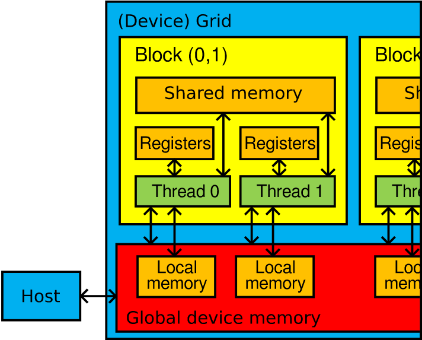
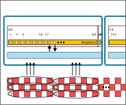
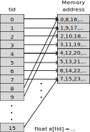
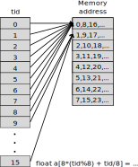
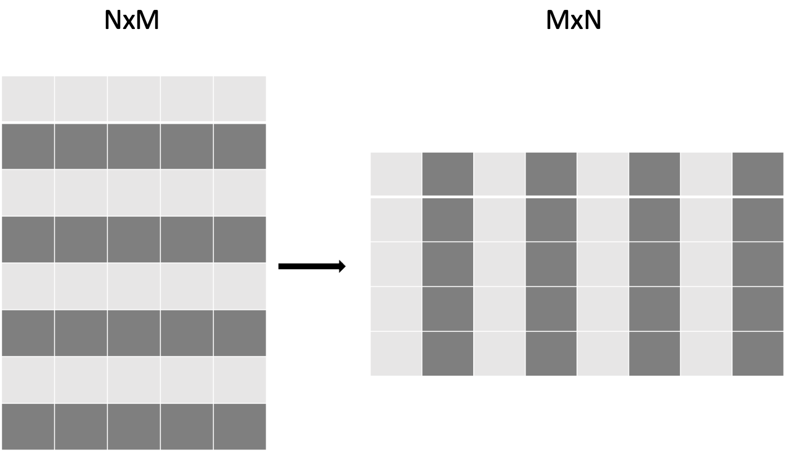

# Kernel optimisation strategies

1. Use existing libraries
2. Minimise host-device data transfers
3. Minimise device memory-compute unit data transfers
4. Optimise for coalesced memory access
5. Avoid branching within warp
6. Minimise number of active local variables 

# 1. Libraries (I)

::: notes

- Before you optimize, use libraries

:::

| NVIDIA   | HIP       | ROCm       | Description                                                                         |
| -------- | --------- | ---------- | ----------------------------------------------------------------------------------- |
| cuBLAS   | hipBLAS   | rocBLAS    | Basic Linear Algebra Subroutines                                                    |
| cuFFT    | hipFFT    | rocfft     | Fast fourier Transform Library                                                      |
| cuSPARSE | hipSPARSE | rocSPARSE  | Sparse BLAS + SMV                                                                   |
| cuSOLVER | hipSOLVER | rocSOLVER  | Lapack library                                                                      |
| AMG-X    |           | rocALUTION | Sparse iterative solvers and preconditioners with Geometric and Algebraic MultiGrid |
| Thrust   |           | rocThrust  | C++ parallel algorithms library                                                     |


# Libraries (II)

| NVIDIA | HIP     | ROCm    | Description                                                                   |
| ------ | ------- | ------- | ----------------------------------------------------------------------------- |
| CUB    | hipCUB  | rocPRIM | Low level Optimized Parallel Primitives                                        |
| cuDNN  |         | MIOpen  | Deep learning solver library                                                  |
| cuRAND | hipRAND | rocRAND | Random number generator library                                               |
| EIGEN  | EIGEN   | EIGEN   | C++ template library for linear algebra: matrices, vectors, numerical solvers |
| NCCL   |         | RCCL    | Communications Primitives Library based on the MPI equivalents                |

# 2. Host-device data transfers

### Peak theoretical bandwidth

| Link | Host-device | Device memory | 
|------|------------:|--------------:|
| LUMI-G MI250x | 36 GB/s | 1600 GB/s|
| PCIE4.0 x16 | $\sim$ 32 GB/s |  |
| A100 (Mahti) |  | 2000 GB/s |

::: notes

- Don't be afraid of host-device memory copies
- But be aware of the 2-order of magnitude BW difference

:::

# 3. Device global memory access

- Matrix multiplication: temporary variable avoids K-1 global memory accesses
- Fuse kernels if applicable

::::::{.columns}
:::{.column width=49%}
```cpp
  if (x < M && y < N) {
    for(int i = 0; i < K; ++i) {
      C[y+x*M] += A[x + i*M]*B[i + y*K];
    }
  }


```
:::
:::{.column width=49%}
```cpp
  if (x < M && y < N) {
    float tmp(0); 
    for(int i = 0; i < K; ++i) {
      tmp += A[x + i*M]*B[i + y*K];
    }
    C[y+x*M] = tmp;
  }
```
:::
::::::

# 3. Device global memory access

**Device memory hierarchy**<br>
**Fastest first**

::::::{.columns}
:::{.column width=60%}
- Registers (per-thread-access)
- Shared memory (per-block-access)
- Local scratch memory (per-thread-access)
- Global memory (global access)
:::
:::{.column}
{width=100%}
:::
::::::


# 3. Device global memory access

## Device memory hierarchy

<div class="column">
::: {.fragment}
- Registers (per-thread-access)
    - Used automatically
    - $\sim$ kilobytes
    - Very fast access
:::
::: {.fragment}
- Shared memory (per-block-access)
    - User controlled with `__shared__` keyword
    - $\sim$ kilobytes
    - Fast access
:::
</div>

<div class="column">
::: {.fragment}
- Local memory (per-thread-access)
    - Used automatically if all registers are reserved
    - Local memory resides in global memory
    - Very slow access
:::
::: {.fragment}
- Global memory (per-device-access)
    - Managed by the host with HIP API
    - $\sim$ gigabytes
    - Very slow access
:::
</div>

---

## MI250x Compute Units (CU)
::::::{.columns}

:::{.column width=40%}

- 64 kiB of **local data share** (LDS) memory
- 800 *scalar registers* (**SGPR**, 12.6 kiB)
  - up to 102 per warp
- 16 kiB of L1 cache
:::

:::{.column width=59%}
{.center width=120%}
:::
::::::

- 4$\times$SIMD units, 16 threads per SIMD unit
  - 128 kiB *vector register* (**VGPR**) storage per SIMD unit $\Rightarrow$ 512 kiB register storage on CU
  - 512 4-byte registers per thread (2 kiB). 
- MI250x CU has matrix units, but they are tricky to program


::: notes
- Simplification
- Ballpark sizes for registers, LDS and cache
- MI250x GCD has 110 compute units
  - Note: Cache is per CU
  - CPU: 32 kiB L1 cache per core
- Lot of register storage
- MI250x has also matrix units but they are tricker. Need intrinsics.
- `hipcc -Rpass-analysis=kernel-resource-usage`!
:::


# 4. Optimise for coalesced memory access

- Device main memory accessed in batches of 64 or 128 bytes
- If warp requests consecutive elements, then fewer global memory accesses are needed
- Typically

  |  |  |  |
  |--|--|--|
  | stride-1 | "`double val = global_mem[tid]`" | ***fast*** 🐇 |
  | stride-64 |"`double val = global_mem[tid*8]`" | ***slow*** 🐢 |

- But access needn't be linear as long as the warp accesses consecutive elements in global memory!
  - "`double val = global_mem[permutation_of_1_to_8[tid]]`" 🐇

---

## Uncoalesced memory access

::::::{.columns}
:::{.column width="50%"}
{width="100%"}
<div align=right>
{width="3cm"}
</div>
:::
:::{.column}

* 6 read operations for 6 elements
```cpp
double val = global_array[8*tid];
```
:::
::::::


---

## Coalesced memory access

::::::{.columns}
:::{.column width="50%"}
{width="100%"} 
<div align=right>
{width="3cm"}
</div>
:::
:::{.column}
* 2 read operations for 16 elements
```cpp
double val = global_array[tid];
```
:::

::::::


---

# Local data share

- Variable defined as `__shared__` is shared within block 
- Use cases:
  - reduce overlapping global memory operations <br>$\Rightarrow$ Remember to `__syncthreads()`!
  - User controlled cache
  - Transform uncoalesced memory OPs to coalesced
- Usage:
  ```cpp
  __shared__ float buf[256];
  ```
- Divided in banks for parallel access
  - one unique memory address access per bank per cycle

---

# Local data share: banked access


::::::{.columns}
:::{.column}
- Example: <br>8 banks, 16 threads
  - Left: 2 bank conflicts per cycle,  use all LDS
  - Right: 8 conflicts per cycle, use $\frac 1 4$ of LDS

- MI250x: 32 banks of 512 dwords
:::
:::{.column}
{width=80%}
:::
:::{.columnn}
{width=23cm}
:::
::::::


# 5. Avoid branching within warp


::::::{.columns}
:::{.column width=60%}
- Both branches are executed sequentially
  - In threads where the condition is false: 
- If the branch changes only between warps, then there is no penalty
- *Note*
  - Code on right is memory bound
:::
:::{.column width=39%}
```cpp
if ( (tid%2) == 0) {
  c[tid] = b[tid]-a[tid];
} else {
  c[tid] = a[tid]-b[tid];
}
```
```cpp
bool mask = (tid%2) == 0;
c[tid] = mask*(b[tid]-a[tid]);
c[tid] += (!mask)*(a[tid]-b[tid]);
```
"Solution"
```cpp
if ( ((tid/64)%2) == 0) {
  c[tid] = b[tid]-a[tid];
} else {
  c[tid] = a[tid]-b[tid];
}
```
:::
::::::

::: notes
  - GPUs have so much computing power that executing all branches is usually fine
:::

---

## Branching across warps


::::::{.columns}
:::{.column width=49%}
*No divergence*
```cpp
if ((tid/64)%2 == 0) {
  x[tid] = f_1(double(tid), ...);
} else {
  x[tid] = f_2(double(tid), ...);
}
```
*Branch divergence*
```cpp
if(tid%2 == 0) {
  x[tid] = f_1(double(tid), ...);
} else {
  x[tid] = f_2(double(tid), ...);
}
```
:::
:::{.column width=49%}
 
 Table: Effect of branching

  | Branching | time (µs) |
  |-----------|-----:|
  | *No divergence* | 970 |
  | *Branch divergence* | 1900|
  | *single branch* | 1000 |

- `f_1` and `f_2` are sufficiently complicated $\Rightarrow$ *not* memory-bound

:::
::::::

::: notes
- Exercise: Find out how complicated `f_1` and `f_2` need to be that branch divergence is an issue
:::

# 6. Minimise number of active local variables 

- Local variables are stored in registers
  - MI250x 128 kiB per SIMD-unit
- What happens if there is not enough registers? 
  - Variables are "spilled" to local memory on slow global device memory
- Might happen if the kernel is very complicated
  - Solution: reduce *occupancy*.

# Example: Using local shared memory in matrix transpose{.section}

# Matrix transpose

- Naive: Either reads or writes are uncoalesced

{.center width=60%}

# Copy operation as base

```cpp
__global__ void copy_kernel(float *in, float *out, int width, int height) {
  int x_index = blockIdx.x * tile_dim + threadIdx.x;
  int y_index = blockIdx.y * tile_dim + threadIdx.y;

  int index = y_index * width + x_index;

  out[index] = in[index];
}
```

```cpp
  int block_x = width / tile_dim;
  int block_y = height / tile_dim;
   hipLaunchKernelGGL(copy_kernel, dim3(block_x, block_y),
                      dim3(tile_dim, tile_dim), 0, 0, d_in, d_out, width,
                      height);
   hipDeviceSynchronize();
```
The duration is `0.174 ms`  and the effective bandwidth `717 GB/s`

# Matrix transpose naive

```cpp
__global__ void transpose_kernel(float *in, float *out, int width, int height) {
  int x_index = blockIdx.x * tile_dim + threadIdx.x;
  int y_index = blockIdx.y * tile_dim + threadIdx.y;

  int in_index = y_index * width + x_index;
  int out_index = x_index * height + y_index;

  out[out_index] = in[in_index];
}
```


The duration is `0.401 ms`  and the effective bandwidth `311 GB/s`


# Matrix transpose with shared memory

<small>
```cpp
__global__ void transpose_lds_kernel(float *in, float *out, int width,
                                     int height) {
  __shared__ float tile[tile_dim][tile_dim];

  int x_tile_index = blockIdx.x * tile_dim;
  int y_tile_index = blockIdx.y * tile_dim;

  int in_index =
      (y_tile_index + threadIdx.y) * width + (x_tile_index + threadIdx.x);
  int out_index =
      (x_tile_index + threadIdx.y) * height + (y_tile_index + threadIdx.x);

  tile[threadIdx.y][threadIdx.x] = in[in_index];

  __syncthreads();

  out[out_index] = tile[threadIdx.x][threadIdx.y];
}
```
</small>

The duration is `0.185 ms`  and the effective bandwidth `674 GB/s`


# Extra: Matrix transpose with shared memory without bank conflicts

<small>
```cpp
__global__ void transpose_lds_kernel(float *in, float *out, int width,
                                     int height) {
  __shared__ float tile[tile_dim][tile_dim+1];

  int x_tile_index = blockIdx.x * tile_dim;
  int y_tile_index = blockIdx.y * tile_dim;

  int in_index =
      (y_tile_index + threadIdx.y) * width + (x_tile_index + threadIdx.x);
  int out_index =
      (x_tile_index + threadIdx.y) * height + (y_tile_index + threadIdx.x);

  tile[threadIdx.y][threadIdx.x] = in[in_index];

  __syncthreads();

  out[out_index] = tile[threadIdx.x][threadIdx.y];
}
```
</small>

The duration is `0.179 ms`  and the effective bandwidth `697 GB/s`

:::{.notes}
- Timings on puhti NVidia V100
:::

# Other examples where shared memory is critical 

- Matrix-matrix/vector multiplication
 
  :::{.fragment}
  - Same elements are loaded in different threads
  :::
- N-body problem
 
  :::{.fragment}
  - One thread evolves one body: each thread loads all data of each other body as well
  :::
- Reductions
 
  :::{.fragment}
  - Cooperation between threads
  :::

# Summary

- Specialised libraries are highly optimised
  - Especially dense linear algebra (hipBLAS/cuBLAS) and FFTs.
- Host-Device vs Device-Compute Unit bandwidth difference is 2 orders of magnitude
- Keep data in registers 
  - But there are a finite amount of registers!
- Neighbouring threads access neighbouring memory locations
  - Memory operations are coalesced
- Local data share: a shared variable inside a block
- Branching in warp: execute both branches
