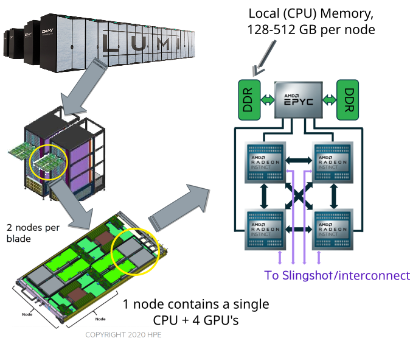
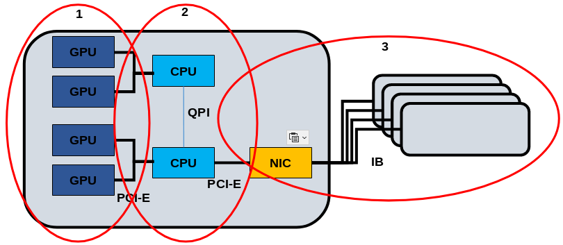
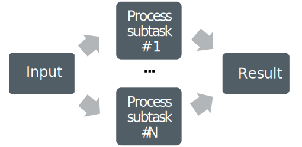

# Running on HPC Systems

 <div class="column" width=60%>

* supercomputer are a collection of thousands of nodes
* currently there are  2 to 8 GPUs per node
* more GPU resources per node, better per-node-performance 
 
</div>

 <div class="column" width=40%>
    {.center width=200%}
    <small>Lumi - Pre-exascale system in Finland</small>
 </div>


# Three Levels of Parallelism

1. GPU - GPU threads on the CUs: HIP
2. Node - Multiple GPUs and CPUs: MPI, OpenMP
3. Supercomputer - Many nodes connected with interconnect: MPI 

{.center width=60% }

# Computing in Parallel

- parallel computing
    - a problem is split into smaller subtasks
    - multiple subtasks are processed simultaneously using multiple GPUs

<!-- Copyright CSC -->
 {.center width=40%}

# Parallel Programming Models

<!-- Copyright CSC -->
 {.center width=80%}
<div class=column>
**MPI: Processes**

- independent execution units
- MPI launches N processes at application startup
- works over multiple nodes
- data exchange via messages
</div>
<div class=column>

**OpenMP: Threads**

- threads share memory space
- threads are created and destroyed  (parallel regions)
- limited to a single node
- directive based

</div>

# GPU Context

* a context is established implicitly on the current device when the first HIP function requiring an active context is evaluated 
* several processes can create contexts for a single device
    * the device resources are allocated per context
* by default, one context per device per process in HIP
    * (CPU) threads of the same process share the primary context (for each device)
* HIP supports explicit context management 

::: notes
A GPU context is an execution environment that manages resources such as memory allocations, streams, and kernel execution for a specific GPU. It acts as an interface between the application and the GPU, ensuring that operations like memory management and kernel launches are handled correctly.
:::

# Device Selection and Management


<div class="column"  style="width:99%;">
 - return the number of gpu devices
 - `hipGetDeviceCount(&c);`, `count=omp_get_device_num();`,  `gpu_devices= device::get_devices(info::device_type::gpu);`
 - set the current device (ids from 0)
 - `hipSetDevice(i)`
 - return the current device 
 - `hipGetDevice(&i);`
 - reset current device resources 
 - `hipDeviceReset();`
</div>


# Querying Device Properties

* one can query the properties of different devices in the system using
  `hipGetDeviceProperties()` function
    * no context needed
    * provides e.g. name, amount of memory, warp size, support for unified
      virtual addressing, etc.
    * useful for code portability

Return the properties of a HIP capable device by `prop`
```
hipError_t hipGetDeviceProperties(struct hipDeviceProp *prop, int device)
```


# Multi-GPU Programming Models

<div class="column">
* one GPU per process
    * syncing is handled through message passing (e.g. MPI)
* many GPUs per process
    * process manages all context switching and syncing explicitly
* one GPU per thread
    * syncing is handled through thread synchronization requirements
</div>

<div class="column">
{width=50%}
{width=50%}
{width=50%}
</div>

# One GPU per Process

* recommended for multi-process applications using MPI
* message passing library takes care of all GPU-GPU communication
* each process interacts with only one GPU which makes the implementation
  easier and less invasive (if MPI is used anyway)
    * apart from each process selecting a different device, the implementation
      looks much like a single-GPU program
    * easy manage device selection using environment variables `ROC_VISIBLE_DEVICES` or `CUDA_VISIBLE_DEVICES`


# Many GPUs per Process

* process switches the active GPU using `hipSetDevice()` function 
* after selecting the default device, operations such as the following are effective only
  on the selected GPU:
    * memory operations
    * kernel execution
    * streams and events
* asynchronous function calls are required to overlap work

# Many GPUs per Process: Code Example

```cpp
// Launch kernels
for(unsigned n = 0; n < num_devices; n++) {
  hipSetDevice(n);
  kernel<<<blocks[n],threads[n], 0, stream[n]>>>(arg1[n], arg2[n], size[n]);
}
//Synchronize all kernels with host
for(unsigned n = 0; n < num_devices; n++) {
  hipSetDevice(n);
  hipStreamSynchronize(stream[n]);
}
```

# Many GPUs per Process, One GPU per Thread

* one GPU per CPU thread
    * e.g. one OpenMP CPU thread per GPU being used
* HIP is threadsafe
    * multiple threads can call the functions at the same time
* each thread can create its own context on a different GPU
    * `hipSetDevice()` sets the device and create a context per thread
    * easy device management with no changing of device
* from the point of view of a single thread, the implementation closer to a single-GPU case
* communication between threads still not trivial


# Many GPUs per Process, One GPU per Thread: Code Example

```cpp
// Launch and synchronize kernels from parallel CPU threads using HIP
#pragma omp parallel num_threads(num_devices)
{
  unsigned n = omp_get_thread_num();
  hipSetDevice(n);
  kernel<<<blocks[n],threads[n], 0, stream[n]>>>(arg1[n], arg2[n], size[n]);
  hipStreamSynchronize(stream[n]);
}
```

# Direct Peer to Peer Access

* access peer GPU memory directly from another GPU
    * pass a pointer to data on GPU 1 to a kernel running on GPU 0
    * transfer data between GPUs without going through host memory
    * lower latency, higher bandwidth

```cpp
// Check peer accessibility
hipError_t hipDeviceCanAccessPeer(int* canAccessPeer, int device, int peerDevice)

// Enable peer access
hipError_t hipDeviceEnablePeerAccess(int peerDevice, unsigned int flags)

// Disable peer access
hipError_t hipDeviceDisablePeerAccess(int peerDevice)
```
* between AMD GPUs, the peer access is always enabled (if supported)

# Peer to Peer Communication

* devices have separate memories
* with devices supporting unified virtual addressing, `hipMemCpy()` with
  `kind=hipMemcpyDefault`, works:
```cpp
hipError_t hipMemcpy(void* dst, void* src, size_t count, hipMemcpyKind kind)
```
* other option which does not require unified virtual addressing
```cpp
hipError_t hipMemcpyPeer(void* dst, int  dstDev, void* src, int srcDev, size_t count)
```
* falls back to a normal copy through host memory when direct peer to peer access is not available


# Compiling MPI+HIP Code


* trying to compile code with any HIP calls with other than the `hipcc`
  compiler can result in errors
* either set MPI compiler to use `hipcc`, eg for OpenMPI:
```bash
OMPI_CXXFLAGS='' OMPI_CXX='hipcc'
```
* or separate HIP and MPI code in different compilation units compiled with
  `mpicxx` and `hipcc`
    * Link object files in a separate step using `mpicxx` or `hipcc`
* **on LUMI, `cc` and `CC` wrappers know about both MPI and HIP**

# Selecting the Correct GPU

* typically all processes on the node can access all GPUs of that node
* implementation for using 1 GPU per 1 MPI process

```cpp
int deviceCount, nodeRank;
MPI_Comm commNode;
MPI_Comm_split_type(MPI_COMM_WORLD, MPI_COMM_TYPE_SHARED, 0, MPI_INFO_NULL, &commNode);
MPI_Comm_rank(commNode, &nodeRank);
hipGetDeviceCount(&deviceCount);
hipSetDevice(nodeRank % deviceCount);
```
::: notes
* Can be done from slurm using `ROCR_VISIBLE_DEVICES` or `CUDA_VISIBLE_DEVICES`
:::

# GPU-GPU Communication through MPI

* CUDA/ROCm aware MPI libraries support direct GPU-GPU transfers
    * can take a pointer to device buffer (avoids host/device data copies)
* currently no GPU support for custom MPI datatypes (must use a
  datatype representing a contiguous block of memory)
    * data packing/unpacking must be implemented application-side on GPU
* on LUMI, enable on runtime by `export MPICH_GPU_SUPPORT_ENABLED=1`
* having a fallback for pinned host staging buffers is a good idea.

# Summary

- there are various options to write a multi-GPU program
- use `hipSetDevice()` to select the device, and the subsequent HIP calls
  operate on that device
- often best to use one GPU per process, and let MPI handle data transfers between GPUs 
- GPU-aware MPI is required when passing device pointers to MPI

     * Using host pointers does not require any GPU awareness

- on LUMI GPU binding is important
  
# Outline

* GPU context
* Device management
* Programming models
* HIP/OpenMP + MPI
* Peer to peer (GPU-GPU) access


# Introduction

* Workstations or supercomputer nodes can be equipped with several GPUs
    * For the current supercomputers, the number of GPUs per node usually
      ranges between 2 and 8
    * Allows sharing (and saving) resources (disks, power units, etc.)
    * More GPU resources per node, better per-node-performance


# GPU Context

* A context is established implicitly on the current device when the first task requiring an active context is evaluated (HIP and OpenMP)
* Several processes can create contexts for a single device
    * The device resources are allocated per context
* By default, one context per device per process in HIP
    * Threads of the same process share the primary context (for each device)
* HIP supports explicit context management whereas OpenMP does not

# Selecting device

* Driver associates a number for each available GPU device starting from 0
* The functions `hipSetDevice()` and `omp_set_default_device()` are used for selecting the desired device for HIP and OpenMP, respectively
  * Furthermore, in OpenMP, the `device()`-directive can be used to offload targets to specific devices without changing the default device


# Device management

```cpp
// HIP
hipError_t hipGetDeviceCount(int *count)
hipError_t hipSetDevice(int device)
hipError_t hipGetDevice(int *device)

// OpenMP
int omp_get_num_devices(void)
void omp_set_default_device(int device)
int omp_get_default_device(void)
```

* Demos: `device_management_hip.cpp`, `device_management_omp.cpp`


# Querying or verifying device properties

* One can query or verify the properties of different devices in the system
    * Properties include name, amount of memory, warp size, support for unified virtual addressing, etc.
    * Useful for code portability

In HIP, the function returns the device properties in struct `prop`
```cpp
// HIP - get device properties as struct
hipError_t hipGetDeviceProperties(struct hipDeviceProp *prop, int device)

// OpenMP - use `requires` clause to verify the device properties, e.g.
#pragma omp requires unified_shared_memory
```

* Demo: `device_properties_hip.cpp`


# Multi-GPU programming models

<div class="column">
* One GPU per process (I)
    * Syncing is handled through message passing (e.g. MPI)
* Many GPUs per process (II)
    * Process manages all context switching and syncing explicitly
* One GPU per thread (III)
    * Syncing is handled through thread synchronization requirements
</div>

<div class="column">
{width=50%}
{width=50%}
{width=50%}
</div>


# One GPU per process with MPI{.section}

# One GPU per process

* Recommended for multi-process applications using MPI
* Message passing library takes care of all GPU-GPU communication
* Each process interacts with only one GPU which makes the implementation
  easier and less invasive (if MPI is used anyway)
    * Apart from each process selecting a different device, the implementation
      looks much like a single-GPU program

# Compiling MPI+HIP/OpenMP code

* Compiling HIP/OpenMP and MPI calls in the same compilation unit may not always be trivial
  * On LUMI, `CC` compiler wrapper takes care of this
* One can set MPI compiler to use `hipcc` or the desirable OpenMP compiler like `nvc`, e.g. for OpenMPI:
  ```bash
  OMPI_CXXFLAGS='' OMPI_CXX='hipcc'  # hip
  OMPI_CXXFLAGS='' OMPI_CXX='nvc -mp=gpu -gpu=cc80'  # nvc
  ```
* Alternatively, one could separate HIP/OpenMP and MPI code in different compilation units compiled with `mpicxx` and `hipcc`/`nvc`
    * Link object files in a separate step using `mpicxx` or `hipcc`/`nvc`


# MPI+HIP strategies

1. One MPI process per node
2. **One MPI process per GPU**
3. Many MPI processes per GPU, only one uses it
4. **Many MPI processes sharing a GPU**

* 2 is recommended (also allows using 4)
    * Typically results in most productive and least invasive implementation
      for an MPI program
    * No need to implement GPU-GPU transfers explicitly (MPI handles all
      this)
    * It is further possible to utilize remaining CPU cores with OpenMP (but
      this is not always worth the effort/increased complexity)


# Selecting the correct GPU

* Typically, all processes on the node can access all GPUs of that node
* The following implementation allows utilizing all GPUs using one or more
  processes per GPU
    * On Nvidia systems, use CUDA MPS when launching more processes than GPUs
<p>
* Demo: `device_management_mpi_hip.cpp`


# GPU-GPU communication through MPI

* GPU-aware (CUDA/ROCm aware) MPI libraries support direct GPU-GPU transfers
    * Can take a pointer to device buffer (avoids host/device data copies)
* Unfortunately, currently no GPU support for custom MPI data types (must use a
  datatype representing a contiguous block of memory)
    * Data packing/unpacking must be implemented application-side on GPU
* On LUMI, enable on runtime by `export MPICH_GPU_SUPPORT_ENABLED=1`


# MPI communication with GPU-aware MPI

* With MPI+HIP, one can simply pass a device pointer to GPU-aware MPI
   * In OpenMP this can be achieved using `use_device_ptr` clause
<p>
* Demos: `mpi_send_and_recv_hip.cpp`, `mpi_send_and_recv_omp.cpp`


# Many GPUs per process{.section}

# Many GPUs per process

* Process switches the active GPU using `hipSetDevice()` (HIP) or `omp_set_default_device()` (OpenMP) functions 
   * OpenMP has also `device()`-directive to offload work to a specific device
* After selecting the default device, operations such as the following are effective only
  on the selected GPU:
    * Memory operations
    * Kernel execution
    * Streams and events (HIP)
* Asynchronous function calls (HIP) or `nowait` clause (OpenMP) are required to overlap work


# Many GPUs per process, code example

<small>

* HIP example
```cpp
// Launch kernels (HIP)
for(unsigned n = 0; n < num_devices; n++) {
  hipSetDevice(n);
  kernel<<<blocks[n],threads[n], 0, stream[n]>>>(arg1[n], arg2[n], size[n]);
}
//Synchronize all kernels with host (HIP)
for(unsigned n = 0; n < num_devices; n++) {
  hipSetDevice(n);
  hipStreamSynchronize(stream[n]);
}
```
* OpenMP example
```cpp
// Launch kernels (OpenMP)
for(int n = 0; n < num_devices; n++) {
  omp_set_default_device(n);
  #pragma omp target teams distribute parallel for nowait
  for (unsigned i = 0; i < size[n]; i++)
    // Do something
}
#pragma omp taskwait //Synchronize all kernels with host (OpenMP)
```
</small>

# One GPU per thread{.section}

# One GPU per thread

* One GPU per CPU thread
    * E.g. one OpenMP CPU thread per GPU being used
* HIP and OpenMP APIs are threadsafe
    * Multiple threads can call the functions at the same time
* Each thread can create its own context on a different GPU
    * `hipSetDevice()` (HIP) or `device()`-directive (OpenMP) determine the device and create a context per thread
* From the point of view of a single thread, the implementation closer to a single-GPU case
* Communication between threads still not trivial


# One GPU per thread, code example

<small>

* HIP example
```cpp
// Launch and synchronize kernels from parallel CPU threads using HIP
#pragma omp parallel num_threads(num_devices)
{
  unsigned n = omp_get_thread_num();
  hipSetDevice(n);
  kernel<<<blocks[n],threads[n], 0, stream[n]>>>(arg1[n], arg2[n], size[n]);
  hipStreamSynchronize(stream[n]);
}
```
* OpenMP example
```cpp
// Launch and synchronize kernels from parallel CPU threads using OpenMP
#pragma omp parallel num_threads(num_devices)
{
  unsigned n = omp_get_thread_num();
  #pragma omp target teams distribute parallel for device(n)
  for (unsigned i = 0; i < size[n]; i++)
    // Do something
}
```
</small>


# Direct peer to peer access {.section}

# Direct peer to peer access (HIP)

* Access peer GPU memory directly from another GPU
    * Pass a pointer to data on GPU 1 to a kernel running on GPU 0
    * Transfer data between GPUs without going through host memory
    * Lower latency, higher bandwidth

```cpp
// Check peer accessibility
hipError_t hipDeviceCanAccessPeer(int* canAccessPeer, int device, int peerDevice)

// Enable peer access
hipError_t hipDeviceEnablePeerAccess(int peerDevice, unsigned int flags)

// Disable peer access
hipError_t hipDeviceDisablePeerAccess(int peerDevice)
```
* Between AMD GPUs, the peer access is always enabled (if supported)


# Peer to peer communication

* Devices have separate memories
* Memcopies between different devices can be done as follows:

```cpp
// HIP: First option that requires unified virtual addressing (use "hipMemcpyDefault" for "kind")
hipError_t hipMemcpy(void* dst, void* src, size_t size, hipMemcpyKind kind=hipMemcpyDefault)

// HIP: Second option does not require unified virtual addressing
hipError_t hipMemcpyPeer(void* dst, int  dstDev, void* src, int srcDev, size_t size)

// OpenMP
int omp_target_memcpy(void *dst, const void *src, size_t size, size_t dstOffset,
                      size_t srcOffset, int dstDev, int dstDev)
```

* If direct peer to peer access is not available or implemented, the functions should fall back to a normal copy through host memory


# Summary {.section}

# Three levels of parallelism

<div class="column">
1. GPU: GPU threads
    * Parallelization strategy: HIP, OpenMP, SYCL, Kokkos, OpenCL
2. Node: Multiple GPUs and CPUs
    * Parallelization strategy: MPI, Threads, OpenMP
3. Supercomputer: Many nodes connected with interconnect
    * Parallelization strategy: MPI between nodes
</div>

<div class="column">
{width=99%}
</div>


# Summary

- There are many ways to write a multi-GPU program
- Use `hipSetDevice()` (HIP) or `omp_set_default_device()` (OpenMP) to choose the default device
   * In OpenMP, `device()`-directive can also be used to select the target device
* If you have an MPI program, it is often best to use one GPU per process, and
  let MPI handle data transfers between GPUs
* GPU-aware MPI is required when passing device pointers to MPI
  * Using host pointers does not require any GPU awareness
