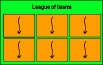
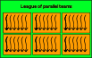
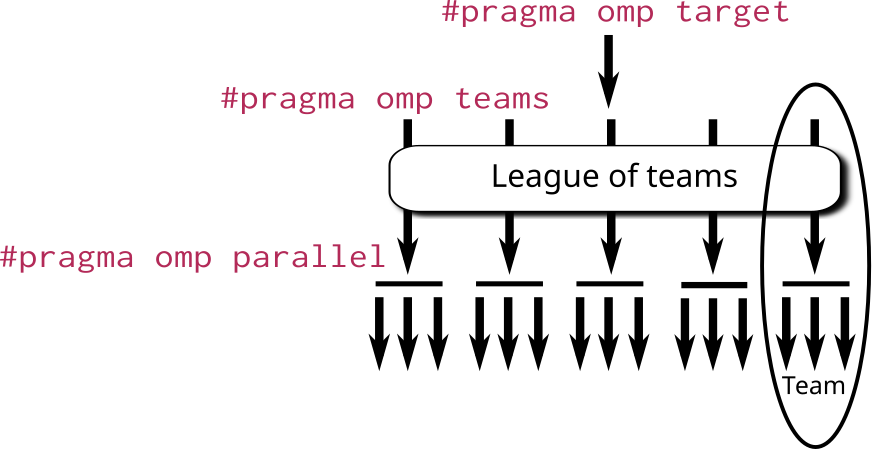

# OpenMP offloading {.section}

# What is OpenMP offloading ?

- Set of OpenMP constructs for heterogeneous systems
  - e.g. CPU+GPU
- Code regions are offloaded from the host (CPU) to be 
  computed on a device (GPU)

# OpenMP execution model vs HIP/CUDA

:::::: {.columns}
:::{.column}
HIP
<small>
```cpp
__global__ void add(float* a, float* b, size_t N) {
  size_t tid = blockDim.x*blockId.x + threadId.x;
  if(tid > N) { 
    a[tid] *= 1.25; 
    a[tid] += b[tid];
  }
}

int main() {
  // Host side definitions and computations ...
  for (size_t k = 0; k < N; ++k) {
    a[k] = k;
    b[k] = k/2.0;
  }

  // Device allocations for d_a, d_b ...
  hipMemcpy(d_a, a, N_bytes, hipMemcpyDefault);
  hipMemcpy(d_b, b, N_bytes, hipMemcpyDefault);
  add<<<griddim, blockdim>>(d_a,d_b)
  hipMemcpy(a, d_a, N_bytes, hipMemcpyDefault);
  // added value is in a
}
```
</small>
:::
:::{.column}
OpenMP offload
<small>

```cpp
int main() {

size_t N = 100;
float* a = (float*)malloc(N*sizeof(float));
float* b = (float*)malloc(N*sizeof(float));

// Host side computations
for (size_t k = 0; k < N; ++k) {
  a[k] = k;
  b[k] = k/2.0;
}

#pragma omp target data map(tofrom:a[:N]) map(to:b[:N])
#pragma omp target teams distribute parallel for
for(size_t k = 0; k<N; ++k) {
  a[k] = a[k]*1.25;
  a[k] += b[k];
}
// added value is in a
}
```

</small>
:::
::::::

# Target construct

- OpenMP *`target`* construct specifies a region to be executed on GPU
    - initially, runs with a single thread
- By default, execution in the host continues only after target region
  is finished
- May trigger implicit data movements between the host and the device

<div class=column>
```c++
#pragma omp target
{
  // code executed in device
}
```
</div>

<div class=column>
```fortranfree
!$omp target
  ! code executed in device
!$omp end target
```
</div>

# Teams construct

::::::{.columns}
:::{.column width=70%}
- Target construct does not create any parallelism, so additional
  constructs are needed
- *`omp target teams`* creates a league of teams
    - Number of teams is implementation dependent (*might be large!*)
    - initially, a single thread in each team executes the following
      structured block

:::
:::{.column}

{width=90%}

```cpp
#pragma omp target 
#pragma omp teams
{
// Not enough parallelism!
// Only one thread per team!
}
```

:::
::::::

# Teams parallel construct

::::::{.columns}
:::{.column width=70%}
- Create threads within teams with *`parallel`* construct:
- *`omp target teams parallel`*
- Comparing HIP/CUDA:<br><br>

  | OMP | HIP |
  | --- | --- | 
  | League of teams | Grid |
  | Team | Block |
  | Thread in team | thread in block |

:::
:::{.column}

{width=90%}

```cpp
#pragma omp target 
#pragma omp teams 
#pragma omp parallel
{
// Many threads execute 
// this code block!
}
```
:::
::::::

# League of multi-threaded teams

{.center width=80%}

# Mimicking HIP/CUDA with OpenMP offloading

```cpp
#pragma omp target
#pragma omp teams
#pragma omp parallel
{
  const int tid = omp_get_team_num() * omp_get_num_threads() + omp_get_thread_num();
  const int stride = omp_get_num_teams()*omp_get_num_threads();

  for (size_t k = tid; k<N; k += stride) 
    c[k] = a[k] + b[k];
}
```
```cpp
__global__ void sum_vecs(float* a, float* b, float* c, size_t n) {
    const size_t tid = threadIdx.x + blockIdx.x * blockDim.x;
    const size_t stride = blockDim.x * gridDim.x;

    for (size_t k = tid; k < n; k += stride) 
      c[k] = a[k] +  b[k];
}
```

# Worksharing in the accelerator

- *`teams`* and *`parallel`* constructs create threads, however, all the
  threads are still executing the same code
- *`distribute`* construct distributes loop iterations over the teams
- *`for`* / *`do`* construct can also be used within a parallel region

# Worksharing syntax

<div class=column>
C
```c++
#pragma omp target
#pragma omp teams
#pragma omp distribute
for (int i = 0; i < N; i++)
  #pragma omp parallel
  #pragma omp for
  for (int j = 0; j < M; j++) {
    ...
  }
```
</div>

<div class=column>
Fortran
```fortranfree
!$omp target
!$omp teams
!$omp distribute
do i = 1, N
  !$omp parallel
  !$omp do
  do j = 1, N
    ...
  end do
  !$omp end do
  !$omp end parallel
end do
!$omp end distribute
!$omp end teams
!$omp end target
```
</div>

# Composite directives

::: incremental
- In many cases composite directives are more convenient
    - possible to parallelize also single loop over both teams and threads

  ::::::{.columns}
  :::{.column}

  ```c++
  #pragma omp target teams
  #pragma omp distribute parallel for
  for (int i = 0; i < N; i++) {
    p[i] = v1[i] * v2[i]
  }
  ```

  :::
  :::{.column}

  ```fortranfree
  !$omp target teams
  !$omp distribute parallel do
  do i = 1, N
    p(i) = v1(i) * v2(i)
  end do
  !$omp end distribute parallel do
  !$omp end target teams
  ```

  :::
  ::::::

- or even further
  ```cpp
  #pragma omp target teams distribute parallel for
  for (size_t k = 0; k<N; ++k)
    c[k] = a[k] + b[k];
  ```
:::

# OpenMP data model in offloading: *`map`* clause

::: incremental
- Host variables are mirrored on device, but dynamically allocated data is *not*.
- Data is moved to/from host with `map` clause: 
  - *`target ... map(...)`* Mapping is valid within following scope device code.
  - *`target data map(...)`* Mapping is valid inside scoped region. Scoped region may contain host code.
  - *`target enter/exit data map(...)`* Mapping is valid after/before statement
- Device allocations/deallocations with map clause directives (target 
  - *`map(alloc/delete:...)`*
:::

# `map(to/from/tofrom)`

- Assume that *`data_array`* is a host allocated array of size *`N`*.
 
| Action | Syntax |
|--|--|
| Copy *`data_array`* to device at start of scope |  *`map(to:data_array[:N])`*|
| Copy *`data_array`* to host after scope | *`map(from: data_array[:N])`*|
| Copy *`data_array`* to device and after scope back to host | *`map(tofrom: data_array[:N])`*|

- *`to/from/tofrom`* makes device allocation automatically if needed

# `map(to/from/tofrom)` -- Example

```cpp
  double* array_a = (double*) malloc(sizeof(double)*N);
  double* array_b = (double*) malloc(sizeof(double)*N);
  double* array_c = (double*) malloc(sizeof(double)*N);
  
  #pragma omp target map(tofrom: array_c[:N]) map(from: array_a[:N], array_b[:N])
  {
  // device code
  #pragma omp teams distribute parallel for
  for (...) 
  ...
  }
```

---

# `target data` and `target enter/exit data`

- *`target data`* and *`target enter/exit data`* do not create scopes where device code is executed
- *`target data`* creates mapping region within the following scope
- *`target enter data map(...)`* create mapping with host data.
  - *Standalone*: no effect of following scope
- *`target exit data map(...)`* unmap data (*`map(from/delete...)`*)
  - *Standalone*
- update data with host: *`target update map(to/from:...)`*

---

# `target data` example
```cpp
#pragma omp target data map(to: b[:N]) map(from:c[:N]) map(tofrom: a[:N])
{
  #pragma omp target teams distribute parallel for
  for (size_t k = 0; k<N; ++k) c[k] = a[k] + b[k]; // Device code

  #pragma omp target update from(a[:N])  // Copy device data to host

  for (size_t k = 0; k<N; ++k) a[k] /= 2.0; // Host code

  #pragma omp target update to(a[:N]) // Copy host data to device

  #pragma omp target teams distribute parallel for
  for (size_t k = 0; k<N; ++k) c[k] *= a[k]; // Device code
}
```

# `target enter/exit data` example
```cpp
#pragma omp target enter data map(to: b[:N], a[:N]) 

#pragma omp target teams distribute parallel for
for (size_t k = 0; k<N; ++k) c[k] = a[k] + b[k]; // Device code

#pragma omp target update from(a[:N])  // Copy device data to host

for (size_t k = 0; k<N; ++k) a[k] /= 2.0; // Host code

#pragma omp target update to(a[:N]) // Copy host data to device

#pragma omp target teams distribute parallel for
for (size_t k = 0; k<N; ++k) c[k] *= a[k]; // Device code

#pragma omp target exit data map(from:c[:N]) map(tofrom: a[:N])
```

# Useful runtime API functions

Function definitions are in header file `omp.h` (C/C++) or `omp_lib` (fortran)
<br>  <br>
<small>

| Description | function name |
|---|---|
| query the number of devices in the system | `int omp_get_num_devices()`|
| select the device to use | `omp_set_default_device(int)`|
| get id of default device | `int omp_get_default_device()`|
| get device pointer | `omp_get_mapped_ptr(void* host_ptr, int device_num)` |
| return true if called from host | `omp_is_initial_device()` |
| number of devices available | `omp_get_num_devices()`
| number of device where the function is called | `omp_get_device_num()` |
  

</small>

# Device pointer

::: incremental
- If *`d_a`* is already a device pointer we can instruct OpenMP by
  ```cpp
  #pragma omp target ... is_device_ptr(d_a) 
  ```
- If host pointer *`a`* has been mapped to device with `enter
data`, we can get corresponding device address by
  ```cpp
  double* d_a = omp_get_mapped_ptr(a, omp_get_default_device())
  ```
  - Now *`d_a`* can be passed to a HIP kernel for example.
:::

# Controlling number of teams and threads

- By default, the number of teams and the number of threads is up to
  the implementation to decide
- `num_teams` clause for `teams` construct and `num_threads` clause
  for `parallel` construct can be used to specify number of teams and
  threads
    - may improve performance in some cases
    - performance is most likely not portable

```c++
#pragma omp target
#pragma omp teams num_teams(32)
#pragma omp parallel num_threads(128)
{
  // code executed in device
}
```

# Compiling an OpenMP program for GPU offloading: LUMI-G

On LUMI compiling OpenMP offload is enabled with

Modules: 
```bash
module load LUMI/24.03 partition/G PrgEnv-cray
```

::::::{.columns}
:::{.column}
C/C++
```
CC -fopenmp code.cpp -o code
```
:::
:::{.column}
Fortran
```
ftn -fopenmp code.f90 -o code
```
:::
::::::

- Note: Compiling HIP and OpenMP offload code in same source unit is not supported (at least on LUMI).

# Compiling an OpenMP program for GPU offloading: Mahti

On Mahti compiling OpenMP offload is enabled with

Modules:
```bash
module load .unsupported
module load nvhpc/22.3
```

::::::{.columns}
:::{.column}
C/C++
```
c++: nvc++ -mp=gpu code.cpp -gpu=cc80
c: nvcc -mp=gpu code.c -gpu=cc80
```
:::
:::{.column}
Fortran
```
nvfortran -mp=gpu code.f90 -gpu=cc80
```
:::
::::::

# OpenMP internal control variables

- OpenMP has internal control variables (ICV)
- Values are always re-read before a kernel is launched and can be
  different for different kernels

<small>

| Variable             | Description                                                   |
| ------------------------ | ----------------------------------------------------------------- |
| `OMP_DEFAULT_DEVICE`     | Sets default target device (0 = first device) |
| `OMP_TARGET_OFFLOAD`     | Controls offload behavior: `MANDATORY`, `DISABLED`, or `DEFAULT` |
| `OMP_NUM_TEAMS`          | Suggests the number of teams to create         |
| `OMP_TEAMS_THREAD_LIMIT` | Limits number of threads per team                |

</small>


# Loop construct

- In OpenMP 5.0 a new `loop` worksharing construct was introduced
- Leaves more freedom to the implementation to do the work division
    - tells the compiler/runtime only that the loop iterations are
      independent and can be executed in parallel

<div class=column>
```c++
#pragma omp target
#pragma omp loop
for (int i = 0; i < N; i++) {
  p[i] = v1[i] * v2[i]
}
```
</div>

<div class=column>
```fortranfree
!$omp target
!$omp loop
do i = 1, N
  p(i) = v1(i) * v2(i)
end do
!$omp end loop
!$omp end target
```
</div>


# Compiler diagnostics {.section}

# Compiler diagnostics

- Compiler diagnostics is usually the first thing to check when starting
  to work with OpenMP, as it can tell you
    - what operations were actually performed
    - what kind of data copies that were made
    - if and how the loops were parallelized
- Diagnostics are very compiler dependent
    - compiler flags
    - level and formatting of information

# CRAY compiler

- Different behaviour and flags between C/C++ and Fortran compilers
- Optimization messages: compiler descibres optimizations in a `.lst` file 
- Save temporaries (advanced): saves assembly files (`.s`) and others
  - Offloading code: look for `*openmppost-llc.s` files

<div align="center">

|Diagnostics|`cc`|`ftn`|
|-----------|----|-----|
|Optimization messages |`-fsave-loopmark`| `-hmsgs`, `-hlist=m`|
|Save temporaries |`-save-temps`|`-hkeepfiles`|

</div>

# CRAY compiler - Fortran

```bash
> ftn -hmsgs -hlist=m -fopenmp sum.F90
```

- Provides full support and nice Diagnostics in file `*.lst`
- Example:
```bash
ftn-6405 ftn: ACCEL VECTORSUM, File = sum.F90, Line = 17 
  A region starting at line 17 and ending at line 21 was placed on the accelerator.

ftn-6823 ftn: THREAD VECTORSUM, File = sum.F90, Line = 17 
  A region starting at line 17 and ending at line 21 was multi-threaded.
```

# CRAY compiler - C/C++

```bash
> cc -fsave-loopmark -fopenmp sum.c
```

- Provides support but limited diagnostics in file `*.lst`
- Still possible to see what is happening during the runtime of the application by setting the environment variable `CRAY_ACC_DEBUG` and reading the stderr of the batch job
- Less friendly to developer


# Summary

- OpenMP enables directive-based programming of accelerators with
  C/C++ and Fortran
- Host--device model
    - host offloads computations to the device
- Host and device may have separate memories
    - host controls copying into/from the device
- Key concepts:
    - league of teams
    - threads within a team
    - worksharing between teams and threads within a team


# Useful resources

- OpenMP API Examples <br>
  [https://www.openmp.org/wp-content/uploads/openmp-examples-4.5.0.pdf](https://www.openmp.org/wp-content/uploads/openmp-examples-4.5.0.pdf)
- [OpenMP Specs (all versions)](https://www.openmp.org/specifications/)
  
- HPE Cray Programming Environment Documentation <br>
  <https://cpe.ext.hpe.com/docs/>
