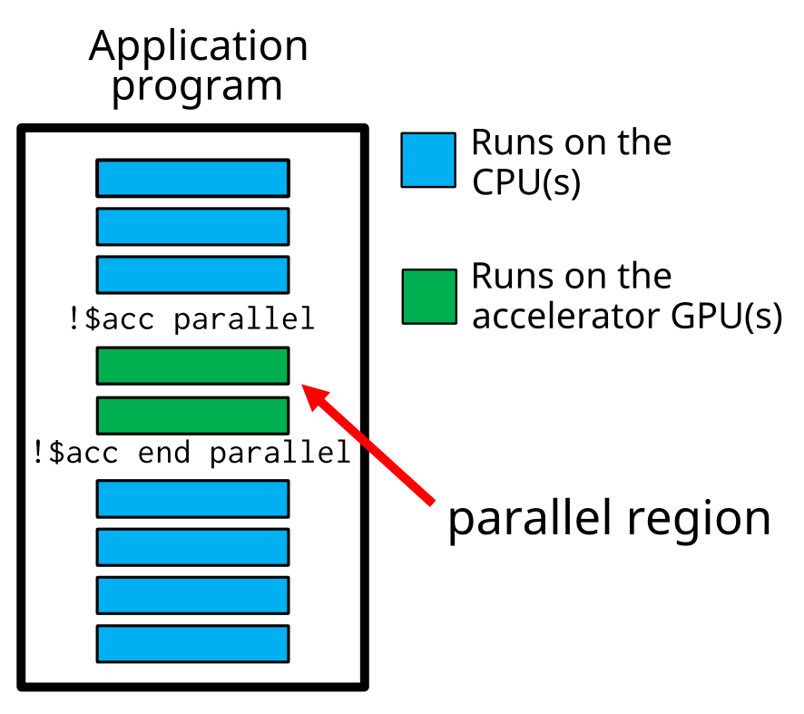
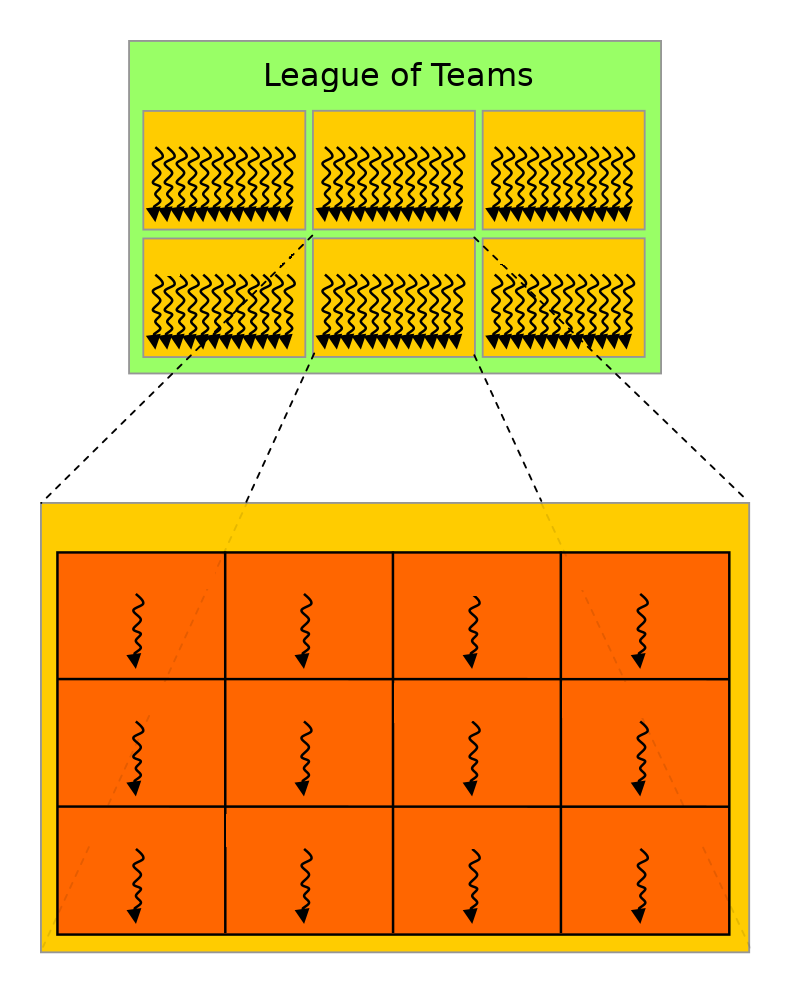

# OpenMP offloading {.section}

# What is OpenMP offloading ?

- Set of OpenMP constructs for heterogeneous systems
  - e.g. CPU+GPU
- Code regions are offloaded from the host (CPU) to be 
  computed on a device (GPU)
- Similar to OpenACC

# OpenMP execution model

<div class="column">
- Program runs on the host CPU
- Host offloads regions of code (*kernels*) and related data to the GPU
- Offloaded regions are executed by the GPU
- Compare to HIP/CUDA: kernels are implicit
</div>

<div class="column">

</div>


# OpenMP data model in offloading

- Host variables are mirrored on device 
- Data is moved to/from host with directives 
  - `map(...)`
  - `enter/exit data map...`)
- Device allocations/deallocations with map clause directives
  - `map(alloc/dealloc:...)`
- When memories are not separate, no copies are needed (difference is
  transparent to the user)

# Compiling an OpenMP program for GPU offloading

On LUMI compiling OpenMP offload is enabled with

- `-fopenmp` flag and
- Modules
  ```bash
  module load LUMI/24.03 partition/G PrgEnv-cray
  ```
- Nvidia compilers (nvfortran/nvcc) use `-mp=gpu` flag
- OpenMP defines `_OPENMP` preprocessor macro if it is enabled. Useful in
  conditional compilation.


# Runtime API functions

- Low-level runtime API functions can be used to
    - query the number of devices in the system
    - select the device to use
    - allocate/deallocate memory on the device(s)
    - transfer data to/from the device(s)
-  Function definitions are in
    - C/C++ header file `omp.h`
    - `omp_lib` Fortran module

# OpenMP internal control variables

- OpenMP has internal control variables (ICV)
    - Environment variable `OMP_DEFAULT_DEVICE`: which device to use
- During runtime, default device can be modified/queried with
  - `omp_`**`set`**`_default_device`
  - `omp_`**`get`**`_default_device`
- Values are always re-read before a kernel is launched and can be
  different for different kernels

# Useful API functions

`omp_is_initial_device()`
  : returns True when called in host, False otherwise

`omp_get_num_devices()`
  : number of devices available

`omp_get_device_num()`
  : number of device where the function is called

`omp_get_default_device()`
  : default device

`omp_set_default_device(n)`
  : set the default device


# Target construct

- OpenMP `target` construct specifies a region to be executed on GPU
    - initially, runs with a single thread
- By default, execution in the host continues only after target region
  is finished
- May trigger implicit data movements between the host and the device

<div class=column>
```c++
#pragma omp target
{
  // code executed in device
}
```
</div>

<div class=column>
```fortranfree
!$omp target
  ! code executed in device
!$omp end target
```
</div>


# OpenMP offloading: worksharing {.section}

# Teams construct

<div class=column>
- Target construct does not create any parallelism, so additional
  constructs are needed
- `teams` creates a league of teams
    - number of teams is implementation dependent
    - initially, a single thread in each team executes the following
      structured block

</div>

<div class=column>

{width=65%}
</div>

# Teams construct

<div class=column>
- No synchronization between teams is possible
- Probable mapping: team corresponds to a "thread block" /
  "workgroup" and runs within streaming multiprocessor / compute unit

</div>

<div class=column>

{width=65%}
</div>

# Creating threads within a team

- Just having a league of teams is typically not enough to leverage all the
  parallelism available in the accelerator
- A `parallel` or a `simd` construct within a `teams` region creates threads
  within each team
    - number of threads per team is implementation dependent
    - with N teams and M threads per team there will be N x M threads in
      total


# Creating threads within a team

<div class=column>
- Threads within a team can synchronize
- Number of teams and threads can be queried with the following API functions:
	- `omp_get_num_teams()`
	- `omp_get_num_threads()`

</div>

<div class=column>

{width=65%}
</div>

# Creating teams and threads

<div class=column>
```c++
#pragma omp target
#pragma omp teams
#pragma omp parallel
{
  // code executed in device
}
```
</div>

<div class=column>
```fortranfree
!$omp target
!$omp teams
!$omp parallel
  ! code executed in device
!$omp end parallel
!$omp end teams
!$omp end target
```
</div>


# League of multi-threaded teams

{.center width=80%}


# Worksharing in the accelerator

- `teams` and `parallel` constructs create threads, however, all the
  threads are still executing the same code
- `distribute` construct distributes loop iterations over the teams
- `for` / `do` construct can also be used within a parallel region


# Worksharing in the accelerator

<div class=column>
```c++
#pragma omp target
#pragma omp teams
#pragma omp distribute
for (int i = 0; i < N; i++)
  #pragma omp parallel
  #pragma omp for
  for (int j = 0; j < M; j++) {
    ...
  }
```
</div>

<div class=column>
```fortranfree
!$omp target
!$omp teams
!$omp distribute
do i = 1, N
  !$omp parallel
  !$omp do
  do j = 1, N
    ...
  end do
  !$omp end do
  !$omp end parallel
end do
!$omp end distribute
!$omp end teams
!$omp end target
```
</div>


# Controlling number of teams and threads

- By default, the number of teams and the number of threads is up to
  the implementation to decide
- `num_teams` clause for `teams` construct and `num_threads` clause
  for `parallel` construct can be used to specify number of teams and
  threads
    - may improve performance in some cases
    - performance is most likely not portable

```c++
#pragma omp target
#pragma omp teams num_teams(32)
#pragma omp parallel num_threads(128)
{
  // code executed in device
}
```


# Composite directives

- In many cases composite directives are more convenient
    - possible to parallelize also single loop over both teams and threads

<div class=column>
```c++
#pragma omp target teams
#pragma omp distribute parallel for
for (int i = 0; i < N; i++) {
  p[i] = v1[i] * v2[i]
}
```
</div>

<div class=column>
```fortranfree
!$omp target teams
!$omp distribute parallel do
do i = 1, N
  p(i) = v1(i) * v2(i)
end do
!$omp end distribute parallel do
!$omp end target teams
```
</div>


# Loop construct

- In OpenMP 5.0 a new `loop` worksharing construct was introduced
- Leaves more freedom to the implementation to do the work division
    - tells the compiler/runtime only that the loop iterations are
      independent and can be executed in parallel

<div class=column>
```c++
#pragma omp target
#pragma omp loop
for (int i = 0; i < N; i++) {
  p[i] = v1[i] * v2[i]
}
```
</div>

<div class=column>
```fortranfree
!$omp target
!$omp loop
do i = 1, N
  p(i) = v1(i) * v2(i)
end do
!$omp end loop
!$omp end target
```
</div>


# Compiler diagnostics {.section}

# Compiler diagnostics

- Compiler diagnostics is usually the first thing to check when starting
  to work with OpenMP, as it can tell you
    - what operations were actually performed
    - what kind of data copies that were made
    - if and how the loops were parallelized
- Diagnostics are very compiler dependent
    - compiler flags
    - level and formatting of information

# CRAY compiler

- Different behaviour and flags between C/C++ and Fortran compilers
- Optimization messages: compiler descibres optimizations in a `.lst` file 
- Save temporaries (advanced): saves assembly files (`.s`) and others
  - Offloading code: look for `*openmppost-llc.s` files

<div align="center">

|Diagnostics|`cc`|`ftn`|
|-----------|----|-----|
|Optimization messages |`-fsave-loopmark`| `-hmsgs`, `-hlist=m`|
|Save temporaries |`-save-temps`|`-hkeepfiles`|

</div>

# CRAY compiler - Fortran

```bash
> ftn -hmsgs -hlist=m -fopenmp sum.F90
```

- Provides full support and nice Diagnostics in file `*.lst`
- Example:
```bash
ftn-6405 ftn: ACCEL VECTORSUM, File = sum.F90, Line = 17 
  A region starting at line 17 and ending at line 21 was placed on the accelerator.

ftn-6823 ftn: THREAD VECTORSUM, File = sum.F90, Line = 17 
  A region starting at line 17 and ending at line 21 was multi-threaded.
```

# CRAY compiler - C/C++

```bash
> cc -fsave-loopmark -fopenmp sum.c
```

- Provides support but limited diagnostics in file `*.lst`
- Still possible to see what is happening during the runtime of the application by setting the environment variable `CRAY_ACC_DEBUG` and reading the stderr of the batch job
- Less friendly to developer


# Summary

- OpenMP enables directive-based programming of accelerators with
  C/C++ and Fortran
- Host--device model
    - host offloads computations to the device
- Host and device may have separate memories
    - host controls copying into/from the device
- Key concepts:
    - league of teams
    - threads within a team
    - worksharing between teams and threads within a team


# Useful resources

- HPE Cray Programming Environment Documentation <br>
  <https://cpe.ext.hpe.com/docs/>

- 2022 ECP Community BoF Days <br>
  <https://www.openmp.org/wp-content/uploads/2022_ECP_Community_BoF_Days-OpenMP_RoadMap_BoF.pdf>
