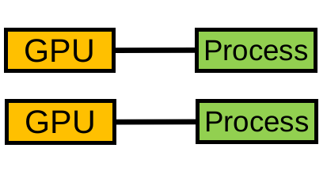
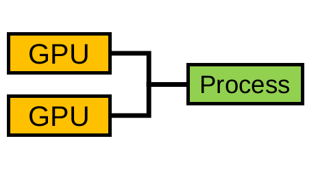
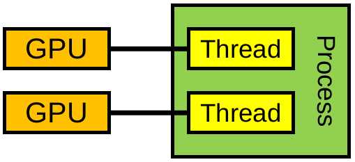

# Anatomy of a supercomputer

Recall that supercomputer consists of *nodes* and *interconnects*

{.center}

---

And even within a node there are more *nodes* and *interconnects*

{.center width=60%}

- LUMI-G node
  - Memory space per GCD
  - CPUs share memory space (but access across is not uniform)


---


::::::{.columns}
:::{.column width=60%}
* supercomputer are a collection of thousands of nodes
* currently there are  2 to 8 GPUs per node
* more GPU resources per node, better per-node-performance 
:::
:::{.column}

{.center width=100%}
:::
:::::: 

# Multi-GPU Programming Models


*Model - example API*

| | One GPU per process | Many GPUs per process | One GPU per thread |
|--|--|--|--|
| Communication | MPI | HIP | HIP  |
| Synchronization | MPI/HIP | HIP (streams)/OpenMP | OpenMP/HIP |
| | {width=100%} | {width=100%} | {width=100%} | 


# One GPU per Process

- Simple porting:
  - Each task assumes one GPU
  - No GPU device selection
- Set prior to executing binary
  - `export ROCR_VISIBLE_DEVICES=$SLURM_LOCALID` on [LUMI-G](https://docs.lumi-supercomputer.eu/runjobs/scheduled-jobs/lumig-job/)
  - `CUDA_VISIBLE_DEVICES` on Roihu
- MPI implementation must be *GPU-aware*
  - LUMI-G: `export MPICH_GPU_SUPPORT_ENABLED=1`
- GPUs may be on different nodes

# Many GPUs per Process

* Process switches the active GPU using `hipSetDevice()` (HIP) or `omp_set_default_device()` (OpenMP)
* After selecting the default device, operations such as the following are effective only
  on the selected GPU:
    * Memory operations
    * Kernel execution
    * Streams and events (HIP)
* Asynchronous function calls (HIP)/`nowait` (OpenMP) for overlapping work

# Many GPUs per Process: Code Example 

::::::{.columns}
:::{.column}
*HIP*
<small>
```cpp
// Launch kernels (HIP)
for(unsigned n = 0; n < num_devices; n++) {
  hipSetDevice(n);
  kernel<<<blocks[n],threads[n], 0, stream[n]>>>(args[n], size[n]);
}
//Synchronize all kernels with host (HIP)
for(unsigned n = 0; n < num_devices; n++) {
  hipSetDevice(n);
  hipStreamSynchronize(stream[n]);
}
```
</small>
:::
:::{.column}
*OpenMP offload*
<small>
```cpp
// Launch kernels (OpenMP)
for(int n = 0; n < num_devices; n++) {
  omp_set_default_device(n);
  #pragma omp target teams distribute parallel for nowait
  for (unsigned i = 0; i < size[n]; i++)
    // Do something
}
#pragma omp taskwait //Synchronize all kernels with host (OpenMP)
```
</small>
:::
::::::


# One GPU per (CPU) Thread

* For example: one OpenMP CPU thread per GPU being used
* HIP/CUDA APIs are threadsafe
* Each thread have designated context to the GPU assigned to it
    * when setting the device a context per thread is created
    * easy device management with no changing of device

<div class="column" width=85%>
*HIP*
<small>


```cpp
// Launch and synchronize kernels
// from parallel CPU threads using HIP
#pragma omp parallel num_threads(num_devices)
{
  unsigned n = omp_get_thread_num();
  hipSetDevice(n);
  kernel<<<blocks[n],threads[n], 0, stream[n]>>>(args[n], size[n]);
  hipStreamSynchronize(stream[n]);
}
```

</small>
</div>

 <div class="column" width=14%>
 *OpenMP offload*
<small>

```cpp
// Launch and synchronize kernels
// from parallel CPU threads using OpenMP
#pragma omp parallel num_threads(num_devices)
{
  unsigned n = omp_get_thread_num();
  #pragma omp target teams distribute parallel for device(n)
  for (unsigned i = 0; i < size[n]; i++)
    // Do something
}
```
</small>
</div>

# Sidetrack: OpenMP `device` clause

- Defines which device the directive should target
- It is available to following directives: `target`, `target data`, `target enter data`, `target exit data`, and `target update`
  - (Also: `dispatch` and `interop`)
- [Specification documentation](https://www.openmp.org/spec-html/5.2/openmpse79.html)

# Direct Peer to Peer Access

* Access peer GPU memory directly from another GPU
  * pass a pointer to data on GPU 1 to a kernel running on GPU 0
  * transfer data between GPUs without going through host memory
  * lower latency, higher bandwidth

```cpp 
// Check peer accessibility
hipError_t hipDeviceCanAccessPeer(int* canAccessPeer, int device, int peerDevice)

// Enable peer access
hipError_t hipDeviceEnablePeerAccess(int peerDevice, unsigned int flags)

// Disable peer access
hipError_t hipDeviceDisablePeerAccess(int peerDevice)
```
* between AMD GPUs, the peer access is always enabled (if supported)

# Peer to Peer Communication

* devices have separate memories
* memcopies between different devices can be done as follows:

```cpp
// HIP: First option that requires unified virtual addressing (use "hipMemcpyDefault" for "kind")
hipMemcpy(dst, src, size, hipMemcpyDefault);

// HIP: Second option does not require unified virtual addressing
hipMemcpyPeer(dst, dstDev, src, srcDev, size);

// OpenMP
omp_target_memcpy(dst, src, size, dstOffset, srcOffset, dstDev, srcDev);
```
* when p-t-p  is missing the copying is done through host memory 
* no equivalent `hipMemcpyPeer` in SYCL
     * implementation dependent behaviour


# GPU-GPU Communication through MPI

* CUDA/ROCm aware MPI libraries support direct GPU-GPU transfers
    * can take a pointer to device buffer (avoids host/device data copies)
* currently no GPU support for custom MPI datatypes (must use a
  datatype representing a contiguous block of memory)
    * data packing/unpacking must be implemented application-side on GPU
* on LUMI, enable on runtime by `export MPICH_GPU_SUPPORT_ENABLED=1`
* having a fallback for pinned host staging pointers is a good idea.


# Device management

```cpp
// HIP
int count, device;
hipGetDeviceCount(&count);
hipSetDevice(device);
hipGetDevice(&device);
hipDeviceReset();

// OpenMP
int count = omp_get_num_devices();
omp_set_default_device(device);
int device=omp_get_default_device();

//SYCL
auto gpu_devices= sycl::device::get_devices(sycl::info::device_type::gpu);
auto count = size(gpu_devices);
queue q{gpu_devices[device]};
auto dev = q.get_device();
```

# Selecting the Correct GPU

* typically all processes on the node can access all GPUs of that node
* implementation for using 1 GPU per 1 MPI process

```cpp
int deviceCount, nodeRank;
MPI_Comm commNode;
MPI_Comm_split_type(MPI_COMM_WORLD, MPI_COMM_TYPE_SHARED, 0, MPI_INFO_NULL, &commNode);
MPI_Comm_rank(commNode, &nodeRank);
hipGetDeviceCount(&deviceCount);
hipSetDevice(nodeRank % deviceCount);
```
::: notes
* Can be done from slurm using `ROCR_VISIBLE_DEVICES` or `CUDA_VISIBLE_DEVICES`
:::

# Compiling MPI+GPU Code


* trying to compile code with any HIP calls with other than the `hipcc` compiler can result in errors
* either single source code (MPI + GPU), set MPI compiler to use `gpucc`:
 
    * OpenMPI: `OMPI_CXXFLAGS='' OMPI_CXX='hipcc'`
    * on LUMI: `'CC --cray-print-opts=cflags' <gpu_mpi_code>.cpp 'CC --cray-print-opts=libs'`
* or separate HIP and MPI code in different compilation units compiled with
  `mpicxx` and `gpucc`
    * Link object files in a separate step using `mpicxx` or `hipcc`
* **on LUMI, `cc` and `CC` wrappers know about both MPI and HIP/OpenMP**

# Summary

- there are various options to write a multi-GPU program
- in HIP/OpenMP a device is set, and the subsequent calls operate on that device
- in SYCL each device has a separate queue
- often best to use one GPU per process + MPI for communications
- use direct peer to peer transfers when available in multithreaded cases
- GPU-aware MPI is required when passing device pointers to MPI

     * Using host pointers does not require any GPU awareness

- on LUMI GPU binding is important
  
