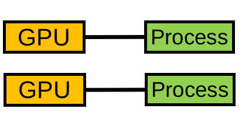
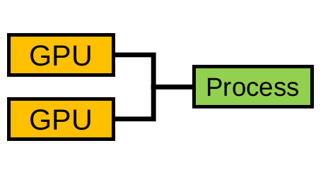
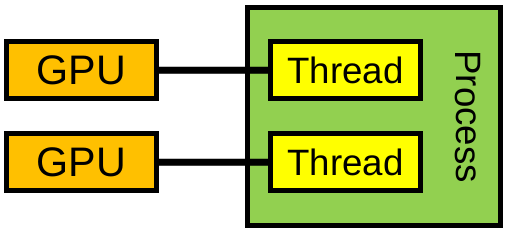

# Anatomy of a supercomputer

- Supercomputers consist of nodes connected by a high-speed network
- A node can contain several multicore CPUs and several GPUs
    - 8 GPUs per node in LUMI, 4 GPUs per node in Mahti and Roihu
- All CPU memory within a node is shared
- GPU memories within a node are distinct

# Using multiple GPUs

- Why to use multiple GPUs?
    - Application requires more memory than a single GPU has
    - Solve the problem faster than with single GPU
- Using multiple GPUs requires:
    - Coordinating the work between GPUs
    - Moving data between GPUs
- HIP/CUDA has functionality for intranode peer-to-peer data movement
- MPI and RCCL/NCCL can be use both for intra- and internode data movement

# GPU-GPU Communication through MPI

- GPUs have dedicated network interfaces (LUMI)
- We want avoid host-device data copies in GPU-to-GPU communication
- GPU aware MPI libraries support direct GPU-GPU transfers
  - Can take a pointer to device buffer 
- Sending custom MPI datatypes falls back to communication via host
  - Data packing/unpacking must be implemented application-side on GPU
- On LUMI: Enable GPU-to-GPU support in MPI
  - `export MPICH_GPU_SUPPORT_ENABLED=1`

# Multi-GPU Programming Models


*Model - example API*

| | One GPU per process | Many GPUs per process | One GPU per thread |
|--|--|--|--|
| Communication | MPI | HIP | HIP  |
| Synchronization | MPI/HIP | HIP (streams) | OpenMP/HIP (streams) |
| | {width=100%} | {width=100%} | {width=100%} | 


# One GPU per Process

- Simple porting:
  - Each process assumes one GPU
  - No GPU device selection within program
-  Communication between GPUs with MPI or RCCL/NCCL
-  Works with arbitrary number of GPUs
  - Same programming approach for inter- and intranode data movement
- Very similar MPI programming as with CPUs


# Assuming one GPU per process: LUMI

- **Problem**: Each process on a node sees all available GPUs ⇒ oversubscription!
- **Solution \#1**: Limit visible GPUs based on `SLURM_LOCALID`:
  - `export ROCR_VISIBLE_DEVICES=$SLURM_LOCALID` on [LUMI-G](https://docs.lumi-supercomputer.eu/runjobs/scheduled-jobs/lumig-job/)
  - `select_gpu` script:
```shell
#!/bin/bash
export ROCR_VISIBLE_DEVICES=$SLURM_LOCALID
exec $*
```
  - `srun ... ./select_gpu <my_binary>`
- For NVidia based systems: `CUDA_VISIBLE_DEVICES`

# Selecting one GPUs per process with MPI

- **Solution \#2**: Use MPI to hand out GPUs at start of program
   - Effectively one gpu per process
- Idea
  1. Split the global communicator to one per shared memory space (i.e. *node*)
  2. Get rank within those communicator and pick a GPU based on that number

```c++
int deviceCount, nodeRank;
MPI_Comm commNode;
MPI_Comm_split_type(MPI_COMM_WORLD, MPI_COMM_TYPE_SHARED, 0, MPI_INFO_NULL, &commNode);
MPI_Comm_rank(commNode, &nodeRank);
hipGetDeviceCount(&deviceCount);
hipSetDevice(nodeRank % deviceCount);
```


# Many GPUs per Process

* HIP
  * Process selects GPU with `hipSetDevice()`
  * Default stream uses the selected device
  * `hipStreamCreate()` will assign the created stream to selected GPU
  * `hipMemcpy()` with `hipMemcpyDefault` will perform P2P copies with unified virtual addressing

* OpenMP
  * Select device with `omp_set_default_device()`
  * Asynchronous function calls `nowait` (OpenMP) for overlapping work

# Many GPUs per Process: Code Example 

::::::{.columns}
:::{.column}
*HIP*
<small>
```cpp
//Create streams
for (size_t n = 0;  n < num_devices; n++) {
  hipSetDevice(n);
  hipStreamCreate(&stream[n]);
}
// Launch kernels 
for(size_t n = 0; n < num_devices; n++) 
  kernel<<<blocks[n],threads[n], 0, stream[n]>>>(args[n], size[n]);

//Synchronize all kernels with host 
for(size_t n = 0; n < num_devices; n++) 
  hipStreamSynchronize(stream[n]);
```
</small>
:::
:::{.column}
*OpenMP offload*
<small>
```cpp
// Launch kernels (OpenMP)
for(int n = 0; n < num_devices; n++) {
  omp_set_default_device(n);
  #pragma omp target teams distribute parallel for nowait
  for (unsigned i = 0; i < size[n]; i++)
    // Do something
}
#pragma omp taskwait //Synchronize all kernels with host (OpenMP)
```

```cpp
// Launch and synchronize kernels
// from parallel CPU threads using OpenMP
#pragma omp parallel num_threads(num_devices)
{
  unsigned n = omp_get_thread_num();
  #pragma omp target teams distribute parallel for device(n)
  for (unsigned i = 0; i < size[n]; i++)
    // Do something
}
```
</small>
:::
::::::


# Sidetrack: OpenMP `device` clause

- Defines which device the directive should target
- It is available to following directives: `target`, `target data`, `target enter data`, `target exit data`, and `target update`
  - (Also: `dispatch` and `interop`)
- [Specification documentation](https://www.openmp.org/spec-html/5.2/openmpse79.html)


# Device management: HIP

<small>

| Description | API Call |
|-|-|
| Query the number of available GPUS within a node | `hipGetDeviceCount(&count)` |
| Set `device` as the current device in the calling host thread | `hipSetDevice(device)`  |
| Query the current device for the calling host thread | `hipGetDevice(&device)` |
| Reset and destroy all current device resources| `hipDeviceReset(void)` |

*Notes*

- All of the above return `hipError_t`
- `device` numbers start from 0.

</small>


# Device management: OpenMP

<small>

| Description | API Call |
|-|-|
| Query the number of devices within a node | `int omp_get_num_devices()` |
| Set `device` as the current device for the calling host thread | `void omp_set_default_device(device)` |
| Query the current device for the calling host thread| `int omp_get_default_device()`  |

</small>

# Compiling HIP+MPI Code

- HIP code requires HIP compiler, **but**
- MPI code is compiled with wrappers `mpicxx` or `mpic++`

  1. Either instruct MPI compiler to use `hipcc`, e.g., for OpenMPI:
  ```bash
  OMPI_CXXFLAGS='' OMPI_CXX='hipcc'
  ```
  2. or separate MPI and HIP code in different compilation units, compile with
    `mpicxx`/`hipcc`, respectively, and link the objects with `mpicxx`/`hipcc`.
      - Linker flags must be collected for `hipcc`/`mpicxx`!

  ---

- **On LUMI, `cc` and `CC` wrappers know about both MPI and HIP**:
```shell
$ CC -xhip <code.cpp> -o <binary>
```


# Example: HIP + MPI program

```cpp
hipMalloc((void **) &dA, sizeof(double) * N);
hipMalloc((void **) &dB, sizeof(double) * N);
...
hipSetDevice(nodeRank % deviceCount);
...
MPI_Send(dA, ...)
MPI_Recv(dB, ...)
gpu_kernel<<<gridsize, blocksize>>> (dB, N);
```

- Multiple devices per rank

# Overlapping communication and computation

- Non-blocking MPI operations enable starting and completing communication in separate calls
- GPU is capable of concurrent computation and memory copies
- Host CPU is available for message progress $\Rightarrow$ more potential for 
  overlapping

# Overlapping communication and computation

<div class="column">
{width=80%}
</div>
<div class="column">
{width=80%}
</div>

<br>

```cpp
MPI_Isend(boundary_data, ...)
MPI_Irecv(boundary_data, ...)
compute_interior<<<gridsize, blocksize>>> (interior_data, ...);
MPI_Waitall(...)
compute_boundaries<<<gridsize, blocksize>>> (boundary_data, ...);
```


# Summary

- Multiple options to write multi-GPU programs
- One GPU per process is simple (`ROCR_VISIBLE_DEVICES` or split communicator)
- Multiple GPUs per process: 
  - Select gpu with OpenMP directive/API call or `hipSetDevice()`
  - `hipMemcpy` with `hipMemcpyDefault` uses unified virtual addressing for
    device-to-device memory copies
- GPU-aware MPI is required when passing device pointers to MPI
  - Using host pointers does not require any GPU awareness
- GPU-aware MPI enable overlapping computation and communication 
