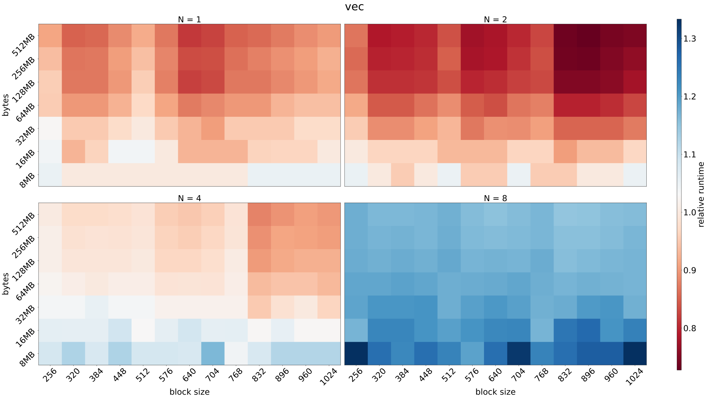
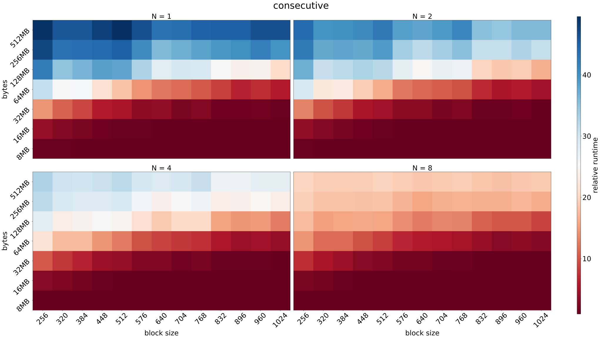
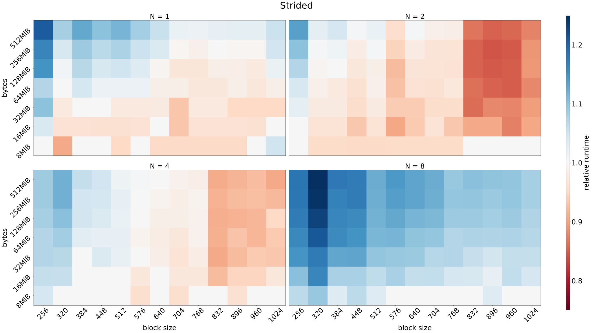
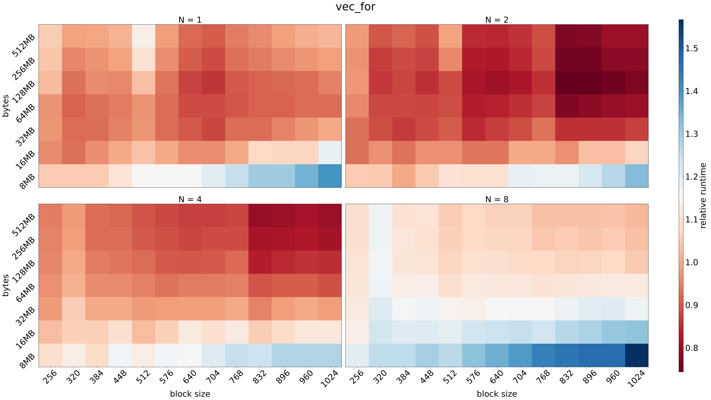
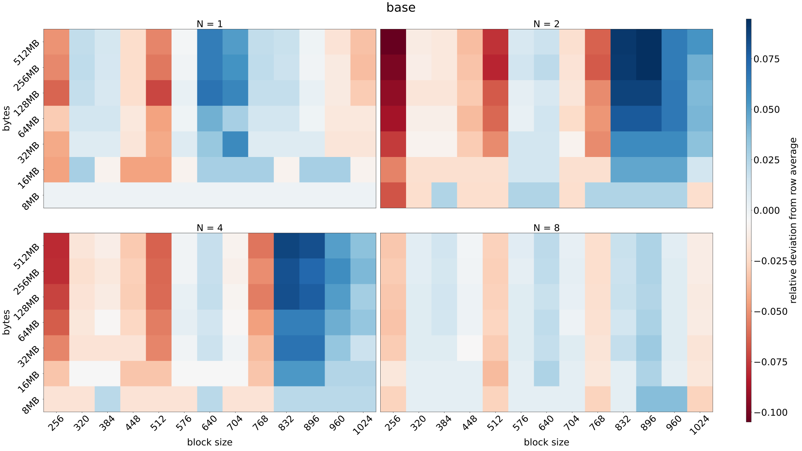
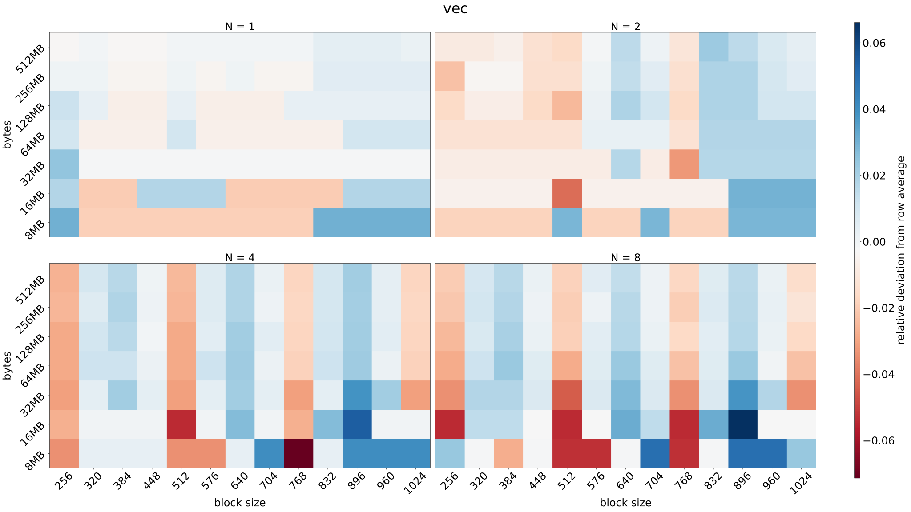
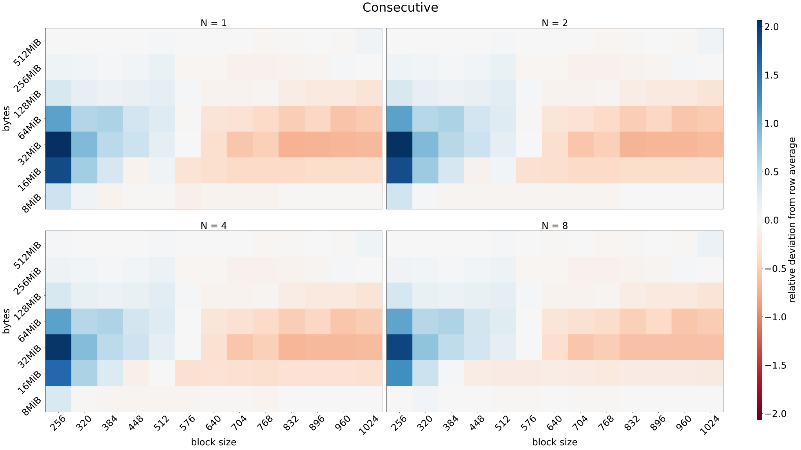
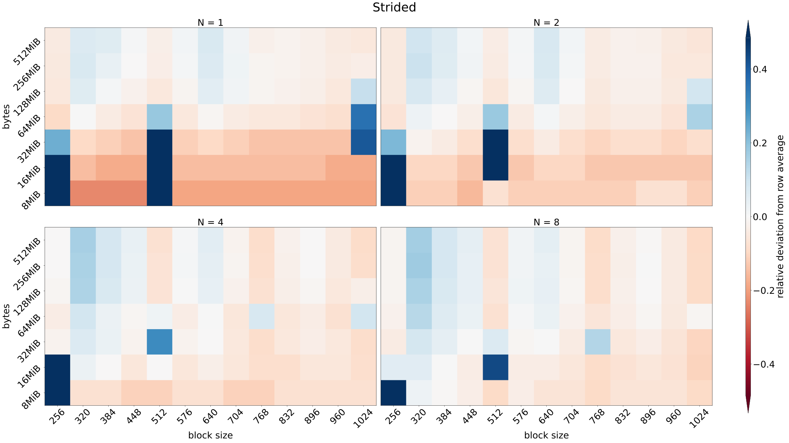
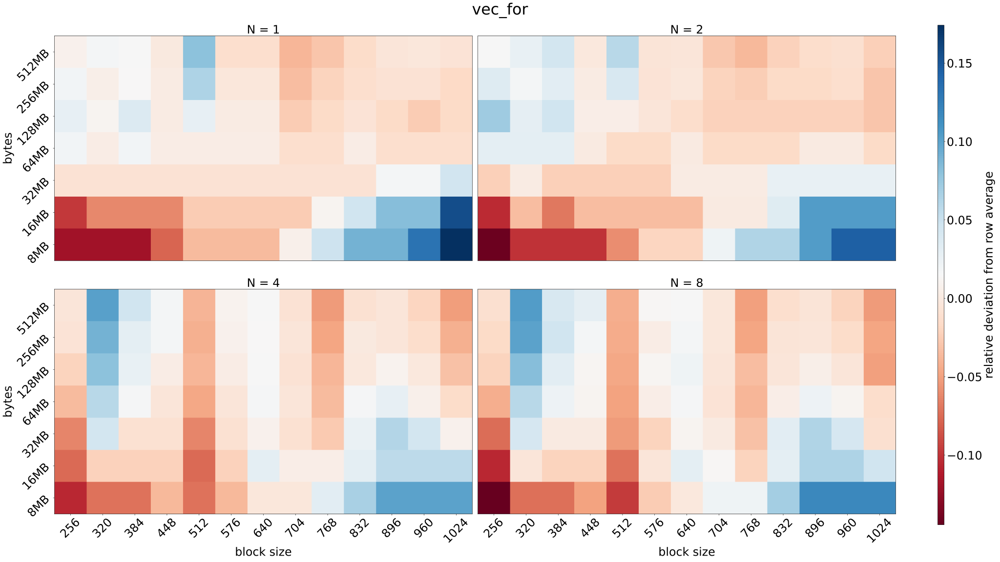

## Codes

### The computation

This is what the kernels are computing.
The number of iterations, `N` is varied.

$$\vec{y} = e^{\vec{x}} \approx \sum_{n = 0}^{N} \frac{x^n}{n!}$$

```cpp
__device__ __host__ float taylor(float x, size_t N) {
    float sum = 1.0f;
    float term = 1.0f;
    for (size_t n = 1; n <= N; n++) {
        term *= x / n;
        sum += term;
    }
    return sum;
}
```

### The base kernel

This is launched with different block sizes and always enough grids such that
`threads per grid >= num_values`.

Other kernels are compared to this.

```cpp
__global__ void taylor_base(float *x, float *y, size_t num_values,
                            size_t num_iters) {
    const size_t tid = threadIdx.x + blockIdx.x * blockDim.x;
    if (tid < num_values)
    {
        y[tid] = taylor(x[tid], num_iters);
    }
}
```

### Vectorized loads

This kernel is otherwise similar to the one above, except it uses four times fewer blocks
and each thread loads a `float4`, then processes four elements.

```cpp
__global__ void taylor_vec(float *x, float *y, size_t num_values,
                           size_t num_iters) {
    const size_t tid = threadIdx.x + blockIdx.x * blockDim.x;
    float4 *xv = reinterpret_cast<float4 *>(x);
    float4 *yv = reinterpret_cast<float4 *>(y);

    if (tid < (num_values >> 2) + 3) {
        const float4 xs = xv[tid];
        const float4 ys(taylor(xs.x, num_iters), taylor(xs.y, num_iters),
                        taylor(xs.z, num_iters), taylor(xs.w, num_iters));

        yv[tid] = ys;
    }

    const size_t index = num_values - num_values & 3 + tid;
    if (index < num_values) {
        y[index] = taylor(x[index], num_iters);
    }
}
```

### Consecutive values for loop

This kernel distributes the work similarly to how CPU threads would do it.
In other words, each thread processes `M` concecutive elements, where
`M = num_values / threads per grid`. Block size is varied, but number of blocks is always 1024.

```cpp
__global__ void taylor_for_consecutive(float *x, float *y, size_t num_values,
                                       size_t num_iters) {
    const size_t tid = threadIdx.x + blockIdx.x * blockDim.x;
    const size_t num_threads = blockDim.x * gridDim.x;
    const size_t num_per_thread = num_values / num_threads;
    for (size_t i = 0; i < num_per_thread; i++) {
        const size_t j = tid * num_per_thread + i;
        y[j] = taylor(x[j], num_iters);
    }

    const size_t left_over = num_values - num_per_thread * num_threads;
    if (tid < left_over) {
        const size_t j = num_per_thread * num_threads + tid;
        y[j] = taylor(x[j], num_iters);
    }
}
```

### Strided for loop

This kernel is also launched with 1024 blocks, while block size is varied, but the
work is distributed differently. Consecutive values are processed by consecutive threads,
but warps jump ahead `M` values, where `M = threads per grid`.

```cpp
__global__ void taylor_for_strided(float *x, float *y, size_t num_values,
                                   size_t num_iters) {
    const size_t tid = threadIdx.x + blockIdx.x * blockDim.x;
    const size_t stride = blockDim.x * gridDim.x;

    for (size_t i = tid; i < num_values; i += stride) {
        y[i] = taylor(x[i], num_iters);
    }
}
```

### Vectorized loads, strided for loop

This otherwise the same as the kernel above, but it uses vectorized floats,
similarly to second kernel.

```cpp
__global__ void taylor_for_vec(float *x, float *y, size_t num_values,
                               size_t num_iters) {
    const size_t tid = threadIdx.x + blockIdx.x * blockDim.x;
    const size_t stride = blockDim.x * gridDim.x;

    float4 *xv = reinterpret_cast<float4 *>(x);
    float4 *yv = reinterpret_cast<float4 *>(y);

    for (size_t i = tid; i < num_values / 4; i += stride) {
        const float4 xs = xv[i];
        const float4 ys(taylor(xs.x, num_iters), taylor(xs.y, num_iters),
                        taylor(xs.z, num_iters), taylor(xs.w, num_iters));

        yv[i] = ys;
    }

    const size_t index = num_values - num_values & 3 + tid;
    if (index < num_values) {
        y[index] = taylor(x[index], num_iters);
    }
}
```

## Visualizations

In the following visualizations we have four subplots.
Each subplot is for a single value of Taylor iteration count `N`.
`N = 1` is the most memory bound case, while `N = 8` is the most compute bound.

In each subplot, the xaxis is the block size of the kernel, while
the y-axis is the size in bytes of the data
(`2 * sizeof(float) * num_values`).

### Relative runtimes

The values in these visualizations are relative runtimes compared to the base kernel.
Values less than one indicate the kernel is faster than the base kernel, while the opposite
is true for values greater than one.

#### Vectorized loads



#### Consecutive values for loop



#### Strided for loop



#### Vectorized loads, strided for loop



### Deviations from row average

These visualizations show the relative deviation from the row average for each kernel.
Negative values mean the kernel with the given configuration takes less time than the average
of all the configurations on the row (i.e. with the same amount of data). Positive value means
the configuration leads to a longer runtime.

#### The base kernel



Block sizes that are multiples of 256 are fastest, this is very clear for the compute bound problem.

Block sizes 832, 896 and 960 seem to be especially bad with `N = 2, 4`.

Block size doesn't matter for the smallest problem size with the most memory bound problem.

#### Vectorized loads

Pretty similar observations as above.



#### Consecutive values for loop

The deviations are much larger than for the other kernels.



#### Strided for loop



#### Vectorized loads, strided for loop


