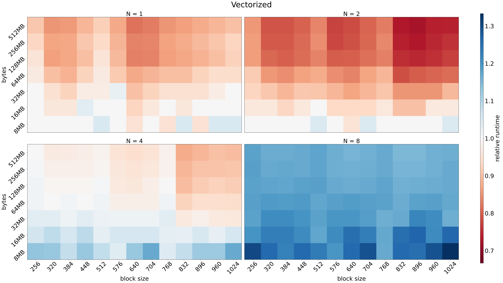
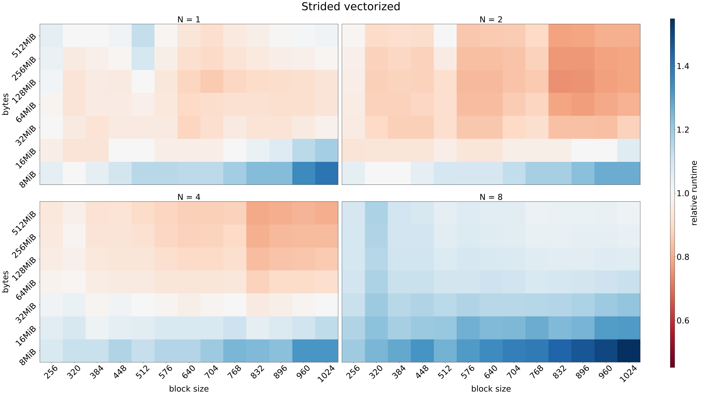
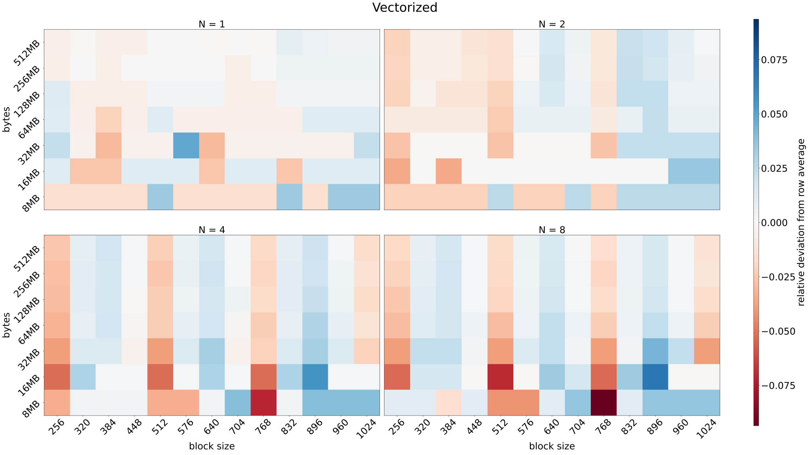
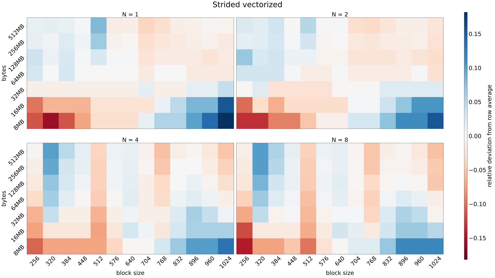

## Codes

The [full source code](main.cpp) is in the same directory.

### The computation

This is what the kernels are computing.
The number of iterations, `N` is varied.

$$\vec{y} = e^{\vec{x}} \approx \sum_{n = 0}^{N} \frac{\vec{x}^n}{n!}$$

```cpp
__device__ __host__ float taylor(float x, size_t N) {
    float sum = 1.0f;
    float term = 1.0f;
    for (size_t n = 1; n <= N; n++) {
        term *= x / n;
        sum += term;
    }
    return sum;
}
```

### The base kernel

This is launched with different block sizes and always enough blocks such that
`threads per grid >= num_values`.

Other kernels are compared to this.

```cpp
__global__ void taylor_base(float *x, float *y, size_t num_values,
                            size_t num_iters) {
    const size_t tid = threadIdx.x + blockIdx.x * blockDim.x;
    if (tid < num_values)
    {
        y[tid] = taylor(x[tid], num_iters);
    }
}
```

### Vectorized loads

This kernel is otherwise similar to the one above, except it uses four times fewer blocks
and each thread loads a `float4`, then processes four elements.

```cpp
__global__ void taylor_vec(float *x, float *y, size_t num_values,
                           size_t num_iters) {
    const size_t tid = threadIdx.x + blockIdx.x * blockDim.x;
    float4 *xv = reinterpret_cast<float4 *>(x);
    float4 *yv = reinterpret_cast<float4 *>(y);

    if (tid < num_values >> 2) {
        const float4 xs = xv[tid];
        const float4 ys(taylor(xs.x, num_iters), taylor(xs.y, num_iters),
                        taylor(xs.z, num_iters), taylor(xs.w, num_iters));

        yv[tid] = ys;
    }

    const size_t index = num_values - num_values & 3 + tid;
    if (index < num_values) {
        y[index] = taylor(x[index], num_iters);
    }
}
```

### Consecutive values for loop

This kernel distributes the work similarly to how CPU threads would do it.
In other words, each thread processes `M` concecutive elements, where
`M = num_values / threads per grid`. Block size is varied, but number of blocks is always 1024.

```cpp
__global__ void taylor_for_consecutive(float *x, float *y, size_t num_values,
                                       size_t num_iters) {
    const size_t tid = threadIdx.x + blockIdx.x * blockDim.x;
    const size_t num_threads = blockDim.x * gridDim.x;
    const size_t num_per_thread = num_values / num_threads;
    for (size_t i = 0; i < num_per_thread; i++) {
        const size_t j = tid * num_per_thread + i;
        y[j] = taylor(x[j], num_iters);
    }

    const size_t left_over = num_values - num_per_thread * num_threads;
    if (tid < left_over) {
        const size_t j = num_per_thread * num_threads + tid;
        y[j] = taylor(x[j], num_iters);
    }
}
```

### Strided for loop

This kernel is also launched with 1024 blocks, while block size is varied, but the
work is distributed differently. Consecutive values are processed by consecutive threads,
but warps jump ahead `M` values, where `M = threads per grid`.

```cpp
__global__ void taylor_for_strided(float *x, float *y, size_t num_values,
                                   size_t num_iters) {
    const size_t tid = threadIdx.x + blockIdx.x * blockDim.x;
    const size_t stride = blockDim.x * gridDim.x;

    for (size_t i = tid; i < num_values; i += stride) {
        y[i] = taylor(x[i], num_iters);
    }
}
```

### Vectorized loads, strided for loop

This otherwise the same as the kernel above, but it uses vectorized floats,
similarly to second kernel.

```cpp
__global__ void taylor_for_vec(float *x, float *y, size_t num_values,
                               size_t num_iters) {
    const size_t tid = threadIdx.x + blockIdx.x * blockDim.x;
    const size_t stride = blockDim.x * gridDim.x;

    float4 *xv = reinterpret_cast<float4 *>(x);
    float4 *yv = reinterpret_cast<float4 *>(y);

    for (size_t i = tid; i < num_values / 4; i += stride) {
        const float4 xs = xv[i];
        const float4 ys(taylor(xs.x, num_iters), taylor(xs.y, num_iters),
                        taylor(xs.z, num_iters), taylor(xs.w, num_iters));

        yv[i] = ys;
    }

    const size_t index = num_values - num_values & 3 + tid;
    if (index < num_values) {
        y[index] = taylor(x[index], num_iters);
    }
}
```

## Visualizations

In the following visualizations we have four subplots.
Each subplot is for a single value of Taylor iteration count `N`.
`N = 1` is the most memory bound case, while `N = 8` is the most compute bound.

In each subplot, the xaxis is the block size of the kernel, while
the y-axis is the size in bytes of the data
(`2 * sizeof(float) * num_values`).

### Relative runtimes

The values in these visualizations are relative runtimes compared to the base kernel.
Values less than one indicate the kernel is faster than the base kernel, while the opposite
is true for values greater than one.

#### Vectorized loads



For memory bound problems it's useful to use vectorized loads. They can offer significant speed ups
compared to non-vectorized loads. The red regions in the top right corners for cases `N = 2, 4` can
be explained by the slowness of the base kernel with those configurations. See the deviation plot for the base kernel:
there's a similar pattern.

For compute bound problem (`N = 8`) vectorized loads only hurt performance.

#### Consecutive values for loop


This is a very bad strategy. It's due to the increased memory traffic that this kernel is so slow.
With GPUs, newer divide the work among the threads like this.

The memory traffic increases both up and left. Up, because there are more values to process over all
and thus also per thread. Left, because there are fewer threads, so more values per thread.

#### Strided for loop


Strided for loop can help with memory bound kernels. The same pattern on the top right corner for cases
`N = 2, 4` is visible, again explainable by the behaviour of the base kernel and not this kernel.

With the largest block size over all the cases, the strided kernel is quite close to the base kernel.
Sometimes mildly faster, sometimes mildly slower.

#### Vectorized loads, strided for loop



The story is pretty similar to the strided loop, except on small problem sizes.
With small problem sizes this strategy can hurt performance quite a lot compared to the base kernel.

### Deviations from row average

These visualizations show the relative deviation from the row average for each kernel.
Negative values mean the kernel with the given configuration takes less time than the average
of all the configurations on the row (i.e. with the same amount of data). Positive value means
the configuration leads to a longer runtime.

#### The base kernel


Block sizes that are multiples of 256 are fastest, this is very clear for the compute bound problem.

Block sizes 832, 896 and 960 are especially bad with `N = 2, 4`.

Smallest block size performs the best overall, whether the problem is compute or memory bound.

#### Vectorized loads



Pretty similar observations as above. One thing to note is the smaller deviations from average overall.
The maximums are smaller and there're are fewer of them.

#### Consecutive values for loop


The deviations are much larger than for the other kernels.
Also we see that there's an especially large deviation in the row with 32 MiB data size. Why is that?

How many bytes does one thread ask for? The total byte size takes into account both `x` and `y`,
but these are different memory addresses and thus served by different memory transactions, so we must
divide the data size by 2 to get bytes per memory transaction.

For the $$256 thread/block$$ case the bytes per thread is

$$\frac{32 / 2 \times 1024 \times 1024 B}{256 thread/block \times 1024 block/grid \times 1 grid} = 64 B/t$$

while for the $$1024 thread/block$$ case it's

$$\frac{32 / 2 \times 1024 \times 1024 B}{1024 thread/block \times 1024 block/grid \times 1 grid} = 16 B/t$$.

If the size of global memory transaction is 64 bytes, exactly one thread can be served by a single memory transaction.
This means there's 64 memory transactions required to fulfill the needs of one wavefront. One step down on the grid
(256 thread/block, 16 MiB case) means two threads can be served by one 64 byte transaction. Likewise, four steps right
(512 thread/block, 32 MiB case) means two threads can be served by one 64 byte transaction.

Going up, each thread requires two 64 byte memory transactions, but each thread can already start doing work with the
first memory transaction while waiting for the second one to be fulfilled. In other words, the number of memory transactions
before useful work can even begin stays constant at 64.

In summary, the number of 64 byte memory transactions that need to happen before the wavefront can start working
increases upwards and to the left, while it reaches it's peak at the 256 thread/block, 32 MiB case. After this it's at
it's maximum value of 64 (i.e. one memory transaction per thread in the wavefront). The total number of required
memory transactions before all work is finished keeps increasing as the total probles size increases in the up direction,
but the wavefronts can do some work with the old data, thus hiding some of the latency.

#### Strided for loop


For some reason, and uniquely for this kernel, 320 threads seems to be a bad choice for block size.
The kernel performs best with the largest block size, whether the problem is memory or compute bound.

#### Vectorized loads, strided for loop


