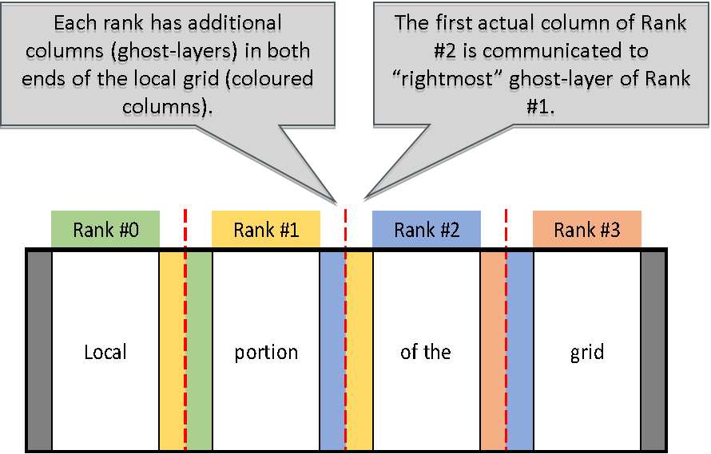

## Heat equation solver parallelized with MPI

Parallelize the whole heat equation program with MPI, by dividing the grid in
blocks of columns (for Fortran – for C substitute “row” in place of
each mention of a “column”) and assigning one column block to one
task. A domain decomposition, that is.  

The MPI tasks are able to update the grid independently everywhere else than
on the column boundaries – there the communication of a single column with the
nearest neighbor is needed. This is realized by having additional
ghost-layers that contain the boundary data of the neighboring
tasks. As the system is non-periodic; the outermost ranks communicate
with single neighbor, and the inner ranks with the two neighbors.

Implement this “halo exchange” operation into the routine `exchange` by
inserting the suitable MPI routines into [core.F90](fortran/core.F90) /
[core.c](c/core.c). The module [heat_mod.F90](fortran/heat_mod.F90) / header [heat.h](c/heat.h)
contain data structures that you can utilize. (The data structures are readily filled by the provided 
`initialize` routine. You may want to investigate also `parallel_setup` routine)

You may use the provided ```Makefile``` for building the 
code (by typing ```make```). 

Remember to update all ghost layers at every iteration.

A schematic representation of the decomposition looks like:


