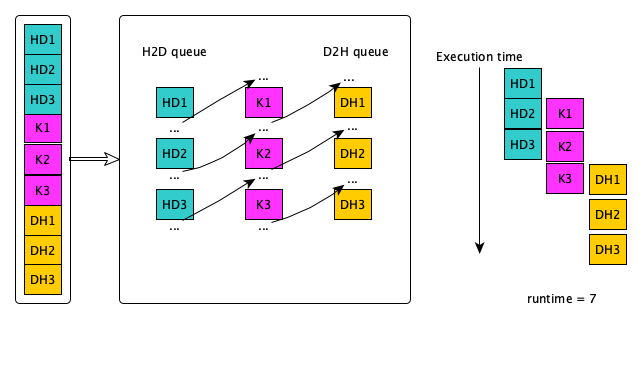
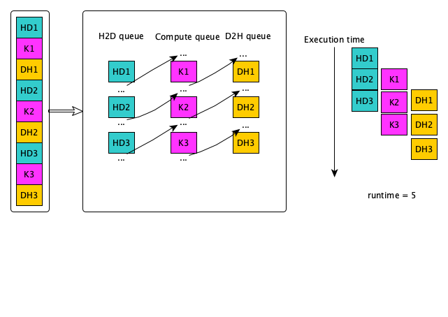

# Streams

* What is a stream?

    * A sequence of operations that execute in issue-order on the GPU
    * HIP operations in different streams could run concurrently
    * The ROCm 4.5.0 brings the  Direct Dispatch, the runtime directly queues a packet to the AQL queue in Dispatch and some of the synchronization.
    * The previous ROCm uses queue per stream


# Concurrency

{width=1600px}


# Amount of concurrency

{width=1600px}


# Default

* Only a single stream is used if not defined
* Commands are synchronized except the Async calls and Kernels


# Example - issue of order (I)

<div class="column">
* We have 3 streams and we do 3 (HD, K, DH)
</div>

<div class="column">
{width=1600px}
</div>


# Example - issue of order (II)

<div class="column">
* We have 3 streams and we do 3 (HD, K, DH)

* Need to think the dependencies and how to improve the runtime
</div>

<div class="column">
{width=1600px}
</div>


# Synchronization and memory (I)

<small>

| HIP API              | Sync Event                                                                     | Fence                | Coherent Host Memory Visibility | Non-Coherent Host Memory Visibility |
| -------------------- | ------------------------------------------------------------------------------ | -------------------- | ------------------------------- | ----------------------------------- |
| hipStreamSynchronize | host waits for all commands in the specified stream to complete                | system-scope release | yes                             | yes                                 |
| hipDeviceSynchronize | host waits for all commands in all streams on the specified device to complete | system-scope release | yes                             | yes                                 |

</small>


# Synchronization and memory (II)

<small>

| HIP API             | Sync Event                                       | Fence                | Conherent Host Memory Visivility | Non-Coherent Host Memory Visibility |
| ------------------- | ------------------------------------------------ | -------------------- | -------------------------------- | ----------------------------------- |
| hipEventSynchronize | host waits for the specified event to complete   | device-scope release | yes                              | depends                             |
| hipStreanWaitEvent  | stream waits for the specified event to complete | none                 | yes                              | no                                  |

</small>


# Stream/Events API

<small>

* hipStreamCreate: Creates an asynchronous stream
* hipStreamDestroy: Destroy an asynchronous stream
* hipStreamCreateWithFlags: Creates an asynchronous stream with specified flags
* hipEventCreate: Create an event
* hipEventRecord: Record an event in a specified stream
* hipEventSynchronize: Wait for an event to complete
* hipEventElapsedTime: Return the elapsed time between two events
* hipEventDestroy: Destroy the specified event \
HIP API: https://raw.githubusercontent.com/RadeonOpenCompute/ROCm/master/AMD-HIP-API-4.5.pdf

</small>


# Implicit Synchronization

* himHostMalloc
* hipMalloc
* hipMemcpy
...


# Example - Data Transfer and Compute

* Serial

```cpp
hipCheck( hipEventRecord(startEvent,0) );

hipCheck( hipMemcpy(d_a, a, bytes, hipMemcpyHostToDevice) );

hipLaunchKernelGGL(kernel, n/blockSize, blockSize, 0, 0, d_a, 0);

hipCheck( hipMemcpy(a, d_a, bytes, hipMemcpyDeviceToHost) );

hipCheck( hipEventRecord(stopEvent, 0) );
hipCheck( hipEventSynchronize(stopEvent) );
hipCheck( hipEventElapsedTime(&duration, startEvent, stopEvent) );
printf("Duration of sequential transfer and execute (ms): %f\n", duration);
```


# How to improve the performance?

* Use streams to overlap computation with communication
```cpp
hipStream_t stream[nStreams];
for (int i = 0; i < nStreams; ++i)
    hipStreamCreate(&stream[i])
```

* Use Asynchronous data transfer
```cpp
hipMemcpyAsync(dst, src, bytes, hipMemcpy kind, stream)
```

* Execute kernels on different streams
```cpp
hipLaunchKernelGGL(some_kernel, gridsize, blocksize, shared_mem_size, stream,
                   arg0, arg1, ...);
```


# Synchronization (I)

* Synchronize everything, could be used after each kernel launch except if you know what you are doing
```cpp
hipDeviceSynchronize()
```

* Synchronize a specific stream
Blocks host until all HIP calls are completed on this stream
```cpp
hipStreamSynchronize(streamid)
```


# Synchronization (II)

* Synchronize using Events
    * Create event
    ```cpp
    hipEvent_t stopEvent
    hipEventCreate(&stopEvent)
    ```
    * Record an event in a specific stream and wait until is recorded
    ```cpp
    hipEventRecord(stopEvent,0)
    hipEventSynchronize(stopEvent)
    ```
    * Make a stream wait for a specific event
    ```cpp
    hipStreamWaitEvent(stream[i], stopEvent, unsigned int flags)
    ```


# Synchronization in the kernel

`__syncthreads`

```cpp
__global__ void reverse(double *d_a) {
__shared__ double s_a[256]; //array of doubles, shared in this block
int tid = threadIdx.x;
s_a[tid] = d_a[tid];    //each thread fills one entry
//all wavefronts must reach this point before any wavefront is allowed to continue.
__syncthreads();
d_a[tid] = s_a[255-tid]; //write out array in reverse order
}
```


# Exercises

https://github.com/csc-training/hip-programming/tree/main/streams

