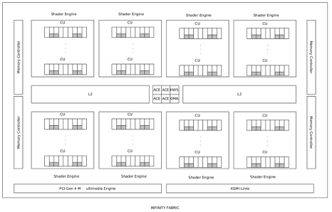
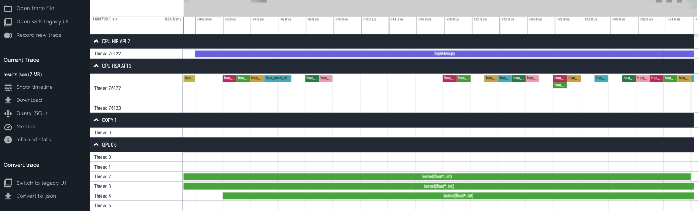

# Libraries (I)

| NVIDIA   | HIP       | ROCm       | Description                                                                         |
| -------- | --------- | ---------- | ----------------------------------------------------------------------------------- |
| cuBLAS   | hipBLAS   | rocBLAS    | Basic Linear Algebra Subroutines                                                    |
| cuFFT    | hipFFT    | rocfft     | Fast fourier Transform Library                                                      |
| cuSPARSE | hipSPARSE | rocSPARSE  | Sparse BLAS + SMV                                                                   |
| cuSOLVER | hipSOLVER | rocSOLVER  | Lapack library                                                                      |
| AMG-X    |           | rocALUTION | Sparse iterative solvers and preconditioners with Geometric and Algebraic MultiGrid |
| Thrust   | hipThrust | rocThrust  | C++ parallel algorithms library                                                     |


# Libraries (II)

| NVIDIA | HIP     | ROCm    | Description                                                                   |
| ------ | ------- | ------- | ----------------------------------------------------------------------------- |
| CUB    | hipCUB  | rocPRIM | Low level Optimized Parllel Primitives                                        |
| cuDNN  |         | MIOpen  | Deep learning solver library                                                  |
| cuRAND | hipRAND | rocRAND | Random number generator library                                               |
| EIGEN  | EIGEN   | EIGEN   | C++ template library for linear algebra: matrices, vectors, numerical solvers |
| NCCL   |         | RCCL    | Communications Primitives Library based on the MPI equivalents                |


# hipBLAS

{width=1600px}


# Kernels

You can call a kernel with the command:

```cpp
hipLaunchKernelGGL(kernel_name, dim3(Blocks), dim3(Threads), 0, 0, arg1, arg2, ...);
```

or
```cpp
kernel_name<<<dim3(Blocks), dim3(Threads),0,0>>>(arg1,arg2,...);
```
* where blocks are for the 3D dimensions of the grid of blocks dimensions
* threads for the 3D dimentions of a block of threads
* 0 for bytes of dynamic LDS space
* 0 for stream
* kernel arguments


# Exercise Nbody


* 32768 number of small particles, 2000 time steps
* Executing the code on an NVIDIA V100 GPU, the execution time is 68.5
  seconds.
* Compile and execute the code Nbody on an AMD MI100 GPU
    * `hip-programming/nbody`


# AMD MI100 architecture

{width=1200px}


# Compute Units (CU)


* Each CU is a 64-wide execution unit, so multiple of 64 as the thread limit.
    * The 64-wide execution is sub-divided into 4 SIMD units of 16 elements.
    * For a 16-wide SIMD instruction, the best possible latency is 4 cycles.
    * So, you need at least 4 SIMD instructions in flight to saturate the
      SIMD units.

Finally, using 256 threads per block would give the best performance in most
cases.

* Change the threads per block to 256 for the all the calls to launch kernel
  at Nbody exercise and discuss what is the performance improvement.
* Is the workload enough to stress the AMD MI100 GPUs?


# Tips

* Get familiar with the GPU hardware
* Compute units, memory etc.
* Using 240 blocks (2 x 120 CUs) and 256 threads per block provides good
  performance, maybe additional tuning required


# Rocprofiler (I)

* Profiling tool developed by AMD
* It is not for scalability purposes
* Its API is available to other profiling tools such as HPCToolkit, TAU,
  SCORE-P
* Profile statistics: `rocprof --stats ./binary`
* Trace HIP: `rocprof --hip-trace ./binary`
* Trace HSA: `rocprof --hsa-trace ./binary`


# Rocprofiler (II)

* Instrumenting with metrics:

```
rocprof -i metrics.txt -o output.csv ./binary
```

* where for example, metrics.txt:

```
pmc: TCC_EA_WRREQ_sum, TCC_EA_RDREQ_sum
range: 0:1
gpu: 0
kernel: copy_kernel
```


# Rocprofiler (III)

* **pmc** is the lines with the counters:
    * TCC_EA_WRREQ_sum: Number of transactions (either 32-byte or 64-byte)
      going over the TC_EA_wrreq interface. Sum over TCC instances
    * TCC_EA_RDREQ_sumi: Number of TCC/EA read requests (either 32-byte or
      64-byte). Sum over TCC instances.
    * Find metrics information in: /opt/rocm/rocprofiler/lib/metrics.xml
* **range** is the range of the kernels but her eis executed only once
* **gpu** is the GPU id //adjust for the GPU that you use
* **kernel** is the kernel name, if you need to add a second one let an empty
  space


# Various useful metrics (I)

* GPUBusy: The percentage of time GPU was busy
*  Wavefronts: Total wavefronts
* VALUInsts: The average number of vector ALU instructions executed per
  work-item (affected by flow control).
* VALUUtilization: The percentage of active vector ALU threads in a wave. A
  lower number can mean either more thread divergence in a wave or that the
  work-group size is not a multiple of 64. Value range: 0% (bad), 100%
  (ideal - no thread divergence).


# Various useful metrics (II)

* VALUBusy: The percentage of GPUTime vector ALU instructions are processed.
  Value range: 0% (bad) to 100% (optimal).
* L2CacheHit: The percentage of fetch, write, atomic, and other instructions
  that hit the data in L2 cache. Value range: 0% (no hit) to 100% (optimal).
* LDSBankConflict: The percentage of GPUTime LDS is stalled by bank conflicts.
  Value range: 0% (optimal) to 100% (bad).


# Visualize Traces

{width=1600px}

<div class="column">
* Execute the `--hip-trace` profiling
* Go to the link https://ui.perfetto.dev/
</div>

<div class="column">
* Click on the left "Open trace file"
* Select the file which was create from rocprof with extension `.json`
</div>


# Optimizing matrix operations {.section}

# Copy matrix

### Example

```cpp
__global__ void copy_kernel(float *in, float *out, int width, int height) {
  int x_index = blockIdx.x * tile_dim + threadIdx.x;
  int y_index = blockIdx.y * tile_dim + threadIdx.y;

  int index = y_index * width + x_index;

  out[index] = in[index];
}
```

```cpp
  int block_x = width / tile_dim;
  int block_y = height / tile_dim;
   hipLaunchKernelGGL(copy_kernel, dim3(block_x, block_y),
                      dim3(tile_dim, tile_dim), 0, 0, d_in, d_out, width,
                      height);
   hipDeviceSynchronize();
```


# Profile the code

```shell
rocprof --stats ./copy
```

```shell
cat results.stats.csv
"Name","Calls","TotalDurationNs","AverageNs","Percentage"
"copy_kernel(float*, float*, int, int) [clone .kd]",1,165920,165920,100.0
```

So the duration of the Copy kernel is 165920 ns

```shell
rocprof -i metrics_copy_kernel.txt -o metrics_copy.csv ./copy
```

```shell
cat metrics_copy.csv
GPUBusy,Wavefronts,VALUInsts,SALUInsts,SFetchInsts,MemUnitStalled,
VALUUtilization,VALUBusy,SALUBusy,L2CacheHit,WriteUnitStalled,LDSBankConflict
100,262144,11,1,2,13,100,13,1,0,6,0
```


# Matrix transpose naive

```cpp
__global__ void transpose_kernel(float *in, float *out, int width, int height) {
  int x_index = blockIdx.x * tile_dim + threadIdx.x;
  int y_index = blockIdx.y * tile_dim + threadIdx.y;

  int in_index = y_index * width + x_index;
  int out_index = x_index * height + y_index;

  out[out_index] = in[in_index];
}
```

```shell
rocprof --stats ./matrix_transpose_naive
```

```shell
cat results.stats.csv
"Name","Calls","TotalDurationNs","AverageNs","Percentage"
"transpose_kernel(float*, float*, int, int) [clone .kd]",1,418083,418083,100.0
```

The duration is 418083 ns, 2.5 times slower


# Profile counters

```shell
rocprof -i metrics_matrix_transpose_naive_kernel.txt -o metrics_naive.csv ./matrix_transpose_naive
```

```shell
cat metrics_naive.csv
GPUBusy,Wavefronts,VALUInsts,SALUInsts,SFetchInsts,MemUnitStalled,
VALUUtilization,VALUBusy,SALUBusy,L2CacheHit,WriteUnitStalled,LDSBankConflict
100,262144,16,0,2,83,100,6,0,77,0,0
```


# Matrix transpose LDS

```cpp
__global__ void transpose_lds_kernel(float *in, float *out, int width,
                                     int height) {
  __shared__ float tile[tile_dim][tile_dim];

  int x_tile_index = blockIdx.x * tile_dim;
  int y_tile_index = blockIdx.y * tile_dim;

  int in_index =
      (y_tile_index + threadIdx.y) * width + (x_tile_index + threadIdx.x);
  int out_index =
      (x_tile_index + threadIdx.y) * height + (y_tile_index + threadIdx.x);

  tile[threadIdx.y][threadIdx.x] = in[in_index];

  __syncthreads();

  out[out_index] = tile[threadIdx.x][threadIdx.y];
}
```


# Profile statistics

```shell
rocprof --stats ./matrix_transpose_lds
```

```shell
cat results.stats.csv
"Name","Calls","TotalDurationNs","AverageNs","Percentage"
"transpose_lds_kernel(float*, float*, int, int) [clone .kd]",1,227522,227522,100.0
```

The duration is 227522, which is 1.37 time slower instead of 2.5 times


# Profile Metrics

```shell
rocprof -i metrics_matrix_transpose_lds_kernel.txt -o metrics_lds.csv ./matrix_transpose_lds
```

```shell
cat metrics_lds.csv
GPUBusy,Wavefronts,VALUInsts,SALUInsts,SFetchInsts,MemUnitStalled,
VALUUtilization,VALUBusy,SALUBusy,L2CacheHit,WriteUnitStalled,LDSBankConflict
100,262144,20,2,2,26,100,26,2,0,0,67
```


# Explanation

* There is need for more optimization
* There are LDS bank conflicts


# Exercise

* Do the hipfort exercise
* Do the nbody exercise, also profile and visualize 
* Execute the presented exercise
* Copy the streams exercise, profile it and visualize the json file.
