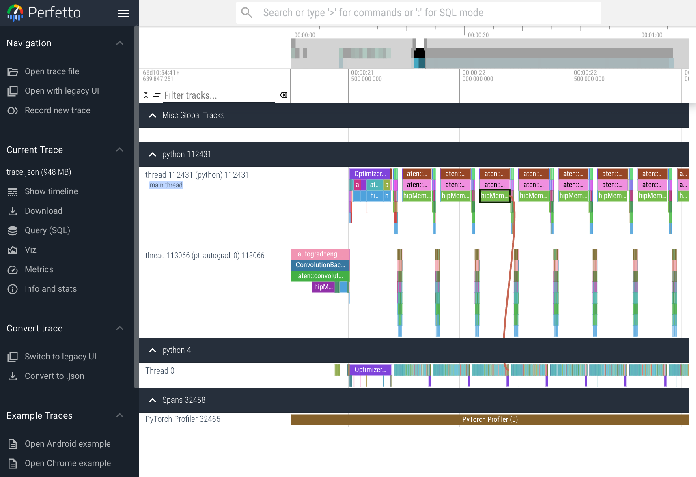

# Demo

In this demo, we study image classification with [CIFAR100](https://www.cs.toronto.edu/~kriz/cifar.html) dataset. [This image](./img/cifar100.jpg) is a sample of what the dataset looks like. The dataset has 100 classes containing 600 images each; 500 image per class is in the trainset.

We will train a CNN model called [ResNet152](https://docs.pytorch.org/vision/main/models/generated/torchvision.models.resnet152.html). This model has over 60M parameters to train.

During the lecture, we did a step-by-step calculation for the required memory and FLOPs for the training. However these calculations do not consider real-world compute overheads like I/O, kernel launch, etc. It also doesn't consider any memory overheads like `pin_memory` etc. While our network is training, we will use monitoring tools to verify our calculations.

In this demo, we want to monitor the GPU utilization. Let's first refresh our memory about it.

## Monitoring GPU Utilization
When running jobs on LUMI's GPUs, you want to make sure you use the given computational resources as efficiently as possible. Your project will be billed for the number of GPUs you allocate times the number of hours you use them. If you only utilize half of the GPUs computational power, you are still billed for the full GPU, resulting in wasted resources and money. In this section, we will show how to monitor and profile your jobs to ensure you are using the resources efficiently.

### Monitoring jobs with `rocm-smi`

The `rocm-smi` tool is a command-line utility that allows you to monitor the status of AMD GPUs on LUMI. If the cluster you are using has Nvidia GPUs (like Mahti, you have to use `nvidia-smi`). The output of the command look similar to the following:


To use `rocm-smi` you have to access the node that your GPU job is running. To do that, you need the
`jobid` of the job which `squeue --me` shows. With the `jobid`, you can open an interactive parallel session with the following command:

```bash
srun --jobid <jobID> --interactive --pty /bin/bash
```
This will open a shell on the compute node where the job is running. We can now use the `rocm-smi` tool to monitor the GPU usage. The following command will show the GPU usage updated every second:

```bash
watch -n1 rocm-smi
```

You can combine the previous commands by 
```bash
srun --interactive --pty --jobid=<jobID> watch -n 1 rocm-smi
```

The `rocm-smi` tool shows multiple useful metrics such as GPU utilization, memory usage, temperature, and power usage. The most intuitive metrics might be GPU utilization and memory usage, they are however not accurate indicators whether the GPU is fully utilized as a kernel waiting idle for data still shows in the driver as 100% GPU utilization. The best indicator is instead the drawn power. For a single GPU, a power usage of around 300W is a good indicator that the full GPU is being leveraged. 

See [GPU-accelerated machine learning](https://docs.csc.fi/support/tutorials/gpu-ml/) documentations on LUMI for more information.

## Tasks
Now it's time to run some trainings. There are three tasks to be compeleted. For each task, remember to monitor the GPU with opening an overlapping job and using `rocm-smi`. Does the calculations we did during the lecture match the VRAM usage?
Also, don't forget to look at the Slurm output file which prints information about the training time. After doing each tasks, try to answer the quetions in the questions section.

As a bouns, you can play with the code and modify some of the hyperparameters and/or the model. Discuss the effect of these changes.

### Task 1

In the first task, we will use one single GPU to train the model Starting with `train_cifar100.py` and familiarize yourself with the codebase.

You can run the training directly with the corresponding script listed above:

    sbatch  run_single_cifar.sh

As a reminder, you can check the status of your runs with the command:

    squeue --me

The output of the run will appear in a file named `single_gpu_cifar100-slurm-RUN_ID.out`
where `RUN_ID` is the Slurm batch job id. You can check the last ten
lines of that file with the command:

    tail slurm-RUN_ID.out

Use `tail -f` if you want to continuously follow the progress of the
output. (Press Ctrl-C when you want to stop following the file.)

### Task 2

Repeat the experimet with `train_data_parallel.py` which trains the model with 2 GPUs with the [Data Parallel](https://docs.pytorch.org/docs/stable/generated/torch.nn.DataParallel.html) technique.

You can run the training directly with the corresponding script listed above:

    sbatch  run_data_parallel_cifar100.sh

### Task 3

Repeat the experiment with the `train_ddp_cifar100.py` Which trains the model with 2 GPUs with the [Distributed Data Parallel](https://docs.pytorch.org/tutorials/intermediate/ddp_tutorial.html) technique.

You can run the training directly with the corresponding script listed above:

    sbatch  run_ddp_cifar100.sh


## Questions:
1. For each task, look at the GPU utilization, and VRAM. 
    - a. Does the VRAM matches our calculations?
    - b. How we can increase the VRAM?
    - c. Why the VRAM is different in DP?

2. By looking at the `slurm-RUN_ID.out`, look for the training speed for the each iteration and also one epoch.
    - a. Why the first epoch in all tasks is slower than other epochs?
    - b. Does the time per epoch matches our calculations?

3. Why using DP or DDP increases the speed of the training?

4. Why using 2 GPUs in Data Parallel approach is not as fast as DDP?

5. Discuss the loss in DDP. Why the loss is not as low as DP and single GPU training?

6. Why the total number of iterations are different in DDP?
    - a. What happens if you divide the the `batch_size` by `world_size`.
    - b. How does it affect the loss after training?

7. In `train_cifar100.py`, investigate the effect of switching to a smaller model of `resnet50`. How it affects the training speed? Does it match your expectations based on the number of parameters?

8. In `train_cifar100.py`, change investigate the effect of switching to a larger batch size. How it affects the training speed? Does it match your expectations based on VRAM utilization?

   
## Monitoring with visulatization

You can use TensorBoard either via the LUMI web user interface.

### Tensorboard via LUMI web interface

1. Log in via <https://www.lumi.csc.fi/>
2. Select menu item: Apps → TensorBoard
4. In the form:
   - Select course project: project_462000956
   - Specify the "TensorBoard log directory", it's where you have cloned the course repository plus "hpc-ai/logs", for example:
  `/scratch/project_462000956/$USER/summerschool/hpc-ai/demo`. You can run `pwd` in the terminal to find out the full path where you are working.
   - Leave rest at default settings
6. Click "Launch"
7. Wait until you see the "Connect to Tensorboard" button, then click that.
8. When you're done using TensorBoard, please go to "My Interactive Sessions" in the LUMI web user interface and "Cancel" the session. (It will automatically terminate once the reserved time is up, but it's always better to release the resource as soon as possible so that others can use it.)

### PyTorch profiler

Using `rocm-smi` can give us an easy way to peek at GPU utilization, but it doesn't provide any information about which parts of the code are taking the most time. For this, we can use PyTorch's built-in profiler. We create the profile in the training scripts, and save the required data by calling `profiler.step()`. 

The output of the profiling will be saved in a `trace.json` file located in `./logs/profiler`. We can visualize the trace using the Chrome browser by copying the `trace.json` file to our local machine. If you are using Google Chrome, you can navigate to `chrome://tracing` or use the Perfetto webite by navigating to [ui.perfetto.dev/](https://ui.perfetto.dev/) and uploading the `trace.json` file. The trace will show us the time spent in each function call, and will look similar to the following:



If the framework-level profiling is not sufficient and you want to investigate hardware-level performance, you can use AMD's profiling tools. The [LUMI training materials](https://lumi-supercomputer.github.io/LUMI-training-materials/) has more details information.
