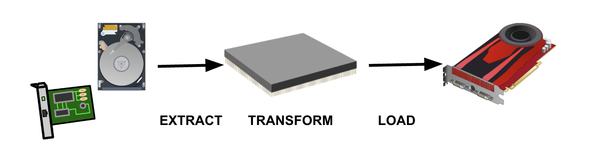
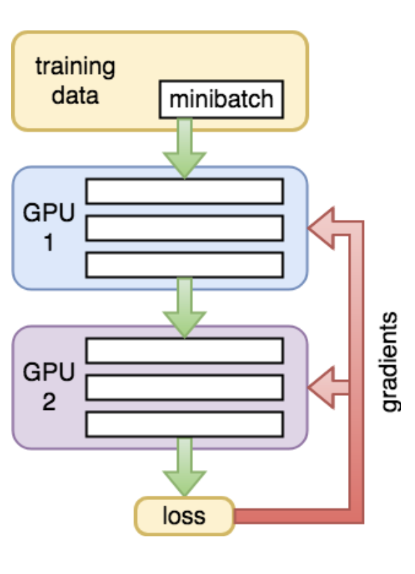
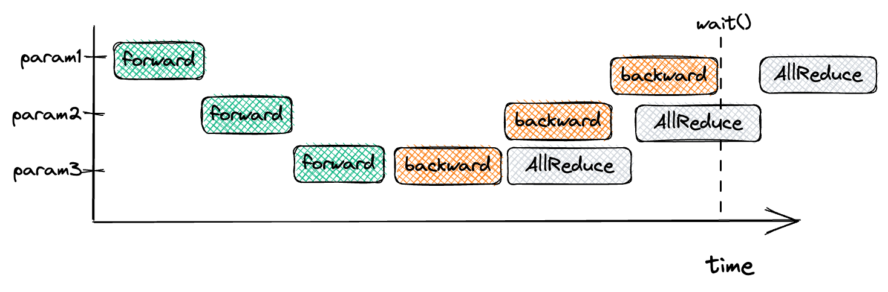
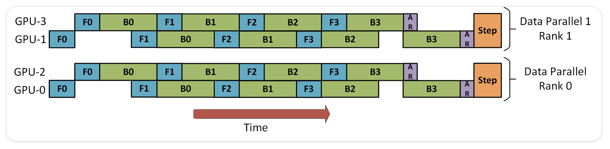

# Single GPU vs Multi-GPU training
- Training ML models could be intense
  - Heavy computations
  - Large Model
- That's why we might need use multiple GPUs to train
  - GPUs could be accross multiple nodes
- Multi-GPU or Multi-Node training has overhead
  - Communication costs
  - Distributation of the data
  - Underutilization


# Multi-GPU performance
<div class="column"  style="width:100%; text-align: center;">
  {width=40%}
</div>
- ResNet152 with CIFAR100 multi-gpu performance


# Single-GPU Training

:::::: {.columns}
::: {.column width="50%"}
{.center width=30%}
:::
::: {.column width="50%"}
- <small>How it works:</small>  
- <small>Entire model & data on one GPU.</small>  
- <small>Pros: Simple, fast for small models.</small>  
- <small>Cons: Not scalable to large models/datasets.</small>
:::
::::::


# DataLoader Issue

- Most common bottleneck in workflows  
- Causes the underutilization issue  
- Reserve enough CPU cores per GPU (7 cores/GPU on LUMI)  
- Use multiple workers (processes) in PyTorch `DataLoader`  

```python
train_loader = torch.utils.data.DataLoader(data, ..., num_workers=N)
```

{.center width=60%}


# Multi-GPU Techniques

:::::: {.columns}
::: {.column width="50%"}
**Model Parallelism**  
{.center width=45%}
:::
::: {.column width="50%"}
**Data Parallelism (MP)**  
{.center width=70%}
:::
::::::

# Data Parallelism

:::::: {.columns}
::: {.column width="40%"}
{.center width=70%}
:::
::: {.column width="30%"}

<small>
How it works:
1. Copy model to each GPU.
2. Split inputs across GPUs.
3. Compute forward/backward.
4. Aggregate gradients.
</small>
:::
::: {.column width="40%"}
<small>
**Overheads**

| Type                      | Description   |
|---------------------------|---------------|
| Communication Overhead    | High          |
| Partial distribution      | Possible      |
| Underutilization          | Possible      |
</small>
:::
::::::
 

# Naive Pytroch Data Parallelism (DP)
  {width=75%}


# Pytroch Distributed Data Parallelism (DDP)
  {width=75%}


# DDP AllReduce overlap
Without overlap:
  {.center width=60%}
With overlap: 
  {.center width=60%}


# DDP vs DP
- DP is Python threads-based, DDP is multiprocess-based 
  - No Python threads limitations, such as GIL
- Simpler data flow
- Both have high inter-GPU communication overhead (all-reduce)
  - DDP has a lower overhead, but still high
- Overlapping pipeline of gradient all-reduce with layer gradient computation
- DDP is generally the recommended approach


# MP: Pipeline Parallelism

:::::: {.columns}
::: {.column width="40%"}
{.center width=70%}
:::
::: {.column width="30%"}
- <small>Vertical Parallelism:</small>
  - <small>Split the layer-wise across GPUs.</small>
  - <small>Each GPU processes part of the model sequentially.</small>
  - <small>Chain of dependencies</small>

:::
::: {.column width="40%"}
<small>
**Overheads**

| Type                      | Description   |
|---------------------------|---------------|
| Communication Overhead    | Low           |
| Partial distribution      | No            |
| Underutilization          | High          |
</small>
:::
::::::


# Bubble issue and GPipe
<div class="column"  style="width:80%; text-align: center;">
  {width=80%}
  - <small>Picture from [GPipe Paper, arXiv:1811.06965](https://arxiv.org/abs/1811.06965)</small>
</div>
- GPipe divided the data to micro-batch to reduce the bubble issue.


# MP: Tensor Parallelism

:::::: {.columns}
::: {.column width="60%"}
{.center width=70%}
:::
::: {.column width="30%"}
<small>
-Horizontal Parallelism:
  - Divide tensors horizontally.
  - Store part of the layers or blocks on different GPUs.
  - Concat outputs between GPUs manually.
</small>
:::
::: {.column width="40%"}
<small>
**Overheads**

| Type                      | Description   |
|---------------------------|---------------|
| Communication Overhead    | Low           |
| Partial distribution      | No            |
| Underutilization          | No            |
| Model Modification        | High            |
</small>
:::
::::::


# How MP works?

{.center width=60%}

# Mix and Match: DP + PP!
  {.center width=70%}
- This is from [Deepspeed](https://www.microsoft.com/en-us/research/blog/zero-deepspeed-new-system-optimizations-enable-training-models-with-over-100-billion-parameters/)

- It reduces the bubble issue

- For DP, there are two GPUs: GPU0 and GPU1

- Inside each DP rank, there is a PP.

# Reality: 3D Parallelism

:::::: {.columns}
::: {.column width="45%"}
{.center width=100%}
:::
::: {.column width="55%"}
- In real world: Data Parallel + Tensor Parallel + Pipeline Parallel are combined.  
- Example: Training GPT-3 used all three.
:::
::::::


# ZeRO: Advance Data Parallelism
- Issue with DP: Full optimizer states and gradients duplicated on every GPU.
  - Not efficient with VRAM
- ZeRO Idea: Partition optimizer states, gradients, and parameters across GPUs.
- Result: Efficient use of VRAM
  - Train MUCH larger models without running out of memory.


# ZeRO
<div class="column"  style="width:100%; text-align: center;">
  {width=100%}
</div>


# ZeRO Stages
- For 7B model with 64 GPUs:
- Zero-1O: ptimizer State Partitioning
  - 4x memory reduction, same communication volume as DP
- Zero-2: Optimizer + Gradient Partitioning
  - 8x memory reduction, same communication volume as DP
- Zero-3: Optimizer + Gradient + Parameter Partitioning
  - Memory reduction is linear with DP degree.
  - For example, with 64 GPUs will yield a 64x memory reduction.
  - There is a modest 50% increase in communication volume.

  
# Summary
- Model fits onto a single GPU -> DDP or ZeRO
- Model doesn’t fit onto a single GPU
  - Fast intra-node/GPU connection -> PP, ZeRO, TP
  - Without intra-node/GPU connection -> PP
- Largest Layer not fitting into a single GPU -> TP
- Multi-Node / Multi-GPU:
  - ZeRO - as it requires close to no modifications to the model
  - PP+TP+DDP: less communications, but requires massive changes to the model
  - PP+TP+ZeRO-1: when you have slow inter-node connectivity and still low on GPU memory
