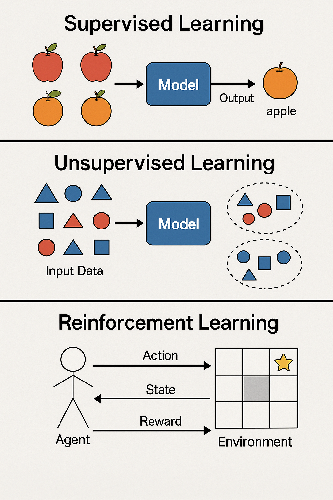

# Machine Learning

- Algorithms that learn patterns from data to make predictions or decisions.

- Learning can be:
  - **Supervised**: labeled data (input-output pairs) -->  &rArr;  outcomes for new, unseen inputs
  - **Unsupervised**: hidden patterns in data without predefined labels (e.g., clustering)
  - **Reinforcement**: rewards or penalties based on its interactons with an environment

 { .center width=100% }

# Machine Learning

- Algorithms that learn patterns from data to make predictions or decisions.
# Neuronal Networks

# Deep Learning

# Training Deep Learning Models

# Summary
