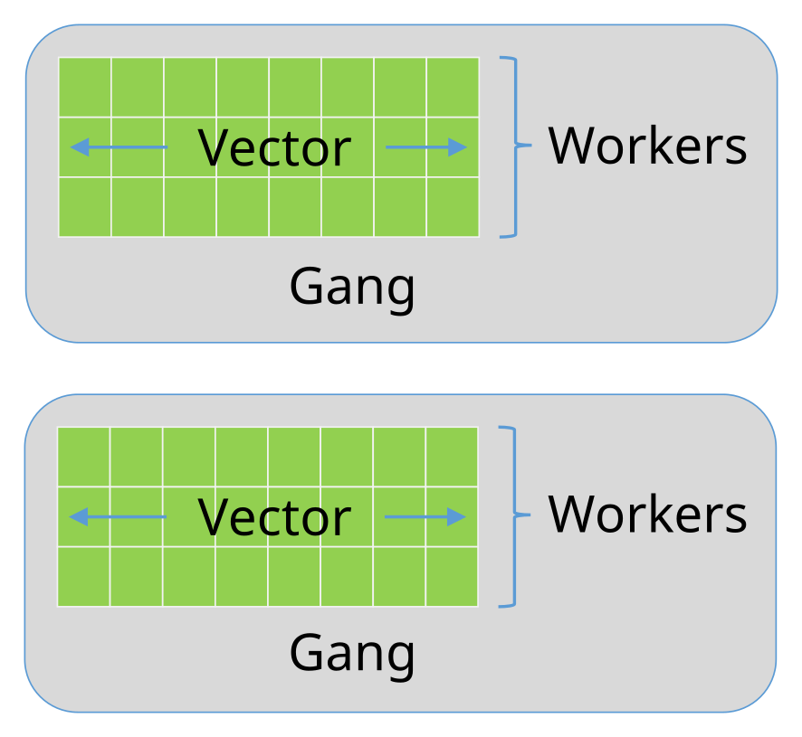

# What is OpenACC ?

- OpenACC defines a set of compiler directives that allow code regions to
  be offloaded from a host CPU to be computed on a GPU
    - High level GPU programming
    - Large similarity to OpenMP directives
- Supports for both C/C++ and Fortran bindings
- More about OpenACC standard:
  [http://www.openacc.org](http://www.openacc.org/)


# OpenACC vs. CUDA

- Why OpenACC and not CUDA?
    - Easier to work with
    - Porting of existing software requires less work
    - Same code can be compiled to CPU and GPU versions easily
- Why CUDA and not OpenACC?
    - Can access all features of the GPU hardware
    - More optimization possibilities


# OpenACC execution model

- Host-directed execution with an attached accelerator
    - Large part of the program is usually executed by the host
    - Computationally intensive parts are *offloaded* to the accelerator
      that executes *parallel regions*
- Accelerator can have a separate memory
    - OpenACC exposes the separate memories through *data environment*
      that defines the memory management and needed copy operations


# OpenACC execution model

<div class="column">
- Program runs on the host CPU
- Host offloads compute-intensive regions (*kernels*) and related data
  to the accelerator GPU
- Compute kernels are executed by the GPU
</div>

<div class="column">

</div>


# OpenACC data model

<div class="column">
- If host memory is separate from accelerator device memory
    - host manages memory of the device
    - host copies data to/from the device
- When memories are not separate, no copies are needed (difference is
  transparent to the user)
</div>

<div class="column">

</div>


# OpenACC directive syntax

|         | sentinel      | construct | clauses      |
| ------- | ------------- | --------- | ------------ |
| C/C++   | `#pragma acc` | `kernels` | `copy(data)` |
| Fortran | `!$acc`       | `kernels` | `copy(data)` |

- OpenACC uses compiler directives for defining compute regions (and data
  transfers) that are to be performed on a GPU
- Important constructs
    - `parallel`, `kernels`, `data`, `loop`, `update`, `host_data`, `wait`
- Often used clauses
    - `if (condition)`, `async(handle)`


# Compiling an OpenACC program

- Compilers that support OpenACC usually require an option that enables
  the feature
    - PGI: `-acc`
    - Cray: `-h acc`
    - GNU (partial support): `-fopenacc`
- Without these options a regular CPU version is compiled!


# OpenACC conditional compilation

- Conditional compilation with `_OPENACC` macro:

```c
#ifdef _OPENACC
device specific code
#else
host code
#endif
```

- `_OPENACC` macro is defined as *yyyymm*, where *yyyy* and *mm*
  refer to the year and month of when the specification supported by
  the compiler was released


# OpenACC internal control variables

- OpenACC has internal control variables
    - `ACC_DEVICE_TYPE` controls which type of accelerator device is
      to be used.
    - `ACC_DEVICE_NUM` controls which accelerator of the selected type
      is used.
- During runtime, values can be modified or queried with
  `acc_<set|get>_device_<type|num>`
- Values are always re-read before a kernel is launched and can be
  different for different kernels


# Runtime API functions

- Low-level runtime API functions can be used to
    - Query the number and type of devices in the system
    - Initialize/shutdown the device(s)
    - Allocate/deallocate memory on the device(s)
    - Transfer data to/from the device(s)
-  Function definitions are in
    - C/C++ header file `openacc.h`
    - `openacc` Fortran module (`openacc_lib.h` header in some
      implementations)


# OpenACC compute constructs {.section}


# OpenACC levels of parallelism

<div class="column">
- OpenACC has three levels of parallelism
    - **Vector** threads work in SIMT (SIMD) fashion
    - **Workers** compute a vector
    - **Gangs** have one or more workers that share resources, such as
      streaming multiprocessor
    - Multiple gangs work independently
</div>

<div class="column">

</div>


# OpenACC compute constructs

- OpenACC includes two different approaches for defining parallel regions
    - `parallel` defines a region to be executed on an accelerator. Work
      sharing *parallelism* has to be defined *manually*. Good tuning
      prospects.
    - `kernels` defines a region to be transferred into a series of
      kernels to be executed in *sequence* on an accelerator. Work sharing
      parallelism is defined *automatically* for the separate kernels, but
      tuning prospects limited.
- With similar work sharing, both can perform equally well


# Compute constructs: `kernels`

- Define a region to be transferred to a sequence of kernels for
  execution on the accelerator device
    - C/C++: `#pragma acc kernels [clauses]`
    - Fortran: `!$acc kernels [clauses]`
- Each separate *loop nest* inside the region will be converted into a
  separate *parallel kernel*
- The *kernels* will be executed in a *sequential* order


# Example: `kernels`

<div class="column">
## C/C++

```c

/* Compute y=a*x+y */

void accdaxpy(int n, double a,
              const double * restrict x,
              double * restrict y)
{
    #pragma acc kernels
    for (int j=0; j<n; ++j)
        y[j] += a  x[j];
}

/* An example call to accdaxpy */
accdaxpy(1<<16, 3.14, x, y);
```
</div>

<div class="column">
## Fortran

```fortran
! Compute y=ax+y

subroutine accdaxpy(n, a, x, y)
  integer :: n, j
  real(kind=8) :: a, x(n), y(n)

  !$acc kernels
  do j = 1,n
     y(j) = y(j) + a * x(j)
  end do
  !$acc end kernels
end subroutine accdaxpy

! An example call to accdaxpy
call accdaxpy(216, 3.14D0, x, y)
```
</div>


# Compute constructs: `parallel`

- Define a region to be executed on the accelerator device
    - C/C++: `#pragma acc parallel [clauses]`
    - Fortran: `!$acc parallel [clauses]`
- Without any *work sharing* constructs, the whole region is executed
  *redundantly* multiple times
    - Given a sequence of loop nests, each loop nest may be executed
      simultaneously


# Work sharing construct: `loop`

- Define a loop to be parallelized
    - C/C++: `#pragma acc loop [clauses]`
    - Fortran: `!$acc loop [clauses]`
    - Must be followed by a C/C++ or Fortran loop construct.
    - Combined constructs with `parallel` and `kernels`
        - `#pragma acc kernels loop` / `!$acc kernels loop`
        - `#pragma acc parallel loop / !$acc parallel loop`
- Similar in functionality to OpenMP `for/do` construct
- Loop index variables are `private` variables by default


# Example: `parallel`

<div class="column">
## C/C++

```c

void accdaxpy(int n, double a,
              const double * restrict x,
              double * restrict y)
{
#pragma acc parallel loop
    for (int j=0; j<n; ++j)
        y[j] += a * x[j];
}

/* An example call to accdaxpy */
accdaxpy(1<<16, 3.14, x, y);
```
</div>

<div class="column">
## Fortran

```fortran
! Compute y=a*x+y

subroutine accdaxpy(n, a, x, y)
  integer :: n, j
  real(kind=8) :: a, x(n), y(n)

  !$acc parallel loop
  do j = 1,n
     y(j) = y(j) + a * x(j)
  end do
  !$acc end parallel loop
end subroutine accdaxpy

! An example call to accdaxpy
call accdaxpy(216, 3.14D0, x, y)
```
</div>


# Compiler diagnostics {.section}


# Compiler diagnostics

- Compiler diagnostics is usually the first thing to check when starting
  the OpenACC work
    - It can tell you what operations were actually performed
    - Data copies that were made
    - If and how the loops were parallelized
- The diagnostics is very compiler dependent
    - Compiler flags
    - Level and formatting of information


# PGI compiler

- Diagnostics is controlled by compiler flag `-Minfo=option`
- Useful options:
    - `accel` -- operations related to the accelerator
    - `all` -- print all compiler output
    - `intensity` -- print loop computational intensity info
    - `ccff` -- add extra information to the object files for use by tools


# Example: `-Minfo`

```bash
$ pgcc -fast -Minfo=all -c util.c
malloc_2d:
     28, Loop not vectorized: data dependency
         Loop unrolled 8 times
         Generated 1 prefetches in scalar loop
eval_point:
     38, Loop not vectorized/parallelized: potential early exits

$ pgcc -fast -Minfo=intensity -c util.c
malloc_2d:
     28, Intensity = 3.00
eval_point:
     38, Intensity = 8.00
```


# Summary

- OpenACC is an directive-based extension to C/Fortran programming
  languages for accelerators
- Supports separate memory on the accelerator
- Compute constructs parallel and kernels
- Compiler diagnostics
