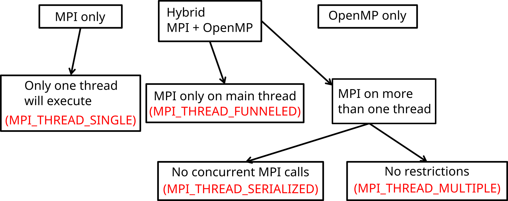
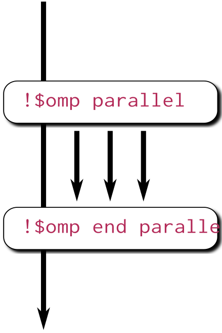

# Processes and threads


<div class="column">
## Process

  - Independent execution units
  - Have their own state information and *own memory* address space
</div>

<div class="column">
## Thread

  - A single process may contain multiple threads
  - Have their own state information, but *share* the *same memory*
    address space
</div>


# Processes and threads


<div class="column">
## Process

  - Long-lived: spawned when parallel program started, killed when
    program is finished
  - Explicit communication between processes
</div>

<div class="column">
## Thread

  - Short-lived: created when entering a parallel region, destroyed
    (joined) when region ends
  - Communication through shared memory
</div>


# Hybrid programming {.section}


# Hybrid programming: Launch threads (OpenMP) *within* processes (MPI)

<div class="column">
## Process

  - Independent execution units
  - MPI launches N processes at application startup
</div>

<div class="column">
## Thread

  - Threads share memory space
  - Threads are created and destroyed (parallel regions)
</div>


# Hybrid programming

<div class="column">
  - Shared memory programming inside a node, message passing between
    nodes
  - Matches well modern supercomputer hardware
  - Often one MPI task / socket, but one should experiment with the
    ratio
</div>

<div class="column">

</div>

# Example: Hybrid hello

<div class="column">
```c
#include <stdio.h>
#include <mpi.h>
#include <omp.h>

int main(int argc, char *argv[]) {
    int my_id, omp_rank;
    int provided, required=MPI_THREAD_FUNNELED;

    MPI_Init_thread(&argc, &argv, required,
                    &provided);
    MPI_Comm_rank(MPI_COMM_WORLD, &my_id);
#pragma omp parallel private(omp_rank)
{
    omp_rank = omp_get_thread_num();
    printf("I'm thread %d in process %d\n",
           omp_rank, my_id);
}
    MPI_Finalize();
}
```
</div>

<div class="column">
```shell
$ cc hybrid-hello.c -o hybrid-hello
$ aprun -n 2 -d 4 -e OMP_NUM_THREADS=4
  ./hybrid-hello

I'm thread 0 in process 0
I'm thread 0 in process 1
I'm thread 2 in process 1
I'm thread 3 in process 1
I'm thread 1 in process 1
I'm thread 3 in process 0
I'm thread 1 in process 0
I'm thread 2 in process 0
```
</div>


# Thread support in MPI




# Thread safe initialization

`MPI_Init_thread(required, provided)`
  : `argc`{.input}, `argv`{.input}
    : Command line arguments in C
  : `required`{.input}
    : Required thread safety level
  : `provided`{.output}
    : Supported thread safety level
  : `error`{.output}
    : Error value; in C/C++ it's the return value of the function,
      and in Fortran an additional output parameter

- Pre-defined integer constants:
  ```
  MPI_THREAD_SINGLE < MPI_THREAD_FUNNELED < MPI_THREAD_SERIALIZED
  < MPI_THREAD_MULTIPLE
  ```


# Hybrid programming styles: fine/coarse grained

- Fine-grained
    - Use **omp parallel do/for** on the most intensive loops
    - Possible to hybridize an existing MPI code with little effort and in
      parts

- Coarse-grained
    - Use OpenMP threads to replace MPI tasks
    - Whole (or most of) program within the same parallel region
    - More likely to scale over the whole node, enables all cores to
      communicate (if supported by MPI implementation)


# Potential advantages of the hybrid approach

- Fewer MPI processes for a given amount of cores
    - Improved load balance
    - All-to-all communication bottlenecks alleviated
    - Decreased memory consumption if an implementation uses replicated
      data
- Additional parallelization levels may be available
- Possibility for dedicating threads for different tasks
    - e.g. dedicated communication thread or parallel I/O
    - Note that OpenMP worksharing constructs (e.g. OMP DO) will not be
      applicable when dedicating threads


# Disadvantages of hybridization

- Increased overhead from thread creation/destruction
- More complicated programming
    - Code readability and maitainability issues
- Thread support in MPI and other libraries needs to be considered


# Real-world hybrid applications

- Vlasiator -- space weather simulations
    - Fluid in 6D spatial/velocity space: spatial grid with MPI, velocity
      grid with OpenMP
    - Lower memory footprint and better load balancing
- CP2K -- electronic structure simulations
    - Especially so called hybrid functionals benefit from threading
    - Lower memory footprint allows more efficient computations


# Real-world hybrid applications

  - Vlasiator, 200 nodes (4800 cores) on Sisu

<small>

| Threads per process | Hyperthreads per core | MPI ranks per node | Performance (108 cells/s) | Memory use per node (GB) |
| ------------------- | --------------------- | ------------------ | ------------------------- | ------------------------ |
| 1                   | 1                     | 24                 | 1.06                      | 28.4                     |
| 2                   | 1                     | 12                 | 1.06                      | 24.6                     |
| 4                   | 1                     | 6                  | 1.04                      | 22.8                     |
| 6                   | 1                     | 4                  | 1.02                      | 22.2                     |
| 2                   | 2                     | 24                 | 1.35                      | 28.5                     |
| 4                   | 2                     | 12                 | 1.33                      | 24.6                     |
| 6                   | 2                     | 8                  | 1.32                      | 23.4                     |
| 12                  | 2                     | 4                  | 1.25                      | 22.2                     |

</small>


# Summary

- Hybrid programming maps well to modern hardware
- In theory, hybrid programming offers several advantages
- In practice, all the advantages can be difficult to realize
- As number of cores inside a node increases, advantages of hybrid
  approach are likely to become more and more relevant
- MPI provides different levels of thread support


# OpenMP {.section}


# What is OpenMP?

* A collection of _compiler directives_ and _library routines_ for
  **multi-threaded**, **shared-memory parallelization**
* Fortran 77/9X/03 and C/C++ are supported
* Latest version of the standard is 4.5 (November 2015)
    - support for attached devices
    - support for thread affinity


# Why would you want to learn OpenMP?

* OpenMP parallelized program can be run on your many-core workstation or on a
  node of a cluster
* Enables one to parallelize one part of the program at a time
    - Get some speedup with a limited investment in time
    - Efficient and well scaling code still requires effort
* Serial and OpenMP versions can easily coexist
* Hybrid MPI+OpenMP programming


# Three components of OpenMP

* Compiler directives, i.e. language extensions, for shared memory
  parallelization

|`   `    | directive     | construct     |clauses      |
|-----    |-----------    |-------------  |-----          |
|C/C++  | `#pragma omp` | `parallel`     | `shared(data)`  |
|Fortran| `!$omp`          | `parallel`    | `shared(data)`  |

* Runtime library routines (Intel: libiomp5, GNU: libgomp)
    - Conditional compilation to build serial version
* Environment variables
    - Specify the number of threads, thread affinity etc.


# OpenMP directives

* Sentinels precede each OpenMP directive
    - C/C++:     `#pragma omp`
    - Fortran:    `!$omp`
* Conditional compilation with `_OPENMP` macro:
```c
#ifdef _OPENMP
    OpenMP specific code
#else
    Code without OpenMP
#endif
```


# Compiling an OpenMP program

* Compilers that support OpenMP usually require an option that enables the
  feature
    - GNU: `-fopenmp`
    - Intel: `-qopenmp`
    - Cray: `-h omp`
        * OpenMP enabled by default, -h noomp disables
    - PGI: `-mp[=nonuma,align,allcores,bind]`
    - Without these options a serial version is compiled!


# Example: Helloworld with OpenMP

<div class=column>
```fortran
program hello
  use omp_lib
  integer :: omp_rank
!$omp parallel private(omp_rank)
  omp_rank = omp_get_thread_num()
  print *, 'Hello world! by &
        thread ', omp_rank
!$omp end parallel
end program hello
```
```bash
> ftn -h omp omp_hello.f90 -o omp
> aprun -e OMP_NUM_THREADS=4 -n 1 -d 4 ./omp
 Hello world! by thread             0
 Hello world! by thread             2
 Hello world! by thread             3
 Hello world! by thread             1
```
</div>

<div class=column>
```c
#include <stdio.h>
#include <omp.h>
int main(int argc, char argv[]){
  int omp_rank;
#pragma omp parallel private(omp_rank){
  omp_rank = omp_get_thread_num();
  printf("Hello world! by
      thread %d", omp_rank);}
  }
```
```bash
> cc -h omp omp_hello.c -o omp
> aprun -e OMP_NUM_THREADS=4 -n 1 -d 4 ./omp
 Hello world! by thread             2
 Hello world! by thread             3
 Hello world! by thread             0
 Hello world! by thread             1
```
</div>


# Parallel regions and data sharing {.section}


# Parallel construct

<div class=column>
* Defines a parallel region
    - C/C++:
    `#pragma omp parallel [clauses]`
    - Fortran:
    `!$omp parallel [clauses]`
    - Prior to it only one thread, master
    - Creates a team of threads: master+slave threads
    - At end of the block is a barrier and all shared data is synchronized
</div>
<div class=column>
SPMD: Single Program Multiple Data


</div>


# How do the threads interact?

* Because of the shared address space threads can interact using _shared
  variables_
* Threads often need some _private work space_ together with shared variables
    - for example the index variable of a loop
* Visibility of different variables is defined using _data-sharing clauses_ in
  the parallel region definition


# omp parallel: data-sharing clauses

* **private(list)**
    - Private variables are stored in the  private stack of each thread
    - Undefined initial value
    - Undefined value after parallel region
* **firstprivate(list)**
    - Same as private variable, but with an initial value that is the same as
	  the original objects defined outside the parallel region


# omp parallel: data-sharing clauses

* **shared(list)**
    - All threads can write to, and read from
    - a shared variable
    - Variables are shared by default
* **default(private/shared/none)**
    - Sets default for variables to be shared, private or not defined
    - In C/C++ default(private) is not allowed
    - default(none) can be useful for debugging as each variable has to be
	  defined manually

_Race condition =
a thread accesses a
variable while another
writes into it_


# Default behaviour

* Most variables are _shared_ by default
    - Global variables are shared among threads
        * C: static variables, file scope variables
        * Fortran: save and module variables, common blocks
        * `threadprivate(list)` can be used to make a private copy
* Private by default:
    - Stack variables of functions called from parallel region
    - Automatic variables within a block


# Data sharing example

<div class=column>
main.c
```c
int A[5];

int main(void) {
    int B[2];
#pragma omp parallel
{
    float c;
    do_things(B);
    ...
}
    return 0;
}
```
</div>
<div class=column>
kernel.c
```c
extern int A[5];

void do_things(int *var) {
    double wrk[10];
    static int status;
    ...
}
```
</div>
