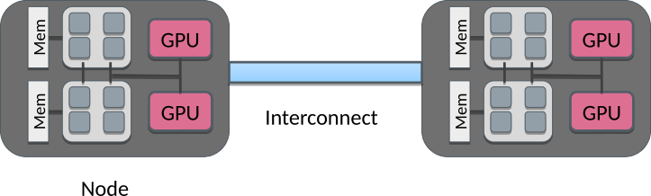
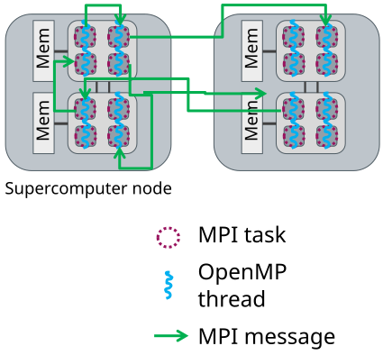

# Introduction {.section}

# Anatomy of supercomputer

- Supercomputers consist of nodes connected with high-speed network
    - Latency `~`1 µs, bandwidth `~`200 Gb / s
- A node can contain several multicore CPUS
- Additionally, node can contain one or more accelerators
- Memory within the node is directly usable by all CPU cores

<br>
 {.center width=60%}

# Parallel programming models

- Parallel execution is based on threads or processes (or both) which
  run at the same time on different CPU cores 
- Processes
    - Interaction is based on exchanging messages between processes
    - MPI (Message passing interface)
- Threads
    - Interaction is based on shared memory, i.e. each thread can
      access directly other threads data 
    - OpenMP


# Parallel programming models

<!-- Presentation suggestion: discuss the analog of office worker using the same white board or communication with phones -->

 {.center width=80%}
<br>
<div class=column>
**MPI: Processes** 

- Independent execution units
- Have their **own** memory space
- MPI launches N processes at application startup
- Works over multiple nodes
</div>
<div class=column>

**OpenMP: Threads**  

- Threads **share** memory space
- Threads are created and destroyed (parallel regions)
- Limited to a single node
</div>

# Hybrid programming: Launch threads (OpenMP) *within* processes (MPI)

<div class="column">
  - Shared memory programming inside a node, message passing between
    nodes
  - Matches well modern supercomputer hardware
  - Optimum MPI task per node ratio depends on the application and should always be experimented.
</div>

<div class="column">
{.center width=80%}
</div>

# Example: Hybrid hello

<!-- Presentation suggestion: live coding for hybrid hello -->

<div class="column">
```c
#include <mpi.h>
#include <omp.h>

int main(int argc, char *argv[]) {
    int my_id, omp_rank;
    int provided, required=MPI_THREAD_FUNNELED;

    MPI_Init_thread(&argc, &argv, required,
                    &provided);
    MPI_Comm_rank(MPI_COMM_WORLD, &my_id);
#pragma omp parallel private(omp_rank)
{
    omp_rank = omp_get_thread_num();
    printf("I'm thread %d in process %d\n",
           omp_rank, my_id);
}
    MPI_Finalize();
}
```
</div>

<div class="column">
```shell
$ mpicc -fopenmp hybrid-hello.c -o hybrid-hello
$ srun  --ntasks=2 --cpus-per-task=4 
  ./hybrid-hello

I'm thread 0 in process 0
I'm thread 0 in process 1
I'm thread 2 in process 1
I'm thread 3 in process 1
I'm thread 1 in process 1
I'm thread 3 in process 0
I'm thread 1 in process 0
I'm thread 2 in process 0
```
</div>

# Potential advantages of the hybrid approach

- Fewer MPI processes for a given amount of cores
    - Improved load balance
    - All-to-all communication bottlenecks alleviated
    - Decreased memory consumption if an implementation uses replicated
      data
- Additional parallelization levels may be available
- Possibility for dedicating threads for different tasks
    - e.g. dedicated communication thread or parallel I/O
- Dynamic parallelization patterns often easier to implement with OpenMP


# Disadvantages of hybridization

- Increased overhead from thread creation/destruction
- More complicated programming
    - Code readability and maitainability issues
- Thread support in MPI and other libraries needs to be considered

# Alternatives to OpenMP within a node

- pthreads (POSIX threads)
- Multithreading support in C++ 11
- Performance portability frameworks (SYCL, Kokkos, Raja)
- Intel Threading Building Blocks
