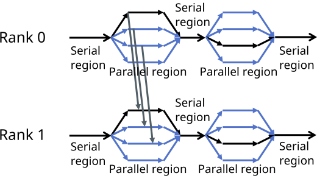
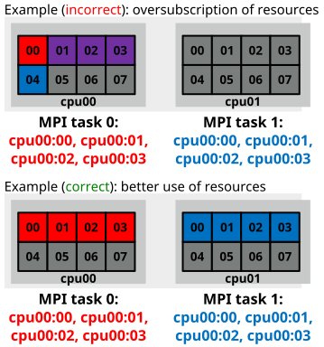

# Multiple thread communication

- Hybrid programming is relatively straightforward in cases where
  communication is by only single thread at time
- With the so called multiple mode all threads can make MPI calls
  independently

```c
int required=MPI_THREAD_MULTIPLE, provided;
MPI_Init_thread(&argc, &argv, required, &provided)
```

- When multiple threads communicate, the sending and receiving threads
  normally need to match
    - Thread-specific tags
    - Thread-specific communicators


# Thread-specific tags

- In point-to-point communication the thread ID can be used to
  generate a tag that guides the messages to the correct thread




# Thread-specific tags

- In point-to-point communication the thread ID can be used to
  generate a tag that guides the messages to the correct thread

```fortran
!$omp parallel private(tid, tidtag, ierr)
tid = omp_get_thread_num()
tidtag = 2**10 + tid

! mpi communication to the corresponding thread on another process
call mpi_sendrecv(senddata, n, mpi_real, pid, tidtag, &
                  recvdata, n, mpi_real, pid, tidtag, &
                  mpi_comm_world, stat, ierr)

!$omp end parallel
```


# Collective operations in the multiple mode

- MPI standard allows multiple threads to call collectives simultaneously
    - Programmer must ensure that the same communicator is not being
      concurrently used by two different collective communication calls at
      the same process
- In most cases, even with `MPI_THREAD_MULTIPLE` it is beneficial to
  perform the collective communication from a single thread (usually the
  master thread)
- Note that MPI collective communication calls do not guarantee
  synchronization of the thread order


# Thread-specific communicators

- Collective calls do not have tag arguments
- Instead, we will generate thread-specific *communicators*

```fortran
! total number of openmp threads
nthr = omp_get_max_threads()
allocate(tcomm(nthr))

! split the communicator
do thrid=1,nthr
    col = thrid
    call mpi_comm_split(mpi_comm_world, col, procid, tcomm(thrid), ierr)
end do

!$omp parallel private(tid, ierr)
tid = omp_get_thread_num() + 1
! ...collective operations in tcomm(tid)
!$omp end parallel
```


# MPI thread support levels

- Modern MPI libraries support all threading levels
    - Cray MPI: Set `MPICH_MAX_THREAD_SAFETY` environment variable to
      `single`, `funneled`, `serialized`, or `multiple` to select the
      threading level
    - Intel MPI: When compiling with `-qopenmp` a thread safe version of the
      MPI library is automatically used
- Note that using `MPI_THREAD_MULTIPLE` requires the MPI library to
  internally lock some data structures to avoid race conditions
    - May result in additional overhead in MPI calls


# MPI+OpenMP thread affinity

<div class="column">
- MPI library must be aware of the underlying OpenMP for correct
  allocation of resources
    - Oversubscription of CPU cores may cause significant performance
      penalty
- Additional complexity from batch job schedulers
- Heavily dependent on the platform used!
</div>

<div class="column">

</div>


# MPI+OpenMP thread affinity (Cray)

- Some Cray MPI launcher (aprun) options related to thread affinity:

`-d <depth>`
  : reserve depth CPU cores for each MPI task
    : Recommended to be set equal to `OMP_NUM_THREADS`

`-cc <cpu|list|depth|numa_node|none>`
  : sets CPU affinity for threads within each MPI task
    : Each thread can be pinned to a CPU core (cpu)
    : The threads may be set to float within a NUMA node (`numa_node`) or
      the -d reservation (depth). With none the affinity control is
      disabled.


# MPI+OpenMP thread affinity (Intel)

- Intel MPI library allows affinity control of MPI domains via
  `I_MPI_PIN`, `I_MPI_PIN_DOMAIN` and `I_MPI_PIN_ORDER` environment
  variables
- Affinity control of the MPI library only applies to the placement of the
  MPI processes
    - `OMP_PLACES` (or `KMP_AFFINITY`) environment variables must be used to
      pin threads to cores within MPI domains


# Summary

- Multiple threads may make MPI calls simultaneously
- Thread specific tags and/or communicators
    - While waiting for the MPI-4 features
- For collectives it is often better to use a single thread for
  communication
- Thread affinity matters
    - See manuals and user guides of the system if performance is not as
      expected
